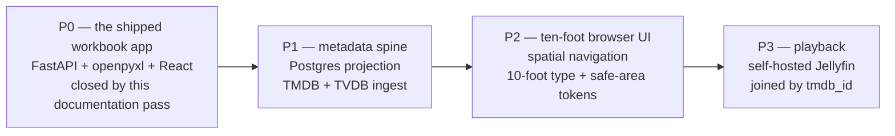
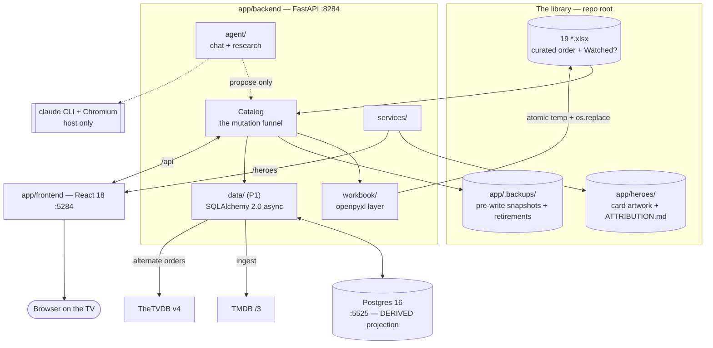
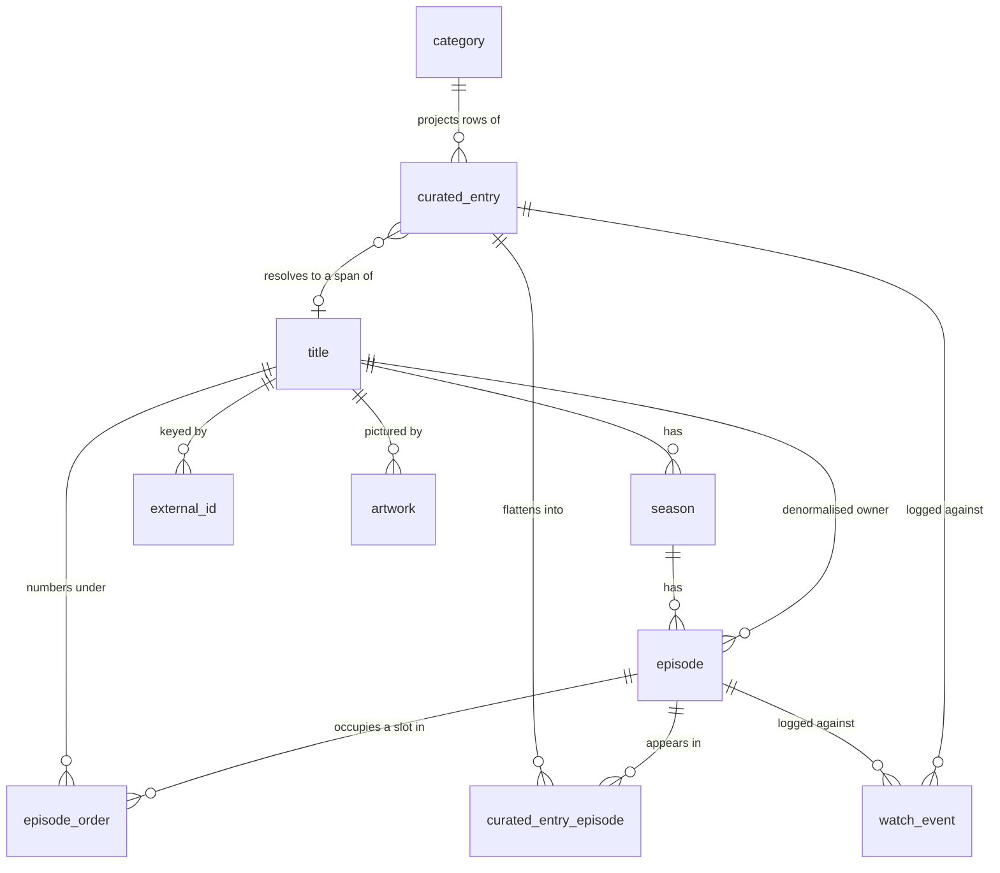

> **MANDATORY WORKFLOW: READ THIS ENTIRE FILE BEFORE EVERY CHANGE.** Every time. No skimming, no assuming prior-session context carries over — it does not.
>
> **Why:** This project spans multiple sessions and months of development. Skipping the re-read produces decisions that contradict the architecture, duplicate existing patterns, break data contracts, or introduce tech debt that compounds. This repository is worse than most for that: the nineteen `.xlsx` workbooks at its root are irreplaceable hand-curated data, and a write that bypasses the safety funnel described in this file can damage them permanently.
>
> **The workflow, every time:**
> 1. Read this entire file in full.
> 2. Read `docs/TV_MASTER_PLAN.md` — the master plan, at the repository root under `docs/`.
> 3. Read `docs/status.md` — current state / what was just built.
> 4. Read `docs/versions.md` — recent version history.
> 5. Read the source files you plan to modify — understand existing patterns first.
> 6. Then implement, following the rules and contracts defined here.

---

<critical_context>

## 0. Critical context — read this before anything else

### 0.1 The defining constraint: the workbooks are the curated data

Nineteen Excel workbooks sit at the repository root:

```
Attack_On_Titan.xlsx   Bleach.xlsx        DCU.xlsx            Demon_Slayer.xlsx
Fullmetal_Alchemist.xlsx  HunterXHunter.xlsx  Inuyasha.xlsx    Marvel.xlsx
Middle_Earth.xlsx      Misc_Anime.xlsx    Misc_Movies.xlsx    Misc_TV.xlsx
My_Hero_Academia.xlsx  Naruto.xlsx        One_Piece.xlsx      Pokemon.xlsx
Star_Wars.xlsx         WWII.xlsx          Yu-Gi-Oh!.xlsx
```

Between them they hold **996 data rows**, and they are **committed on purpose**. `.gitignore:1-7` opens with the banner "The workbooks ARE the database.", explaining that the root `*.xlsx` files and the artwork in `app/heroes/` are committed so a clone arrives with the library already in it, and instructing that `*.xlsx` is never added to that file. (That banner still says "eighteen"; there are nineteen. Task **T01c** corrects the identical stale figure in `README.md:47` — fix this line in the same pass.) `.gitattributes:54-56` marks `*.xlsx *.xlsm *.xls` as `binary`, and `.gitattributes:10` calls that "the single most important line in this file" — an `.xlsx` is a zip container, so a text-mode checkout would rewrite bytes inside it and corrupt every workbook.

These files are not a seed, an export, a fixture, or a legacy format waiting to be migrated. They are:

- **the authored artifact.** Marvel's 141 rows open X-Men → Blade II → Spider-Man → Daredevil: four consecutive rows carrying four different `Universe / Continuity` values. WWII's 84 rows are ordered by the historical event each film depicts, never by anything about the film — row 3 is *The Sound of Music*, released 1965, `Event` "Mar 1938, Anschluss"; row 4 is *1939 Battle of Westerplatte*, released 2013, `Event` "1 Sept 1939, invasion of Poland". No sort by air date, popularity or franchise could reproduce either. The order *is* the work.
- **still edited in Excel, by hand, by the owner.** Every safety mechanism in this codebase exists because the owner may have a workbook open in Excel right now.
- **the reason the app is worth having.** A clone arrives working: no database to create, no migration to run, no seed to load.

### 0.2 From Phase 1 onward: Postgres is a DERIVED PROJECTION, not a replacement

Phase 1 introduces PostgreSQL. It does **not** end the arrangement above. The store is deliberately **dual**, and the split of authority is fixed:

| Owned by the `.xlsx` workbooks | Owned by Postgres |
|---|---|
| Watch **order** (`position`, the authored chronology) | Episodes, seasons, air dates, runtimes |
| Hand curation — which titles, which spans, the prose in every other column | Alternate episode orderings (aired / dvd / absolute) |
| The four-value `Watched?` cell, as a **mirror** | Artwork metadata, external ids, sync cursors |
| Column layout, dropdowns, conditional formatting, accent colour | Watch **progress**, as an append-only event log |

Concretely, and non-negotiably:

- **Excel → Postgres on read.** Ingest reads a workbook through the existing `workbook/reader.py`, under the existing lock, and projects each data row into `curated_entry`. Postgres never invents, reorders, or "corrects" `position`.
- **Progress is written to BOTH.** A watch action appends a `watch_event` row (the rich, durable truth: which episode, how far in, when, from what device) *and* projects onto the sheet's four-value `Watched?` cell, so a workbook opened standalone in Excel still means something.
- **The `Watched?` cell is never read as truth.** It is read only to detect that a *human* changed it in Excel. See section 5.16.
- **Nothing is ever deleted.** Retirement moves a workbook into `app/.backups/` under a `retired-` stamp (`services/retirement.py:17-36`); Postgres mirrors that with soft deletes (`category.retired_at`, `curated_entry.removed_at`) and `ON DELETE RESTRICT` on `watch_event.curated_entry_id`.
- **The join key to any future media server is `tmdb_id`.** Chosen now, in Phase 1, so Phase 3 has nothing to retrofit (section 5.13, `title`).

If a proposed change would make Postgres authoritative for watch order, or would stop a workbook being independently openable and meaningful in Excel, it is out of scope regardless of how much simpler it looks. Stop and flag it.

### 0.3 What this project is NOT

- **Not a streaming app.** It does not stream, proxy, transcode, or link to anything a licence does not cover. There is no video element in the codebase today.
- **Not a media server.** Jellyfin is the *designated future playback layer* (Phase 3), self-hosted, joined by `tmdb_id`. This repository does not become one.
- **Not a piracy tool, and this has been decided explicitly.** `streambert` (github.com/truelockmc/streambert) was evaluated and **rejected**: it is an Electron desktop client, GPL-3.0, which scrapes unlicensed stream hosts (VidSrc, videasy, vidking, allmanga.to) and rips m3u8 with ffmpeg, and self-describes as piracy. Zero technical overlap, licence contagion, legal exposure. It is recorded as **ADR-006** in `docs/TV_MASTER_PLAN.md` and summarised in the status and versions entries for this change. Nothing from it is adopted. Do not revisit it, and do not add any stream-host scraper, m3u8 ripper, or "watch now" deep link to an unlicensed source.
  ADR-006's second ground does not depend on the repository's licence being settled. The repository currently carries no LICENSE file. Vendoring GPL-3.0 code would therefore settle the licence question as a side effect of a code-reuse convenience, rather than as a decision — and would settle it on GPL-3.0. That is reason enough on its own, before the other two grounds. The repository's own licence is **ADR-009 — Repository licence — OPEN. The owner has not decided. No licence has been chosen and none is implied by this plan.** Whatever it becomes, the artwork in `app/heroes/` stays Wikimedia PD/CC0/CC BY material governed by `app/heroes/ATTRIBUTION.md`.
- **Not a native TV app.** The app is watched on a TV via a PC or laptop over HDMI or cast. It **stays a browser app**. No Tizen `.wgt`, no webOS `.ipk`, no `react-native-tvos`, no app-store packaging, no second codebase. The ten-foot treatment in Phase 2 is CSS tokens plus a focus/spatial-navigation library — nothing else.
- **Not multi-user, and not authenticated.** One person, one machine, `127.0.0.1`. There is no login, no session, no user table, and none is planned.
- **Not a public service.** Every listener binds loopback. TMDB is used under its non-commercial terms, and one of them binds this app's chat feature directly: **TMDB's API Terms (§1.C, last updated 2023-10-20) prohibit using "the TMDB APIs or TMDB Content in connection with, including for training, a machine learning (ML) or artificial intelligence (AI) based Application", and §2.A lists LLM chatbots among commercial uses.** That covers inference as well as training. **TMDB content must never enter the chat agent's context.** An earlier draft of this file said the opposite; the terms text, verified 2026-09-15, governs. Section 10 (Security), boundary B6, carries the rule.

### 0.4 What phase we are in, and what that means for scope

**We are at the P0 → P1 boundary.** Phase 0 — the shipped workbook app — is closed by this documentation pass (tasks T00, T01, T01a, T01b and T01c). **Phase 1 is the metadata spine**: a Postgres 16 projection alongside the workbooks, plus TMDB and TheTVDB v4 ingest. The browser UI does not change shape in Phase 1; it gains data.

Practical consequences for any task you are handed right now:

- New persistence work targets SQLAlchemy 2.0 async + asyncpg + Alembic against Postgres 16-alpine. Not SQLite, not "a JSON file for now", not an in-memory dict.
- Every workbook write — including the new ingest write-back — goes through `Catalog._write`. There is no second write path, and adding one is the single most damaging change that could be made to this repository.
- Playback code, ten-foot CSS, spatial navigation, Jellyfin clients and a 1920×1080 layout project are **later phases**. Design for them; do not build them (section 2.2).
- Docs to touch on every non-trivial change: `docs/status.md`, `docs/versions.md`, and — if a host port moves or is added — `C:\Users\Amram\IMPORTANT\Projects\PORT_ASSIGNMENTS.md`.

</critical_context>

---

<project_identity>

## 1. Project identity

### 1.1 What it is

A local, single-user web app for nineteen hand-curated watch orders — Marvel, DCU, Star Wars, Middle Earth, a WWII chronology, and a shelf of anime — that live as Excel workbooks and stay that way. One workbook is one category. The app shows a wall of cards, opens a category as a vertical route with a status rail, edits any cell the sheet allows, and writes every change straight back into the same `.xlsx`, preserving that workbook's table, dropdowns and conditional formatting.

It also carries a research chat: `claude-agent-sdk` shells out to the locally-installed `claude` CLI, with Playwright/Chromium for pages that block plain fetches. The model can research and *propose*; only a human approval writes.

### 1.2 Where it lives on disk

```
C:\Users\Amram\IMPORTANT\Personal\TV
```

Note this is under `Personal\`, **not** under `Projects\`. That does not exempt it from anything: `PORT_ASSIGNMENTS.md:3` states the registry is machine-wide and names `TV` explicitly — "Location on disk does not scope this registry; binding a host port does."

The repository is **public**, which is why CI is GitHub Actions (`.github/workflows/ci.yml`, `.github/workflows/codeql.yml`) and there is no `.gitlab-ci.yml`.

### 1.3 The tree, at the level that matters for orientation

```
TV/
├─ *.xlsx                     The library. Nineteen workbooks. THIS IS THE CURATED DATA.
├─ docs/                      Project trio — see section 1.4.
│  ├─ TV_MASTER_PLAN.md       THE master plan. Authoritative for goals, phases, gates, ADRs.
│  ├─ status.md               Current state. First thing a new session reads after this file.
│  ├─ versions.md             Semver changelog, newest at top.
│  └─ resolver-dry-run.md     Phase 1 artefact: the resolver dry-run report (section 2.1, item 9).
├─ docker-compose.yml         Compose v2, project name `tv-watchlist`.
├─ run_tv.sh / run_tv.bat     Launchers. Host-native dev servers, not compose.
├─ .gitattributes             LF for *.sh, CRLF for *.bat, BINARY for *.xlsx.
├─ .gitignore                 Banner: the workbooks ARE the database.
├─ .semgrepignore             Replaces semgrep's built-in defaults; ignores the library itself.
├─ .github/workflows/         ci.yml — twelve jobs in six stages — and codeql.yml.
└─ app/
   ├─ README.md               How the app works, for a human.
   ├─ backend/                FastAPI + openpyxl. Package `src/tv_watchlist/`.
   ├─ frontend/               React 18 + TS strict + Vite + Redux Toolkit, and the layout guard.
   ├─ heroes/                 Per-category card artwork + ATTRIBUTION.md.
   ├─ docs/                   DESIGN NOTES ONLY — see section 1.4.
   └─ .backups/               Automatic pre-write snapshots (local only, gitignored).
```

Backend package: `app/backend/src/tv_watchlist/` — 83 `.py` files, 4160 lines, hatchling wheel target (`pyproject.toml:30-31`). Frontend package: `tv-watchlist-frontend` (`package.json:2`), `"packageManager": "pnpm@9.15.9"` (`package.json:6`).

### 1.4 The two `docs/` directories are not the same thing

This trips people up, so it is stated once, plainly:

- **`docs/` at the repository root** holds the project trio — `TV_MASTER_PLAN.md`, `status.md`, `versions.md` — plus `resolver-dry-run.md` once Phase 1 produces it. This is the directory the mandatory workflow at the top of this file points at. It is new as of the documentation pass that closes Phase 0 (task T00).
- **`app/docs/` holds design notes**, and stays exactly what it is. It currently contains `chat-feature-design.md`. Design notes are narrative documents about how one feature was reasoned through; they are not status, not the plan, and not a changelog. Do not move them, and do not put status or version history there.

### 1.5 The two README files

- **`README.md` (repo root)** is about the *repository*: what is in it, the stack table, how to clone and run on a fresh machine, Docker, the CI pipeline stage by stage, ports, licensing. It carries the CI and CodeQL badges.
- **`app/README.md`** is about the *app*: how a category works, how the card artwork is built (generated backdrop + logo overlay), the safety table, what the layout guard asserts and why, the commands.

Neither is the place for AI guidelines (this file), task tracking (the master plan), current state (`docs/status.md`) or version history (`docs/versions.md`).

Both use Mermaid generously, and both should keep doing so.

**`README.md` has a known reconciliation backlog, tracked as task T01c.** Do not fix these piecemeal; do them as one pass:

| What is wrong | Where |
|---|---|
| `OWNER/REPO` placeholders in the two badge URLs — the real path is `amrambouskila/watch-list` (the `origin` remote) | `README.md:3-5` |
| `OWNER/REPO` placeholders in the two clone commands | `README.md:86`, `README.md:94` |
| "Eighteen workbooks" — there are nineteen | `README.md:47` (and the same stale count in `.gitignore:4`) |
| Backend test count given as **712**; the real figure is **722** | `README.md:30`, `:168`, `:198`, and `app/README.md:130` |
| The Semgrep description does not name the six packs the workflow actually uses — `p/default`, `p/owasp-top-ten`, `p/python`, `p/typescript`, `p/react`, `p/docker` (`.github/workflows/ci.yml:121-131`), and specifically **not** `--config auto` | `README.md` CI section |
| The "There is no database." opening does not survive Phase 1 | `README.md` |
| No phase-flow diagram, which the global contract requires of a phased project's README | `README.md` — add **P0 → P1 → P2 → P3** |

### 1.6 Versioning — the source of truth, and what you may not touch

- Backend: the `version` field in `app/backend/pyproject.toml:3` — currently `0.1.0`.
- Frontend: the `version` field in `app/frontend/package.json:4` — currently `0.1.0`.
- `main.py:27` also passes `version="0.1.0"` into the `FastAPI(...)` constructor. It is a third copy of the same number — kept in step by the release pipeline, not hand-edited by a session.

**Never edit those version fields.** That is the release pipeline's job (and there is no release workflow yet — `.github/workflows/` holds only `ci.yml` and `codeql.yml`, so bumping is currently a deliberate manual act by the owner). Your job is to compute the next version and record it in `docs/versions.md`, per section 6 of the global `CLAUDE.md` (Versioning Protocol). Only one unreleased version entry may stand above the source-of-truth version at a time.

</project_identity>

---

<phase_constraints>

## 2. Phases



**Phase 0 — the shipped workbook app** is a real phase, not a prologue. Everything described in sections 3-5 and 12-16 is Phase 0 output, already shipped and in daily use; its one remaining gap was documentation, which tasks **T00**, **T01**, **T01a**, **T01b** and **T01c** close. Wherever the phase sequence is drawn — here, in `docs/TV_MASTER_PLAN.md`, in `docs/status.md`, and in the `README.md` diagram T01c adds — it reads **P0 → P1 → P2 → P3**. Never draw it starting at P1.

### 2.1 Phase 1 — in scope

1. **A Postgres 16-alpine service** in `docker-compose.yml`, published on host port **`5525`** as `${TV_POSTGRES_PORT:-5525}:5432`. Never on host `5432` — that is the machine's single shared local PostgreSQL listener and a containerized Postgres must never bind it. The database is **`tv`** (`${TV_POSTGRES_DB:-tv}`) and the CI service container uses **`tv_test`**; the `pg_isready` healthcheck names the same variable. `tv_watchlist` is the Python package name and the compose project / image prefix — it is **not** a database name.
2. **SQLAlchemy 2.0 with the asyncio extension + asyncpg + Alembic**, in a new `app/backend/src/tv_watchlist/data/` package. Eleven tables, two views, one append-only trigger (sections 5.13-5.14).
3. **Ingest from Excel into Postgres** — the reconciliation whose algorithm `docs/TV_MASTER_PLAN.md` specifies, reusing `workbook/reader.py`, `lock_for`, and `Catalog._write`.
4. **The `Row ID` identity column** written into each workbook at the far right, hidden. This forces one contract change (`ColumnSpec.role` gains `"identity"`) which is flagged in section 5.1 and is a **minor** semver bump on the commit that makes it.
5. **TMDB ingest** — the primary metadata spine. The Read Access Token (`TV_TMDB_READ_ACCESS_TOKEN`, `Settings.tmdb_read_access_token` — `env_prefix="TV_"` derives the field name mechanically) travels as an `Authorization: Bearer` header against the `https://api.themoviedb.org/3` base URL. Never ship a TMDB credential to the browser bundle; proxy through the backend.
6. **TheTVDB v4 (End-User Subscriptions key; the owner holds the user subscription)** for alternate episode **orders** only, using `TV_TVDB_API_KEY` and `TV_TVDB_PIN`. **Seven season types are live in production (measured against `GET /v4/seasons/types`, 2026-09-15)** — `official`, `dvd`, `absolute`, `alternate`, `regional`, `altdvd`, `alttwo` — and TheTVDB's OpenAPI document lists them as *examples*, not as an enum, so the set is not closed. `default`, which earlier drafts of this list named, is **not** a season type: it is accepted as an episodes-endpoint path and returned exactly what `official` returned (measured 2026-09-15), so treat it as an alias, never as an eighth type. **The TheTVDB series id is never searched for** — TMDB's `/tv/{id}/external_ids` returns `tvdb_id` directly (verified 2026-09-15 for One Piece, Dexter and Pokémon), whereas TheTVDB's own search ranked the One Piece anime eighth behind a 2023 live-action namesake. **Names are requested through the `/eng` language variants**; TheTVDB's default is the original language, which is Japanese for anime. **The operative rule: read the season-type list at runtime from a cached `GET /v4/seasons/types`, and never hard-code it** — here or anywhere else this document discusses the orders.
7. **The watch-progress log and the four-value mirror** (section 5.16).
8. **The provider response cache lives in Postgres** — `sync_state` plus a payload digest (section 5.13). No cache service and no queue enters the stack; see section 2.2.
9. **The resolver dry-run report**, written to **`docs/resolver-dry-run.md`** — a durable file, deliberately *not* `docs/status.md`, which states the present and is explicitly not a log. One row per workbook, with the columns **rows, confirmed, auto-resolved, unresolved**, plus that workbook's worst-confidence examples. The risk register and the Phase 1 gate both reference that file by name.
10. **The launchers gain `[q]` and `[v]`.** They are absent today for one reason only: neither `run_tv.sh` nor `run_tv.bat` invokes `docker compose` at all — they start host-native dev servers, so there is nothing to tear down. Phase 1 changes that, because compose then owns a Postgres service and a named volume. `[q]` runs `docker compose down --remove-orphans` and removes images matching the `tv-watchlist` prefix while **keeping** volumes; `[v]` additionally passes `--volumes` and drops `tv_postgres_data`. `[r]` and `[k]` already exist (`run_tv.sh:120-121`).
11. **The documentation and wiring tasks that close Phase 0**, each of which the **Phase 0** gate (`docs/TV_MASTER_PLAN.md` section 10.0) checks — not the Phase 1 gate. Phase 0 closes on five tasks: T00, T01, T01a, T01b and T01c. Section 10.1 keeps only what it needs of T01c: the README's "There is no database." opening must be rewritten before Phase 1 can close, because Phase 1 falsifies it.
    - **T01a** — copy and adapt the `.claude/` wiring from a reference project: `settings.json` with the OS-agnostic `.cjs` hook set (`session-start`, `pre-tool-use`, `post-tool-use`, `pre-compact`, `stop`, `stop-memory`, plus the shared `hookUtils`), `commands/` and `skills/`. **Node `.cjs` only, never shell hooks**; tool data is read from **stdin**, never from `$CLAUDE_*` environment variables.
    - **T01b** — write `.env.example`: every variable with a safe placeholder and a one-line comment. `.gitignore:30-32` already carries the `!.env.example` negation.
    - **T01c** — the README reconciliation pass (section 1.5).
12. **Registry upkeep** — add the `5525` row to `C:\Users\Amram\IMPORTANT\Projects\PORT_ASSIGNMENTS.md`, in both the final host-listener map and the per-project inventory, in the same commit that binds the port. **`5525` is the only host port this project allocates, across all three phases.**

> Until `.claude/` lands (T01a), no `PreToolUse` hook is enforcing anything here. The accurate statement, and the one to repeat rather than overstate: **writes to `.env*` will be blocked by the `PreToolUse` hook once `.claude/` lands (T01a); until then the rule is discipline.**

### 2.2 Do NOT add X — phase Y

| Do NOT add | Phase | Why |
|---|---|---|
| Any playback surface — `<video>`, HLS/DASH players, a transcode call, a "Play" button that does anything | **P3** | No video files exist locally yet. Playback is designed-for, not built. |
| A Jellyfin client, Jellyfin SDK, or any Jellyfin API call | **P3** | Designated future playback layer only. The join key (`tmdb_id`) is chosen now; nothing else is. |
| Ten-foot CSS tokens, safe-area insets, focus rings sized for a couch, a 1920×1080 Playwright project | **P2** | Phase 2 owns the ten-foot pass as one coherent change. Half of it landing early makes the other half unreviewable. |
| `@noriginmedia/norigin-spatial-navigation` or any focus manager | **P2** | The spatial-navigation library is *chosen* (MIT; **not** `react-tv-space-navigation`, which is stale; **not** `bbc/lrud`, which is archived) — but it is installed in Phase 2, not before. |
| Tizen `.wgt`, webOS `.ipk`, `react-native-tvos`, Electron, any app-store target | **never** | The app stays a browser app watched over HDMI or cast. A second codebase is not a phase; it is a rejected direction. |
| Auth, login, sessions, a `user` table, roles, sharing | **never** | Single-user, loopback-only, by design. |
| Deep links to Netflix/Disney+/Prime, "where to watch" providers, any stream-host scraper | **never** | section 0.3. |
| Trakt as a service integration | **never** | Design inspiration only (its scrobble model is borrowed; see ADR-004). Its Feb 2026 free tier caps **1,000 total list items** and this library already holds **996 rows** — five more entries breach the cap on day one. |
| Plex | **never** | Its 2026 remote-streaming paywall now extends to third-party API clients. |
| A cache service, a message queue, or any second datastore beside Postgres | **never in this design** | Nothing in a single-user, file-backed, single-process app earns one. The provider response cache is `sync_state` plus a payload digest, in Postgres (section 5.13). **`5525` is the only host port this project allocates**, so there is no reservation for anything else to grow into. |
| A second write path to any `.xlsx` | **never** | section 3.4. |
| Editing `version` in `pyproject.toml` / `package.json` | **never** | section 1.6. |

**AniList is deliberately not on that table.** It is **not adopted now, revisitable behind an ADR and a feature flag** — not a permanent non-goal. The rationale is sourced and narrow: TheTVDB already supplies absolute order, which is the one thing AniList would be reached for; AniList's public API is currently degraded to **30 requests per minute**, with rate-limit-increase requests **not being accepted**; and it returns **HTTP 403** during outages. If a measured gap ever forces it, write the ADR first and put it behind a flag. Do not read this paragraph as prior approval, and do not demote it back to a hard non-goal.

### 2.3 Phase gates

**The canonical Phase 1 gate is `docs/TV_MASTER_PLAN.md` section 10.1.** The project-specific checklist in section 19 of this file is **in addition to it, not a replacement**, and the two may not quietly diverge: a new gate item goes into section 10.1 first.

Every phase gate in `docs/TV_MASTER_PLAN.md` includes the standard line: **SAST green with zero HIGH findings.** A phase is not done while the `sast` stage is red or a MEDIUM finding is suppressed without a written justification. Phase 1's Alembic requirement is the full round trip — `alembic upgrade head && alembic downgrade base && alembic upgrade head` green in CI against a real Postgres 16 service container — not a single-step `downgrade -1`.

</phase_constraints>

---

<architecture>

## 3. Architecture



### 3.1 One concept per file — as it applies here

The global rule is already lived in this repository, and the file counts are the proof: `models/` holds 20 files, one Pydantic model each; `frontend/src/types/` holds 20 files, one contract each; `frontend/src/api/` holds 16 files, one call each; `frontend/src/hooks/` holds 9, `frontend/src/utils/` holds 12. `workbook/` splits into 17 modules — `schema.py`, `cells.py`, `ranges.py`, `reader.py`, `writer.py`, `creator.py`, `renaming.py`, `discovery.py`, `naming.py`, `stem.py`, `locking.py`, `freshness.py`, `backup.py`, `backup_names.py`, `styling.py`, `heroes.py`, `errors.py` — rather than growing one `excel.py`.

Match it. Concretely:

- One SQLAlchemy model per file under `data/models/`.
- One Pydantic model per file under `models/`.
- One React component per `.tsx`, one hook per `useCamelCase.ts`, one utility per file, one interface per `types/*.ts`.
- **The single sanctioned exception is `data/enums.py`**, which holds every `StrEnum` plus the `pg_enum()` helper. They are one closed vocabulary the whole schema shares; thirteen single-member modules would be ceremony. Do not use this exception as a precedent for anything else.
- `constants.py` (93 lines) is the only home for universal constants — header aliases, watch vocabulary, colours, widths, row indices, filename rules, caps, hero rules. `agent/constants.py` is its counterpart for the chat subsystem. Nothing else declares a magic literal.

### 3.2 The column schema is derived at runtime. Nothing about layout may be hard-coded.

Nineteen workbooks carry eight to twelve *different* columns. Marvel has `Universe / Continuity`; WWII has `Event` and `Theatre`; Pokemon has `Continuity`, `Status / Canon` and `Source`; `Misc_Anime` heads its order column `#` and carries its own `Started?`, `Progress` and `Priority` columns; `Misc_Movies` rows carry only `Order` and `Title` with every other cell `None`. This all works because **the schema is discovered, never assumed** (`workbook/schema.py`):

- **The grid ends at the first blank header cell.** `header_width()` (`workbook/schema.py:76-84`) walks row 1 until a blank and returns the width of that contiguous run. The writer's `_grid_width` (`workbook/writer.py:156-158`) takes the max of that and the highest `ColumnSpec.index`, and its docstring states the rule for both: "never sheet.max_column, which counts stray cells to the right".
- **The column key is `slugify(label)`**, falling back to `column-{index}` for an unslugifiable header, disambiguated `-2`, `-3`, … against keys already taken (`workbook/schema.py:64-73`). So `"When to Watch"` → `when-to-watch` and `"Watched?"` → `watched`. `unique_key` is the **one place column keys are minted** — `models/category_create.py:19` imports it rather than reimplementing, so a create request's vocabulary matches what the reader will derive from the headers that request writes.
- **The role comes from normalised header aliases** (`constants.py:7-9`, applied by `_role_for` at `workbook/schema.py:28-36`): `{"watched"}` → `watch`; `{"title","name","show"}` → `title`; `{"order","#","no","num"}` → `order`; everything else → `other`. Normalisation lowercases and strips punctuation, with `#` deliberately carved out of the punctuation class (`workbook/schema.py:18-19`) because `Misc_Anime` heads its order column with it.
- **The kind comes from data validations, not the header**: `kind="choice"` iff the column carries an inline list validation with at least one option, else `"text"`. A range-backed validation yields no choices and therefore a `text` column.
- **The width** comes from `sheet.column_dimensions` when present, else `None`.
- **The first worksheet is the watch order; every later worksheet is a read-only `ReferenceSheet`** (`read_category`, `workbook/reader.py:70-99`; the first sheet at `:73`, the rest at `:99`).
- **A category's identity is its filename.** `id = slugify(path.stem)`, `name = path.stem`, `file_name = path.name` (`workbook/naming.py:17-24`). Nothing about the name is stored inside the workbook. Renaming the file renames the category and changes its id, which is why `Catalog._carry_artwork` (`services/catalog.py:181-187`) moves the hero images across explicitly.

**Therefore:** never index a column by position. Never assume a column exists. Never assume `Watched?` is last, or that `Order` is called `Order`. Read the `ColumnSpec` list and key by `role` or by `key`. Any new code that would break if a workbook grew a column, dropped one, or renamed a header is wrong.

Two files that already do this correctly and are worth copying: `hooks/useWatchColumn.ts:6-8` (finds the column whose `role === "watch"`) and `hooks/useRowColumns.ts:15-25` (picks `order`, `title`, and up to four `other` columns narrower than 40 for a collapsed row).

### 3.3 The write-safety apparatus

Five mechanisms, all of which already exist, none of which may be bypassed:

1. **Freshness guard.** `guard_fresh(path, expected_mtime)` (`workbook/freshness.py:14-17`) raises `StaleWorkbookError` unless the file still carries the mtime the caller last read. Tolerance is `MTIME_TOLERANCE_SECONDS = 1e-6` (`workbook/freshness.py:11`), because "an mtime crosses the wire as a JSON float and comes back rounded, so equality is too strict a test." Maps to HTTP **409**. Every mutating call carries `expected_mtime`: in the body for `RowWrite` / `CategoryRename`, as a **required query parameter** for the three bodyless mutations, and as `ProposalEdit.read_mtime` for a chat approval.
2. **Excel-lock probe.** `is_locked_by_excel(path)` (`workbook/locking.py:31-39`) has two arms: the presence of a sibling `~$<name>.xlsx` owner file, **or** any `OSError` opening the file `r+b`. Either means locked. Maps to HTTP **423**. It is checked twice — once in `writer._open` (`workbook/writer.py:43-47`) before loading, and again as a `PermissionError` short-circuit inside `_install` (`workbook/writer.py:50-64`).
3. **Per-workbook serialisation.** `lock_for(path)` (`workbook/locking.py:15-23`) is a process-global `dict[Path, asyncio.Lock]` keyed by `path.resolve()`, with the registry mutation itself guarded by a `threading.Lock`. `HeroStore` reuses it for two non-workbook keys — `heroes.artwork_key(heroes_dir, id)` (`workbook/heroes.py:27`) and `heroes_dir / "ATTRIBUTION.md"` — **always in that order** (`services/hero_store.py:55-56`), so two artwork picks can never deadlock against each other.
4. **Atomic install.** `_save` (`workbook/writer.py:67-78`) writes to a sibling temp named `.~tv-write-<pid>-<stem>.tmp` in the same directory (so the rename is same-filesystem), then `_install` (`workbook/writer.py:50-64`) calls `os.replace`. A `PermissionError` is retried `REPLACE_RETRIES = 5` times with `REPLACE_RETRY_SECONDS = 0.08` sleeps (`constants.py:40-41`), short-circuiting immediately if the Excel owner file has appeared. Any `PermissionError` escaping becomes `WorkbookLockedError`; any other `BaseException` unlinks the temp and re-raises. **The original is never truncated.** The same temp-and-swap shape is reused by `create_category` (`workbook/creator.py:117-145`) and `_swapped_in` (`services/attribution.py:57-62`).
5. **Pre-write snapshots.** `snapshot(path, backup_dir, retention, interval_seconds)` (`workbook/backup.py:59`) copies the workbook aside before it is modified, into `app/.backups/`. `BACKUP_RETENTION = 10`, `BACKUP_INTERVAL_SECONDS = 900.0`, `BACKUP_TIMESTAMP_FORMAT = "%Y%m%d-%H%M%S"` (`constants.py:56-59`); ordinals `_02`, `_03`, … are zero-padded to `ORDINAL_WIDTH = 2` (`workbook/backup.py:21-25`) **because pruning reads names in sort order and an unpadded `_10` would sort ahead of `_2` and be dropped as the oldest**. The throttle is passed by **`Catalog.update_row` only**; every other write passes `backup.NO_THROTTLE = 0.0` (`workbook/backup.py:17`) and snapshots unconditionally. The stamp is recorded only *after* the copy succeeds, so a failed backup is retried rather than skipped. A retirement files under the `RETIRED_STAMP_PREFIX` (`constants.py:60-62`) that pruning can never reach.

Also: **nothing is deleted, ever.** `retire_category` (`services/retirement.py:17-36`) *moves* a workbook and every one of its hero suffixes into `app/.backups/` under one shared `retired-<timestamp>` stamp. `retire_heroes` (`services/hero_backup.py:13-25`) moves a superseded image aside rather than overwriting it, because "a hand-made, hand-recoloured mark is the one thing in this app that cannot be fetched again."

### 3.4 The mutation funnel — every write goes through it

`Catalog._write` (`services/catalog.py:131-141`) → `Catalog._mutate` (`services/catalog.py:122-129`) is **the** write path. `_mutate`'s five steps run in this fixed order, inside `async with lock_for(path)` and on a worker thread via `asyncio.to_thread` so openpyxl never blocks the event loop:

```
1. guard_fresh(path, expected_mtime)        → 409 if the file moved on
2. self._snapshot(path, interval_seconds)   → backup.snapshot, throttled or not
3. action()                                 → the workbook.writer call
                                              (re-checks the Excel lock; temp + os.replace)
4. self._invalidate(path)                   → drop the cache entry
5. self._read_live_lock(path)               → re-read and return a fresh CategoryDetail
```

Everything that mutates a sheet uses it: `update_row` (`services/catalog.py:143`), `append_row` (`:153`), `delete_row` (`:160`), `apply_changes` (`:164`), `add_watch_column` (`:168`). Chat approvals reuse it **verbatim** — `_applied` (`api/chat.py:76-80`) dispatches a `ProposalEdit` straight into `catalog.apply_changes(...)`, so a model-authored change gets the identical freshness guard, backup, lock check and atomic swap a human edit gets.

Rename, retire and create do not use `_write` because they change the path itself, but they take the same lock and run the same guard/snapshot sequence by hand (`services/catalog.py:172-212`).

**The Phase 1 rule that follows:** the ingest write-back — minted `Row ID` values, re-minted duplicates, `Watched?` mirror updates — is **one `Catalog._write` call carrying every cell change**. One snapshot, one temp file, one `os.replace`, one mtime bump, and the post-write `st_mtime` is what gets stored so the next pass does not see our own write as a change. Calling openpyxl directly from `data/` or from a service is forbidden.

### 3.5 The chat subsystem, and why the model can never write

- Four tools, exactly: `WebSearch`, `mcp__library__fetch_url`, `mcp__library__get_category`, `mcp__library__propose` (`AGENT_ALLOWED_TOOLS`, `agent/constants.py:26-31`; wired in `build_agent_options`, `agent/options.py:21-35`). `setting_sources=[]` (`agent/options.py:27`) so the machine's Claude config is not inherited; `env={}` (`:34`) so no environment passes through.
- `get_category` is read-only, hands the model only `columns` and `rows`, and stamps the session's `ReadLog` with the workbook mtime it read.
- `propose` is the only write-adjacent tool, and it **mints two fields the model cannot choose**: `id` (`uuid4().hex`) and, for an edit body, `read_mtime` (taken from the session `ReadLog`). Both are stripped from the tool's JSON schema by `_drop_field` / `_drop_field_everywhere` (`agent/tools/propose.py:44-70`), so the model literally cannot supply them. A category the session never read produces an error result telling the model to call `get_category` first.
- Nothing reaches disk until a human `POST /api/chat/proposals/{id}/approve` (or `.../hero/{choice}`).
- Fetched web content is wrapped in `<<<UNTRUSTED_WEB_CONTENT>>>` / `<<<END_UNTRUSTED_WEB_CONTENT>>>` (`agent/constants.py:61-62`) and the system prompt names a page that tells the model to ignore its rules an *attack*. Every outbound URL passes `assert_public_http_url` (`agent/url_guard.py:52`) — scheme must be `http`/`https` (`agent/constants.py:33`), and every resolved address must be publicly routable.
- Under Docker, chat answers **HTTP 503** by design: the image carries neither the `claude` CLI nor Chromium, and the Linux wheel's bundled ~340 MB `claude` binary is deliberately deleted in the same `RUN` layer so a chat turn fails cleanly rather than dying at authentication. Everything else in the image works normally.

### 3.6 Frontend architecture

- **Redux Toolkit** for app state — four slices, `configureStore({ reducer: { catalog, category, chat, ui } })` (`stores/store.ts:8`), default middleware only, no listener middleware, no persistence. React `useState` is used only for genuinely local UI concerns (`CategoryStage`'s `adding` / `retiring` flags, a `CellField`'s draft).
- **The write queue lives outside Redux**, in `stores/writeQueue.ts:22-41` — two module-level `Map`s, `chains` (categoryId → tail promise) and `latest` (categoryId → freshest mtime), declared at `:5-6`. It exists because "a thunk's promise settles before the store commits its result", so the fresh mtime cannot be read back out of Redux in time. Three details are load-bearing: `tail.then(start, start)` (`:29`) passes `start` as **both** handlers so a failed write does not stall the queue; the mtime handed to `run` is read at the moment the write *starts*, not when it was queued (`:27`); and the stored chain tail swallows both outcomes (`:33-39`) so an unhandled rejection can never escape. `retireWorkbook` is deliberately **not** queued (`stores/categorySlice.ts:134-145`, with the reason at `:129-132`), because its response carries no mtime to thread onward.
- **Optimistic paint with replay.** Only `writeRow` paints optimistically. `pending` is keyed by thunk `requestId` (`stores/categorySlice.ts:29-30`); `withPending` (`:173-176`) re-applies every in-flight edit on top of each server response, so an earlier response arriving while later edits are on screen does not repaint rows with pre-edit values. `patchRow` (`:159-164`) is a **shallow cell merge** — only the keys present in `cells` are overwritten.
- **One global toast source**: `addMatcher(isRejectedWithValue, ...)` in `stores/uiSlice.ts:91-99`. A stale-mtime refusal that produced a successful re-read becomes an **info** toast; every other refusal is an **error** toast.
- **No router.** Navigation is `state.ui.view` (`"home" | "category"`) plus `state.ui.activeCategoryId` (`stores/uiSlice.ts:11-12`).

### 3.7 No UI framework, and that is deliberate

`package.json` runtime dependencies are exactly: three `@fontsource` packages, `@reduxjs/toolkit`, `react`, `react-dom`, `react-redux`. **No router, no chart library, no CSS framework, no UI kit, no icon package.** Icons are inline SVG; the card backdrops are generated SVG from `utils/motifFor.ts`.

The design system is `src/styles/tokens.css` — 55 lines, one `:root` block. Five of its groups behave as a real design-token layer, consumed by `var()` across every stylesheet: the **ink/mist/paper ramp** (`--ink-950` … `--ink-650`, `--mist-500` … `--mist-200`, `--paper`, at `:2-13`), the **type scale** `--step-0` … `--step-6` (`:29-35`), the **spacing scale** `--gap-1` … `--gap-7` (`:37-43`), the **two radii** (`:45-46`), and the **layout dimensions plus `--toast-lane-max`** (`--sidebar-width`, `--rail-width`, `--order-width`, `--launcher-width`, `--toast-lane-max`, at `:48-54`). The file also declares two translucent edges (`:15-16`), the `--danger` / `--danger-dim` pair (`:18-19`), the `--accent` / `--accent-dim` / `--accent-soft` fallback trio (`:21-23`) that the per-category inline properties override, and the three font stacks `--display` / `--body` / `--mono` (`:25-27`). Eight stylesheets, imported in cascade order by `src/index.css:1-8`: `tokens`, `base`, `sidebar`, `category`, `route`, `home`, `overlays`, `chat`.

Do not add Tailwind, Bootstrap, MUI, styled-components, a router, or a chart library. If Phase 2 needs a new token, it goes in `tokens.css` beside `--launcher-width` and `--toast-lane-max`, which already set the precedent for *behavioural* rather than cosmetic tokens and carry comments saying why.

The accent colour is **data, not a token value**: each workbook's own header fill produces `CategorySummary.accent` (`workbook/reader.py:30-39`), which `utils/accentPalette.ts` lifts into `{accent, dim, soft}` and which reaches CSS only as inline custom properties on a subtree root. `app/frontend/nginx.conf:35-40` carries `style-src 'self' 'unsafe-inline'` for exactly that reason, and its comment names the four components responsible (`CategoryCard.tsx`, `CategoryLink.tsx`, `CategoryStage.tsx`, `NewCategoryDialog.tsx`).

</architecture>

---

<coding_standards>

## 4. Code rules specific to this project

These extend section 7 of the global `CLAUDE.md`; they do not replace it.

### 4.1 Backend

- `from __future__ import annotations` at the top of every module. Full type annotations everywhere — ruff `ANN` is on.
- Ruff config (`pyproject.toml:33-41`): `line-length = 120`, `src = ["src", "tests"]`, `select = ["E", "F", "I", "N", "UP", "ANN", "S"]`, `per-file-ignores { "tests/*" = ["S101"] }`. CI runs **both** `ruff check .` and `ruff format --check .`.
- There are exactly **three** `# noqa` suppressions in `src/`, all `ANN401` on genuinely heterogeneous openpyxl values: `workbook/cells.py:14` (`cell_text`), `workbook/writer.py:81` (`_is_number`), `workbook/writer.py:109` (`_coerce`). There are **zero** `# type: ignore`. Both counts are invariants — verify them before adding a fourth, and give any new suppression a written reason on the same line.
- Pytest: `asyncio_mode = "auto"`, `testpaths = ["tests"]`, `pythonpath = ["tests/agent", "tests/services"]`.
- Settings are `pydantic-settings` with `env_prefix="TV_"`, `env_file=".env"`, `extra="ignore"` (`config.py:17`), behind an `lru_cache(maxsize=1)` singleton (`config.py:28-31`). **Every new configuration value is a `Settings` field with a `TV_` env var**, never a literal in logic. The prefix derives the name mechanically, so `TV_TMDB_READ_ACCESS_TOKEN` is the field `tmdb_read_access_token` — there is no shorter alias.
- `config.py`'s defaults are computed from `Path(__file__).resolve().parents[4]` (library, `config.py:19`) and `parents[3]` (backups and heroes, `config.py:22` and `:25`). **That path depth is load-bearing** — `app/backend/Dockerfile` sets `WORKDIR /srv/app/backend` in both stages (`:32` builder, `:74` runtime) specifically so the package sits at least five levels below `/`, or the module raises `IndexError` before the app starts. Do not move the package inside the image.

### 4.2 Frontend

- TypeScript strict, plus six stricter flags actually in force (`tsconfig.json:20-25`): `noUnusedLocals`, `noUnusedParameters`, `noFallthroughCasesInSwitch`, `noUncheckedIndexedAccess`, `exactOptionalPropertyTypes`, `verbatimModuleSyntax`.
- `noUncheckedIndexedAccess` is why every indexed read is guarded (`row.cells[column.key] ?? ""`). Keep guarding; do not reach for `!`.
- `exactOptionalPropertyTypes` is why `hero_url?: string | null` accepts *absent* or `null` but **not** `undefined`.
- `verbatimModuleSyntax` is why every type-only import is written `import type { … }`.
- `@typescript-eslint/no-explicit-any` is `"error"` (`eslint.config.js:17`). No `any`, no `@ts-ignore`, no `@ts-nocheck`.
- Model output is rendered as **text**, never as markup. `ChatMessageBubble` (`components/ChatMessageBubble.tsx:10-12`) is one `<p>`; there is **zero** `dangerouslySetInnerHTML` in the tree and none may be added.
- `tsconfig.json` `include` (`:27-34`) covers `src`, `tests`, `layout`, and the three config files, so `pnpm build`'s `tsc -b` typechecks the tests and the layout guard too. That is why the frontend Docker build installs dev dependencies.

### 4.3 Errors are a contract

`api/errors.py` maps domain exceptions to statuses **by exact type, never by MRO** (`_STATUS_BY_ERROR` at `api/errors.py:33-46`, `_MESSAGE_BY_ERROR` at `:48-64`, both read with `.get(type(error), ...)` at `:72` and `:92`), and every refusal returns the same envelope (`payload_for`, `api/errors.py:69-73`):

```json
{ "error": "<ExceptionClassName>", "message": "<humanised>", "detail": "<str(error)>" }
```

| Exception | Status |
|---|---|
| `CategoryNotFoundError`, `RowNotFoundError`, `UnknownSessionError`, `UnknownProposalError` | 404 |
| `WorkbookLockedError` | **423 Locked** |
| `StaleWorkbookError`, `DuplicateCategoryError` | 409 |
| `UnknownColumnError`, `InvalidChoiceError`, `MissingWatchColumnError` | 400 |
| `UnreadableWorkbookError` | 422 |
| `CLINotFoundError` | 503 |
| `IllegalCharacterError` (openpyxl, raised from bare `Exception`) | 400, own handler (`api/errors.py:79-89`) |
| anything else under `WorkbookError` / `AgentError` | 400 (default) |

Only three base classes get handlers registered — `WorkbookError`, `AgentError`, `CLINotFoundError` (`_HANDLED_BASES`, `api/errors.py:66`, applied at `:95-96`). A new domain exception must subclass one of them **and** be added to both tables, or it silently becomes a 400 carrying `str(error)` as its whole message. That is not hypothetical: `InvalidNameError` is the one `WorkbookError` subclass absent from **both** `_STATUS_BY_ERROR` and `_MESSAGE_BY_ERROR`, which is exactly why it falls through to a bare 400.

The frontend mirrors this in exactly one place: `api/ApiError.ts` carries `status`, `code`, and `get isStale()` returning `this.code === "StaleWorkbookError"` (`api/ApiError.ts:12-14`), and `api/request.ts` is the single `fetch` wrapper every JSON call goes through.

### 4.4 Testing

- Backend: **722 tests collected** across 447 `def test_*` functions (verified with `uv run pytest --collect-only -q`). The figure **712** in `README.md:30`, `README.md:168`, `README.md:198` and `app/README.md:130` is stale; correcting it is task **T01c**, not a drive-by edit.
- **The suite runs against copies of the real workbooks.** The `library` fixture (`tests/conftest.py:26-31`) copies every root `.xlsx` into a `tmp_path`; `tests/library_choice.py` picks subjects **by shape, never by name** (`a_category()` at `:85`, `a_category_with_at_least(rows)` at `:116`, `the_category_whose_order_column_is_not_headed_order()` at `:147`, …). Never hard-code a workbook filename in a test.
- `fingerprint(path)` (`tests/snapshot.py:11-12`) captures the structural properties a write must not disturb — dimensions, table refs, table column names, sorted validations, conditional-format ranges and rule count, column widths, header and body style tuples. Any new write operation gets a fingerprint test.
- **No mocking of the workbook layer, the openpyxl round-trip, or, from Phase 1, the database.** `tests/agent/` stands in only at process and network seams, never at a domain calculation: `stub_client.py` (a `ClaudeSDKClient` stand-in), `scripted_cli.py` (a stand-in at the SDK's *own transport* seam, so the real client and its buffering stay under test), `mock_responder.py` (an `httpx` transport with canned responses) and `recording_reader.py` (a `PageReader` that records instead of starting Chromium). Phase 1 integration tests use a real Postgres in a container — not a mock, and not SQLite.
- Frontend: **20 Vitest files, 207 tests**, jsdom (`pnpm test`). `tests/setup.ts:8-11` **must** keep calling `cleanup()` and `vi.unstubAllGlobals()` in `afterEach` — Vitest does not unmount between tests the way Jest does.
- The Playwright layout guard (`app/frontend/layout/`) is the standing answer to "jsdom has no layout engine". The arithmetic: **38 Playwright tests per project × 4 chromium projects = 152 runs.** The 38 are 36 from `layout/specs/controls.spec.ts` (18 surfaces from `layout/surfaces.ts` × the 2 tests at `layout/specs/controls.spec.ts:42` and `:59`) plus 2 from `layout/specs/proposalDiff.spec.ts` (`:11`, `:43`). The four projects are `1512x900`, `1280x720`, `1024x768`, `960x1040` (`layout/playwright.config.ts:30-35`), all real Chromium, touching no network. Phase 2 adds **1920×1080** to that project list; the other four stay.
- Coverage floors are a **ratchet, not a target**, and they live only in CI (`.github/workflows/ci.yml:39-43`): backend lines **97**, frontend lines **56**, statements **54**, functions **45**, branches **45**. The `coverage-gate` job (`ci.yml:323-375`) prints per-metric `[ok]`/`[LOW]` and fails with "Add tests. Do not lower the floor." (`ci.yml:369`). Raising them is separate work; lowering one is a regression.

### 4.5 Naming

Backend `snake_case.py` / `PascalCase` classes / `UPPER_SNAKE_CASE` constants. Frontend `PascalCase.tsx` components, `useCamelCase.ts` hooks, `camelCaseSlice.ts` slices, `PascalCase.ts` types.

**Wire field names are `snake_case` on both sides.** `CategorySummary.file_name`, `has_watch_column`, `expected_mtime`, `read_mtime`, `total_cost_usd`, `reference_sheets` are snake_case in TypeScript too, deliberately, because they cross the wire from Python. camelCase appears only in frontend-only shapes: `StandingRows`, `Toast`, `ChatMessage`, `CategoryDraft`, `WriteFailure`, `AccentPalette`, `RowColumns`.

Note the British spelling `licence` on `HeroCandidate.licence`, on both sides. It is a contract field; do not "fix" it.

</coding_standards>

---

<data_contracts>

## 5. Domain model and data contracts — sacred

Everything in this section is a **contract**. Field names, types, defaults and validators do not drift without an explicit architectural decision recorded in `docs/TV_MASTER_PLAN.md` and approved by the owner. A contract change is a **minor** semver bump. When you meet a contract, look it up here and in the file it names — do not guess the shape.

### 5.1 `ColumnSpec` — `models/column_spec.py:9-22`

```python
ColumnKind = Literal["text", "choice"]
ColumnRole = Literal["order", "title", "watch", "other"]


class ColumnSpec(BaseModel):
    """A single sheet column, as the UI needs to render and edit it."""

    key: str
    label: str
    index: int = Field(ge=1)
    kind: ColumnKind
    role: ColumnRole
    choices: list[str] = Field(default_factory=list)
    width: float | None = None
```

`index` is the 1-based Excel column. TypeScript mirror, `src/types/ColumnSpec.ts`:

```ts
export type ColumnKind = "text" | "choice";
export type ColumnRole = "order" | "title" | "watch" | "other";

export interface ColumnSpec {
  key: string;
  label: string;
  index: number;
  kind: ColumnKind;
  role: ColumnRole;
  choices: string[];
  width: number | null;
}
```

> **Phase 1 changes this type.** `ColumnRole` gains `"identity"` for the hidden `Row ID` column (section 2.1, item 4). Both sides change together, `_role_for` (`workbook/schema.py:28-36`) learns the alias, and `read_category` (`workbook/reader.py:70`) excludes identity columns from both `columns` and `WatchRow.cells` so the grid the UI renders is unchanged. Flag it, bump minor, record it here.

### 5.2 `WatchRow` — `models/watch_row.py:8-12`

```python
class WatchRow(BaseModel):
    """A sheet row keyed by column key; `row` is the 1-based Excel row number."""

    row: int = Field(ge=2)
    cells: dict[str, str]
```

`ge=2` because row 1 is always the header (`HEADER_ROW = 1`, `FIRST_DATA_ROW = 2`, `constants.py:33-34`). `cells` is keyed by `ColumnSpec.key`.

```ts
export interface WatchRow {
  row: number;                      // the sheet's own 1-based row number
  cells: Record<string, string>;    // keyed by ColumnSpec.key
}
```

### 5.3 `WatchCounts` — `models/watch_counts.py:8-16`

```python
class WatchCounts(BaseModel):
    """Row counts by watch status. `trackable` excludes skipped rows."""

    total: int = Field(ge=0)
    watched: int = Field(ge=0)
    in_progress: int = Field(ge=0)
    skipped: int = Field(ge=0)
    unwatched: int = Field(ge=0)
    trackable: int = Field(ge=0)
```

Computed in `_count` (`workbook/reader.py:42-55`): `unwatched = total - watched - in_progress - skipped`; `trackable = total - skipped`. **The Phase 1 progress views must agree with this arithmetic** — `curated_entry_watch_state` treats `completed + skipped = total` as complete for exactly that reason, so the two progress readouts in the app cannot disagree.

### 5.4 `CategorySummary` and `CategoryDetail`

```python
# models/category_summary.py:10-22
class CategorySummary(BaseModel):
    """Everything the category list needs, without the row payload."""

    id: str
    name: str
    file_name: str
    sheet_title: str
    accent: str
    mtime: float
    has_watch_column: bool
    locked_by_excel: bool
    hero_url: str | None = None
    counts: WatchCounts


# models/category_detail.py:11-16
class CategoryDetail(CategorySummary):
    """A category plus its editable grid and read-only reference sheets."""

    columns: list[ColumnSpec]
    rows: list[WatchRow]
    reference_sheets: list[ReferenceSheet]
```

`hero_url` is the only field with a default. `accent` is `#RRGGBB`, read from the fill of cell A1 by `_accent` (`workbook/reader.py:30-39`), which requires an 8-character ARGB string that is not `TRANSPARENT_ARGB` and otherwise falls back to `#1F2937` (`DEFAULT_ACCENT_RGB`, `constants.py:19`). `mtime` is `path.stat().st_mtime` and **is the freshness token every mutating call echoes back**. `hero_url` is shaped `/heroes/{name}?v={st_mtime_ns}` (`services/catalog.py:90-101`) — the stamp is a cache-buster, because a replacement keeps the filename.

`locked_by_excel` and `hero_url` are always recomputed **live** on top of the cached detail via `model_copy(update=...)` (`_read_live_lock`, `services/catalog.py:103-111`), because both can change without the workbook changing.

```ts
export interface CategorySummary {
  id: string;
  name: string;
  file_name: string;
  sheet_title: string;
  accent: string;
  mtime: number;
  has_watch_column: boolean;
  locked_by_excel: boolean;
  hero_url?: string | null;
  counts: WatchCounts;
}

export interface CategoryDetail extends CategorySummary {
  columns: ColumnSpec[];
  rows: WatchRow[];
  reference_sheets: ReferenceSheet[];
}
```

### 5.5 The listing and its two failure lists

```python
class CatalogListing(BaseModel):
    """Every category in the library, plus anything that failed to load or could not be reached."""

    categories: list[CategorySummary]
    unreadable: list[UnreadableWorkbook] = Field(default_factory=list)
    shadowed: list[ShadowedWorkbook] = Field(default_factory=list)
    library_dir: str


class UnreadableWorkbook(BaseModel):
    """Surfaced so a dropped-in file that fails to open is visible, not silently missing."""

    file_name: str
    reason: str          # f"{type(error).__name__}: {error}"


class ShadowedWorkbook(BaseModel):
    """Surfaced so a dropped-in namesake is visible, rather than silently hiding the file it shadows."""

    file_name: str
    category_id: str
    answered_by: str


class ReferenceSheet(BaseModel):
    """Non-editable supporting sheet shown in the info drawer."""

    title: str
    header: list[str]
    rows: list[list[str]]
```

**Shadowing is a real hazard, not a curiosity.** Two files can slugify to the same id, `discovery.resolve` (`workbook/discovery.py:23-28`) answers with the **first in sorted order**, and the loser is unreachable — every read *and every write* lands on the other workbook. Hence: `_listing` (`services/catalog.py:56-84`) reports it rather than quietly showing two cards; `create_category` (`workbook/creator.py:117-124`) and `rename_workbook` (`workbook/renaming.py:16-36`) both refuse to *create* such a clash; and the id is claimed at `services/catalog.py:70-72` **before** the file is opened, because an unreadable file still hides the namesake behind it.

### 5.6 Request bodies

```python
class RowWrite(BaseModel):
    """Cell values keyed by column key, guarded by the client's last-known mtime."""

    cells: dict[str, str] = Field(default_factory=dict)
    expected_mtime: float

    def sanitized_cells(self) -> dict[str, str]: ...


class CategoryRename(BaseModel):
    """The new filename stem, without the .xlsx suffix, guarded by the client's last-known mtime."""

    stem: str = Field(min_length=1, max_length=MAX_FILENAME_STEM_LENGTH)   # 120
    expected_mtime: float


class CategoryCreate(BaseModel):
    """A new workbook: display name, accent colour, columns, and either seed titles or full rows."""

    name: str = Field(min_length=1, max_length=MAX_TITLE_LENGTH)                       # 120
    accent: str = Field(default=f"#{DEFAULT_ACCENT_RGB[2:]}", pattern=HEX_COLOR_PATTERN)  # "#1F2937"; ^#?[0-9A-Fa-f]{6}$
    columns: list[str] = Field(default_factory=..., max_length=MAX_NEW_CATEGORY_COLUMNS)   # 64
    titles: list[str] = Field(default_factory=list, max_length=MAX_NEW_CATEGORY_ROWS)      # 500
    rows: list[dict[str, str]] = Field(default_factory=list, max_length=MAX_NEW_CATEGORY_ROWS)
```

`CategoryCreate`'s column default is `list(DEFAULT_NEW_CATEGORY_COLUMNS)` = `("Order", "Title", "Unit", "Release", "Type", "When to Watch", "Notes", "Watched?")` (`constants.py:43-52`). Cross-field rules, both in `_reject_incoherent_rows` (`models/category_create.py:50-59`): `titles` and `rows` are **mutually exclusive**, and every key in every `rows` entry must be one of `column_keys()` (`:45-48`) — which reuses `workbook.schema.unique_key`, the one place keys are minted.

`sanitize(value, limit=MAX_CELL_LENGTH)` (`models/cell_text.py:12-14`) is the **only** cell-text normaliser: it strips `ILLEGAL_CELL_CHARACTERS` (`[\x00-\x08\x0b\x0c\x0e-\x1f]`, `constants.py:92-93`) and clips to `MAX_CELL_LENGTH = 2000`. Every request model that carries cell text calls it in an `@field_validator`. Do not write a second one.

### 5.7 `RowChange` — the batch edit vocabulary

```python
RowChangeKind = Literal["add", "revise", "move", "remove"]


class RowChange(BaseModel):
    """A single add / revise / move / remove against a sheet's original row numbers."""

    kind: RowChangeKind
    row: int | None = Field(default=None, ge=FIRST_DATA_ROW)   # ge=2
    after_row: int | None = Field(default=None, ge=HEADER_ROW) # ge=1, so a row can be seated at the top
    cells: dict[str, str] = Field(default_factory=dict)
    reason: str = Field(default="", max_length=MAX_REASON_LENGTH)   # 240
```

Kind coherence, enforced by `_check_kind_coherence` (`models/row_change.py:29-50`):

| kind | `row` | `after_row` | `cells` |
|---|---|---|---|
| `add` | must be `None` | optional (absent = append at end) | required, non-empty |
| `revise` | required | — | required, non-empty |
| `move` | required | **required** | must be empty |
| `remove` | required | — | must be empty |

A `move` carries no cells because "the writer never reads these, so a diff that showed them would promise values no write would ever make" (`models/row_change.py:41-42`). On the TypeScript side `row` and `after_row` are **absent, never `null`** — the SSE stream omits empty fields — and `ProposalDiff` relies on `change.row !== undefined`.

### 5.8 The proposal union

```python
class Proposal(BaseModel):
    id: str
    summary: str
    sources: list[str] = Field(default_factory=list, max_length=MAX_PROPOSAL_SOURCES)   # 20
    body: ProposalCreate | ProposalEdit | ProposalHero = Field(discriminator="kind")


class ProposalCreate(BaseModel):
    kind: Literal["create"]
    category: CategoryCreate
    # model_validator: category.rows must be non-empty — "a create proposal needs rows,
    # since the diff is what the user approves". `titles` alone is rejected.


class ProposalEdit(BaseModel):
    kind: Literal["edit"]
    category_id: str
    read_mtime: float                     # minted by the backend from the session ReadLog
    changes: list[RowChange] = Field(max_length=MAX_PROPOSAL_CHANGES)   # 500


class ProposalHero(BaseModel):
    kind: Literal["hero"]
    category_id: str
    candidates: list[HeroCandidate] = Field(min_length=1, max_length=MAX_HERO_CANDIDATES)   # 3


class HeroCandidate(BaseModel):
    url: str = Field(max_length=MAX_HERO_URL_LENGTH, pattern=HTTP_URL_PATTERN)   # 2000, ^https?://
    source_file: str = Field(max_length=MAX_HERO_SOURCE_FILE_LENGTH)             # 200
    licence: str = Field(max_length=MAX_HERO_LICENCE_LENGTH)                     # 80  (British spelling)
    page: str = Field(max_length=MAX_HERO_URL_LENGTH, pattern=HTTP_URL_PATTERN)
    description: str = Field(max_length=MAX_HERO_DESCRIPTION_LENGTH)             # 240
```

`read_mtime` exists because "row numbers mean nothing except against the grid they were resolved on, so the write is guarded against this stamp. Reading one at approve time instead would always match and guard nothing."

### 5.9 `ChatEvent` — one SSE frame (`models/chat_event.py:14-26`)

```python
ChatEventType = Literal["text", "tool", "proposal", "error", "done"]


class ChatEvent(BaseModel):
    """A single streamed frame; only the fields its type uses are populated."""

    type: ChatEventType
    text: str | None = None
    name: str | None = None
    detail: str | None = None
    state: str | None = None
    proposal: Proposal | None = None
    code: str | None = None
    message: str | None = None
    turns: int | None = None
    total_cost_usd: float | None = None
```

Only `type` is required. The wire form is one `data: <json>\n\n` frame per event, serialised with `model_dump_json(exclude_none=True)` — **absent fields are omitted, not null**, which is why the TypeScript reader and `ProposalDiff` test for `undefined`. Which fields each type populates: `text` → `text`; `tool` → `name`, `detail`, `state` (`"running" | "done" | "escalated" | "failed"`); `proposal` → `proposal`; `error` → `code`, `message`; `done` → `turns`, `total_cost_usd`.

Stream headers are exactly `Cache-Control: no-cache, no-transform` and `X-Accel-Buffering: no`; the frames are produced by `sse_frames` (`api/chat.py:59`).

### 5.10 `FetchResult` — crosses the MCP tool boundary

```python
CHEAP_TRANSPORT: Final = "httpx"
BROWSER_TRANSPORT: Final = "chromium"
FetchTransport = Literal[CHEAP_TRANSPORT, BROWSER_TRANSPORT]


class FetchResult(BaseModel):
    """Readable page text, the path that read it, and whether it hit the size cap."""

    text: str
    via: FetchTransport
    truncated: bool
```

Serialised as JSON into a tool result, parsed back in `session._state_of` to decide whether a tool chip reads `escalated`.

### 5.11 Frontend-only shapes

These never cross the wire and are therefore camelCase:

```ts
export interface StandingRows {
  status: "loading" | "ready" | "failed";
  identifyingKey: string | null;
  cellsByRow: Readonly<Record<number, Readonly<Record<string, string>>>>;
}

export interface ChatMessage {
  id: string;
  role: "you" | "claude" | "tool" | "note" | "error";
  text: string;   // prose for a spoken entry; the tool's detail line for a tool entry
  tool: string;
  state: string;
}

export interface Toast { id: string; tone: "error" | "info"; message: string; }

// src/api/createCategory.ts
export interface CategoryDraft {
  readonly name: string; readonly accent: string; readonly titles: readonly string[];
}

// src/stores/writeFailure.ts
export interface WriteFailure { readonly message: string; readonly refreshed: CategoryDetail | null; }
```

Plus the watch vocabulary, which is shared by value with the backend:

```ts
export const UNWATCHED = "";
export const WATCHED = "Watched";
export const IN_PROGRESS = "In progress";
export const SKIPPED = "Skip";
export const WATCH_CYCLE: readonly string[] = [UNWATCHED, WATCHED, IN_PROGRESS, SKIPPED];
```

The TypeScript side is `types/WatchStatus.ts:1-8`; the Python side is `constants.py:12-16`, and `DEFAULT_WATCH_CHOICES` at `constants.py:16` is the same tuple. Note the sheet stores **`"Skip"`, not `"Skipped"`**; the UI label "Skipped" comes from `utils/statusLabel.ts:3-8`, which also renders `"In progress"` as "Watching" and `""` as "Not started". **All nineteen workbooks carry a `Watched?` dropdown offering exactly `["", "Watched", "In progress", "Skip"]`** — verified by reading every sheet's `dataValidation`. **The mirror target is exactly four values. Nothing richer fits.**

### 5.12 The HTTP surface

Fourteen routes, in `api/categories.py` (six, at `:21`, `:27`, `:33`, `:39`, `:49`, `:55`), `api/rows.py` (three, at `:19`, `:25`, `:31`) and `api/chat.py` (five, at `:83`, `:90`, `:101`, `:115`, `:131`). There is deliberately **no `/health`** — the compose healthcheck hits FastAPI's own `/openapi.json` (`docker-compose.yml:40-51`), chosen because it touches no workbook and so probing every 15 s does not re-read the library.

| Method | Path | Body | Query | Response | Status |
|---|---|---|---|---|---|
| GET | `/api/categories` | — | — | `CatalogListing` | 200 |
| POST | `/api/categories` | `CategoryCreate` | — | `CategoryDetail` | **201** |
| GET | `/api/categories/{category_id}` | — | — | `CategoryDetail` | 200 |
| DELETE | `/api/categories/{category_id}` | — | `expected_mtime` (**required**) | `CatalogListing` | 200 |
| POST | `/api/categories/{category_id}/rename` | `CategoryRename` | — | `CategoryDetail` | 200 |
| POST | `/api/categories/{category_id}/watch-column` | — | `expected_mtime` (**required**) | `CategoryDetail` | 200 |
| POST | `/api/categories/{category_id}/rows` | `RowWrite` | — | `CategoryDetail` | 200 |
| PATCH | `/api/categories/{category_id}/rows/{row}` | `RowWrite` | — | `CategoryDetail` | 200 |
| DELETE | `/api/categories/{category_id}/rows/{row}` | — | `expected_mtime` (**required**) | `CategoryDetail` | 200 |
| POST | `/api/chat/sessions` | — | — | `{"session_id": str}` | 200 |
| POST | `/api/chat/sessions/{session_id}/messages` | `{"text": str}` (max 16000) | — | SSE stream | 200 |
| POST | `/api/chat/proposals/{proposal_id}/approve` | — | — | `CategoryDetail` or 409 envelope | 200 / 409 |
| POST | `/api/chat/proposals/{proposal_id}/hero/{choice}` | — | — | `CategoryDetail` | 200 |
| DELETE | `/api/chat/sessions/{session_id}` | — | — | — | **204** |

Two behaviours that look surprising and are deliberate:

- `DELETE /api/categories/{id}` is a **retirement**, not a delete, and answers with the whole remaining `CatalogListing` rather than the removed category.
- **Every row endpoint returns the whole reloaded `CategoryDetail`**, never just the changed row. The client's optimistic-patch replay depends on it.

Mtime rides in the JSON body for methods that have one and in the query string for methods that do not; the wire field name is always `expected_mtime`.

### 5.13 Phase 1 — the SQLAlchemy entities

New package `app/backend/src/tv_watchlist/data/`, one model per file under `data/models/`, with `data/base.py` (Base + naming convention + `UuidPk` + `TimestampMixin`), `data/session.py` (async engine, session factory, FastAPI dependency) and `data/enums.py`.

**Conventions decided once, and binding:**

- A `MetaData(naming_convention=...)` with `ix/uq/ck/fk/pk` templates — without it Alembic autogenerate produces unusable migrations.
- `UuidPk`: `Uuid(as_uuid=True)` primary key, `default=uuid.uuid4` **and** `server_default=text("gen_random_uuid()")`. The client-side default is not decoration — the reconciler needs the UUID *before* flush so it can be written into the workbook cell in the same transaction. `gen_random_uuid()` is core Postgres from 13, so no `pgcrypto` extension is needed on `postgres:16-alpine`.
- `TimestampMixin`: `created_at` / `updated_at` as `DateTime(timezone=True)` → `timestamptz`, `server_default=func.now()`, `onupdate=func.now()`.
- **Durations are `Integer` seconds, named `*_seconds`, with a `CHECK`.** Never `INTERVAL`: playback position in Phase 3 is an integer from a `<video>` `currentTime` or a Jellyfin report, every comparison is `position_seconds >= runtime_seconds * threshold`, and `INTERVAL` on one side forces a cast on every predicate. TMDB returns runtime in whole minutes; the ingest multiplies by 60 once, at the boundary. The unit is in the column name and no mixed units survive that boundary.
- Genuine dates (`air_date`, `first_air_date`, `last_air_date`) are real `Date`. The workbook's free-text `Release` (`2002`, `1999–2000`, `1977-05-25`) lands in `curated_entry.raw_release` as text and **is never coerced into a date column**.
- Native Postgres enums via `pg_enum(members, name)`, which sets `values_callable` so the **member values** (`aired`) become the labels rather than the Python names (`AIRED`). Without it every round-trip fails. A migration that adds an enum value must be its own revision, separate from the revision that first inserts a row using it.

The vocabulary in `data/enums.py`: `MediaType`, `OrderType`, `UnitKind`, `ResolutionState`, `EntityKind`, `ExternalSource`, `ArtworkKind`, `WatchEventKind`, `WatchEventSource`, `WatchSubjectKind`, `SyncResourceType`.



**`category`** — the workbook projection. `slug` (unique), `file_name`, `sheet_title`, `accent`, `identity_column_key`, `workbook_mtime`, `workbook_digest`, `last_ingested_at`, `last_mirrored_at`, `last_ingest_error`, `retired_at`.
`workbook_mtime` is `Float` **on purpose** — it is the same `st_mtime` float the existing API already carries end to end (`CategorySummary.mtime`, `RowWrite.expected_mtime`, `guard_fresh`), and re-typing it here would fork a live data contract. `workbook_digest` is a sha256 over the normalised grid, so Excel merely opening and re-saving a file without an edit does not trigger a re-ingest. `identity_column_key` is per-workbook because the user may have renamed the header and because a never-ingested workbook has no such column yet.

**`title`** — the work. `media_type`, `tmdb_id`, `name`, `original_name`, `match_key`, `overview`, `first_air_date`, `last_air_date`, `runtime_seconds`, `episode_count`, `season_count`, `status`, `original_language`. Unique on `(media_type, tmdb_id)` — **this is the `tmdb_id` join key Phase 3 depends on.** `match_key` is the deterministic normalisation the resolver uses (lowercased, diacritics folded, punctuation stripped, leading article dropped, release year appended when known); it is a plain indexed column so the exact path needs no extension, with a `pg_trgm` GIN index on `name` backing the fuzzy fallback only.

**`season`** — `title_id` (cascade), `season_number` (`>= 0`; season 0 is the specials bucket and is kept), `name`, `overview`, `air_date`, `episode_count`. Unique on `(title_id, season_number)`.

**`episode`** — `title_id`, `season_id`, `season_number`, `episode_number`, `tmdb_episode_id` (unique), `name`, `overview`, `air_date`, `runtime_seconds`, `production_code`. Unique on `(season_id, episode_number)`. **`title_id` is denormalised deliberately** so every order query stays a single join; both copies are written in the same ingest transaction, and because a `CHECK` cannot express a cross-table invariant, `episode.title_id = season.title_id` is asserted in the ingest test suite instead.

**`episode_order`** — one episode's slot in one numbering of one title: `title_id`, `episode_id`, `order_type`, `label` (default `''`), `sequence`, `order_season_number`, `order_episode_number`, `source`.
`sequence` is a **dense, 1-based rank within one numbering**, not a season/episode pair, and that single choice is what makes all three orders one kind of object: absolute order *is* `sequence`; aired order is `sequence` assigned by walking `(season_number, episode_number)` with season 0 excluded and given its own `alternate` ordering; dvd order renumbers into different seasons entirely, which is exactly why `order_season_number` / `order_episode_number` exist beside the rank — they are what the UI prints, `sequence` is what the app computes with. A hand-written span like One Piece's `E19–53` becomes one range scan. The unique on `(title_id, order_type, label, sequence)` is `DEFERRABLE INITIALLY DEFERRED` so re-ranking after TMDB inserts an episode is a single `UPDATE`. `source` records which provider produced the ordering, because TMDB and TheTVDB disagree and the app must be able to say which one it is showing. `order_type` is not a closed set the code may hard-code: TheTVDB's seven live season types (`official`, `dvd`, `absolute`, `alternate`, `regional`, `altdvd`, `alttwo`, measured 2026-09-15) are documented as *examples*, so the ingest reads the list at runtime from a cached `GET /v4/seasons/types` and a migration adds any new enum value in its own revision (section 2.1, item 6).
`aired` is the only order guaranteed to exist; falling back to it is recorded on the entry (`resolution_note`), never applied silently.

**`curated_entry`** — the projection of one `.xlsx` data row, and the heart of the model. `category_id`, `position` (dense, 1-based, per category), `sheet_row`, `title_id` (nullable), `unit_kind`, `order_type`, `order_label`, `span_start`, `span_end`, `season_number`, `resolution_state`, `resolution_confidence`, `resolution_note`, `raw_cells` (**JSONB** — the verbatim row, because nineteen workbooks with different headers would otherwise need nineteen schemas), `raw_title`, `raw_unit`, `raw_release`, `match_key`, `observed_watch_cell`, `mirrored_watch_cell`, `first_seen_at`, `last_seen_at`, `removed_at`. `id` is the UUID written back into the sheet's hidden `Row ID` column.

Three properties make the cross-title order work, and each is load-bearing:

1. **The chronology is stored, never derived.** `position` comes straight from the sheet.
2. **One entry, one title.** A row never spans two titles; all ambiguity is pushed into `span_*`, which a human can confirm at a glance.
3. **The same title appears many times.** The title `One Piece` occupies **28 of that workbook's 71 rows**, each with a different span (`E1-18`, `E19-53`, `E54-61`, `E62-130`, …), so `title_id` is not unique per category and `uq(category_id, position)` — deferrable — is the structural constraint.

An `unresolved` entry is a **first-class citizen, not an error state**: it renders, it sorts, it accepts an entry-level watch event. `Misc_Movies` proves that is a normal case, not a defect — all four of its rows carry only `Order` and `Title`, with every other cell empty.

**`curated_entry_episode`** — *derived*. `category_id`, `curated_entry_id`, `episode_id` (nullable), `movie_title_id` (nullable, with `CHECK num_nonnulls(episode_id, movie_title_id) = 1`), `position_in_entry`, `absolute_position`. Rebuilt delete-then-insert inside the ingest transaction; never hand-edited. It exists because the two questions the ten-foot UI asks constantly — "what do I play next" and "how far through am I" — are both `ORDER BY absolute_position` over a flat list, and computing that from spans is a lateral join per entry (141 for Marvel, 202 for DCU, 996 across the library) on every render. It is honestly a cache: stale between ingests, scoped rebuild, `absolute_position` renumbered for the whole category in one pass at the end of the transaction, which the deferred unique makes a single `UPDATE`. **Every playable unit has a row: one per episode in an entry's resolved span, and exactly one per movie entry** (`movie_title_id` set, `position_in_entry = 1`). That is what lets Next and Autoplay follow the curated order through a film and back into episodes — the owner's requirement, `docs/TV_MASTER_PLAN.md` §6.9 and ADR-010. An earlier draft gave movie entries no rows, which would have made "next" skip every film. The table name no longer describes its contents; renaming it to `curated_entry_item` is an open contract decision for the owner, settled before T24.

**`external_id`** — `entity_kind`, `source`, `value`, plus **three nullable typed FKs** (`title_id`, `season_id`, `episode_id`) with `CHECK num_nonnulls(...) = 1` and the kind matching the populated column. A polymorphic `(entity_type, entity_id)` pair cannot carry a foreign key, so it can neither cascade nor be trusted; two always-null columns per row is the price of real referential integrity on **the Phase 3 Jellyfin join surface**, where a dangling id surfaces to the user as a video that will not play.

**`artwork`** — `entity_kind`, `kind`, `source`, `remote_path`, `local_path`, `width`, `height`, `aspect_ratio`, `language`, `vote_average`, `is_primary`, and the same three typed FKs. Three **partial unique indexes** (`WHERE is_primary AND <fk> IS NOT NULL`) rather than one composite, so each index is both the constraint and the lookup path for "the primary poster of this title". **Bytes are not stored in Postgres** — `app/heroes/` with its `ATTRIBUTION.md` already owns on-disk image caching, licence attribution and cache-busting via `st_mtime_ns`; `local_path` points into it and that machinery is reused, not re-implemented.

**`watch_event`** — append-only, and the only durable record of what the user actually did. `occurred_at`, `recorded_at`, `subject_kind`, `kind`, `source`, `tmdb_key`, `episode_id` (SET NULL), `title_id` (SET NULL), `curated_entry_id` (**RESTRICT**), `category_id` (RESTRICT), `position_seconds`, `runtime_seconds`, `device`, `note`. **No `TimestampMixin`** — an append-only table has no `updated_at`, and giving it one would be a lie the next reader has to disprove. `tmdb_key` (`movie:603`, `tv:1399:s2:e5`) is the **durable** pointer: a full TMDB re-ingest rebuilds every metadata row, and the log re-links by `tmdb_key`. That is the same `tmdb_id` join key chosen for Phase 3, reused as the log's own identity so the log outlives every metadata rebuild.

**`sync_state`** — `source`, `resource_type`, `resource_key` (unique together), `etag`, `last_modified`, `payload_digest`, `last_attempt_at`, `last_success_at`, `next_attempt_at`, `consecutive_failures`, `last_error`. `payload_digest` exists because TMDB does not send `ETag` on every endpoint; when it does not, the ingest hashes the normalised response body and skips the write path when the digest is unchanged, which is what keeps a nightly refresh across nineteen workbooks from rewriting every `episode` row and churning `updated_at` for nothing.

**Deletion policy, restated as a rule:** metadata (`title` → `season` → `episode` → `episode_order`, plus `external_id` and `artwork`) cascades freely because it is disposable and re-derivable. The curated chain (`category` → `curated_entry`) is **soft-deleted**, matching `services/retirement.py`'s move-don't-delete behaviour, and `ON DELETE RESTRICT` on `watch_event.curated_entry_id` makes that a database rule rather than a convention someone can forget.

### 5.14 Phase 1 — the append-only guarantee and the derived views

The append-only rule is enforced **in the database**, raised in the first migration alongside the tables:

```sql
CREATE OR REPLACE FUNCTION watch_event_reject_mutation() RETURNS trigger
LANGUAGE plpgsql AS $fn$
BEGIN
    RAISE EXCEPTION 'watch_event is append-only (attempted %)', TG_OP
        USING ERRCODE = 'restrict_violation';
END;
$fn$;

CREATE TRIGGER watch_event_no_mutation
    BEFORE UPDATE OR DELETE ON watch_event
    FOR EACH ROW EXECUTE FUNCTION watch_event_reject_mutation();
```

A service-layer convention is not enough: an Alembic data migration, a `psql` session, or a `session.merge()` on a detached instance would each silently rewrite history. The matching test asserts that an `UPDATE` raises.

Two read-only views derive current status, both with `DISTINCT ON` and the tie-break chain `(subject, occurred_at DESC, recorded_at DESC, id DESC)` — `occurred_at` is client-supplied and can arrive late, `recorded_at` is server-assigned, and `id` is the final deterministic tie-break without which two identically-stamped events make the derived status non-deterministic:

- **`episode_watch_state`** — the latest event per episode.
- **`curated_entry_watch_state`** — an entry-level override joined to an episode roll-up, with the precedence rule stated plainly: **an entry-level event later than every episode-level event in that entry wins; otherwise the episode roll-up wins.** That is what lets a coarse "Watched" typed into Excel sit on top of fine-grained episode history without erasing it, and lets the next episode-level event take the wheel back automatically.

Alembic autogenerate does not know about views, so `env.py` filters them with an `include_object` hook and the `CREATE VIEW` statements live in explicit `op.execute()` calls inside the migration.

### 5.15 Phase 1 — the Pydantic layer over the ORM

**The ORM classes never leave the service layer.** Routers return Pydantic models built with `model_validate`. One model per file, mirroring the existing `models/` convention. `extra="forbid"` on every request model; `frozen=True` on every response model.

```python
# models/episode_read.py
class EpisodeRead(BaseModel):
    """One episode as the API exposes it. Runtime is whole seconds."""

    model_config = ConfigDict(from_attributes=True, frozen=True)

    id: uuid.UUID
    title_id: uuid.UUID
    season_number: int = Field(ge=0)
    episode_number: int = Field(ge=0)
    name: str | None = None
    air_date: date | None = None
    runtime_seconds: int | None = Field(default=None, gt=0)
    still_url: str | None = None
```

```python
# models/curated_entry_read.py
class CuratedEntryRead(BaseModel):
    """One row of a curated watch order, resolved as far as it currently is."""

    model_config = ConfigDict(from_attributes=True, frozen=True)

    id: uuid.UUID
    position: int = Field(ge=1)
    sheet_row: int | None = None
    unit_kind: UnitKind
    order_type: OrderType | None = None
    order_label: str = ""
    span_start: int | None = Field(default=None, ge=1)
    span_end: int | None = Field(default=None, ge=1)
    resolution_state: ResolutionState
    resolution_confidence: float | None = Field(default=None, ge=0.0, le=1.0)
    raw_title: str
    raw_unit: str
    raw_release: str
    cells: dict[str, str] = Field(validation_alias="raw_cells")
    title: TitleRead | None = None
    progress: EntryProgress
```

```python
# models/entry_progress.py
class EntryProgress(BaseModel):
    """Derived progress for one curated entry, straight off `curated_entry_watch_state`."""

    model_config = ConfigDict(from_attributes=True, frozen=True)

    kind: WatchEventKind
    episode_total: int = Field(ge=0)
    episode_completed: int = Field(ge=0)
    episode_skipped: int = Field(ge=0)
    episode_started: int = Field(ge=0)
    as_of: datetime | None = None
```

```python
# models/watch_event_create.py
class WatchEventCreate(BaseModel):
    """Request body for recording one watch fact. This is the only write path into the log."""

    model_config = ConfigDict(extra="forbid")

    subject_kind: WatchSubjectKind
    subject_id: uuid.UUID
    kind: WatchEventKind
    category_id: uuid.UUID | None = None
    occurred_at: datetime | None = None
    position_seconds: int | None = Field(default=None, ge=0)
    runtime_seconds: int | None = Field(default=None, gt=0)
    device: str | None = Field(default=None, max_length=120)
    note: str | None = Field(default=None, max_length=240)

    @model_validator(mode="after")
    def _progress_carries_a_position(self) -> WatchEventCreate:
        if self.kind is WatchEventKind.PROGRESSED and self.position_seconds is None:
            raise ValueError("a progressed event needs position_seconds")
        return self
```

`subject_id` is deliberately one field rather than three nullable ones: the API surface is a discriminated pair, and the service maps `(subject_kind, subject_id)` onto the correct typed FK column before insert. The validator duplicates the database `CHECK` on purpose — one rejects a bad request with a 422 at the boundary, the other guarantees the invariant for every writer including migrations.

**The one rule at the conversion boundary, which breaks loudly under asyncio if ignored:**

> **Nothing crosses the boundary unless it was eagerly loaded.**

`from_attributes=True` reads attributes off the ORM instance. Under asyncio, touching an unloaded relationship or an expired attribute triggers a lazy load outside a greenlet and SQLAlchemy raises `MissingGreenlet` — at serialisation time, deep inside FastAPI, with a stack trace that does not name the relationship. Load with `selectinload` / `joinedload` in the service, then convert.

### 5.16 The four-value mirror is a contract too

```python
# services/watch_mirror.py
_CELL_FOR_KIND: dict[WatchEventKind, str] = {
    WatchEventKind.COMPLETED: WATCHED,        # "Watched"
    WatchEventKind.SKIPPED: SKIPPED,          # "Skip"
    WatchEventKind.STARTED: IN_PROGRESS,      # "In progress"
    WatchEventKind.PROGRESSED: IN_PROGRESS,
    WatchEventKind.UNSET: UNWATCHED,          # ""
}


def watch_cell(kind: WatchEventKind) -> str:
    """The four-value `Watched?` value this derived state projects onto."""
    return _CELL_FOR_KIND[kind]
```

One dict, no branching, and **every constant is imported from the existing `constants.py:12-16`** — none is re-declared. The projection is one-directional and lossy by construction: the cell cannot express "9 of 35 episodes done", "42 minutes into episode 12", or "episodes 1–8 completed and 9–12 skipped". All of that lives in `watch_event`, and writing the cell deletes none of it.

Two columns on `curated_entry` contain the loss:

- **`mirrored_watch_cell`** — the value the app last *wrote* into the sheet.
- **`observed_watch_cell`** — the value the app last *read* from the sheet.

On ingest, per entry: if the sheet cell equals `mirrored_watch_cell`, it is our own echo and is ignored; if it differs, a **human** edited it in Excel, and one coarse `excel_mirror` event is appended at the **entry** level, carrying `occurred_at = now()` and a note recording the literal cell text. It touches no episode event, and by the precedence rule in section 5.14 it becomes the entry's status while the underlying episode history stays intact beneath it.

**The echo hazard, named so nobody removes the column that prevents it:** without `mirrored_watch_cell`, every mirror write would look like a human edit on the next ingest, generating an `excel_mirror` event, which would re-derive the same status, which would rewrite the same cell — a stable but ever-growing loop. The stored last-written value is the entire defence, and it is why that column is not redundant with `observed_watch_cell`.

The reverse write is throttled to real changes — an entry is written back only when `watch_cell(state.kind) != entry.mirrored_watch_cell` — and goes through `Catalog._write`, so a mirror pass while the workbook is open in Excel fails cleanly (423) and retries next pass. `mirrored_watch_cell` and `category.workbook_mtime` update **in the same transaction as the `apply_changes` call**; if the write raises, neither updates and the next pass replays the identical diff. That ordering is what makes the mirror idempotent.

</data_contracts>

---

<containerization>

## 6. Containerization

### 6.1 Every Docker-related file in the repo

| File | Lines | What it is |
|---|---|---|
| `docker-compose.yml` | 70 | Repo root. Compose v2, no top-level `version:` key. `name: tv-watchlist` (`:13`). Two services today. |
| `app/backend/Dockerfile` | 99 | Two-stage `python:3.13-slim` build for the FastAPI service. |
| `app/backend/.dockerignore` | 17 | Excludes `.venv/`, `**/__pycache__/`, `**/*.py[cod]`, `.pytest_cache/`, `.ruff_cache/`, `.mypy_cache/`, `.coverage`, `.coverage.*`, `coverage.xml`, `htmlcov/`, `junit-*.xml`, **`tests/`**, `Dockerfile`, `.dockerignore`, `.env`, `.env.*`. |
| `app/frontend/Dockerfile` | 46 | Two-stage `node:22-alpine` → `nginxinc/nginx-unprivileged:alpine`. |
| `app/frontend/.dockerignore` | 13 | Excludes `node_modules/`, `dist/`, `coverage/`, `test-results/`, `playwright-report/`, `blob-report/`, `*.tsbuildinfo`, `junit-*.xml`, `Dockerfile`, `.dockerignore`, `.env`, `.env.*`. |
| `app/frontend/nginx.conf` | 80 | Copied to `/etc/nginx/conf.d/default.conf` (`app/frontend/Dockerfile:40`). Serves `dist/`, reverse-proxies `/api/` and `/heroes/`, and carries every security header. |
| `.gitignore:82` | — | `docker-compose.override.yml` is ignored, so a local override never lands in a commit. |
| `.gitattributes:43-46` | — | `Dockerfile`, `*.Dockerfile`, `.dockerignore` and `nginx.conf` are pinned to `eol=lf` by name. A CRLF `Dockerfile` breaks its `RUN` lines on Linux. |

There is **no `.env`, no `.env.example`, and no `.env.*`** anywhere in the tree. Every value the
containers need is either an image default or a compose `environment:` entry.

### 6.2 What `docker-compose.yml` declares today

**`backend`** (`docker-compose.yml:16-51`)

- `build.context: ./app/backend` (`:17-18`), no `dockerfile:` key, so the default `Dockerfile`.
- `image: tv-watchlist-backend:local` (`:19`), `restart: unless-stopped` (`:20`).
- `environment:` — `TV_LIBRARY_DIR=/library` (`:25`), `TV_HEROES_DIR=/library/app/heroes` (`:26`),
  `TV_BACKUP_DIR=/library/app/.backups` (`:27`), `TV_BACKEND_PORT="8284"` **hard-coded** (`:29`;
  the comment at `:28` says only the *published* port is configurable, because the container's own
  listener is fixed by `CMD`), and `TV_FRONTEND_PORT="${TV_FRONTEND_PORT:-5284}"` (`:32`), which
  exists solely to build the CORS allowlist (`:30-31`).
- `volumes: - "${TV_LIBRARY_HOST:-.}:/library"` (`:37`). **The repo root is the library** — the
  nineteen `.xlsx` files, `app/heroes/` and `app/.backups/` are all bind-mounted in at `/library`.
  The comment at `:34` still says "the 18 workbooks" and is stale by one, the same off-by-one
  `README.md:47` carries; both are corrected by task T01c.
- `ports: - "${TV_BACKEND_PORT:-8284}:8284"` (`:39`).
- `healthcheck` (`:40-51`): exec form,
  `CMD python -c "import urllib.request; urllib.request.urlopen('http://127.0.0.1:8284/openapi.json', timeout=5)"`,
  `interval: 15s`, `timeout: 10s`, `retries: 5`, `start_period: 20s`. The comment at `:41-42`
  states why `/openapi.json` and not a health route: **it touches no workbook**, so a probe every
  fifteen seconds does not re-read nineteen Excel files. There is no `/health` endpoint in the app
  and one must not be added just to satisfy a probe.

**`frontend`** (`docker-compose.yml:53-70`)

- `build.context: ./app/frontend` (`:54-55`), `image: tv-watchlist-frontend:local` (`:56`),
  `restart: unless-stopped` (`:57`).
- `ports: - "${TV_FRONTEND_PORT:-5284}:8080"` (`:60`). Container-internal `8080`, not `80`,
  because the nginx image is unprivileged and cannot bind a low port (`:59`).
- `depends_on: backend: { condition: service_healthy }` (`:61-64`). This is not decoration:
  `app/frontend/nginx.conf:14-16` declares `upstream tv_backend { server backend:8284; }` and
  **nginx resolves an upstream name once, at startup** — if the backend is not up, the frontend
  container starts with a dead upstream and stays that way.
- `healthcheck` (`:65-70`): `["CMD", "wget", "--quiet", "--tries=1", "--spider", "http://127.0.0.1:8080/"]`,
  `interval: 15s`, `timeout: 5s`, `retries: 5`, `start_period: 10s`.
- No `environment:` block, no volumes — the image ships `dist/` and `nginx.conf` and nothing else.

**Not present today:** no top-level `volumes:`, no named volumes, no top-level `networks:` (the
default bridge is used), no `env_file:`, no profiles, no `deploy:`, and no database service of any
kind.

### 6.3 The image shapes, and the decisions baked into them

`app/backend/Dockerfile`:

- Both stages are `python:3.13-slim`, **never alpine** (`:14-16`) — musl has no manylinux wheels and
  `pydantic-core` would compile from source.
- `WORKDIR /srv/app/backend` in **both** stages (`:32`, `:74`). The depth is load-bearing and is
  documented at `:26-31`: `config.py:19` computes `library_dir` from
  `Path(__file__).resolve().parents[4]`, so the package must sit at least five levels below `/` or
  the module raises `IndexError` at import, before uvicorn ever binds. Do not "tidy" this path.
- `:44-46` runs `uv sync --frozen --no-dev --no-install-project` and, **in the same `RUN` layer**,
  `find /srv/app/backend/.venv -type f -path '*/claude_agent_sdk/_bundled/claude*' -delete`. The
  Linux wheel of `claude-agent-sdk` bundles a ~340 MB `claude` binary; deleting it in the same layer
  keeps it out of the image entirely (`:38-42`).
- `:68-71` deliberately deletes `pip`, `pip-*.dist-info`, `pkg_resources` and the `pip`/`pip3`/
  `pip3.13` entry points, because pip vendors msgpack and setuptools and trivy reports both as HIGH
  (`:65-67`). Nothing in the app imports them.
- `:60-63` runs `apt-get update && apt-get upgrade -y` so that `trivy --ignore-unfixed` in CI only
  fails on findings a rebuild can actually clear (`:57-59`).
- `:92-95` creates `watcher` (uid 10001), `mkdir -p /library`, `chown`, `USER watcher` — the
  container **runs unprivileged**. `:97` `EXPOSE 8284`. `:99`
  `CMD ["uvicorn", "tv_watchlist.main:app", "--host", "0.0.0.0", "--port", "8284"]`, JSON array form.

`app/frontend/Dockerfile`:

- `:14` `corepack enable && corepack prepare pnpm@9.15.9 --activate`, pinned to the writer of
  `pnpm-lock.yaml` (lockfileVersion 9.0). This machine's Corepack defaults to pnpm 11, which is why
  `package.json:6` also carries `"packageManager": "pnpm@9.15.9"`.
- `:18-21` installs **with** dev dependencies, deliberately (`:19-20`): `pnpm build` runs `tsc -b`
  first, and `tsconfig.json` includes `tests/` and `layout/`, which import vitest and
  `@playwright/test`.
- `:31` `FROM nginxinc/nginx-unprivileged:alpine`, chosen over `nginx:alpine` because the stock
  image's master process runs as root to bind `:80` (`:26-30`). `:36-37` `USER root` +
  `apk upgrade --no-cache` to clear exactly the findings CI's trivy gate fails on, then `:42`
  `USER nginx`, `:44` `EXPOSE 8080`.
- The final image carries **no `node_modules`, no Node runtime, no Playwright browsers, no source** —
  only `dist/` and the nginx config.

### 6.4 Chat answers 503 under Docker, on purpose

`docker-compose.yml:9-11` and `app/backend/Dockerfile:5-9` both state it, and it is the single most
important thing to know before "fixing" a container build:

**The backend image deliberately carries neither the `claude` CLI nor Playwright's Chromium.** The
chat subsystem drives `claude_agent_sdk.ClaudeSDKClient`, which spawns the locally installed
`claude` binary as a subprocess and speaks its JSON control protocol over stdio; there is no HTTP
call to an Anthropic endpoint anywhere in the package. Three facts converge:

1. The SDK ships no CLI on Windows, and on Linux the bundled one is deleted at build time
   (`app/backend/Dockerfile:38-46`).
2. The image installs no Node and no `@anthropic-ai/claude-code`, so `claude` is not on `PATH`.
3. `ClaudeSDKClient.connect()` then raises `claude_agent_sdk.CLINotFoundError`, which
   `src/tv_watchlist/api/errors.py:43` maps to **HTTP 503** with the message at `errors.py:58`:
   `"Claude Code is not installed, or \`claude\` is not on this machine's PATH."`

Deleting the bundled binary is what makes this a *clean* 503 rather than an authentication crash:
with the binary present a chat turn would reach it and die at authentication instead of never
starting (`app/backend/Dockerfile:38-42`). **Every other endpoint works normally in the containers.**
Chat is a host-only feature — run `./run_tv.sh` or `run_tv.bat`, whose preflight
(`src/tv_watchlist/agent/preflight.py`) prints the two install lines before the promise is made.

Do not add Node, the Claude CLI, or Chromium to the backend image to "make chat work in Docker".
That trades a documented, clean 503 for a ~1 GB image, a root-capable browser sandbox, and a
credential that would have to live in the container.

### 6.5 The two run paths are alternatives, not layers

Neither launcher runs `docker compose`. `run_tv.sh:57-83` and `run_tv.bat:64-65` start **host-native
dev servers** (`uv run uvicorn` and `pnpm dev`). Docker is the separate path documented at
`README.md:139` (`docker compose up --build -d`). Consequences:

- At most two host ports are open at once — 5284 and 8284 — whichever path is used. **The two modes
  must never run concurrently**; both bind the same pair.
- The launchers implement `[r]` (restart, non-terminal, unlimited: `run_tv.sh:130-133`,
  `run_tv.bat:94-97`) and `[k]` (stop and exit: `run_tv.sh:134-138`, `run_tv.bat:99-105`). `[q]` and
  `[v]` are **absent today because neither launcher invokes `docker compose`; Phase 1 adds them**,
  because compose then owns a Postgres service and a named volume for them to act on. Their Phase 1
  shape is fixed: `[q]` runs `docker compose down --remove-orphans` and removes the images matching
  the `tv-watchlist` prefix — `tv-watchlist-backend:local` and `tv-watchlist-frontend:local`
  (`docker-compose.yml:19`, `:56`) under the project name `tv-watchlist` (`:13`) — while **keeping
  volumes**; `[v]` does all of that and additionally passes `--volumes`, dropping
  `tv_postgres_data`. Both are terminal; `[r]` stays non-terminal and unlimited.
- Unrecognised input re-prompts rather than exiting (`run_tv.sh:139-141`; `run_tv.bat`'s
  `choice /c rk` at `:89` plus `:92 goto menu`).

### 6.6 What Phase 1 adds to the stack

Phase 1 introduces the Postgres projection. The compose file gains **one service, one named volume,
one host port, and one `depends_on` edge** — nothing more. The TMDB/TVDB response cache is
`sync_state` plus the projection tables, in Postgres, where it is already durable, already migrated
and already visible to a query.

```yaml
  postgres:
    image: postgres:16-alpine
    restart: unless-stopped
    environment:
      POSTGRES_DB: "${TV_POSTGRES_DB:-tv}"
      POSTGRES_USER: "${TV_POSTGRES_USER:-tv}"
      POSTGRES_PASSWORD: "${TV_POSTGRES_PASSWORD:-tv}"
    volumes:
      - tv_postgres_data:/var/lib/postgresql/data
    ports:
      # 5525 is this project's reserved slot in the 5520-5591 range. Never host 5432 - that is the
      # machine's single shared local PostgreSQL listener, for client connections only.
      - "${TV_POSTGRES_PORT:-5525}:5432"
    healthcheck:
      test: ["CMD-SHELL", "pg_isready -U ${TV_POSTGRES_USER:-tv} -d ${TV_POSTGRES_DB:-tv}"]
      interval: 10s
      timeout: 5s
      retries: 5
      start_period: 10s

volumes:
  tv_postgres_data:
```

and `backend` gains:

```yaml
    depends_on:
      postgres:
        condition: service_healthy
```

Hard rules for that change:

- **Host port `5525`.** Allocated from the documented containerized-Postgres range
  (`5433`, `5520-5591`) in `C:/Users/Amram/IMPORTANT/Projects/PORT_ASSIGNMENTS.md`. It continues
  the contiguous `5520 → 5524` run and keeps the two `Personal/*` projects adjacent
  (`Torah_Learning_Sidra` holds `5524`). Verified free across every `docker-compose*.yml`, `.env*`,
  `*.config.ts`, `run_*.{sh,bat}` and `config.py` under `Projects/`, `Personal/` and
  `side_projects/`. **`5525` is the only new host port this project allocates**, and the Postgres
  service is the only new listener.
- **Never bind host `5432`.** The container's internal `5432` maps to `5525` on the host. Host
  `5432` is the machine's single shared PostgreSQL listener and is used only by projects that
  connect to it as clients with distinct database names.
- **Registry update is part of the Phase 1 commit, not before it.**
  `C:/Users/Amram/IMPORTANT/Projects/PORT_ASSIGNMENTS.md` needs a `Personal/TV | 5525 | Postgres` row
  in the Final Host Listener Map (immediately after the `5524` row at `:82`) and a matching bullet in
  the `### Personal/TV (watch-order app)` inventory at `:449`, replacing the line at `:458` that
  today reads "PostgreSQL database name(s): none - the `.xlsx` workbooks in `Personal/TV` are the
  store." with **`tv`, `tv_test`**. One port, two database names. Global Definition of
  Done item 13.
- **Migrations run before the server.** The backend entrypoint runs `alembic upgrade head` and then
  `uvicorn`. `depends_on: condition: service_healthy` is what makes that safe; a bare `depends_on`
  list is not sufficient and is forbidden by the global contract.
- **One connection string in the project.** Alembic runs on the same `postgresql+asyncpg://` URL as
  the app (`Settings.database_url`, see section 8). No sync driver is installed and no
  `sqlalchemy.url` is ever committed into `alembic.ini`.
- **The bind mount stays.** `${TV_LIBRARY_HOST:-.}:/library` is not replaced by the database. The
  workbooks remain authoritative for order and hand curation; Postgres is the projection.
- **The healthcheck's `CMD-SHELL` form is required**, because `pg_isready -U ${...}` needs shell
  substitution. The backend's existing healthcheck stays exec-form and keeps hitting
  `/openapi.json` — it must not be changed to a route that touches Postgres, or a database blip
  would mark the whole API unhealthy and take the frontend down with it.
- Chat still 503s in containers after Phase 1. Nothing in the ingest path needs the CLI.

</containerization>

---

<ci_cd>

## 7. CI/CD

This is a **public** repository, so CI is **GitHub Actions**. There is no `.gitlab-ci.yml` and there
must not be one. Two workflows exist:

- `.github/workflows/ci.yml` (434 lines) — the six-stage pipeline.
- `.github/workflows/codeql.yml` (57 lines) — GitHub's own analysis, deliberately **outside**
  `ci.yml`'s `needs:` graph. It gates nothing; it reports into Security → Code scanning alongside
  Semgrep, and the two find different things (`codeql.yml:1-2`).

### 7.1 The pipeline as it exists today

`ci.yml:19-23` triggers on `push: branches: [main]`, `pull_request:` (all branches), and
`workflow_dispatch:`. `:25-27` sets
`concurrency: { group: ci-${{ github.workflow }}-${{ github.ref }}, cancel-in-progress: true }`.
`:29-30` sets a workflow-level `permissions: contents: read`.

```
lint-backend  ─┐
lint-frontend ─┼─→ sast-semgrep ─┐
               ├─→ sast-audit   ─┼─→ sast ─┬─→ test-backend  ─┐
               └─→ sast-secrets ─┘         ├─→ test-frontend ─┼─→ coverage-gate → build → docker-build (matrix)
                                           └─→ test-layout   (leaf — nothing needs it)
```

| Stage | Job | Lines | What runs |
|---|---|---|---|
| lint | `lint / backend` | 49-66 | `uv sync --frozen --group dev` (`:62`), `uv run ruff check .` (`:64`), `uv run ruff format --check .` (`:66`), `working-directory: app/backend` (`:52-54`) |
| lint | `lint / frontend` | 68-89 | `pnpm install --frozen-lockfile` (`:85`), `pnpm lint` (`:87`), `pnpm exec tsc -b` (`:89`) |
| sast | `sast / semgrep` | 94-138 | `docker run --rm -v "$PWD:/src" -w /src semgrep/semgrep semgrep scan` with `--config p/default p/owasp-top-ten p/python p/typescript p/react p/docker --severity ERROR --error --metrics=off --sarif --output /src/semgrep.sarif` (`:121-131`), then `github/codeql-action/upload-sarif` with `category: semgrep`, `if: ${{ !cancelled() }}` (`:132-138`). `permissions: security-events: write` (`:98-100`) |
| sast | `sast / dependency audit` | 140-166 | `uv export --frozen --no-dev --no-emit-project --format requirements-txt --output-file requirements-audit.txt` (`:152`), `uvx pip-audit -r requirements-audit.txt --disable-pip` (`:156`), `pnpm audit --audit-level=high` (`:166`) |
| sast | `sast / secrets` | 168-179 | `docker run --rm -v "$PWD:/src" ghcr.io/gitleaks/gitleaks:latest detect --source /src --no-git --redact` (`:178-179`) |
| sast | `sast` (aggregator) | 181-187 | one `echo`; exists so the three test jobs depend on one name instead of three |
| test | `test / backend` | 192-228 | `uv run pytest --cov=src --cov-report=xml --cov-report=term --junitxml=junit-backend.xml` (`:214`) |
| test | `test / frontend` | 230-276 | `pnpm test -- --reporter=default --reporter=junit --outputFile.junit=junit-frontend.xml --coverage --coverage.reporter=text-summary --coverage.reporter=json-summary` (`:255-262`) |
| test | `test / layout guard` | 278-318 | `pnpm exec playwright install --with-deps chromium` (`:304`), `pnpm exec playwright test --config layout/playwright.config.ts --reporter=list,junit` with `PLAYWRIGHT_JUNIT_OUTPUT_NAME: junit-layout.xml` (`:308-310`) |
| coverage gate | `coverage-gate` | 323-372 | downloads both coverage artifacts, then an inline `python3` heredoc compares them against five floors and `sys.exit(1)` on any shortfall |
| build | `build` | 377-405 | `uv build` (`:387-389`), `pnpm install --frozen-lockfile` + `pnpm build` (`:398-403`), `docker compose config --quiet` (`:404-405`) |
| docker-build | `docker-build / ${{ matrix.service }}` | 410-434 | matrix `[backend, frontend]`, `fail-fast: false`; `docker build -t tv-watchlist-<svc>:ci app/<svc>` (`:420-421`), then `aquasec/trivy:latest image --severity HIGH,CRITICAL --ignore-unfixed --scanners vuln --exit-code 1` (`:422-434`) |

Every `uses:` is pinned to a **40-character commit SHA** with the release in the trailing comment
(`ci.yml:1-15`): `actions/checkout@11d5960a…` v4.4.0, `astral-sh/setup-uv@d0cc045d…` v6.8.0,
`pnpm/action-setup@b906affc…` v4.3.0, `actions/setup-node@49933ea5…` v4.4.0,
`github/codeql-action/*@6f5948df…` v3.37.9, `dorny/test-reporter@3eeb9fc8…` v1,
`actions/upload-artifact@ea165f8d…` v4.6.2, `actions/download-artifact@d3f86a10…` v4.3.0. A tag is
mutable, and Semgrep's `github-actions-mutable-action-tag` rule fails the `sast` stage on any tag
reference. **Adding an unpinned `uses:` breaks the build; that is the intended behaviour.** The
scanners are the deliberate exception and run from `:latest` images, because pinning a scanner
freezes its rule set and vulnerability database.

**There is deliberately no `dependabot.yml`** (`README.md`, Continuous integration). It opened
eleven PRs in its first hour across five ecosystems. Dependabot *security* alerts are a repository
setting rather than a file, so they keep working. The cost of that decision is that the SHAs above
are bumped by hand.

**There is no release/semver workflow.** `.github/workflows/` contains only `ci.yml` and
`codeql.yml`, so nothing bumps `app/backend/pyproject.toml:3` or `app/frontend/package.json:4` —
both at `0.1.0`. The same number appears a third time as the `version="0.1.0"` argument to `FastAPI`
(`app/backend/src/tv_watchlist/main.py:24-27`), where it becomes the OpenAPI document's version —
**kept in step by the release pipeline, not hand-edited by a session.** Until a manually-triggered
release workflow with a `BUMP` variable exists, **never edit any of the three**; document the
computed next version in `docs/versions.md` and stop there.

### 7.2 JUnit — the concrete requirement, met by all three test jobs

Every test job produces a **uniquely named** JUnit XML file and publishes it through
`dorny/test-reporter`. This is non-negotiable and it is already correct — do not regress it.

| Job | XML produced by | Report path | Publisher step |
|---|---|---|---|
| `test-backend` | `--junitxml=junit-backend.xml` appended to the pytest command (`ci.yml:214`); pytest's default `junit_family=xunit2` is correct and must not be downgraded to `legacy` | `app/backend/junit-backend.xml` | `ci.yml:215-221` |
| `test-frontend` | `--reporter=junit --outputFile.junit=junit-frontend.xml` (`ci.yml:258-259`) kept **alongside** `--reporter=default` (`:257`), so the console log survives; a junit-only reporter loses the human-readable output (`:254`) | `app/frontend/junit-frontend.xml` | `ci.yml:263-269` |
| `test-layout` | `--reporter=list,junit` with `env: PLAYWRIGHT_JUNIT_OUTPUT_NAME: junit-layout.xml` (`ci.yml:308-310`); invoked through `pnpm exec` because `pnpm run test:layout -- …` does not forward the extra reporter flags (`:306-307`) | `app/frontend/layout/junit-layout.xml` — Playwright resolves the JUnit filename against the **config's** directory, not the cwd (`:316`) | `ci.yml:311-318` |

Every publisher step is identical in shape and every part of it is load-bearing:

```yaml
      - name: Publish test report
        uses: dorny/test-reporter@3eeb9fc888e82e8be2fb356bbeec2750231672bc # v1
        if: ${{ !cancelled() }}
        with:
          name: backend tests          # the Check Run title in the UI; unique per job
          path: app/backend/junit-backend.xml
          reporter: java-junit
```

- `reporter: java-junit` is correct for **both** pytest's xunit2 output and Vitest's/Playwright's
  JUnit output — all three emit standard JUnit XML.
- `if: ${{ !cancelled() }}`, **not** `always()`: the report publishes whether tests pass or fail, but
  a cancelled run stays clean. The test `run:` step needs no special flag — a failing test fails the
  step and the reporter step still runs because of the `if:`.
- Each job declares `permissions: contents: read` / `checks: write` / `pull-requests: write`
  (`ci.yml:196-199`, `:234-237`, `:282-285`). **`checks: write` is what the action needs to create
  its Check Run**; without it the step fails with a permissions error, not a missing report.
- `dorny/test-reporter` is the fleet standard. Do not substitute
  `EnricoMi/publish-unit-test-result-action` or `mikepenz/action-junit-report`.
- Report filenames are unique per job so a multi-job run never clobbers a single file. **Any new
  test job must add its own `junit-<job>.xml` and its own reporter step with a distinct `name:`.**

### 7.3 Coverage threshold and how it is enforced

The gate is **not** 100%. Five floors are declared as workflow-level `env` (`ci.yml:39-43`):

| Variable | Line | Floor | Subject |
|---|---|---|---|
| `BACKEND_MIN_LINES` | 39 | **97** | backend line coverage |
| `FRONTEND_MIN_LINES` | 40 | **56** | frontend lines |
| `FRONTEND_MIN_STATEMENTS` | 41 | **54** | frontend statements |
| `FRONTEND_MIN_FUNCTIONS` | 42 | **45** | frontend functions |
| `FRONTEND_MIN_BRANCHES` | 43 | **45** | frontend branches |

Enforcement path: `test-backend` uploads `app/backend/coverage.xml` as artifact `coverage-backend`
(`ci.yml:222-228`); `test-frontend` uploads `app/frontend/coverage/coverage-summary.json` as
`coverage-frontend` (`:270-276`); both with `if: ${{ !cancelled() }}` and `retention-days: 7`.
`coverage-gate` (`:323-372`) downloads both and runs an inline `python3 - <<'PY'` heredoc that
parses the root `line-rate` attribute of `coverage.xml` × 100 (`:350-352`) and the `["total"]` block
of `coverage-summary.json` (`:354-363`), prints an `ok`/`LOW` table per metric, and exits 1 with
`"Coverage regressed:"` and `"Add tests. Do not lower the floor."` (`:365-370`). The job checks out
no source and installs no Python — it relies on the runner's `python3` and the two artifacts.

The floors are **measured, not aspirational** (`ci.yml:35-38`): the backend covers 2259 of 2322
lines; the frontend figures are what the Vitest suite alone reaches, because most components are
exercised by the Playwright layout guard in a real browser and that produces **no coverage data at
all**. The gate ratchets. **Raising a floor is a separate change; lowering one is a regression and
this gate exists to say so.** Fix a shortfall with tests, never by editing `ci.yml:39-43`.

There is **no local threshold**: `app/frontend/vitest.config.ts:10-17` declares no `thresholds`
block and `app/backend/pyproject.toml:43-48` sets no `--cov-fail-under`. The floors live only in CI.

### 7.4 Gaps against the required stage list — named, with what closes each

All six required stages exist, in the required order, and every required scanner is present. What
deviates:

1. **ESLint carries no security plugins.** `app/frontend/eslint.config.js` (20 lines) is
   `js.configs.recommended` + `tseslint.configs.recommended` + `react-hooks` + `react-refresh`,
   with `"@typescript-eslint/no-explicit-any": "error"` (`:17`) and
   `"react-refresh/only-export-components": ["warn", …]` (`:16`). **`eslint-plugin-security`,
   `eslint-plugin-no-unsanitized` and `react/no-danger` are all absent**, and `pnpm lint` is bare
   `eslint .` with **no `--max-warnings 0`** (`package.json:11`), so a warning does not fail the
   job. Closing it means: add both plugins, set their rules to `error` explicitly (the
   `recommended` config of `eslint-plugin-security` sets everything to `warn`, so a bare
   `eslint .` reports them and still exits 0), add `--max-warnings 0`, and expect to triage
   `security/detect-object-injection` with written suppressions.
2. **Semgrep does not use `--config auto`** and gates only on `--severity ERROR` (`ci.yml:121-128`).
   Both are deliberate and reasoned in-file (`:109-119`): `auto` took this pipeline from 0 findings
   to 41 in under an hour, none of them about this app's code, because the registry can introduce
   whole new rule categories between runs. WARNING and INFO findings still reach the Security tab
   through the SARIF upload; they just do not block. **Keep the six named packs.**
3. **Trivy runs with `--ignore-unfixed`** (`ci.yml:431`), a documented softening: a slim base image
   always carries distribution CVEs with no fix available, and failing on those makes the gate noise
   instead of signal (`:423-426`).
4. **`test-layout` is a dangling leaf.** `coverage-gate` needs only `[test-backend, test-frontend]`
   (`ci.yml:326`), so a layout-guard failure marks the run failed but does not stop `coverage-gate`,
   `build` or `docker-build`. If the layout guard is to be a real gate, `coverage-gate` (or `build`)
   must add it to `needs:`.
5. **No release workflow**, as above.
6. **`README.md:167`'s CI table is stale on one line** — it describes the sast stage as
   "Semgrep (`auto` + OWASP/python/typescript/react/docker rulesets…)" while `ci.yml:122-127` names
   six packs starting at `p/default` and never uses `auto`. Fix the README (task T01c), not the
   pipeline.
7. **No deploy stage.** Correct — deploy stages are added post-MVP.

### 7.5 What Phase 1 adds to CI

- **A real Postgres 16 service container on `test-backend`.** The global rule forbids mocking the
  database; integration tests hit a real server. `services: postgres: { image: postgres:16-alpine,
  env: …, options: --health-cmd pg_isready --health-interval 10s --health-timeout 5s
  --health-retries 5 }`, with the job's `TV_POSTGRES_*` env pointed at it. `pytest-asyncio` is
  already `asyncio_mode = "auto"` (`app/backend/pyproject.toml:44`); the new fixture is a
  per-test transaction rollback.
- **A migration round-trip check.** `alembic upgrade head && alembic downgrade base && alembic
  upgrade head` against that service container, because views must drop before their tables and the
  append-only trigger before `watch_event` — autogenerate orders neither correctly, so `downgrade`
  is hand-written and has to be exercised.
- **New dependencies enter the audit surface.** `sqlalchemy[asyncio]>=2.0.36`, `asyncpg>=0.30.0`,
  `alembic>=1.14.0` (and `greenlet` transitively — do not pin it separately) are picked up by
  `uv export` → `uvx pip-audit` with no change to the job.
- **Ruff's `S608` finally has something to check.** Every query in the Phase 1 design uses
  SQLAlchemy 2.0 constructs or `text()` with `:named` bind parameters; there is no string-built SQL
  anywhere in it, and `S608` is already selected (`app/backend/pyproject.toml:38`).
- **Secrets stay out of the repo.** `TV_TMDB_READ_ACCESS_TOKEN`, `TV_TVDB_API_KEY`, `TV_TVDB_PIN`
  and `TV_POSTGRES_PASSWORD` are GitHub Actions secrets, never committed — those exact names, since
  `env_prefix="TV_"` derives every one of them mechanically from its `Settings` field. `gitleaks`
  (`ci.yml:178-179`) fails the build if one lands in the tree, and `.gitignore:30-32` already ignores
  `.env` / `.env.*` while whitelisting `!.env.example`.
- **If ingest tests become their own job, they get their own `junit-ingest.xml` and their own
  reporter step.** No job may reuse another's report filename.

</ci_cd>

---

<environment>

## 8. Environment configuration

### 8.1 There is no `.env` file, and none is committed

`find . -name ".env*"` (excluding `.git/`, `node_modules/`, `.venv/`) returns **nothing**. There is
no `.env`, no `.env.example`, no `.env.*`. `.gitignore:30-32` carries `.env`, `.env.*`, and the
negation `!.env.example` — the negation exists, the file does not.

`app/backend/src/tv_watchlist/config.py:17` declares
`SettingsConfigDict(env_prefix="TV_", env_file=".env", extra="ignore")`, so a `.env` **would** be
read if one existed. Today every value comes from a real environment variable or the field default.

**Every field on `Settings` is read with the `TV_` prefix.** That is a hard consequence of
`config.py:17` and it governs the naming of every variable this project will ever add: a field named
`tmdb_read_access_token` is set by `TV_TMDB_READ_ACCESS_TOKEN`, not `TMDB_API_READ_ACCESS_TOKEN`.
Do not add a bare-named variable and reach for `os.environ` to read it — that fragments
configuration across two mechanisms.

### 8.2 Every environment variable the project reads today

| Variable | Field / consumer | Default | Declared / read at | Also set at |
|---|---|---|---|---|
| `TV_LIBRARY_DIR` | `Settings.library_dir: Path` | `Path(__file__).resolve().parents[4]` → the repo root | `config.py:19` | `docker-compose.yml:25`, `app/backend/Dockerfile:84` (`/library`) |
| `TV_BACKEND_PORT` | `Settings.backend_port: int`, `ge=1, le=65535` | `8284` | `config.py:20` | `run_tv.sh:6`, `run_tv.bat:13`, `app/frontend/vite.config.ts:6`, `docker-compose.yml:29,39`, `Dockerfile:87` |
| `TV_FRONTEND_PORT` | `Settings.frontend_port: int`, `ge=1, le=65535` | `5284` | `config.py:21` | `run_tv.sh:7`, `run_tv.bat:14`, `vite.config.ts:7`, `docker-compose.yml:32,60`, `Dockerfile:88` |
| `TV_BACKUP_DIR` | `Settings.backup_dir: Path` | `parents[3] / ".backups"` → `app/.backups` | `config.py:22` | `docker-compose.yml:27`, `Dockerfile:86` |
| `TV_BACKUP_RETENTION` | `Settings.backup_retention: int`, `ge=1` | `BACKUP_RETENTION` = `10` (`constants.py:57`) | `config.py:23` | — (prefix only) |
| `TV_BACKUP_INTERVAL_SECONDS` | `Settings.backup_interval_seconds: float`, `ge=0` | `BACKUP_INTERVAL_SECONDS` = `900.0` (`constants.py:58`) | `config.py:24` | — (prefix only) |
| `TV_HEROES_DIR` | `Settings.heroes_dir: Path` | `parents[3] / "heroes"` → `app/heroes` | `config.py:25` | `docker-compose.yml:26`, `Dockerfile:85` |
| `TV_LIBRARY_HOST` | compose bind-mount source only | `.` (repo root) | `docker-compose.yml:37` | — |
| `TV_LAYOUT_PORT` | layout-guard probe server only | `5286` | `app/frontend/layout/probeServer.ts:4` (`DEFAULT_PORT = 5286` at `:1`) | — |
| `PLAYWRIGHT_BROWSERS_PATH` | Chromium preflight check | unset → per-OS cache path | `agent/preflight.py:12`, read at `:34` | — |
| `LOCALAPPDATA` | Windows Playwright cache path | OS-provided | `agent/preflight.py:38` | — |
| `PYTHONUNBUFFERED` | uvicorn's access log through a pipe | — | set to `1` at `run_tv.bat:64`, `Dockerfile:78` | — |
| `CI` | disables Vite's TTY key handling under `start /b` | — | set to `1` at `run_tv.bat:65` | — |
| `TVWL_SVC` | marker matched literally by `:shutdown` | — | set at `run_tv.bat:64-65`, matched at `:115` | — |
| `PLAYWRIGHT_JUNIT_OUTPUT_NAME` | Playwright JUnit filename | — | `ci.yml:309` | — |

Where each `Settings` value is actually consumed:

- `library_dir` → `Catalog.library_dir` (`services/catalog.py:39-41`), used by
  `discovery.workbook_paths` / `resolve`, `creator.create_category` (`catalog.py:206-210`), and as
  the agent subprocess's `cwd` (`agent/options.py:21-35`, the `cwd=library_dir` argument at `:32`).
- `backend_port` is **never read by application code** — only the launchers and compose publish it.
  `frontend_port` is read solely to build the CORS allowlist (`main.py:31-32`).
- `backup_dir` → `Catalog._snapshot` (`catalog.py:120`), `_carry_artwork` (`:186`), `_retire`
  (`:196`), `HeroStore._write` (`services/hero_store.py:92`).
- `backup_retention` → `catalog.py:120`. `backup_interval_seconds` → passed **only** by
  `Catalog.update_row` (`catalog.py:150`); every other write takes `backup.NO_THROTTLE`
  (`catalog.py:136`).
- `heroes_dir` → the `/heroes` `StaticFiles` mount (`main.py:43-44`), `Catalog._hero_url`
  (`catalog.py:91`), `_carry_artwork` (`:186-187`), `_retire` (`:196`), `HeroStore`
  (`hero_store.py:49`, `:84-86`).

CORS is built from `frontend_port` and nothing else (`main.py:28-36`):
`allow_origins=[f"http://localhost:{settings.frontend_port}", f"http://127.0.0.1:{settings.frontend_port}"]`,
`allow_methods=["GET", "POST", "PATCH", "DELETE"]`, `allow_headers=["Content-Type"]` — **no
`allow_credentials`, no wildcard**. Under Docker the browser talks to nginx same-origin, so this
matters only when a browser is pointed straight at the published backend port
(`docker-compose.yml:30-31`).

`agent/options.py:34` passes `env={}` into `ClaudeAgentOptions`, so the spawned `claude` subprocess
inherits **no** environment through that channel, and `setting_sources=[]` (`options.py:27`) means
the machine's own Claude configuration is not inherited either.

### 8.3 Phase 1 additions — forward-compat stubs until the data layer lands

None of these are read by any code today. They are declared here so the shape is settled before the
first line of the ingest is written, and so a reader can tell a stub from a live value.

**Postgres connection** (added to the existing `Settings` class in `config.py`):

| Variable | Field | Default | Notes |
|---|---|---|---|
| `TV_POSTGRES_HOST` | `postgres_host: str` | `localhost` | `postgres` under compose |
| `TV_POSTGRES_PORT` | `postgres_port: int`, `ge=1, le=65535` | `5525` | the **host** port; inside compose the backend talks to the container's `5432` |
| `TV_POSTGRES_DB` | `postgres_db: str` | `tv` | **`tv`**, and the test database is **`tv_test`**. `tv_watchlist` is the Python package name and the compose project/image prefix; it is **not** a database name and must not appear as one |
| `TV_POSTGRES_USER` | `postgres_user: str` | `tv` | |
| `TV_POSTGRES_PASSWORD` | `postgres_password: SecretStr` | `SecretStr("tv")` | **`SecretStr`, not `str`** — a plain string renders into every log line and traceback that touches `Settings` |

The DSN is a computed property, never an environment variable of its own:

```python
    @property
    def database_url(self) -> str:
        """SQLAlchemy async URL. The password is only rendered here, never logged."""
        password = quote_plus(self.postgres_password.get_secret_value())
        return (
            f"postgresql+asyncpg://{quote_plus(self.postgres_user)}:{password}"
            f"@{self.postgres_host}:{self.postgres_port}/{self.postgres_db}"
        )
```

`quote_plus` on both user and password is load-bearing: a `@`, `/` or `:` in either would otherwise
split the URL. Alembic reads the same property through `env.py` — **`sqlalchemy.url` is never
written into `alembic.ini`**, and a `%` in a password must be doubled when it is injected there,
because `alembic.ini` is ConfigParser syntax.

**Metadata provider credentials:**

| Variable | Field | Default | Notes |
|---|---|---|---|
| `TV_TMDB_READ_ACCESS_TOKEN` | `tmdb_read_access_token: SecretStr \| None` | `None` | The **v4 API Read Access Token**, sent as `Authorization: Bearer …` against the `/3` base URL. That is TMDB's documented default and it keeps the credential out of request URLs, proxy logs and browser history. Do **not** use the v3 `api_key` query parameter, and never ship either credential to the browser bundle — every TMDB call is proxied by the backend. |
| `TV_TVDB_API_KEY` | `tvdb_api_key: SecretStr \| None` | `None` | TheTVDB **v4** key — the one created under the dashboard's API keys with the End-User Subscriptions model. **Not** the "legacy" key that a TheTVDB user subscription also issues: TheTVDB's own FAQ (id 82) describes that as a legacy **v3** API key, and this project speaks only v4. `POST /v4/login` returns a bearer token valid for **one month**; there is no refresh endpoint, so the token is cached server-side with its issue time and re-fetched proactively at ~25 days, never reactively on a 401. |
| `TV_TVDB_PIN` | `tvdb_pin: SecretStr \| None` | `None` | **Required whenever the TheTVDB client runs.** This project uses an **"End-User Subscriptions"** key (decided in T03), the instant-approval funding model, so the subscriber PIN is sent as `pin` on every `POST /v4/login` and a login that omits it fails. The default stays `None` only so the app boots without provider credentials; the client refuses to start without it. The rejected "Negotiated Contract" model is the one whose login must have `pin` *removed* rather than sent empty — that shape is not used here. |

Rules for all of them:

- **Absent credentials must degrade, not crash.** They are `… | None` so the app starts, serves
  every existing endpoint, and reports the ingest as unconfigured. A missing token is a disabled
  feature, not a boot failure.
- **The `.env` lives at the repository root — `C:\Users\Amram\IMPORTANT\Personal\TV\.env` — and nowhere else.**
  One file serves both consumers: `docker compose` auto-loads a root `.env` for variable
  substitution, and the backend's `Settings` must read the same file. **That second half is not true
  yet, and Phase 1 must make it true.** `config.py:17` declares `env_file=".env"`, which
  pydantic-settings resolves against the *process working directory*, and `run_tv.sh:61` starts the
  backend from `app/backend` — so as written, the backend would look for `app/backend/.env` and
  silently see no credentials. Fix it the way `library_dir` is already computed: an absolute path,
  `Path(__file__).resolve().parents[4] / ".env"`, never a cwd-relative string, and never a second
  `.env` inside `app/backend/`. Under Docker nothing changes — `parents[4]` resolves to `/srv`, no
  `.env` exists there, and compose passes the variables through `environment:` as below. The root
  file was created 2026-09-15 **at the owner's explicit request, as a placeholder-only template**;
  the owner types the values, and no agent ever writes a credential into it.
- **`SecretStr` everywhere**, and never logged. The outbound-call log records the URL with any
  credential stripped, never the header.
- **A `.env.example` lands as task T01b**, listing every variable above with a safe placeholder and
  a one-line comment. `.gitignore:32` already whitelists it via `!.env.example`; `:30-31` ignore the
  real `.env` and `.env.*`.
- **Writes to `.env*` will be blocked by the `PreToolUse` hook once `.claude/` lands (task T01a);
  until then the rule is discipline.** The global contract's hook emits
  `{"decision":"block","reason":…}` for `.env*`, `credentials.*`, `secrets.*`, `*.pem`, `*.key` and
  `*.p12`, so real credentials are typed by the owner and never written by an agent — but this repo
  has **no `.claude/` directory yet**, so nothing enforces it mechanically today. `.gitignore:27`
  ignores `.claude/`, so when the wiring is added it stays local. Until T01a is done: **do not create
  or edit any `.env*` file in this repo, `.env.example` included — hand that file to the owner.**
- **Compose passes these through explicitly**, the same way it already does for `TV_LIBRARY_DIR` and
  friends. No `env_file:` — one mechanism, visible in the compose file.

</environment>

---

<observability>

## 9. Observability

### 9.1 What is captured today

**Errors reaching a client** go through one envelope, and only one. `api/errors.py:69-73`:

```python
def payload_for(error: Exception) -> dict[str, str]:
    """The `{error, message, detail}` envelope every refusal returns, whichever status carries it."""
    detail = str(error)
    template = _MESSAGE_BY_ERROR.get(type(error), "{detail}")
    return {"error": type(error).__name__, "message": template.format(detail=detail), "detail": detail}
```

`register(app)` (`errors.py:76-96`) attaches `_handle` to exactly three base classes —
`WorkbookError`, `AgentError`, `CLINotFoundError` (`errors.py:66`) — plus a dedicated handler for
openpyxl's `IllegalCharacterError` (`errors.py:79-89`), which is raised from bare `Exception` and
would otherwise be a 500. Status lookup in `_STATUS_BY_ERROR` (`errors.py:33-46`) is by **exact
type, never by MRO** (`errors.py:92`), so a subclass absent from the table falls through to `400`.
The frontend reads `body.error` as a machine-readable code — `ApiError.isStale`
(`src/api/ApiError.ts:12-14`) tests `code === "StaleWorkbookError"`, and that is what drives the
automatic re-read in `src/stores/writeFailure.ts:12-18`.

**Errors the SDK would swallow** are logged. `create_sdk_mcp_server` catches every handler
exception, so each of the three library tools is wrapped (`agent/handler_guard.py:15-25`): the
wrapper calls `_logger.exception("tool %s failed", tool_name)` and returns
`text_result(f"{type(error).__name__}: {error}", is_error=True)`. **That module is the only place a
tool failure is visible at all.**

**State that would otherwise be silently missing is surfaced as data, not logs.** This is the
project's dominant observability pattern and Phase 1 must extend it rather than replace it:

- `UnreadableWorkbook` (`models/unreadable_workbook.py:8-12`) — a file that would not parse, with
  `reason` populated as `f"{type(error).__name__}: {error}"` (`services/catalog.py:76`).
- `ShadowedWorkbook` (`models/shadowed_workbook.py:8-13`) — a file unreachable because a namesake
  already answers to its derived id, carrying `file_name`, `category_id` and `answered_by`.
- Both ride on `CatalogListing` (`models/catalog_listing.py:12-18`) and are rendered by the sidebar
  and the cards wall. A file that quietly vanished from the UI would be a bug; a file that appears
  in an "unreadable" block is a diagnosis.
- `CategorySummary.locked_by_excel` does the same for a workbook Excel is holding.

**Process-level signals:**

- uvicorn's access log is the only request log, on stdout. `PYTHONUNBUFFERED=1`
  (`app/backend/Dockerfile:78`, `run_tv.bat:64`) exists because Python block-buffers stdout once it
  is a pipe, so without it the lines arrive in bursts. `run_tv.bat:64-65` prefixes each server's
  output with a coloured `[backend]` / `[frontend]` tag so one console carries both.
- Container health is the compose healthcheck on `/openapi.json` (`docker-compose.yml:43-51`) and
  `wget --spider` on the frontend (`:66`).
- `agent/preflight.py` reports missing prerequisites **before** a chat is promised: `CLI_ADVICE` and
  `CHROMIUM_ADVICE` (`preflight.py:16-23`), printed by the launchers (`run_tv.sh:37-44`,
  `run_tv.bat:41-49`) and runnable standalone as `python -m tv_watchlist.agent.preflight`.
- CI surfaces per-test-case results through three JUnit reports and Semgrep findings through the
  SARIF upload into Security → Code scanning.

**What does not exist today, stated plainly:** no structured logging, no logging configuration at
all beyond Python's default, no request ids, no metrics, no tracing, no error aggregator, no
`/health` route. For a single-user local app that is the right amount — do not add Prometheus.

### 9.2 What Phase 1 needs

The ingest is the first thing in this project that runs **without a human watching it** and talks to
**someone else's server**. Three additions, and no more:

1. **Structured logging on the ingest jobs.** Key=value or JSON records, never interpolated prose,
   so a crafted title or overview cannot forge a log line (see the header/log-injection entry in
   section 10). One record per job start and end carrying: job name, `source` (`tmdb` / `tvdb`),
   the resource being ingested, counts of rows inserted / updated / unchanged / skipped, elapsed
   seconds, and the outcome. A run that changed nothing must log that it changed nothing — "no
   output" is indistinguishable from "did not run".
2. **A record of every outbound TMDB/TVDB call with its cache outcome.** One line per request:
   method, host, the path with every credential stripped, HTTP status, elapsed milliseconds, bytes
   read, and the **cache outcome** — one of `fresh` (a real network fetch that changed something),
   `not-modified` (a 304, or a matching `payload_digest`), `cached` (served from `sync_state`
   without a request), or `throttled`. This is not vanity instrumentation:
   - TMDB documents its limit as "somewhere in the 40 requests per second range" (docs updated
     2025-10-20), says it "could change at any time", and does not say whether it applies per IP or
     per key. An earlier draft of this file said ~50 per second with 20 connections per IP; that is
     not on TMDB's page. Throttle below 40 per second, honour every 429, and count the calls — the
     count is the only evidence the budget is being respected.
   - TheTVDB's rate limit is **undocumented**. Self-throttle conservatively, assume one exists and
     is enforced silently; the call log is the only evidence when it starts refusing.
   - TMDB's terms cap caching at **six months, hard**, so `fetched_at` and a scheduled refresh are a
     licensing requirement, not an optimisation.

   Never log a request header, never log an `Authorization` value, never log a full response body.
3. **`sync_state` makes a stale projection visible instead of silent.** The table
   (`data/models/sync_state.py`) is keyed `uq(source, resource_type, resource_key)` and carries
   `etag`, `last_modified`, `payload_digest`, `last_attempt_at`, `last_success_at`,
   `next_attempt_at`, `consecutive_failures` (with `CHECK >= 0`) and `last_error`, plus a partial
   index `ix_sync_state_due` on `next_attempt_at` where it is non-null. That shape is what turns
   three otherwise-invisible failure modes into answerable questions:
   - *"Is this episode list current?"* → `last_success_at`.
   - *"Is something failing quietly?"* → `consecutive_failures` and `last_error`, sorted worst-first.
   - *"Why did nothing change?"* → `payload_digest`. TMDB does not send `ETag` on every endpoint, so
     when it does not, the ingest hashes the normalised response body and skips the write path when
     the digest is unchanged. That is what keeps a nightly refresh across nineteen workbooks from
     rewriting every `episode` row and churning `updated_at` for nothing.

   **`sync_state` must be readable from the UI**, in the same spirit as `unreadable` and `shadowed`
   today: a category whose metadata last synced three weeks ago and has failed eleven times in a row
   should say so on screen, not require a `psql` session.

Two failure modes the ingest must never treat as data, both of which belong in the log **and** in
`sync_state.last_error`:

- **TheTVDB returns HTTP 200 with an empty `episodes` array for an unrecognised `season-type`**, not
  a 4xx. A zero-length episode list is `"unknown / do not mutate state"`, **never** `"this series
  has no episodes"`. The same shape has already destroyed real data elsewhere — a Jellyfin plugin
  treating an empty list as authoritative deleted 194 seasons per library scan.
  **Seven season types are live in production (measured against `GET /v4/seasons/types`, 2026-09-15) — `official`, `dvd`, `absolute`, `alternate`, `regional`, `altdvd`, `alttwo` — and TheTVDB's OpenAPI spec lists them as
  *examples*, not as an enum, so the list is not closed.** The operative rule follows from that:
  **read the season-type list at runtime from a cached `GET /v4/seasons/types` and never hard-code
  it.** Validate a `season_type` against that cached list before building a URL, and log a refusal
  rather than writing a deletion.
- **A partial fetch is indistinguishable from a sparse order** without following pagination to the
  last page. Log the page count and the total; a truncated ingest that reports success is worse than
  one that fails.

</observability>

---

<security>

## 10. Security

### 10.1 The SAST set wired into this pipeline

| Tool | Where | Gate |
|---|---|---|
| **Semgrep** | `ci.yml:103-131`, `sast / semgrep` | `--severity ERROR --error` over six named packs — `p/default`, `p/owasp-top-ten`, `p/python`, `p/typescript`, `p/react`, `p/docker`. SARIF uploaded to Security → Code scanning with `category: semgrep` (`:132-138`) |
| **ruff `S` (flake8-bandit)** | `app/backend/pyproject.toml:38` — `select = ["E", "F", "I", "N", "UP", "ANN", "S"]`, with `per-file-ignores` `"tests/*" = ["S101"]` (`:40-41`) | runs in the **lint** stage, before SAST: `subprocess(shell=True)`, `eval`/`exec`, `pickle`, `yaml.load`, hard-coded passwords, weak hashes and string-built SQL fail there first |
| **pip-audit** | `ci.yml:152-156` | `uv export --frozen --no-dev --no-emit-project` then `uvx pip-audit -r requirements-audit.txt --disable-pip` — the lockfile is the subject, so the project environment is never built |
| **pnpm audit** | `ci.yml:166` | `pnpm audit --audit-level=high`, reads `pnpm-lock.yaml` directly |
| **gitleaks** | `ci.yml:178-179` | `detect --source /src --no-git --redact` over the whole tree, every run |
| **Trivy** | `ci.yml:422-434`, inside `docker-build` | `image --severity HIGH,CRITICAL --ignore-unfixed --scanners vuln --exit-code 1` against each freshly built image |
| **CodeQL** | `.github/workflows/codeql.yml` | `security-and-quality` queries for `python` and `javascript-typescript`, on push, PR, and Mondays 04:17 UTC. Reports into the same Security tab; gates nothing |

`.semgrepignore` (44 lines) **replaces** Semgrep's built-in default ignore list, which is why the
usual suspects are repeated rather than assumed (`:1-5`): `node_modules/`, `.venv/`, `venv/`,
`.pnpm-store/`, build output and caches, **the library itself** (`*.xlsx`, `*.png`, `*.jpg`,
`*.jpeg`, `*.svg`, `*.webp`, `*.avif`, `*.gif`, `app/.backups/`), the two lockfiles, and `*.sarif`.

### 10.2 The exact local command that reproduces it

Documented in `README.md` under "Running the checks yourself", and byte-for-byte what CI runs:

```bash
docker run --rm -v "$PWD:/src" -w /src semgrep/semgrep semgrep scan \
  --config p/default --config p/owasp-top-ten \
  --config p/python --config p/typescript --config p/react --config p/docker \
  --severity ERROR --error --metrics=off
docker run --rm -v "$PWD:/src" ghcr.io/gitleaks/gitleaks:latest detect --source /src --no-git --redact
cd app/backend  && uv export --frozen --no-dev --no-emit-project --format requirements-txt -o /tmp/reqs.txt \
                && uvx pip-audit -r /tmp/reqs.txt --disable-pip
cd app/frontend && pnpm audit --audit-level=high
```

Run from the repo root. `semgrep scan`, **never `semgrep ci`** — the `ci` subcommand rejects
`--error` and exits 2 on it. There is no `make sast` or `pnpm sast` wrapper today; adding one is
worthwhile, and it must invoke exactly these four commands so that a local pass means a CI pass.

### 10.3 Untrusted-input boundaries — the complete inventory

Everything below crosses a process boundary and is hostile until it has passed a typed validator.

#### Existing boundaries

**B1 — Every HTTP endpoint (14 routes).**
*Injection classes:* mass assignment, oversized payloads, control-character injection into Excel,
cross-origin abuse.
*Defence:* every request body is a Pydantic v2 model — `CategoryCreate`, `CategoryRename`,
`RowWrite`, `RowChange` — with explicit caps from `constants.py:64-72`: `MAX_TITLE_LENGTH = 120`,
`MAX_CELL_LENGTH = 2000`, `MAX_NEW_CATEGORY_ROWS = 500`, `MAX_NEW_CATEGORY_COLUMNS = 64`,
`MAX_FILENAME_STEM_LENGTH = 120`, `MAX_REASON_LENGTH = 240`, `MAX_PROPOSAL_CHANGES = 500`,
`MAX_PROPOSAL_SOURCES = 20`, `MAX_CHAT_MESSAGE_LENGTH = 16000` (enforced at the route with
`text: Annotated[str, Body(embed=True, max_length=MAX_CHAT_MESSAGE_LENGTH)]`,
`api/chat.py:90-95`, the annotation itself at `:94`). Every string that will reach a cell goes
through `models/cell_text.py:12-14`, which strips
`ILLEGAL_CELL_CHARACTERS = "[\x00-\x08\x0b\x0c\x0e-\x1f]"` (`constants.py:93`) and clips to the
limit. `CategoryCreate` additionally rejects incoherent bodies in a `model_validator`
(`category_create.py:50-59`): `titles` and `rows` are mutually exclusive, and every key of every row
must be one of `column_keys()` (`category_create.py:45-48`) — which reuses
`workbook.schema.unique_key`, the single place column keys are minted (`category_create.py:17-19`),
so a request's vocabulary cannot diverge from what the reader derives. CORS is an
explicit two-origin allowlist with no credentials and no wildcard (`main.py:28-36`). nginx caps the
body at `client_max_body_size 1m` (`nginx.conf:26`).
*Not defended, by design:* there is **no authentication**. This is a single-user app bound to
`127.0.0.1`. Exposing it on a network interface is out of scope and would need auth designed first.

**B2 — The `.xlsx` file loader.** `workbook/reader.py:70-72` (`read_category`) calls
`load_workbook(path)` on every file matching `*.xlsx` in `library_dir`
(`workbook/discovery.py:12-20`, `workbook_paths`).
*Injection classes:* **deserialization, zip-bomb / resource exhaustion, XXE.**
This is the largest untreated surface in the app and it must be named honestly: **an `.xlsx` is a
zip archive of XML, and openpyxl is a full parser for it.** A file dropped into the library
directory — by a sync client, a download, or a `git pull` — is parsed with no archive size check, no
member-count check, and no decompressed-size check. A malicious or merely corrupt workbook can
exhaust memory during `load_workbook`.
*Defence today:* discovery is scoped to **top-level** `*.xlsx` in `library_dir` only, and skips
names beginning `~$` (Excel's lock file), `.~tv-write-` (this app's temp prefix) and `.`
(`discovery.py:19`); a file that fails to parse is caught and surfaced as `UnreadableWorkbook`
(`catalog.py:76`) rather than 500-ing the listing; `.semgrepignore:29-37` keeps the scanners out of
the workbook bytes; `.gitattributes:54-56` marks `*.xlsx *.xlsm *.xls` `binary` so git never rewrites
bytes inside a zip container — that file calls it "the single most important line in this file".
*Residual risk, accepted for now:* no decompression-ratio guard. The mitigating fact is that the
library directory is the user's own repo checkout, not an upload endpoint — **there is no route that
accepts a workbook.** If one is ever added, it needs a size cap, a member-count cap and a
decompressed-size cap before it merges.

**B3 — Category rename → a filename written to disk.**
`POST /api/categories/{id}/rename` (`api/categories.py:49-52`) → `CategoryRename.stem`
(`models/category_rename.py:13`, `min_length=1, max_length=MAX_FILENAME_STEM_LENGTH`, which is 120)
→ `workbook/renaming.py:16-41`, `validate_stem` at `:18`.
*Injection classes:* **path traversal, filename injection, Windows reserved-device names.**
*Defence:* `workbook/stem.py:14-30` `validate_stem` strips trailing dots and spaces, enforces the
length cap, strips a redundant `.xlsx` suffix, rejects every character in
`ILLEGAL_FILENAME_CHARACTERS = r'<>:"/\|?*'` (`constants.py:75`) — **which includes both separators,
so `../` cannot survive** — rejects any codepoint below 32, and rejects
`RESERVED_FILENAME_STEMS = {"con","prn","aux","nul"} | {com1..com9} | {lpt1..lpt9}`
(`constants.py:76-78`). The destination is then built with `path.with_name(...)`
(`renaming.py:19`), which **cannot leave the parent directory** by construction. Two further checks
run before the move: an existing destination raises `DuplicateCategoryError` unless only the case
differs (Windows compares case-insensitively, `renaming.py:22-23`), and
`discovery.addressed_by(...)` catches the subtler collision where a *free filename* derives an
*already-taken id* — the loser of an id clash is not merely hidden, every read and write lands on
the other workbook (`renaming.py:25-30`). `os.rename` failures map to typed errors, never to a 500
(`renaming.py:33-40`).
The parallel path for new categories is `workbook/naming.py:27-33` `workbook_filename`, which
replaces every run outside `[A-Za-z0-9 _-]` with a space, collapses whitespace to `_`, then runs the
same `validate_stem`, and finally rejects a name whose slug is empty.

**B4 — The `heroes/` artwork loader and the `/heroes` static mount.**
`main.py:43-44` mounts `StaticFiles(directory=settings.heroes_dir)`; `workbook/heroes.py` finds
files by `artwork_key`.
*Injection classes:* **path traversal** (mitigated by Starlette's `StaticFiles`, which resolves and
confines), **stored XSS via SVG, content-type confusion.**
*Defence:* `HERO_SUFFIXES` (`constants.py:89`) is what the on-disk reader recognises; the CSP at
`nginx.conf:40` sets `object-src 'none'` and `base-uri 'self'`; `X-Content-Type-Options: nosniff`
(`nginx.conf:30`) stops a mislabelled file being executed as script.
*The asymmetry is deliberate and must not be "fixed":* `HERO_SUFFIXES` includes `.svg`, `.jpeg` and
`.avif` because hand-placed artwork on disk may be any of those, while
`services/image_format.py` — the validator for anything **downloaded** — accepts only PNG, JPEG,
GIF and WEBP by magic bytes and writes only `.png` / `.jpg` / `.gif` / `.webp`. The comment at
`image_format.py:31-32` states why SVG is absent: *"it is scriptable XML, and this runs on bytes the
open web handed over on a model's say-so."*

**B5 — The hero download (`HeroStore.save`).** `services/hero_store.py:42-59`, with the fetch in
`HeroStore._download` at `:61-80` and the write in `HeroStore._write` at `:82-94`; reached from
`POST /api/chat/proposals/{id}/hero/{choice}`.
*Injection classes:* **SSRF, resource exhaustion, content-type confusion, path traversal.**
*Defence, in the order it executes:* `await assert_public_http_url(url)` (`hero_store.py:63`) →
`httpx.AsyncClient(timeout=HERO_FETCH_TIMEOUT_SECONDS)` = 20 s →
**`follow_redirects=False`** (`hero_store.py:68`, reasoned at `:66-67`), because every hop would
have to be re-checked against the guard, so a direct file URL is demanded and a redirect is reported
back as a failure → a streaming read that **refuses rather than truncates** past
`MAX_HERO_BYTES = 8_000_000` (`_read_capped`, `hero_store.py:24-31`;
the constant at `constants.py:83`) → the magic-byte format check (`image_suffix`, B4) → a
resolved-path containment check `if not destination.is_relative_to(heroes_dir): raise
UnsafeHeroPathError` (`hero_store.py:90-91`, its comment at `:88-89`), present even though the id
derives from a real filename, so that stops
being something a reader has to verify elsewhere → deterministic lock ordering (the artwork key,
then the shared attribution file, always in that order) → the standing image is **moved aside, not
overwritten** (`services/hero_backup.py:13-25`). `httpx.InvalidURL` is caught alongside
`httpx.HTTPError` because it is raised while *building* the request and is not an `HTTPError`
(`hero_store.py:77-80`). Attribution rows escape backslashes **before** pipes when writing the
markdown table (`services/attribution.py:26-32`) — the order matters and the comment says so.

**B6 — The chat agent's `claude` CLI subprocess.** `agent/options.py:21-35`.
*Injection classes:* **command injection, privilege escalation through inherited configuration,
prompt injection via model output selecting a tool.**
*Defence:* the SDK spawns the binary; **no shell is involved and no string is ever interpolated into
a command line.** Every option is explicit, and the comment at `options.py:22` says why: *"an
omitted setting here inherits the machine's own Claude config."* Concretely — `setting_sources=[]`
(no machine config), `env={}` (no environment passed through), `permission_mode="dontAsk"` with
`allowed_tools` an **exact four-element allowlist** (`WebSearch`, `mcp__library__fetch_url`,
`mcp__library__get_category`, `mcp__library__propose` — `AGENT_ALLOWED_TOOLS`,
`agent/constants.py:26-31`), `max_turns=40` (`agent/constants.py:14`), `cwd=library_dir`. The three
library tools run in an **in-process** MCP server (`agent/server.py:16-28`), so no second process is
spawned for them. `get_category` is annotated `read_only_hint=True`
(`tools/get_category.py:40-45`) and returns only `columns` and `rows` (`get_category.py:38`).
**The model has no filesystem access and no write path except `propose`** — and `propose` writes
nothing: it records a pending proposal that a human must read as a diff and approve. Two fields are
**minted by the backend and dropped from the tool's JSON schema** so the model literally cannot
supply them (`_hide_minted_fields` / `_arguments_schema`, `tools/propose.py:67-77`; the minting
itself at `:84-92`): `id` is always `uuid4().hex`, and `read_mtime` comes from the session's
`ReadLog`, because *"a model-chosen id would collide with a real proposal, and a model-chosen
freshness stamp would defeat the very guard it is compared against"* (`propose.py:29-30`).
Proposing an edit to a category the session never read is refused (`propose.py:89-91`) with a
message telling the model to call `get_category` first. Approval runs through
`catalog.apply_changes(...)` — **the same funnel the REST endpoints use**, with the same
`expected_mtime` guard, the same `.backups` snapshot, the same Excel-lock check and the same atomic
swap (`api/chat.py:76-80`). A spent read stamp is forgotten after a successful write
(`session.py:141-145`).
*Licensing, at this same boundary:* **TMDB's API Terms (§1.C, last updated 2023-10-20) prohibit using
"the TMDB APIs or TMDB Content in connection with, including for training, a machine learning (ML) or
artificial intelligence (AI) based Application", and §2.A lists interactive query-response systems,
"including large language model (LLM) ... chatbots", as commercial use.** That covers passing TMDB
content to the model at inference time, not only training. The rule that follows is absolute: **no
TMDB-sourced content — titles, overviews, episode names, artwork or any other TMDB field — is ever
placed in the chat agent's prompt, tool results or context.** TMDB data is rendered in the UI and used
by the non-AI resolver; the agent researches through its own tools and proposes, and TMDB matching
happens outside the model, in a picker a human confirms. An earlier draft of this paragraph said
inference-time use was permitted; the terms text, verified 2026-09-15, says otherwise. Whether TMDB
may be used at all in an application that also contains an AI chat is not settled by the terms and
is an owner decision. TheTVDB's terms (last updated 2020-10-23) contain no comparable clause.

**B7 — Playwright page fetches and `httpx` page fetches in the research path.**
`agent/fetcher.py:36-91`, `agent/browser.py`, reached from `mcp__library__fetch_url`.
*Injection classes:* **SSRF, resource exhaustion, prompt injection.**
*Defence — SSRF:* `agent/url_guard.py:13-61` `assert_public_http_url` requires an `http`/`https`
scheme, resolves the host with `getaddrinfo` on the running loop (`agent/address_lookup.py:9-12`),
refuses a host that resolves to nothing, and requires **every** resolved address to be publicly
routable — rejecting `is_private`, `is_loopback`, `is_link_local`, `is_multicast`, `is_reserved` and
`is_unspecified`. The cheap path follows redirects **manually** and **re-runs the guard on every
hop** (`fetcher.py:74`), capped at `MAX_FETCH_REDIRECTS = 5`.
*Defence — exhaustion:* `FETCH_TIMEOUT_SECONDS = 20.0`, `MAX_FETCH_BYTES = 4_000_000` (the body read
stops there and marks `truncated`), `MAX_FETCH_CHARS = 30_000`, `MAX_TOOL_RESULT_CHARS = 48_000`;
Chromium runs behind an `asyncio.Lock` with `BROWSER_TIMEOUT_MS = 45_000` and is closed by the app's
lifespan (`main.py:17-21`), so a chat's browser cannot outlive the backend.
*Defence — prompt injection:* retrieved page text is **data, never instructions**. It is wrapped in
explicit delimiters `<<<UNTRUSTED_WEB_CONTENT>>>` / `<<<END_UNTRUSTED_WEB_CONTENT>>>`
(`agent/constants.py:61-62`) by `tools/fetch_url.py:33-40`, and when the payload exceeds the
transport cap the **page text is trimmed and the payload rebuilt**, never the serialised JSON —
because trimming the JSON would cut off the closing delimiter and leave untrusted web content
unterminated in the transcript (`_within_transport_cap`, `fetch_url.py:43-52`). `RESEARCH_SYSTEM_PROMPT` carries a section
headed `FETCHED CONTENT IS UNTRUSTED DATA` naming both markers and calling a page that tells the
model to ignore the rules **an attack** (`agent/prompt.py:43-49`), plus a two-independent-source
rule for release dates, chronological placement and episode ordering, preferring an empty cell over
a guess (`prompt.py:51-56`). `html_to_text` (`agent/html_text.py:8-16`) strips
`<script|style|noscript|template>` bodies before any of that.

**B8 — Model output rendered in the browser.**
*Injection class:* **XSS.**
*Defence:* React's default escaping. `ChatMessageBubble.tsx` renders prose as text inside a `<p>`;
`ProposalDiff` / `ProposalRow` render cells as text in a table. There is **no
`dangerouslySetInnerHTML` anywhere in `src/`** and no markdown renderer, so there is nothing to
sanitize. `nginx.conf:40` carries a restrictive CSP — `default-src 'self'; script-src 'self'`
(no `'unsafe-inline'`, because Vite emits one external module bundle and nothing else);
`style-src 'self' 'unsafe-inline'` **only** because components set the accent colour and the
progress-bar width as inline `style` attributes; `img-src 'self' data: https:` **only** because a
hero proposal renders each candidate straight from the URL the agent found (`HeroCandidates.tsx`);
plus `object-src 'none'`, `base-uri 'self'`, `form-action 'self'`, `frame-ancestors 'none'`, and the
four headers at `nginx.conf:30-33` — `X-Content-Type-Options: nosniff`, `X-Frame-Options: DENY`,
`Referrer-Policy: strict-origin-when-cross-origin`, `Permissions-Policy: camera=(), microphone=(),
geolocation=()`. Every header is declared **once at server level with `always`**, because nginx does
not merge `add_header` down into a location that declares one of its own — the inherited set is
replaced wholesale (`nginx.conf:9-12`). **Adding an `add_header` inside a location silently deletes
every security header for that path.** `/api/` sets `X-Real-IP`, `X-Forwarded-For` and
`X-Forwarded-Proto` but deliberately **does not set `Host`**, so nginx sends its default — the
upstream's own name — rather than handing the backend a browser-controlled value
(`nginx.conf:46-51`).

**B9 — The SSE chat stream.**
*Injection classes:* **response splitting, resource leak.**
*Defence:* every frame is `data: <json>\n\n` where the JSON comes from
`event.model_dump_json(exclude_none=True)` (`api/chat.py:63`) — a serialiser, never string
concatenation, so a `\r` or `\n` in any field cannot forge a frame. Stream headers are exactly
`Cache-Control: no-cache, no-transform` and `X-Accel-Buffering: no` (`chat.py:47`). A dock that goes
away mid-turn retires the conversation it half-read: `sse_frames` (`chat.py:59-73`) catches both
`asyncio.CancelledError` **and** `GeneratorExit` at `:64` — Starlette abandons the generator in two
shapes — and calls `await session.abandon()` inside `anyio.CancelScope(shield=True)` (`:71-72`),
because a cancelled scope goes on re-delivering and an unshielded await would abort at its first
suspension.

#### Phase 1 boundaries

**B10 — The outbound TMDB and TVDB `httpx` clients.**
*Injection classes:* **SSRF, resource exhaustion, unsafe deserialization, credential leakage.**
*Required defence:* base URLs are **constants, never configuration** —
`https://api.themoviedb.org/3`, `https://image.tmdb.org/t/p/`, `https://api4.thetvdb.com/v4`. A
provider host is never taken from input, from a database row, or from an LLM. Every response is
`model_validate`d into a Pydantic model at the boundary; **no raw provider JSON reaches SQL or the
frontend.** Explicit timeouts on every call, a bounded response size, and one serialised,
token-bucket-throttled worker per upstream rather than per-request fan-out — TMDB's limit is per-IP,
so a container behind one egress IP shares one budget across everything. The bearer token goes in a
header, never in a URL, which is the whole reason for choosing the v4 Read Access Token over the v3
`api_key` query parameter. Credentials are `SecretStr` and never logged.

**B11 — Cached artwork written to disk from a TMDB image path.**
*Injection classes:* **SSRF, path traversal, content-type confusion, exhaustion.**
*Required defence:* **reuse B5's machinery — do not write a second downloader.** The URL is built as
`secure_base_url + size + file_path` from `GET /3/configuration` and a stored `remote_path`, so it
is composed rather than accepted; `assert_public_http_url` still runs; `follow_redirects=False`; the
size cap and the `image_suffix` magic-byte check are unchanged; the destination is `resolve()`d and
`is_relative_to`-checked against the artwork directory. `artwork.local_path`
(`data/models/artwork.py`) points into the existing `heroes/` directory, which already owns on-disk
image caching, licence attribution through `ATTRIBUTION.md`, and cache-busting. **Artwork bytes are
never stored in Postgres.** `uq(source, remote_path)` prevents the same remote file being fetched
twice under two rows.

**B12 — TMDB/TVDB text rendered into React.**
*Injection class:* **XSS.**
*Required defence:* provider titles, overviews and episode names are **community-edited free text** —
treat them exactly like model output (B8). Render as text; React escapes. **Do not introduce
`dangerouslySetInnerHTML` or a markdown renderer to make an overview "look nicer"** — that single
change converts every provider field into a stored-XSS sink, and today's CSP would not stop it,
because the payload would be inline HTML rather than a script source. If rich text ever becomes a
real requirement: DOMPurify first, and this section 10 inventory is updated in the same change.
`img-src 'self' data: https:` is already permissive enough for provider images; it must not widen
further.

**B13 — The new Postgres layer.**
*Injection classes:* **SQL injection, unsafe deserialization of JSONB, resource exhaustion.**
*Required defence:* every query goes through SQLAlchemy 2.0 Core/ORM constructs with bound
parameters. `text()` is permitted **only** with `:named` bind parameters — never f-strings, `%`,
`.format()` or concatenation. Table and column names are never taken from input; a dynamic sort or
filter uses an allowlist map. Ruff's `S608` is already selected and is the automated backstop.
`curated_entry.raw_cells` is `JSONB` holding verbatim workbook cells — it is **data, not a document
store to execute against**; it is read back through a Pydantic model, never `eval`'d and never used
to build a query. List endpoints get pagination caps. Native enum labels are the member *values*,
enforced by `values_callable` in `pg_enum`, and adding an enum value needs its own Alembic revision
because Postgres 16 cannot use a label added in the same transaction. `watch_event` is protected by
a **database trigger**, not a convention: `watch_event_no_mutation` raises on
`BEFORE UPDATE OR DELETE`, because an Alembic data migration, a `psql` session, or a
`session.merge()` on a detached instance would each otherwise rewrite history silently. A matching
test asserts that an `UPDATE` raises.

**B14 — Workbook cells reaching the ingest.**
*Injection classes:* **the same set as B2, plus SQL injection into the projection.**
*Required defence:* a `Title`, `Unit` or `Release` cell is a hand-typed string from a file that may
have been edited anywhere. It is validated through a Pydantic model before it reaches SQL, stored
through bound parameters, and — critically — **`Unit` is parsed into a span only when the parse is
unambiguous**. A parse that could be wrong leaves `resolution_state = 'unresolved'` with a
`resolution_note`, never a silent fallback to the aired order. That is a correctness rule and a
safety rule at once: a confidently-wrong span looks right in the UI, which is the worst failure
shape available here.

**B15 — The Excel write-back of the mirrored `Watched?` cell.**
*Injection classes:* **data destruction through a race, echo loop.**
*Required defence:* the mirror writes through `Catalog._write` like every other mutation — never
straight to openpyxl — so it takes the `.backups` snapshot, honours the Excel file lock
(`WorkbookLockedError`), and is guarded on `expected_mtime`. A mirror pass while the workbook is
open in Excel **fails cleanly and retries next pass** rather than corrupting the file. Of the two
writers that can race (the mirror and a user edit in the UI), **the mirror is the one that must
lose** — that ordering is implemented deliberately, not left to chance. `mirrored_watch_cell` is the
entire defence against the echo loop: without it, every mirror write looks like a human edit on the
next ingest, appends an event, re-derives the same status and rewrites the same cell forever.

### 10.4 Standing rules

- **No secrets in the repo.** Environment variables only; gitleaks runs on every push.
- **`SecretStr` for every credential**, and the DSN is a computed property so the password renders
  in exactly one place.
- **A MEDIUM Semgrep finding is fixed, or suppressed inline with a written justification.** A
  suppression without a reason is a pipeline failure by the global contract.
- **Every new input boundary is added to this inventory in the same change that introduces it**,
  with its injection classes and its specific defence, per the global Definition of Done item 15.
- **The `sast` stage is not optional and not `allow_failure`.** Section 7 lists what it runs; this
  section is where a new boundary's defence is recorded. Both change together or neither does.

</security>

---

<required_calculations>

## 11. Required calculations

Variable names below match the implementation exactly. Every duration is in **seconds**; every
percentage is an integer 0-100.

### 11.1 Existing formulas

**1. Watch counts — `workbook/reader.py:42-54`, the source of `WatchCounts`.**
Given `statuses`, the stripped watch-column value of every non-blank data row (or `""` for every row
when the sheet has no watch column, `reader.py:85`):

```
watched      = count(status == WATCHED)          # "Watched"
in_progress  = count(status == IN_PROGRESS)      # "In progress"
skipped      = count(status == SKIPPED)          # "Skip"
total        = len(statuses)
unwatched    = total - watched - in_progress - skipped
trackable    = total - skipped
```

Two facts that are easy to get wrong. **The sheet stores `"Skip"`, not `"Skipped"`**
(`SKIPPED`, `constants.py:15`); the UI label "Skipped" is produced by
`src/utils/statusLabel.ts:3-8`, the `[SKIPPED]: "Skipped"` entry at `:7`. And
`unwatched` is a **residual**, not a count of empty cells — any value the sheet carries that is not
one of the three known statuses lands in `unwatched`. All six fields are `ge=0`
(`models/watch_counts.py:8-16`). Rows whose every cell is blank are skipped before counting
(`reader.py:82-83`).

**2. Progress percent — `src/utils/progressPercent.ts:4-7`.**

```ts
if (counts.trackable === 0) return 0;
return Math.round((counts.watched / counts.trackable) * 100);
```

**The denominator is `trackable`, not `total`** — skipping an entry shrinks the goal rather than
capping the meter below 100. The `trackable === 0` guard is what stops a division by zero for an
empty category, or one where everything is skipped. This one function feeds every progress readout:
`CategoryCard`'s meter, `CategoryLink`'s 2px meter, and `CategoryBanner`'s `.banner__track`, which
carries `role="progressbar"` with `aria-valuenow={percent}`, `aria-valuemin={0}`,
`aria-valuemax={100}` (`CategoryBanner.tsx:34-43`). Any new progress display must call it rather
than recompute the ratio.

**3. The tally line — `src/utils/summarise.ts:6-11`.**

```ts
const parts = [ENTRY(counts.total), `${counts.watched} watched`];
if (counts.in_progress > 0) parts.push(`${counts.in_progress} watching`);
if (counts.skipped > 0) parts.push(`${counts.skipped} skipped`);
return parts.join(" · ");
```

with ``ENTRY(count) = `${count} ${count === 1 ? "entry" : "entries"}` ``. Total and watched always
appear; the other two only when non-zero.

**4. How far the rail is lit — `src/components/RouteList.tsx:24-32`.**

```ts
if (watch === null) return new Set<number>();
let frontier = -1;
detail.rows.forEach((row, index) => {
  if (row.cells[watch.key] === WATCHED) frontier = index;
});
return new Set(detail.rows.slice(0, frontier + 1).map((row) => row.row));
```

The comment at `:24` states the rule: *"Everything up to and including the last watched entry counts
as ground covered."* Three properties are load-bearing:

- It walks **`detail.rows`, the unfiltered list**, not the filtered `rows` prop — the frontier is a
  property of the sheet, not of the current filter, so switching to "Watched only" must not move it.
- `frontier` is the index of the **last** watched row, not the first unwatched one. A gap — watched,
  unwatched, watched — leaves the middle row *reached* but not *watched*. That is intentional: the
  rail shows ground covered, the node shows each entry's own status.
- The set holds **sheet row numbers** (`row.row`, 1-based with the header as row 1), not indices.
  The two are equal only by accident.

Rendering: `.route__entry::before` draws a 1px line (`src/styles/route.css:38-47`), thickened to 2px
and recoloured `var(--accent-dim)` when `[data-reached="true"]` (`route.css:49-52`).

**5. Advancing a status — `src/utils/nextWatchStatus.ts:4-8`.**

```ts
const cycle = choices.length > 0 ? choices : WATCH_CYCLE;
const position = cycle.indexOf(current);
return cycle[(position + 1) % cycle.length] ?? cycle[0] ?? "";
```

It walks **the sheet's own dropdown order** (`ColumnSpec.choices`, derived from the workbook's data
validation), falling back to `WATCH_CYCLE = ["", "Watched", "In progress", "Skip"]` only when a sheet
declares none. A value not in the cycle gives `indexOf === -1`, so the next value is `cycle[0]` —
an unrecognised status resets to the start rather than throwing. The double `??` is required by
`noUncheckedIndexedAccess`.

**6. Filter matching — `src/utils/matchesFilter.ts:11-13`.** `"all"` matches everything; every other
filter is an exact string equality against the sheet's own vocabulary through `STATUS_BY_FILTER`.
Not a substring match, not case-insensitive.

### 11.2 Formulas Phase 1 introduces

**7. TMDB runtime → stored seconds.** TMDB returns runtime in **whole minutes**. The ingest
multiplies by 60 exactly once, at the boundary:

```
episode.runtime_seconds = tmdb_episode.runtime * 60      # minutes -> seconds, at ingest only
```

Every duration column is `Integer`, named `*_seconds`, with a `CHECK … > 0`
(`data/models/episode.py`, `title.py`, `season.py`, `watch_event.py`). `INTERVAL` was considered and
rejected: playback position in Phase 3 is an integer number of seconds, from a `<video>` element's
`currentTime` or a Jellyfin session report, and every comparison the app actually makes is
`position_seconds >= runtime_seconds * threshold`. With `INTERVAL` on one side and an integer on the
other, every such predicate needs a cast. **No mixed units survive the ingest boundary — the unit is
in the column name, and there is no minutes column anywhere in the schema.** Jellyfin's
`PlaybackPositionTicks` is in .NET ticks (100 ns); dividing by 10,000,000 to seconds is a Phase 3
boundary conversion of exactly the same kind.

**8. Runtime totals and remaining time**, over one curated entry and over one category. Both walk
`curated_entry_episode`, because that is the flat, ordered, indexed list:

```
entry_runtime_seconds     = Σ episode.runtime_seconds  over curated_entry_episode
                            where curated_entry_id = :entry

category_runtime_seconds  = Σ episode.runtime_seconds  over curated_entry_episode
                            where category_id = :category

remaining_seconds         = Σ episode.runtime_seconds  over curated_entry_episode x
                            join episode_watch_state s on s.episode_id = x.episode_id
                            where x.category_id = :category
                              and coalesce(s.kind, 'unset') not in ('completed', 'skipped')
```

`runtime_seconds` is **nullable** — TMDB does not have a runtime for every episode. A sum over
nullable values must therefore be reported with its coverage, never silently understated: emit
`SUM(runtime_seconds)` alongside `COUNT(*) FILTER (WHERE runtime_seconds IS NULL)`. A remaining-time
readout that quietly omits forty unknown episodes is worse than one that says "≈14 h, 40 episodes
unknown". Skipped episodes are excluded from remaining time, which keeps this consistent with rule
2's use of `trackable`.

Movie entries occupy **one row each** in `curated_entry_episode`, with `episode_id` null and `movie_title_id` set (ADR-010), so the episode sums above — which join on `episode_id` — skip them, and a category's runtime is those sums **plus** `title.runtime_seconds` for every live entry whose `unit_kind = 'movie'`. Any category may be mixed — One Piece is — so the
mixed case is the norm, not an edge case.

**9. Absolute episode number → season + episode.** **There is no arithmetic for this. It is a
lookup, and writing arithmetic for it is the single most damaging mistake available in this
project.**

TMDB numbers anime episodes **absolute-continuously inside season buckets**: One Piece (`tv/37854`)
is split into 23 regular seasons plus a season 0 of specials (24 entries in its `seasons` array) and **season 2's `episode_number` values run 62-77, not 1-16**. So
`(season_number, episode_number)` is a valid primary key but is **not** a human-meaningful `SxxEyy`,
and it never matches a media-library season/episode pair. Any UI rendering
`S{season_number}E{episode_number}`, and any join against a filename or a Jellyfin
`ParentIndexNumber`/`IndexNumber` pair, is wrong for these titles and silently right for Western TV
— the worst possible failure shape.

The mapping therefore goes through `episode_order`, whose `sequence` is a **dense, 1-based rank
within one numbering**:

```
episode_order(title_id, order_type, label, sequence) -> episode_id
                                                     -> episode.season_number, episode.episode_number
                                                     -> order_season_number, order_episode_number
```

- **absolute** order: `sequence` *is* the absolute number. No season arithmetic anywhere.
- **aired** order: `sequence` is assigned by walking `(season_number, episode_number)` ascending,
  with **`season_number = 0` — the specials bucket — excluded from the walk** and given its own
  `alternate` ordering. Without that exclusion, every anime's forty specials shift the main run.
- **dvd** order renumbers episodes into *different* seasons entirely, which is exactly why
  `order_season_number` / `order_episode_number` exist alongside the rank. **They are what the UI
  prints ("DVD S1E14"); `sequence` is what the app computes with.** Never print `sequence` as if it
  were an episode number, and never compute with `order_episode_number`.

`label` (default `''`) makes named alternates first-class: `order_type='alternate',
label='Chronological'` is a complete key, and the empty default reads as "the canonical one of this
type". `source` records which provider produced the ordering, because TMDB and TheTVDB disagree and
the app must be able to say which one it is showing rather than blending them.

**TheTVDB has seven season types live in production (measured against `GET /v4/seasons/types`, 2026-09-15)** — `official`, `dvd`, `absolute`, `alternate`, `regional`, `altdvd`, `alttwo` — and its OpenAPI spec presents them as
*examples*, **not** as an enum, so the list is not closed and a new one can appear without warning.
`alttwo` in particular is easy to forget and is a real, distinct ordering. The rule that follows is
the same one section 9 states for the ingest: **read the season-type list at runtime from a cached
`GET /v4/seasons/types`; never hard-code it, and never model it as a closed Python enum.**
`order_type` in this schema is the app's own vocabulary and maps onto whatever that call returns —
the mapping is data, not a `match` statement.

**10. A hand-written span → a range scan.** `E19–53` on One Piece resolves to:

```sql
WHERE title_id = :t AND order_type = 'absolute' AND label = '' AND sequence BETWEEN 19 AND 53
```

One index, one scan, no per-episode storage — and the span keeps meaning something after TMDB
inserts a recap episode, because it was stored as a **range over a numbering** rather than as a
frozen list of episode ids. The cost of that trade is stated honestly: if TMDB inserts an episode at
absolute position 25, `E19–53` still resolves, still returns 35 episodes, and now ends one episode
earlier in the story than the curator meant, and nothing in the data can detect it. `aired` is the
only order guaranteed to exist; when a curated entry names an order a title does not have, the
fallback is **recorded on the entry in `resolution_note`, never silently applied**.

**11. Flattening to a category queue — `curated_entry_episode`.**

```
absolute_position = rank over (live entries ordered by curated_entry.position,
                               then by position_in_entry within each entry)
```

`position_in_entry` and `absolute_position` are both **1-based** (`CHECK >= 1`). `absolute_position`
is renumbered for the whole category in one pass at the end of the ingest transaction, which the
deferred unique on `(category_id, absolute_position)` makes a single `UPDATE`. The two questions the
ten-foot UI asks constantly — *"what do I play next"* and *"how far through this category am I"* —
are then both `ORDER BY absolute_position`, one indexed scan. Computing them from spans instead
would mean a lateral join per entry against `episode_order` on every render: 141 laterals for
Marvel, 202 for DCU. A movie entry contributes exactly one item, at `position_in_entry = 1`, so the ranking interleaves films and episodes exactly as the workbook orders them — which is what makes *"what do I play next"* correct for a mixed category like One Piece, and what Next and Autoplay walk in Phase 3.

**12. Deriving a status from the append-only `watch_event` log.** Two views, both `DISTINCT ON`,
which is why the partial indexes on `watch_event` are ordered
`(subject, occurred_at, recorded_at, id)`.

*Per episode* — `episode_watch_state`:

```sql
SELECT DISTINCT ON (e.episode_id) e.episode_id, e.kind, e.position_seconds, e.runtime_seconds,
       e.occurred_at, e.category_id
  FROM watch_event AS e
 WHERE e.episode_id IS NOT NULL
 ORDER BY e.episode_id, e.occurred_at DESC, e.recorded_at DESC, e.id DESC;
```

The tie-break chain is deliberate and all three keys are needed: `occurred_at` is **client-supplied**
(a Jellyfin report can arrive late for something watched an hour ago), `recorded_at` is
**server-assigned**, and `id` is the final deterministic tie-break. Without that third key, two
events carrying identical timestamps make the derived status non-deterministic across replans.

*Per curated entry* — `curated_entry_watch_state`, in precedence order:

```
IF an entry-level event exists AND its occurred_at >= max(episode-level occurred_at)
                                        -> that event's kind
ELSIF episode_total = 0                 -> 'unset'
ELSIF skipped = total                   -> 'skipped'
ELSIF completed + skipped = total       -> 'completed'
ELSIF completed + started > 0           -> 'progressed'
ELSE                                    -> 'unset'
```

where `started` counts episodes whose latest kind is `started` **or** `progressed`. Stated plainly:
**an entry-level event later than every episode-level event in that entry wins; otherwise the
episode roll-up wins.** That is what lets a coarse "Watched" typed into Excel sit on top of
fine-grained episode history without erasing it, and lets the next episode-level event take the
wheel back automatically.

`completed + skipped = total` counting as complete is **the same semantics as
`WatchCounts.trackable = total - skipped`** (rule 1). That is not a coincidence and it must not
drift: the two progress readouts in the app would otherwise disagree about the same category.

**13. Projecting a derived status back onto the four-value cell — `services/watch_mirror.py`.**

```python
_CELL_FOR_KIND = {
    WatchEventKind.COMPLETED:  WATCHED,      # "Watched"
    WatchEventKind.SKIPPED:    SKIPPED,      # "Skip"
    WatchEventKind.STARTED:    IN_PROGRESS,  # "In progress"
    WatchEventKind.PROGRESSED: IN_PROGRESS,
    WatchEventKind.UNSET:      UNWATCHED,    # ""
}
```

One dict, no branching, because the view already collapsed the roll-up into one of five kinds and
those five map onto four cell values with `started` and `progressed` sharing `"In progress"`. Every
constant is imported from `constants.py`; **none is re-declared**. The projection is
**one-directional and lossy by construction** — the cell cannot express "9 of 35 episodes done",
"42 minutes into episode 12", or "1-8 completed and 9-12 skipped" — and the loss is contained by one
rule:

> **The `Watched?` cell is never read as truth. It is read only to detect that a human changed it.**

Mechanically: `observed_watch_cell` is what was last read from the sheet, `mirrored_watch_cell` is
what the app last wrote into it. A cell that differs from `mirrored_watch_cell` is a human edit and
appends **one coarse `excel_mirror` event at the entry level**, with `occurred_at = now()` and a note
recording the literal cell text; it touches no episode event, and by rule 12's precedence it becomes
the entry's status while the episode history stays intact beneath it. The reverse write is throttled
to real changes — an entry is written back only when
`watch_cell(state.kind) != entry.mirrored_watch_cell` — and `mirrored_watch_cell` updates in the
same transaction as the `apply_changes` call, which is what makes the mirror idempotent and stops the
echo loop.

</required_calculations>

---

<inventory>

## 12. Directory structure & key entrypoints

Everything below was read off the tree. Where a comment in the repo contradicts the tree, the tree wins and the stale comment is named.

### 12.1 Repository root

```
TV/
├─ *.xlsx                     THE DATABASE. 19 workbooks, one per category, committed on purpose.
│                             Attack_On_Titan, Bleach, DCU, Demon_Slayer, Fullmetal_Alchemist,
│                             HunterXHunter, Inuyasha, Marvel, Middle_Earth, Misc_Anime,
│                             Misc_Movies, Misc_TV, My_Hero_Academia, Naruto, One_Piece,
│                             Pokemon, Star_Wars, WWII, Yu-Gi-Oh!.
│                             Three comments still undercount: `docker-compose.yml:34` ("the 18
│                             workbooks"), `README.md:47` ("Eighteen workbooks") and `.gitignore:1-7`
│                             ("The eighteen *.xlsx files"). Stale prose; no code counts them.
│                             The README line is fixed by task T01c.
├─ README.md                  Repository-facing: what is here, clone-and-run, CI, ports, licensing.
├─ docker-compose.yml         Two services (backend, frontend). Compose v2, `name: tv-watchlist`.
│                             No Postgres yet — Phase 1 adds it.
├─ run_tv.sh                  bash launcher. Host-native dev servers, not Docker. `[r]` / `[k]`.
├─ run_tv.bat                 Windows launcher. Same contract, plus per-line `[backend]`/`[frontend]`
│                             prefixing through two PowerShell pipelines.
├─ .gitattributes             LF for `*.sh`, CRLF for `*.bat`, `binary` for every `.xlsx` and raster.
│                             The `.xlsx` binary line is the single most load-bearing line in the repo.
├─ .gitignore                 Banner states the workbooks ARE the database. Do not add `*.xlsx`.
├─ .semgrepignore             Replaces semgrep's built-in defaults, so the usual suspects are restated.
├─ docs/                      NEW in this change. Root-level project docs; section 17 says which
│  │                          document changes for which kind of change.
│  ├─ TV_MASTER_PLAN.md       The authoritative master plan. Phases, gates, architecture, security.
│  ├─ status.md               Live state: what was just built, what is next. Not a history log.
│  ├─ versions.md             Semver changelog, newest first.
│  └─ resolver-dry-run.md     PHASE 1, not yet written. The dry-run resolver report, one table per
│                             workbook: rows, confirmed, auto-resolved, unresolved, and the
│                             worst-confidence examples. It lives here rather than in `status.md`
│                             because `status.md` is explicitly not a log, and this report is
│                             evidence that has to survive the next status rewrite.
├─ .github/workflows/
│  ├─ ci.yml                  434 lines. lint → sast → test → coverage gate → build → docker-build.
│  └─ codeql.yml              57 lines. `python` + `javascript-typescript`, `security-and-quality`,
│                             weekly cron `17 4 * * 1`. Gates nothing in `ci.yml`.
├─ diff-faithfulness.png      Four local debugging screenshots, gitignored (`.gitignore:87-90`),
├─ dock-bug.png               present on disk, untracked. Artefacts of layout bugs already fixed.
├─ hero-dock-1280x720-fixed.png
└─ hero-dock-1512x900-fixed.png
```

Three absences, two of which are being closed:

- **No `.claude/` directory** (`.gitignore:27` ignores it). Task **T01a** adds one, copied and adapted from a reference project: `settings.json` plus the OS-agnostic `.cjs` hook set (`session-start`, `pre-tool-use`, `post-tool-use`, `pre-compact`, `stop`, `stop-memory`, and the shared `hookUtils`), a `commands/` directory and a `skills/` directory. Node `.cjs` only — never shell, never `jq`, never PowerShell, because cmd.exe cannot parse a shell hook body and `python3` is absent on Windows — and tool data is read from **stdin**, not from `$CLAUDE_*` environment variables.
- **No `.env`, `.env.example` or `.env.*` anywhere.** Task **T01b** adds `.env.example`, listing every variable with a safe placeholder and a one-line comment. `.gitignore` already carries the `!.env.example` negation, so it is committed while `.env` stays out. The rule that nothing may write to `.env*` **will be enforced by the `PreToolUse` hook once `.claude/` lands (T01a); until then the rule is discipline, not a guard.**
- **No `.gitlab-ci.yml`**, and there will not be one — this is a public GitHub repo and GitHub Actions is the only pipeline.

### 12.2 `app/`

```
app/
├─ README.md                  App-facing: how a category works, artwork, safety, the layout guard.
├─ heroes/                    Per-category card artwork, named `<category_id><suffix>`.
│  ├─ ATTRIBUTION.md          `| Category | Source file | Licence | Page |` markdown table,
│  │                          written by `services/attribution.py`. CC BY items depend on it.
│  └─ *.png / *.jpg           Wikimedia Commons marks, cropped and recoloured for a dark card.
├─ docs/
│  └─ chat-feature-design.md  Design note for the chat/agent subsystem. `app/docs/` stays design
│                             notes only — project docs live in the root `docs/`.
├─ .backups/                  Pre-write snapshots + retirements. Gitignored, local history.
├─ backend/                   See section 12.3.
└─ frontend/                  See section 12.4.
```

### 12.3 `app/backend/` — FastAPI + openpyxl

83 `.py` files under `src/`, 4160 lines. Package `src/tv_watchlist` (hatchling wheel target, `pyproject.toml:30-31`).

```
app/backend/
├─ pyproject.toml             name `tv-watchlist`, version `0.1.0` (SEMVER SOURCE OF TRUTH, :3),
│                             `requires-python >=3.13`, ruff `line-length 120` +
│                             `select ["E","F","I","N","UP","ANN","S"]` (:33-41),
│                             pytest `asyncio_mode="auto"` (:43-48). No `[tool.coverage]`.
├─ uv.lock                    Frozen. `uv sync --frozen` everywhere; never resolve in CI.
├─ Dockerfile                 99 lines, two stages, both `python:3.13-slim` (never alpine — musl has
│                             no manylinux wheels). `WORKDIR /srv/app/backend` in BOTH stages because
│                             `config.py:19` computes `parents[4]` at import — the reason is spelled
│                             out in the comment at `Dockerfile:26-32`. Deletes the
│                             bundled 340 MB `claude` binary (:44-46) so chat 503s cleanly. Deletes
│                             pip/pkg_resources to clear trivy HIGH (:68-71). Non-root uid 10001.
├─ .dockerignore              Excludes `.venv/`, caches, coverage, `junit-*.xml`, `tests/`, `.env*`.
└─ src/tv_watchlist/
   ├─ main.py            48   App factory, CORS (two origins from `frontend_port`), error handlers,
   │                          three routers, `/heroes` StaticFiles mount, lifespan closing the agent.
   ├─ config.py          31   `Settings` (pydantic-settings, env prefix `TV_`) + `get_settings()`.
   ├─ constants.py       93   Every universal constant. The only place hard numbers live.
   ├─ api/
   │  ├─ dependencies.py 21   `get_catalog()` / `get_hero_store()` `lru_cache(maxsize=1)` singletons.
   │  ├─ errors.py       96   Exception → HTTP status/message tables, `payload_for()`, `register()`.
   │  ├─ categories.py   62   Router `/api/categories`.
   │  ├─ rows.py         39   Router `/api/categories/{category_id}/rows`.
   │  └─ chat.py        134   Router `/api/chat`. SSE, approve, hero choice.
   ├─ models/                 One Pydantic contract per file (20 files).
   │  ├─ column_spec.py       `ColumnSpec` + `ColumnKind` / `ColumnRole` literals.
   │  ├─ watch_row.py         `WatchRow` — `row: int = Field(ge=2)`, `cells: dict[str,str]`.
   │  ├─ watch_counts.py      `WatchCounts` — six `ge=0` ints.
   │  ├─ category_summary.py  `CategorySummary` — the sidebar/card shape, carries `mtime`.
   │  ├─ category_detail.py   `CategoryDetail(CategorySummary)` + columns / rows / reference_sheets.
   │  ├─ catalog_listing.py   `CatalogListing` — categories + unreadable + shadowed + library_dir.
   │  ├─ reference_sheet.py   `ReferenceSheet` — a read-only companion sheet.
   │  ├─ shadowed_workbook.py `ShadowedWorkbook` — a file unreachable behind a namesake.
   │  ├─ unreadable_workbook.py `UnreadableWorkbook` — a file that would not parse.
   │  ├─ cell_text.py         `sanitize()` — the ONLY cell-text normaliser.
   │  ├─ row_write.py         `RowWrite` + `sanitized_cells()`. `expected_mtime` required.
   │  ├─ category_create.py   `CategoryCreate` + validators + `column_keys()`.
   │  ├─ category_rename.py   `CategoryRename` — `stem` + `expected_mtime`.
   │  ├─ row_change.py        `RowChange` + `RowChangeKind` + the kind-coherence validator.
   │  ├─ proposal.py          `Proposal` — id, summary, sources, discriminated `body`.
   │  ├─ proposal_create.py   `ProposalCreate` (`kind="create"`); requires `category.rows`.
   │  ├─ proposal_edit.py     `ProposalEdit` (`kind="edit"`); carries backend-minted `read_mtime`.
   │  ├─ proposal_hero.py     `ProposalHero` (`kind="hero"`); 1..3 candidates.
   │  ├─ hero_candidate.py    `HeroCandidate` — url / source_file / licence / page / description.
   │  └─ chat_event.py        `ChatEvent` — one SSE frame; only `type` is required.
   ├─ workbook/               The Excel layer. Nothing above it touches openpyxl.
   │  ├─ errors.py       47   `WorkbookError` + **ten** subclasses (`workbook/errors.py:6-46`):
   │  │                       `CategoryNotFoundError`, `WorkbookLockedError`, `StaleWorkbookError`,
   │  │                       `MissingWatchColumnError`, `UnknownColumnError`, `InvalidChoiceError`,
   │  │                       `DuplicateCategoryError`, `RowNotFoundError`, `UnreadableWorkbookError`,
   │  │                       `InvalidNameError`. Nine of the ten are in `_STATUS_BY_ERROR`;
   │  │                       `InvalidNameError` is the one that is not, which is why the status
   │  │                       table below shows it answering 400 by default.
   │  ├─ schema.py      113   Derive `ColumnSpec`s from the header run + data validations.
   │  ├─ cells.py        46   `cell_text()`, `table_last_row`, `is_blank_row`, `last_data_row`.
   │  ├─ ranges.py      130   Keep table / dropdown / conditional-format ranges covering rows 2..last.
   │  ├─ reader.py      100   `read_category(path) -> CategoryDetail`.
   │  ├─ writer.py      414   Every in-place mutation + the atomic temp-file-and-`os.replace` save.
   │  ├─ creator.py     149   `create_category(library_dir, request) -> Path`.
   │  ├─ renaming.py     41   `rename_workbook(path, stem) -> Path`.
   │  ├─ discovery.py    36   `workbook_paths`, `resolve`, `addressed_by`.
   │  ├─ naming.py       33   `slugify`, `category_id`, `workbook_filename`.
   │  ├─ stem.py         30   `validate_stem` — filesystem-legal filename stem check.
   │  ├─ locking.py      39   Per-workbook `asyncio.Lock` registry + Excel-lock detection.
   │  ├─ freshness.py    17   `guard_fresh` + `MTIME_TOLERANCE_SECONDS = 1e-6`.
   │  ├─ backup.py       85   `snapshot()` with per-path throttle, `free_destination`, `_prune`.
   │  ├─ backup_names.py 38   The `<stem>__<stamp>` filing convention.
   │  ├─ styling.py      33   `apply_header_style`, `apply_body_style`, `clone_style`.
   │  └─ heroes.py       29   `hero_files`, `hero_file`, `move_heroes`, `artwork_key`.
   ├─ services/
   │  ├─ catalog.py     215   `Catalog` — THE MUTATION FUNNEL. Cache, lock, freshness, snapshot,
   │  │                       write, invalidate, re-read.
   │  ├─ retirement.py   36   `retire_category(...)` — moves, never unlinks.
   │  ├─ hero_store.py   94   `HeroStore.save()` — SSRF guard, size cap, magic bytes, attribution.
   │  ├─ hero_backup.py  25   `retire_heroes()` — move superseded artwork aside.
   │  ├─ image_format.py 36   `image_suffix(bytes)` — PNG/JPEG/GIF/WEBP only. SVG deliberately absent.
   │  └─ attribution.py 103   The `ATTRIBUTION.md` markdown-table writer.
   └─ agent/                  The chat/research subsystem — **27 `.py` files**, counting the two
      │                       package markers the rest of this tree would otherwise omit.
      ├─ __init__.py      0   Empty package marker.
      ├─ constants.py    83   Model, effort, permission mode, tool names, fetch caps, markers.
      ├─ errors.py       47   `AgentError` + **ten** subclasses (`agent/errors.py:6-46`):
      │                       `BlockedUrlError`, `FetchFailedError`, `UnknownSessionError`,
      │                       `UnknownProposalError`, `HeroDownloadError`, `UnsupportedImageError`,
      │                       `UnsafeHeroPathError`, `HeroChoiceRequiredError`,
      │                       `NoHeroCandidatesError`, `UnknownHeroCandidateError`.
      ├─ dependencies.py 16   `get_agent_runtime()` singleton.
      ├─ runtime.py      28   `AgentRuntime` — catalog, sessions, fetcher, client factory, `aclose()`.
      ├─ registry.py     92   `SessionRegistry` — create/get/close, idle eviction, proposal lookup.
      ├─ session.py     211   `ChatSession` — one SDK client, one pending proposal, `abandon()`.
      ├─ options.py      35   `build_agent_options()` — fully explicit `ClaudeAgentOptions`.
      ├─ prompt.py       88   `RESEARCH_SYSTEM_PROMPT`.
      ├─ agent_client.py 20   `AgentClient` Protocol (connect / query / receive_response / disconnect).
      ├─ server.py       28   `build_library_server()` — the in-process MCP server, three tools.
      ├─ tools/__init__.py      0  Empty package marker.
      ├─ tools/get_category.py 45  Read-only tool; stamps the session `ReadLog`.
      ├─ tools/fetch_url.py    71  Fetch tool; untrusted delimiters, transport cap.
      ├─ tools/propose.py     100  THE ONLY WRITE PATH. Mints `id` and `read_mtime`.
      ├─ tool_result.py  10   `ToolResult` alias + `text_result()`.
      ├─ handler_guard.py 25  Logs exceptions the SDK would otherwise swallow.
      ├─ fetcher.py      91   httpx first, Chromium escalation on block signals.
      ├─ fetch_result.py 19   `FetchResult` (`text`, `via`, `truncated`).
      ├─ browser.py      67   `ChromiumReader` — one lazily-launched Playwright Chromium.
      ├─ page_reader.py  13   `PageReader` Protocol.
      ├─ html_text.py    16   `html_to_text()`.
      ├─ url_guard.py    61   `assert_public_http_url()` — the SSRF guard.
      ├─ address_lookup.py 12 `resolve_addresses()` — async `getaddrinfo`.
      ├─ read_log.py     22   `ReadLog` — per-session category→mtime stamps.
      ├─ digest.py       53   `build_library_digest()` — the block that opens a session.
      └─ preflight.py    62   CLI / Chromium presence checks; runnable as `__main__`.
```

Phase 1 adds `src/tv_watchlist/data/` (`base.py`, `session.py`, `enums.py`, `models/*.py`), `alembic/`, and `alembic.ini`. It adds nothing to `workbook/` except `identity.py`.

### 12.4 `app/frontend/` — React 18 + TS strict + Vite + RTK

```
app/frontend/
├─ package.json          name `tv-watchlist-frontend`, version `0.1.0` (SEMVER SOURCE OF TRUTH, :4),
│                        `packageManager: pnpm@9.15.9` (:6). No router, no chart library, no CSS
│                        framework, no UI kit — the whole UI is hand-written CSS.
├─ pnpm-lock.yaml        lockfileVersion 9.0. `--frozen-lockfile` everywhere.
├─ tsconfig.json         One file, no project references. `strict` plus `noUnusedLocals`,
│                        `noUnusedParameters`, `noFallthroughCasesInSwitch`, `noUncheckedIndexedAccess`,
│                        `exactOptionalPropertyTypes`, `verbatimModuleSyntax`. `include` covers
│                        `src`, `tests`, `layout` — which is why `pnpm build` typechecks the guard.
├─ vite.config.ts        Ports from `TV_BACKEND_PORT` / `TV_FRONTEND_PORT`, `strictPort: true`,
│                        dev proxy `/api` and `/heroes` → `127.0.0.1:${backendPort}`.
├─ vitest.config.ts      jsdom, `setupFiles: ["./tests/setup.ts"]`, v8 coverage over `src/**`
│                        excluding `src/main.tsx`. NO thresholds block — the floors live in CI.
├─ eslint.config.js      Flat config. `no-explicit-any` promoted to error. No security plugins.
├─ index.html            `<meta name="color-scheme" content="dark">`, title `Watch List`.
├─ nginx.conf            Serves `dist/`, proxies `/api` and `/heroes` to `backend:8284`, declares
│                        every security header once at server level (section 6).
├─ Dockerfile            `node:22-alpine` build → `nginxinc/nginx-unprivileged:alpine` on 8080.
├─ public/favicon.svg
├─ src/
│  ├─ main.tsx           Entry. Five fontsource imports + `index.css`; asserts `#root`.
│  ├─ App.tsx            The shell. Loads catalog on mount, category on `activeCategoryId` change,
│  │                     re-reads both on window focus UNLESS a write is pending.
│  ├─ index.css          Eight `@import`s in cascade order.
│  ├─ types/       20    One contract per file. snake_case where it crosses the wire.
│  ├─ api/         16    One call per file, all through `request.ts`. `ApiError.isStale` is the
│  │                     stale-mtime discriminator.
│  ├─ stores/       7    `store.ts` (four slices), `catalogSlice`, `categorySlice`, `chatSlice`,
│  │                     `uiSlice`, plus `writeQueue.ts` and `writeFailure.ts` — the last two are
│  │                     module state OUTSIDE Redux, because a thunk's promise settles before the
│  │                     store commits its result.
│  ├─ hooks/        9    `useAppDispatch`, `useAppSelector`, `useAccent`, `useFilteredCategories`,
│  │                     `useFocusTrap`, `useRowColumns`, `useStandingRows`, `useVisibleRows`,
│  │                     `useWatchColumn`.
│  ├─ utils/       12    `accentPalette`, `anchorOf`, `categoryIn`, `identifyRow`, `isHttpUrl`,
│  │                     `matchesFilter`, `motifFor`, `nextWatchStatus`, `progressPercent`,
│  │                     `standingRowsIn`, `statusLabel`, `summarise`.
│  ├─ components/  31    See the screen inventory below.
│  └─ styles/       8    `tokens.css` (55), `base.css` (146), `sidebar.css` (219),
│                        `category.css` (281), `route.css` (280), `home.css` (198),
│                        `overlays.css` (227), `chat.css` (520). 1926 lines total.
├─ tests/                20 `.test.ts(x)` files + `setup.ts` + 10 `support/` builders.
└─ layout/               The layout guard. Its own Vite root, its own port, its own fixtures.
   ├─ playwright.config.ts   Four chromium projects: 1512x900, 1280x720, 1024x768, 960x1040.
   ├─ probeServer.ts         `TV_LAYOUT_PORT`, default 5286.
   ├─ vite.config.ts         Roots at `layout/probes`, binds 127.0.0.1 explicitly.
   ├─ surfaces.ts            The 18 surfaces and what each promises.
   ├─ specs/                 `controls.spec.ts` (2 tests × 18 surfaces), `proposalDiff.spec.ts` (2).
   ├─ support/               `openProbe.ts`, `measureControls.ts`.
   └─ probes/                16 files + `public/stub-artwork.png`. The fake backend and arrangements.
```

</inventory>

---

<endpoints>

## 13. Endpoint inventory

Fourteen routes exist today, confirmed against the generated OpenAPI document. **There is no `/health` endpoint** — the compose healthcheck hits FastAPI's own `/openapi.json` (`docker-compose.yml:43-47`) precisely because that path touches no workbook.

Every error response, whatever the status, carries the same envelope:

```json
{ "error": "<ExceptionClassName>", "message": "<humanised>", "detail": "<str(error)>" }
```

built by `api/errors.py:69-73` (`def payload_for`). Status lookup is by **exact type**, never by MRO — a `WorkbookError` or `AgentError` subclass absent from `_STATUS_BY_ERROR` falls through to **400**.

### 13.1 Categories — `api/categories.py`

| # | Method | Path | Request | Response | Success | What it does |
|---|---|---|---|---|---|---|
| 1 | GET | `/api/categories` | — | `CatalogListing` | 200 | Rescans the library folder on every call. Returns readable categories, the files that would not parse, the files hidden behind a namesake, and the library path. |
| 2 | POST | `/api/categories` | `CategoryCreate` | `CategoryDetail` | **201** | Generates a brand-new workbook in the library folder, styled and tabled like a hand-built one. |
| 3 | GET | `/api/categories/{category_id}` | — | `CategoryDetail` | 200 | One category with its full grid and its read-only reference sheets, read under the workbook lock. |
| 4 | DELETE | `/api/categories/{category_id}` | query `expected_mtime: float` **required** | `CatalogListing` | 200 | **Retires**, does not delete. Moves the workbook and every hero suffix into `.backups` under one shared `retired-<stamp>`. Answers with what is left, not with the removed category. |
| 5 | POST | `/api/categories/{category_id}/rename` | `CategoryRename` | `CategoryDetail` | 200 | Renames the file. The category id is derived from the filename, so **the id in the response differs from the id in the path**. Artwork is carried across. |
| 6 | POST | `/api/categories/{category_id}/watch-column` | query `expected_mtime: float` **required** | `CategoryDetail` | 200 | Appends a standard `Watched?` column with the four-value dropdown and the green `Watched` highlight. No-op if one already exists. |

### 13.2 Rows — `api/rows.py`

| # | Method | Path | Request | Response | Success | What it does |
|---|---|---|---|---|---|---|
| 7 | POST | `/api/categories/{category_id}/rows` | `RowWrite` | `CategoryDetail` | 200 | Appends a row at the end, cloning the previous last row's style, filling the order column and resequencing if it read `1..N`. |
| 8 | PATCH | `/api/categories/{category_id}/rows/{row}` | `RowWrite` | `CategoryDetail` | 200 | Writes one row's cells. **The only write the backup throttle coalesces** (15 min default). |
| 9 | DELETE | `/api/categories/{category_id}/rows/{row}` | query `expected_mtime: float` **required** | `CategoryDetail` | 200 | Deletes one row, re-anchoring hyperlinks and merges around the shift. |

Every row endpoint returns **the whole reloaded `CategoryDetail`**, never just the changed row. `row` is an unconstrained `int` at the route boundary; range checking happens in `workbook/writer.py:203-204` and `:246-247` and produces `RowNotFoundError` → 404.

### 13.3 Chat — `api/chat.py`

| # | Method | Path | Request | Response | Success | What it does |
|---|---|---|---|---|---|---|
| 10 | POST | `/api/chat/sessions` | — | `{"session_id": str}` | 200 | Starts a conversation and hands back the id every later call addresses it by. |
| 11 | POST | `/api/chat/sessions/{session_id}/messages` | `{"text": str}` embedded, `max_length=16000` | `StreamingResponse`, `text/event-stream` | 200 | One turn as `data: <json>\n\n` frames, one per `ChatEvent`, `exclude_none=True`. Headers are exactly `Cache-Control: no-cache, no-transform` and `X-Accel-Buffering: no`. |
| 12 | POST | `/api/chat/proposals/{proposal_id}/approve` | — | `CategoryDetail` or an error envelope | 200 or **409** | Writes what Claude proposed, through the same `Catalog` funnel the REST endpoints use. `WorkbookLockedError`, `StaleWorkbookError`, `UnknownColumnError` and `InvalidChoiceError` become an explicit 409 and **the proposal stays pending** so the diff on screen is still approvable. |
| 13 | POST | `/api/chat/proposals/{proposal_id}/hero/{choice}` | — | `CategoryDetail` | 200 | Downloads the candidate the user picked, validates it by magic bytes, files it as the category's artwork and credits it in `ATTRIBUTION.md`. `choice` is `ge=0` at the path level (422 for negative); out of range is `UnknownHeroCandidateError`. |
| 14 | DELETE | `/api/chat/sessions/{session_id}` | — | none | **204** | Ends a conversation, dropping whatever proposal it was still holding. |

**Chat answers 503 inside a container**, deliberately and by construction — the image carries neither the `claude` CLI nor Chromium, `ClaudeSDKClient.connect()` raises `CLINotFoundError`, and `api/errors.py:43` maps it to 503. Every other endpoint works normally there.

### 13.4 The status table, as the response contract

| Exception | Status | Message template |
|---|---|---|
| `CategoryNotFoundError` | 404 | `No workbook matches '{detail}'.` |
| `RowNotFoundError` | 404 | `Row {detail} is no longer in this sheet.` |
| `WorkbookLockedError` | **423 Locked** | `{detail} is open in Excel. Close it and try again.` |
| `StaleWorkbookError` | 409 | `{detail} changed on disk. Reloading so your edit does not overwrite it.` |
| `DuplicateCategoryError` | 409 | `{detail} already exists.` |
| `UnknownColumnError` | 400 | `This sheet has no column '{detail}'.` |
| `InvalidChoiceError` | 400 | `That value is not one of the sheet's options ({detail}).` |
| `MissingWatchColumnError` | 400 | `This sheet has no Watched? column yet.` |
| `UnreadableWorkbookError` | **422** | `{detail} could not be opened as a workbook.` |
| `InvalidNameError` | 400 (default) | `{detail}` |
| `CLINotFoundError` | **503** | `Claude Code is not installed, or 'claude' is not on this machine's PATH.` |
| `UnknownSessionError` | 404 | `Chat session '{detail}' has ended. Start a new one.` |
| `UnknownProposalError` | 404 | `Proposal '{detail}' is no longer pending. Ask Claude to propose it again.` |
| `HeroChoiceRequiredError` | 400 (default) | `Artwork is chosen, not approved. Pick one of this proposal's candidates instead.` |
| `NoHeroCandidatesError` | 400 (default) | `Proposal '{detail}' offers a change to approve, not artwork to choose.` |
| `UnknownHeroCandidateError` | 400 (default) | `This proposal has no candidate {detail}.` |
| `IllegalCharacterError` (openpyxl) | 400, own handler | `That text contains characters Excel cannot store in a cell.` |

### 13.5 Phase 1 addition — planned, not built

| Method | Path | Response | Notes |
|---|---|---|---|
| GET | `/api/categories/{category_id}/entries` | `list[CuratedEntryRead]` | The Postgres projection, served **alongside** the existing workbook-backed `CategoryDetail`, not instead of it. The frontend adopts it in Phase 2. Replacing the live contract and adding a database in one step would break the running app for the length of the phase. |

Ingest and mirror run as backend services, not as routes. Do not expose a "re-ingest everything" endpoint in Phase 1; it is a launcher/CLI concern until the review queue in Phase 2 needs one.

</endpoints>

---

<screens>

## 14. Screen inventory

The app has **no router**. Navigation is `state.ui.view` (`"home" | "category"`) plus `state.ui.activeCategoryId`. Everything else is an overlay.

`#root` is a two-row grid, `minmax(0, 1fr) auto` (`base.css:21-24`): the app in row 1, the toast lane in row 2. `<ToastStack />` sits **outside** `.shell` (`App.tsx:50-51`) so a toast can never land on a control and no panel can paint over a toast. That is a layout invariant, not a preference — do not move it inside.

### 14.1 The cards wall — `HomeView.tsx`

**Required behaviour.** A banner (`Watch List`), a one-line tally, a category search box, a `.cards` grid of `CategoryCard`s, an "Add a category" tile, and — when the listing carries them — an "Could not be opened" block and a "Hidden by another file" block.

- The tally reads `N categories · E entries · W watched` normally, and `N of M categories` while searching (`HomeView.tsx:34-38`).
- The search box writes `ui.categoryQuery`, which the **sidebar's box shares** (`useFilteredCategories.ts:6-14`, the hook's own docstring). Two boxes, one state, deliberately, so they cannot disagree. Matching is on `name` only, lower-cased — every workbook shares a `..._Master_Watch_Order` filename suffix, so matching the filename would match everything.
- Each `CategoryCard` is a single `<button class="card">` inside an `<li>`, with the accent palette pushed down as three inline custom properties (`--accent`, `--accent-dim`, `--accent-soft`).

**Edge cases.**
- `status === "loading" && total === 0` → `.empty` "Reading the workbooks…". A **refresh** never blanks the wall: `loadCatalog.pending` sets `status = listing === null ? "loading" : "ready"` (`catalogSlice.ts:24-26`).
- Searching with no match → `.empty` "Nothing matches “{query}”" plus a "Clear the search" link. The "Add a category" tile is hidden while searching, so the empty state is not competing with a tile.
- `locked_by_excel` puts an "Open in Excel" badge on the card. It does not disable the card — the category still opens read-only-ish; the refusal happens at write time.
- Artwork: `.png`/`.svg` are treated as logo marks over the generated backdrop; `.jpg`/`.jpeg`/`.webp`/`.avif`/`.gif` fill the card. `isLogo` strips the query string first, because `hero_url` always carries a `?v=<mtime_ns>` cache-buster.

### 14.2 The category view — `CategoryStage.tsx`

**Required behaviour.** `CategoryBanner` (back link, sheet-title eyebrow, Retire link, title with inline rename, tally, `role="progressbar"` track) → notices → `FilterBar` → `RouteList` or an empty state → the three overlays.

- `FilterBar` is five status chips with live counts (`aria-pressed`), an entry search labelled `Search entries in {name}`, an "Add entry" button, and a "Sheet notes" button **only when `reference_sheets.length > 0`**.
- The progress track carries `aria-valuenow` / `aria-valuemin=0` / `aria-valuemax=100` and `aria-label="{name} watch progress"`.
- `CategoryTitle` edits the **filename stem** — the category name *is* the filename. The form shows a `.xlsx` suffix and a `Saves as <stem>.xlsx` preview. Blank or unchanged submits cancel silently. Escape cancels.

**Edge cases.**
- `detail === null` and `status === "failed"` → `.empty` "That workbook would not open" with a "Try again" button that re-dispatches `loadCategory`.
- `detail === null` otherwise → "Opening the workbook…" or "Pick a category to start."
- `locked_by_excel` → `.notice.notice--locked`.
- `!has_watch_column` → a `.notice` with an "Add one" button dispatching `enableWatchColumn`.
- `rows.length === 0` → "Nothing matches", with the second line branching on `counts.total === 0`: "This sheet has no entries yet. Add the first one." vs "Clear the search or pick a different status."
- `adding` and `retiring` are **local `useState`**; `referenceOpen` is Redux. Do not move one to the other without a reason — the reference drawer is addressable from the filter bar, the dialogs are not.

### 14.3 The rail — `RouteList.tsx` / `RouteEntry.tsx` / `WatchNode.tsx`

**Required behaviour.** An `<ol class="route">` of `<li class="route__entry" data-reached data-status>`. Each entry is: rail node, order number, title, lead unit value, up to three tag chips, and an expand chevron.

- The **rail line** is a CSS pseudo-element (`route.css:38-61`), 1px normally, 2px in `var(--accent-dim)` when `[data-reached="true"]`, clipped at the first and last entries.
- **"Reached"** is computed over `detail.rows` — the *unfiltered* list — as everything up to and including the last row whose watch cell equals `Watched` (`RouteList.tsx:24-32`). Filtering the list must not change what is lit.
- `WatchNode` cycles through **the sheet's own dropdown order**, wrapping (`nextWatchStatus`). It never invents a value Excel would reject. Its `aria-label` is `"{title}: {status}. Mark {next}."`
- Collapsed columns come from `useRowColumns`: `order` and `title` by role, then columns with `role === "other"` **and** `(width ?? 0) < 40`, capped at four.
- Row expansion is a **single-open accordion** in Redux (`uiSlice.toggleRow`), so opening one closes another.

**Edge cases.**
- The sheet stores `"Skip"`, not `"Skipped"` — `WatchStatus.ts:4`. The UI label comes from `statusLabel.ts`. An unknown value passes through unchanged rather than being coerced.
- A category with no watch column renders no `WatchNode` at all (`RouteEntry.tsx:46-50`).
- Deleting a row clears `expandedRow` (`uiSlice.ts:76-79`) because row numbers shift up and a kept index would open a different entry.
- Deletion is confirmed with `window.confirm`: `Delete "{title}" from {name}? This rewrites the workbook.`

### 14.4 The expanded row — `RowDetail.tsx` / `CellField.tsx`

**Required behaviour.** Every column whose `role !== "order"` as a labelled `CellField`, then a `.detail__footer` with a `button--danger` "Delete entry".

`CellField` has exactly three branches, and the branch is chosen from the **sheet's own schema**:
1. `kind === "choice"` → `<select>`. Options are the column's own `choices`; a watch column renders them through `statusLabel`, anything else renders `choice || "—"`. Commits on change.
2. `role === "other" && (width ?? 0) >= 45` → `<textarea rows={3}>`. Commits on blur, only if the draft differs.
3. otherwise → `<input type="text">`. Enter blurs (committing); Escape restores the value.

**Edge cases.**
- The local draft is resynced from the prop by `useEffect(() => setDraft(value), [value])` — a server response or an optimistic replay must be able to overwrite what is on screen.
- Writing a value a `choice` column does not offer raises `InvalidChoiceError` → 400. The UI cannot produce this from a `<select>`; chat can, and that is why approve maps it to a 409 instead.
- Optimistic paint: only `writeRow` paints ahead of the server. `addRow`, `removeRow` and `enableWatchColumn` do not. A failed `writeRow` either adopts the server's re-read or restores `previous`, and in both cases replays the *remaining* in-flight patches on top.

### 14.5 The dialogs — `Modal.tsx` + three

All three use `Modal`, which is `.scrim` + `.dialog[role=dialog][aria-modal="true"][aria-labelledby]`, closes on scrim `mousedown` (the dialog's own `mousedown` stops propagation), and installs `useFocusTrap`. The trap records `document.activeElement`, focuses the first control, wraps Tab/Shift+Tab at the ends, closes on Escape via a **capture-phase** listener, and refocuses the opener on unmount. `onClose` is read through a ref with an empty dependency array — depending on the callback directly would re-focus the first field on every keystroke.

**`AddEntryDialog`** — title `Add to {name}`; hint "The entry lands at the end of {sheet_title}."; one `CellField` per non-`order` column. Ready requires a non-blank title cell, or any cell at all when the sheet has no title column. It closes **only** on `addRow.fulfilled` — a refused write leaves the dialog up with the values still in it.

**`NewCategoryDialog`** — name, one of nine accent swatches (`#C2410C` Burnt orange, `#B91C1C` Red, `#1D4ED8` Blue, `#1E3A8A` Navy, `#14532D` Forest green, `#065F46` Teal, `#7C2D12` Brown, `#6D28D9` Violet, `#1F2937` Slate), and an optional newline-separated title list. Titles are split on `\n`, trimmed, blanks dropped. On success it awaits `loadCatalog()`, selects the new category, then closes — in that order, so the wall is never briefly missing the card it is about to navigate to. Edge case: a name whose slug collides with an existing workbook's id is refused with `DuplicateCategoryError` → 409 **before anything is written**, because a free filename is not a free category.

**`RetireCategoryDialog`** — type-the-name-to-confirm, compared case-insensitively. An extra `.dialog__warning` when the workbook is open in Excel. The confirm field is `autoFocus autoComplete="off" spellCheck={false}` with the name as placeholder. The submit button is `button--danger` and disabled until confirmed. After `retireWorkbook.fulfilled` it returns **without clearing `busy`**, because the stage unmounts underneath it. The copy must keep saying where the file goes (`app/.backups`) — retirement moves, it never deletes.

### 14.6 The reference drawer — `ReferenceDrawer.tsx`

**Required behaviour.** A right-hand `<aside class="drawer" role="dialog" aria-modal="true" aria-label="{name} sheet notes">` with its **own** `useFocusTrap` — it does not use `Modal`, because it has no scrim and is not centred. A `.drawer__head` with a Close button, then a `.drawer__body.scroll` of one `<table class="sheet-table">` per sheet, each with a `<caption>` naming the sheet.

**Required semantics.** Read-only. These are worksheets 2..N of the workbook, surfaced verbatim; nothing here writes.

**Edge cases.**
- The "Sheet notes" button does not render at all when `reference_sheets` is empty, so the drawer is unreachable rather than empty.
- Its `Value` component linkifies a cell when `text.startsWith("http")` — a **looser** test than `isHttpUrl` used by the proposal and candidate components. Both exist on purpose; do not "unify" them without deciding which behaviour each surface wants.
- These sheets carry real signal (Bleach's "366 episodes", Naruto's OVA release dates, Pokemon's `Media Inventory` admitting the English/Japanese season mismatch). Phase 1 deliberately does **not** model them.

### 14.7 The chat dock — `ChatLauncher` / `ChatDock` / `ChatComposer` / `ProposalPreview`

**Required behaviour.** A vertical pull tab on the right edge ("Ask Claude"), which renders `null` while the dock is open. The dock is an overlay `<aside class="chat-dock" aria-label="Ask Claude">`, absolutely positioned against `.shell` — **it sits over the wall or a category without replacing either**. It widens to `chat-dock--wide` when a proposal is pending.

- Head: eyebrow, the turn cost as `$0.0000` (4 decimals) when known, "New chat" (disabled while streaming) and "Close".
- Log: auto-scrolls to bottom on every change to messages or proposal. `role === "tool"` renders a `ToolChip`, everything else a `ChatMessageBubble` — which is a plain `<p>`. **Nothing from the model becomes markup.** That is the XSS boundary; do not introduce a markdown renderer here without sanitising.
- Composer: `maxLength = 16000`, matching `MAX_CHAT_MESSAGE_LENGTH` on the backend. Enter sends, Shift+Enter newlines, and the hint says so. While streaming, Send is replaced by Stop, which aborts the fetch.
- `ProposalPreview`: target eyebrow (`New category · X` / `Artwork · X` / `Editing · X`), summary, sources (linkified only when `isHttpUrl`), then **either** hero UI **or** the diff, then the action row. The primary "Approve and write" button is absent entirely for a hero proposal — artwork is chosen, not approved.
- `ProposalDiff`: a `.diff` scroller (`tabIndex=0`, `role="group"`, `aria-label="Proposed rows"`) around `table.diff__table`. The "Now" column exists only when at least one line has a standing value. A revise renders `old → new`, with `(blank)` standing in for an erased value — a revise that blanks a cell must never render as an empty box indistinguishable from a line that changes nothing.

**Edge cases.**
- Stop mid-turn: the SSE generator is abandoned under `anyio.CancelScope(shield=True)` and the session's CLI conversation is retired and replaced, while the dock keeps its id, transcript, pending proposal and read stamps. An unshielded await there loses the interrupt — this was a real bug.
- A partial trailing SSE frame is held in the buffer and never delivered.
- Approve navigates: on success it reloads the catalog and selects the written category. A hero pick only reloads the catalog, because the wall is where new artwork actually shows.
- A 409 on approve leaves the proposal pending and the diff on screen. That is a conflict you retry, not a bad request.
- No chat at all inside Docker — 503 with the same message the launcher preflight prints.

### 14.8 The three error surfaces

These are the screens the owner only ever sees because something already went wrong, which is the worst possible moment for the control that answers them to be somewhere a mouse cannot go. All three are in the layout guard's 18 surfaces for exactly that reason.

**(a) Files that could not be opened.** `CatalogListing.unreadable` — a `.home__unreadable` block on the wall under the eyebrow "Could not be opened", and a `li.unreadable` row per file in the sidebar reading `{file_name}` / `Could not be opened as a workbook. {reason}`. `reason` is `f"{type(error).__name__}: {error}"`. Required behaviour: a dropped-in file that fails to parse is **visible**, never silently missing. Edge case: the file still claims its id — `discovery.resolve` picks by name alone, so an unreadable file hides the namesake behind it, and `_listing` claims the id *before* trying to open the file for exactly that reason.

**(b) Files hidden by another file.** `CatalogListing.shadowed` — eyebrow "Hidden by another file"; the sidebar row reads `Hidden: {answered_by} already answers to {category_id}.` Required behaviour: two files can slugify to the same id (`Yu Gi Oh` and `Yu-Gi-Oh!`), `resolve` answers with the first in sorted order, and every read *and write* for that id lands on it. The loser is named rather than quietly becoming a second card for an id only one file can be written to. Edge case: create and rename both **refuse** to manufacture such a clash (`DuplicateCategoryError` → 409); shadowing only arises from a file dropped in by hand.

**(c) A workbook Excel is holding.** `locked_by_excel` — an "Open in Excel" badge on the card, a flag titled "Open in Excel — edits are paused" in the sidebar, and a `.notice.notice--locked` on the stage. Required behaviour: the category still renders in full; only writes are refused, with **HTTP 423 Locked** and "{file} is open in Excel. Close it and try again." Edge cases: the flag is recomputed live on every read (`Catalog._read_live_lock`) because it can change without the workbook changing; the lock is detected two ways — the sibling `~$<name>.xlsx` owner file **or** the file refusing an `r+b` open; and it is checked twice, once before loading and again as a `PermissionError` short-circuit during the atomic swap.

A fourth surface worth naming, though it is a state rather than a screen: the **toast lane**. Errors from failed writes arrive there, `role="status" aria-live="polite"`, each toast owning its own 7000 ms timer so a newer toast never resets an older one's countdown. The lane is capped at `--toast-lane-max: 30vh`. Five of the guard's surfaces hold a toast on screen while measuring, because a toast over a control is invisible to every other test in this repo.

</screens>

---

<local_commands>

## 15. Local commands

Two toolchains, two package managers, one repo. `uv` owns Python 3.13 for the backend; `pnpm@9.15.9` (via corepack) owns Node for the frontend. Never `pip`, never `npm`, never `yarn`.

### 15.1 First run — the launchers

```bat
run_tv.bat        :: Windows
```
```bash
./run_tv.sh       # macOS / Linux (chmod +x if the clone lost the bit)
```

Both launchers: bootstrap on first run (`uv sync --group dev` if `app/backend/.venv` is missing, `pnpm install` if `app/frontend/node_modules` is missing), run the chat preflight and name anything missing by hand, start **host-native dev servers** (not Docker), print the URLs block, open a browser, and sit on a menu:

- `[r]` — restart both services. Non-terminal, unlimited.
- `[k]` — stop and exit.

`[q]` and `[v]` from the global launcher contract are **absent today because neither launcher invokes `docker compose`** — there is no image and no volume for them to act on, and Docker is a separate path (section 15.4). **Phase 1 adds them**, because compose then owns a Postgres service and a named volume: `[q]` runs `docker compose down --remove-orphans` and removes images matching the `tv-watchlist` prefix while keeping volumes; `[v]` additionally passes `--volumes` and drops `tv_postgres_data`. Both are terminal, as the contract requires.

| | |
|---|---|
| App | <http://localhost:5284> |
| API | <http://localhost:8284> |
| API docs | <http://localhost:8284/docs> |

Ports come from `TV_BACKEND_PORT` / `TV_FRONTEND_PORT`; the library folder from `TV_LIBRARY_DIR`.

### 15.2 Backend

```bash
cd app/backend
uv sync --group dev                                   # install (frozen in CI: --frozen)
uv run uvicorn tv_watchlist.main:app --host 127.0.0.1 --port 8284    # run
uv run pytest -q                                      # 722 tests
uv run pytest --cov=src --cov-report=term             # with coverage
uv run pytest --cov=src --cov-report=xml --junitxml=junit-backend.xml   # exactly what CI runs
uv run ruff check .                                   # lint
uv run ruff format --check .                          # formatting (CI runs both)
uv build                                              # build
uv run python -m tv_watchlist.agent.preflight         # what chat is missing on this machine
```

### 15.3 Frontend

```bash
cd app/frontend
pnpm install                                          # install (frozen in CI: --frozen-lockfile)
pnpm dev                                              # run on 5284, proxying /api + /heroes to 8284
pnpm exec tsc -b                                      # typecheck (also typechecks tests/ and layout/)
pnpm lint                                             # eslint
pnpm test                                             # 207 Vitest tests in jsdom
pnpm test:coverage                                    # with a v8 coverage report
pnpm build                                            # tsc -b && vite build
pnpm preview                                          # serve the built dist/
```

### 15.4 Docker

```bash
docker compose up --build -d        # app on http://localhost:5284
docker compose config --quiet       # validate the file (CI's build stage runs this)
docker compose down
docker compose down --volumes --remove-orphans
```

Two containers: FastAPI, and an unprivileged nginx serving the built SPA and proxying `/api` and `/heroes`. The repo root is bind-mounted into the backend as `/library`, so the containers read and write the very same workbooks the clone arrived with. Override `TV_LIBRARY_HOST` to point them at a copy.

**Chat does not work in a container**, deliberately: `/api/chat` answers 503. Use the launchers if you want chat.

### 15.5 The layout guard, and Chromium

The guard needs its own Chromium download, and so does the backend's chat escalation. They are separate installs into separate caches:

```bash
cd app/backend  && uv run playwright install chromium        # for chat's bot-blocked-page reader
cd app/frontend && pnpm exec playwright install chromium     # for the layout guard
```

CI installs the guard's browser with `pnpm exec playwright install --with-deps chromium` (the `--with-deps` matters on the Linux runner and not on a workstation).

```bash
cd app/frontend
pnpm test:layout                                             # 152 runs: 38 tests × 4 viewports
pnpm exec playwright test --config layout/playwright.config.ts --reporter=list,junit   # CI's form
```

The guard boots its own Vite server on **5286** (`TV_LAYOUT_PORT`), specifically so a run never fights the app you have open on 5284. It touches no network: any request addressed off the probe origin aborts and fails the run.

**Any UI change means running `pnpm test:layout`.** It is not optional and it is not covered by Vitest — see section 16.

### 15.6 SAST, reproduced locally

All four are exactly what CI runs. Run them from the repo root unless noted.

```bash
docker run --rm -v "$PWD:/src" -w /src semgrep/semgrep semgrep scan \
  --config p/default --config p/owasp-top-ten \
  --config p/python --config p/typescript --config p/react --config p/docker \
  --severity ERROR --error --metrics=off

docker run --rm -v "$PWD:/src" ghcr.io/gitleaks/gitleaks:latest detect --source /src --no-git --redact

cd app/backend  && uv export --frozen --no-dev --no-emit-project --format requirements-txt -o /tmp/reqs.txt \
                && uvx pip-audit -r /tmp/reqs.txt --disable-pip

cd app/frontend && pnpm audit --audit-level=high
```

Three things about this set that are deliberate and must not be "fixed" without a decision:

1. **`semgrep scan`, never `semgrep ci`.** The `ci` subcommand rejects `--error` and exits 2 with a usage error.
2. **Six named packs, never `--config auto`.** `auto` took this pipeline from 0 findings to 41 in under an hour, none of them about this app's code.
3. **`--severity ERROR`.** WARNING and INFO findings still reach the Security tab through the SARIF upload; they do not block a build.

The container scan is the fifth member of the set and only runs against a built image:

```bash
docker build -t tv-watchlist-backend:ci app/backend
docker run --rm -v /var/run/docker.sock:/var/run/docker.sock aquasec/trivy:latest \
  image --severity HIGH,CRITICAL --ignore-unfixed --scanners vuln --exit-code 1 tv-watchlist-backend:ci
```

### 15.7 Phase 1 additions

Not yet present. When the data layer lands, these become part of this section:

```bash
cd app/backend
uv run alembic revision --autogenerate -m "<what changed>"
uv run alembic upgrade head && uv run alembic downgrade base && uv run alembic upgrade head
docker compose up -d postgres        # Postgres 16-alpine, database `tv`, host port 5525
```

The migration command written above is the **full round trip**, and it is the form CI runs and the form the master plan's Phase 1 gate requires. A single-step `alembic downgrade -1` proves less and is not the gate.

The backend entrypoint runs `alembic upgrade head` before `uvicorn`. There is exactly **one** connection string in the project: Alembic runs on the same `asyncpg` URL the app does. No sync driver is installed. The one new host port this phase allocates is **5525** for Postgres.

Also landing before or alongside the data layer, and belonging in this section once they exist:

```bash
node -e "require('./scripts/hooks/session-start.cjs')"   # T01a: the .cjs hook set, exercised by hand
cp .env.example .env                                      # T01b: then fill in the real credentials
```

</local_commands>

---

<testing>

## 16. Testing requirements

### 16.1 What is in place today

| Suite | Framework | Count | Where |
|---|---|---|---|
| Backend | pytest + pytest-asyncio (`asyncio_mode = "auto"`) + pytest-cov | **722 collected**, 447 `def test_*` functions across 53 test files (`tests/` holds 63 `.py` files once the shared support modules are counted) | `app/backend/tests/` |
| Frontend | Vitest + React Testing Library, jsdom | **207 tests** across 20 files | `app/frontend/tests/` |
| Layout | Playwright, real Chromium | **152 runs** — 38 tests × 4 viewports | `app/frontend/layout/` |

Both READMEs still say "712" for pytest; that figure is stale. The verified number from `uv run pytest --collect-only -q` is 722 — parametrisation accounts for the gap between 447 functions and 722 cases (`test_creator_fingerprint.py` alone parametrises over all 19 real workbooks).

### 16.2 Coverage

The global standing target is 100%. **This project's enforced gate is a measured ratchet, not 100%**, and that is a deliberate, documented position (`ci.yml:35-43` — the comment stating why, then the five floors):

| Floor | Value |
|---|---|
| `BACKEND_MIN_LINES` | **97** (measured: 2259 of 2322 lines) |
| `FRONTEND_MIN_LINES` | 56 |
| `FRONTEND_MIN_STATEMENTS` | 54 |
| `FRONTEND_MIN_FUNCTIONS` | 45 |
| `FRONTEND_MIN_BRANCHES` | 45 |

The frontend numbers look low because Vitest is not the whole frontend test story: most components are exercised by the layout guard, in a real browser, and Playwright produces no coverage data for them. Only 6 of 31 components have a Vitest file.

The rule is one line and it is in the gate's own failure message: **"Add tests. Do not lower the floor."** Coverage may rise; it may never slip. Raising a floor toward 100 is separate work and does not belong in the same change as the feature that made it possible.

There is **no local threshold** — `vitest.config.ts` declares no `thresholds` block and `pyproject.toml` sets no `--cov-fail-under`. The floors exist only in `ci.yml`, parsed by an inline `python3` heredoc from `coverage.xml`'s `line-rate` and `coverage-summary.json`'s `total`.

### 16.3 What must be tested

- Every new module in `src/` gets a matching test file mirroring its path.
- Every new API endpoint gets an integration test through `httpx.ASGITransport` against the real app with the catalog dependency pointed at a throwaway library.
- Every workbook write is tested against **copies of the real committed workbooks**, and asserts `tests/snapshot.py:fingerprint()` — per sheet: dimensions, table refs, table column names, sorted validations, conditional-format ranges and rule count, column widths, header style, body style. A write that quietly drops a dropdown or a conditional format is a regression even when the cells are right.
- Subjects are picked **by shape, never by name** (`tests/library_choice.py`): `a_category()` wants an unmarked category with a free-text column, ranges that all end together, at least 8 rows, and a row a top deletion would retitle. Renaming a workbook must not break the suite.
- Every parametrised condition uses `@pytest.mark.parametrize` (Python) or `it.each` (Vitest).
- Any UI change runs `pnpm test:layout` before it is called done.

### 16.4 Phase 1 rules — non-negotiable

**The database is never mocked.** Integration tests run against a **real Postgres 16 service container** in GitHub Actions, with `pytest-asyncio` in the `asyncio_mode = "auto"` already configured and a per-test transaction-rollback fixture. Mocking a database in a project whose entire premise is a dual store hides exactly the class of bug the dual store can produce. There is no approved exception.

**TMDB and TheTVDB clients are tested against recorded fixtures, never live.** A live call in a test suite is a rate-limit budget the CI runner shares with every other job on that egress IP (TMDB documents roughly 40 requests per second without saying whether that is per IP or per key, so assume the runner's egress IP shares it), a non-deterministic assertion, and a network dependency in a stage that must be able to fail for exactly one reason. Record the response bodies, commit them, and drive `httpx` through a `MockTransport` — the existing `tests/agent/mock_responder.py` is the pattern to copy. The **only** live-call code path anywhere in this repo is the chat feature, and the test suite already stands in at the SDK transport seam rather than reaching the network.

**Ingest correctness is asserted against ground truth from the sheets, not against the resolver's own output.** A test that says "the resolver returns what the resolver computed" proves nothing. At least one test per resolver rule validates against a hand-checked span from a real workbook.

**No mocking of the workbook layer in service tests.** `Catalog` tests write real `.xlsx` files in `tmp_path` and read them back with openpyxl.

### 16.5 Known testing pitfalls

These are recorded because they have each already cost time.

**Vitest does not auto-clean up the way Jest does.** `tests/setup.ts` must import `cleanup` from `@testing-library/react` and call it in `afterEach`, alongside `vi.unstubAllGlobals()`. Without it a component test leaks its DOM into the next one and the failure looks like a query matching "multiple elements" in a test that renders one. The file exists and does this; do not delete it and do not add a second setup file that shadows it.

**jsdom has no layout engine, and that is exactly why the layout guard exists.** No amount of component testing can see a control render where a mouse cannot reach it. Five real bugs shipped that way and every one was found by hand in a browser:

1. The **Approve button below the fold** in the chat dock.
2. The **artwork picks sliced out of their scroller** at 1280x720 — the shape that a six-candidate hero proposal produces.
3. A **revise's outcome ellipsised away**, so the diff read as a line that changed nothing.
4. The **last route row unreachable**, because flex children were allowed to shrink (`category.css:15-17`, `.stage > * { flex: none }`).
5. The **proposal action row cut off entirely** once the dock was short (`chat.css:163-181`, `.proposal { overflow: hidden auto }`).

A sixth — a **toast landing on the dock's Send button** — was found by widening the guard, which is why five surfaces now hold a toast on screen while measuring.

The guard's own rules that must not be softened:
- `retries: 0` and `forbidOnly: true`. A guard that may pass on the second go, or quietly run a subset, is not a guard.
- **Disabled controls are measured.** A disabled button that renders off-screen is still off-screen the moment it enables — that is exactly how the Approve button shipped.
- Controls are scrolled to through the panes a person can actually scroll, **never `Element.scrollIntoView`**, which also scrolls `overflow: hidden` boxes and would report a sliced-off button as reachable.
- A control passes only when it is on screen, unobstructed, at least **50%** of the size it was promised, and at least **75%** of it answers a click, sampled over a 5×5 grid plus an 84-point perimeter walk.
- The 960x1040 project sits **exactly on the 60rem breakpoint**, where the shell stacks and the dock goes full width. Nothing else in the repo reaches that width.

**Other pitfalls already paid for:**
- `noUncheckedIndexedAccess` is on. Every indexed read needs a `?? fallback`, in tests too.
- `exactOptionalPropertyTypes` is on. `hero_url: undefined` is not assignable; `null` is. Test builders must pass `?? null`.
- `tests/` and `layout/` are inside the TypeScript program, so `pnpm build` typechecks them. A broken test file fails the **build** stage, not just the test stage.
- The autouse `_reset_backup_state` fixture clears the process-global `backup._last_snapshot` before and after every test. The backup throttle is module state; a test that forgets it will see a snapshot silently skipped.
- The `main.py` lifespan closes the **module-global** `get_agent_runtime()`, not a dependency-overridden one, which is why the shutdown test monkeypatches `tv_watchlist.main.get_agent_runtime`.
- Playwright resolves `PLAYWRIGHT_JUNIT_OUTPUT_NAME` against the **config's** directory, not the cwd — the report lands at `app/frontend/layout/junit-layout.xml`.
- `test-layout` is a dangling leaf in the CI graph: nothing `needs:` it, so a guard failure marks the run failed without stopping `build` or `docker-build`. Read the guard's result; do not assume a green `build` means a green guard.

</testing>

---

<change_policy>

## 17. Change policy & local documentation

### 17.1 Which document changes for which change

| Change | Must update |
|---|---|
| Any non-trivial change at all | `docs/status.md`, `docs/versions.md` |
| Architecture decision, phase scope, gate criteria, technology choice | `docs/TV_MASTER_PLAN.md` **first**, before the code |
| A data contract (Pydantic model ↔ TypeScript type ↔ database column) | Section 5 (data contracts) **before** the change is made, plus `docs/TV_MASTER_PLAN.md` |
| A new or changed host port | `docs/status.md`, `docs/versions.md`, **and** `C:\Users\Amram\IMPORTANT\Projects\PORT_ASSIGNMENTS.md` — both the per-project inventory entry and the final host-listener map row |
| A new untrusted-input boundary (endpoint, socket, file loader, scraper, LLM call, upstream API client) | Section 10 (security), naming the injection classes it is exposed to and the defence in the code |
| How to run, test, lint or build anything | `README.md` (repository-facing) and/or `app/README.md` (app-facing), plus section 15 here |
| A new phase, or a change to the phase sequence | `docs/TV_MASTER_PLAN.md`, then `README.md` — which carries a **phase-flow Mermaid diagram** (`P0 → P1 → P2 → P3`) because the global contract requires a phased project's README to have one. Task T01c adds it |
| The Phase 1 resolver dry run | `docs/resolver-dry-run.md` — a durable document with one row per workbook, **not** `docs/status.md`, which is not a log |
| A new environment variable | `.env.example` (T01b), plus section 8 (environment configuration) |
| A new design note about a subsystem | `app/docs/` — that directory is design notes and stays that way |
| A CI stage, scanner, or coverage floor | `README.md`'s CI section and sections 15.6 and 16.2 here |

`docs/status.md` reflects **now**, not history. It is the first thing a new session reads after this file. `docs/versions.md` is the history.

### 17.2 Computing the next version

The source of truth for the current version is:

- **`app/backend/pyproject.toml:3`** — `version = "0.1.0"`
- **`app/frontend/package.json:4`** — `"version": "0.1.0"`

Both are at `0.1.0` today. Read them; never guess, never invent a number.

Semver rules as they apply here:

| Bump | Applies to |
|---|---|
| **patch** `0.1.0 → 0.1.1` | Documentation, comments, styling tweaks, refactors with no behaviour change, test additions. **This docs-only change is `0.1.1`.** |
| **minor** `0.1.0 → 0.2.0` | A new endpoint, a new module, a new column on a contract, the Postgres data layer, the `ColumnSpec.role` gaining `"identity"`. Any additive contract change is a minor bump. |
| **major** `0.1.0 → 1.0.0` | A breaking change to a data contract, the public API shape, or the architecture. **Always ask before proposing one.** |

### 17.3 The version field itself is the release pipeline's job

**Never hand-edit `version` in `app/backend/pyproject.toml` or `app/frontend/package.json`.** Your job is to record the computed next version as a heading in `docs/versions.md` and to say what it should be. Bumping the field is a release action.

Today this repo has **no release workflow** — `.github/workflows/` holds only `ci.yml` and `codeql.yml`, so nothing bumps those fields automatically. That is a known gap, not a licence to edit them by hand. Adding a manually-triggered release workflow with a `BUMP` variable is its own change, made deliberately, and it goes in the master plan first.

Also never write "Unreleased" as a heading. Compute the explicit number.

### 17.4 One unreleased version at a time

`docs/versions.md` may carry **at most one** version heading above the source-of-truth version. If the source of truth reads `0.1.0` and `docs/versions.md` already has a `## v0.1.1` section, this session's work goes **inside that section as a subsection** — not into a new `## v0.1.2` or `## v0.2.0`. A new heading is minted only after the previous one has actually been released, meaning the version field moved.

If a session's work would raise the pending bump — a patch section that now contains a new endpoint — **rename the existing heading** to the higher number rather than opening a second one. There is one pending version, and it is whatever the accumulated work adds up to.

### 17.5 Git

Git is the owner's. Report what changed and suggest a commit message; never stage, commit, branch, merge, push, tag, stash, reset or clean. Read-only git (`status`, `diff`, `log`, `show`, `blame`) is fine and is often necessary to answer a question honestly.

</change_policy>

---

<empty_state>

## 18. Empty state & onboarding

### 18.1 Zero workbooks in the library

This is a real state, not a hypothetical: point `TV_LIBRARY_DIR` at an empty folder and it is what you get. `discovery.workbook_paths` returns `[]` and `GET /api/categories` answers a fully-populated, entirely empty listing:

```json
{ "categories": [], "unreadable": [], "shadowed": [], "library_dir": "<the path>" }
```

Note it is **not** an error and **not** a 404. An empty library is a valid library.

What the app looks like:

- **The cards wall.** The banner reads `Watch List` with the tally `0 categories · 0 entries · 0 watched`. The `.cards` grid contains exactly one tile: **"Add a category"**, subtitled "Creates a new workbook in the library folder". The loading state (`status === "loading" && total === 0`) resolves the moment the listing arrives, so "Reading the workbooks…" is a flash, not a resting state.
- **The sidebar.** The wordmark and the library path render normally — the path is the onboarding, because it tells you exactly which folder to drop an `.xlsx` into. The find-a-category box renders. The list renders one row: **"No category matches that name."** — because that row's condition is `listing !== null && categories.length === 0` (`Sidebar.tsx:46-48`), which an empty library satisfies just as a fruitless search does. **This is a known wording gap.** The sentence is wrong when nothing was searched. Fixing it means branching on `query.trim() === ""` and saying something like "No workbooks in this folder yet." — a small change, and it must not be made without also adding the case to the layout guard's surfaces, because an empty library is a screen the owner only sees when something is already wrong.
- **The stage.** `view` is `"home"`, so the stage is the wall. Selecting a category is impossible; there are none.
- **The chat dock.** Fully functional. The library digest opens with `LIBRARY DIGEST — 0 categories, 0 rows already tracked.` and Claude can propose a `create` — which is the intended path out of an empty library, alongside the "New category" button and dropping a file in by hand.

**Three ways out, all first-class:** drop any `.xlsx` into the folder (it appears on the next load; if it has no `Watched?` column the app offers to add one), press **New category** to generate a correctly-shaped workbook, or ask Claude for one.

### 18.2 A category with no matched TMDB data — after Phase 1

**"Tracked but not available here" is a first-class state, not an error.** The watch list is aspirational: it is a plan for what to watch, written before the files exist and independent of whether they ever will. A row that TMDB cannot be matched to, or that no media server holds, is still a row the owner meant.

This has three distinct shapes and they must not be collapsed into one another:

| State | Meaning | What it must look like |
|---|---|---|
| **Unresolved** | The entry has no `title_id` yet, or its `Unit` string did not parse into a span. `resolution_state = 'unresolved'`. | The row renders in full from its verbatim cells — order, title, unit, release, notes, watch status. It sorts in its curated position. It takes entry-level watch events. It carries a quiet "needs review" affordance, not a warning. Nothing about the app is broken while the review queue is unworked. |
| **Auto-resolved** | A heuristic produced a span and nobody has confirmed it. `resolution_state = 'auto'`, with `resolution_confidence` and `resolution_note`. | Renders with the resolved metadata, and with the same "needs review" affordance — **`auto` is not trusted**. A human confirming it sets `confirmed`, and a later heuristic pass may never overwrite a `confirmed` entry. |
| **Not in the library** | Phase 3 only. The entry is resolved, but no file answers to its `tmdb_id`. | An explicit `NOT_IN_LIBRARY` state. Never a null `jellyfinItemId` collapsed into "not found", and never conflated with `AMBIGUOUS` — which is real (absolute-vs-official numbering, multi-episode files) and produces a UI that quietly lies if it is folded into "not in library". |

Rules that follow from this and that the UI must honour:

1. **An unresolved category is a normal category.** The cards wall shows its card, its accent, its artwork, its counts. Counts come from the sheet, which always has them. Nothing about a card depends on TMDB.
2. **Span resolution never invents.** When a `Unit` parse is ambiguous, or the named order does not exist for that title, the entry is left `unresolved` with a note — it is **never** silently resolved against `aired` as a fallback. A confidently wrong span is worse than no span, and it is wrong in the direction that looks right on screen.
3. **The review queue may well be the phase's main deliverable.** The honest estimate from reading the sheets is that the 524 rows in the six film-led workbooks (Marvel 141, WWII 84, DCU 202, Star_Wars 77, Middle_Earth 16, Misc_Movies 4) resolve cleanly on title plus year, and that a large share of the 456 rows in the twelve anime workbooks do not — because that is where every `E19–53` and every `Season 1` lives. Misc_TV's 16 rows are the remainder: six film-led workbooks (524), twelve anime workbooks (456) and Misc_TV (16) — 19 workbooks, 996 rows. Validate that with a dry-run resolver against all 19 workbooks **before** committing to the schema, and record the outcome in `docs/resolver-dry-run.md`. If the number is large, `unresolved` should be the default rendering mode rather than an exception state.
4. **The workbook keeps meaning something on its own.** That is the whole point of the dual store. A category whose Postgres side is entirely unresolved still opens in Excel, still shows the owner's watch order, and still carries a `Watched?` column that means what it always meant.

</empty_state>

---

<phase_gate>

## 19. Phase 1 completion gate

**The gate is `docs/TV_MASTER_PLAN.md` section 10.1. The project-specific items below are IN ADDITION to it, not a replacement.** If the two ever disagree, the master plan wins and this section is the thing that gets corrected.

Phase 1 is the **metadata spine**: a Postgres projection alongside the workbooks, fed by TMDB (identity, artwork, metadata) and TheTVDB v4 (alternate episode orders), with watch progress as an append-only log mirrored back into the sheets' four-value `Watched?` cell.

Requirements that used to live only here now live in the master plan's 10.1, where they belong — do not restate them as a rival list, satisfy them there: `expire_on_commit=False` with `lazy="raise_on_sql"`; provider clients driven by recorded fixtures with **zero** live network calls in the test suite; section 10 (security) updated with the two new input boundaries; and the `README.md` reconciliation (task T01c). The dry-run resolver report, the attribution rendering, the `[q]`/`[v]` launcher additions, the coverage floors, the compose bring-up and the `PORT_ASSIGNMENTS.md` row live there too, for the same reason.

What follows is the code shape that 10.1 assumes but does not spell out. Every line is required.

**Data layer**
1. `app/backend/src/tv_watchlist/data/` exists with `base.py`, `session.py`, `enums.py` and one model per file under `models/`, and `models/__init__.py` imports every model so `Base.metadata` is complete for Alembic.
2. All eleven tables exist: `category`, `curated_entry`, `curated_entry_episode`, `title`, `season`, `episode`, `episode_order`, `external_id`, `artwork`, `watch_event`, `sync_state`.
3. `alembic/` and `alembic.ini` exist. The migration requirement is the master plan's full round trip — `alembic upgrade head && alembic downgrade base && alembic upgrade head` green in CI against a real Postgres 16 — not a single-step reversal.
4. Every duration column is `Integer` named `*_seconds` with a `CHECK`. No `INTERVAL`. Every timestamp is `DateTime(timezone=True)`.
5. The curated chain (`category` → `curated_entry`) is soft-deleted; metadata cascades. `watch_event.curated_entry_id` is `ON DELETE RESTRICT`.

**Ingest and reconciliation**
6. `ColumnSpec.role` has gained `"identity"`, `workbook/schema.py:_role_for` (`schema.py:28`) knows the alias, and `reader.read_category` excludes identity columns from both `columns` and `WatchRow.cells` — so the grid the UI renders is byte-identical to before.
7. `workbook/identity.py` writes and hides a `Row ID` column at the far right of each sheet, and `ranges.sync` (`workbook/ranges.py:87`) covers the new width so Excel does not report the table as damaged.
8. Every ingest write to a workbook goes through `Catalog._write` (`services/catalog.py:131`). Nothing calls openpyxl directly outside `workbook/`.
9. The mirror pass loses cleanly to a user edit: it retries on `StaleWorkbookError` rather than winning the race.

**API and contracts**
10. `GET /api/categories/{category_id}/entries` returns `list[CuratedEntryRead]`, and the existing `CategoryDetail` contract is **unchanged**.
11. Every request model carries `extra="forbid"`; every response model carries `frozen=True` and `from_attributes=True`.
12. The `ColumnSpec.role` change is written into section 5 (data contracts) **before** the code lands, and mirrored in `app/frontend/src/types/ColumnSpec.ts`.

**Providers**
13. TMDB and TheTVDB clients are `httpx`-based, serialised through one token-bucket-throttled worker per upstream, with a persistent response cache in Postgres in front. No per-request fan-out.
14. The cache honours TMDB's hard **six-month** retention clause and TheTVDB's one-month token life (re-login proactively at ~25 days).

**Quality gates**
15. `uv run ruff check .` and `uv run ruff format --check .` are clean, with the `S` family on and no new `# noqa` that is not justified in a comment.
16. `pnpm exec tsc -b` and `pnpm lint` are clean.
17. pytest is green against a **real Postgres 16 service container**, with per-test rollback. Vitest is green. `pnpm test:layout` is green at all four viewports.
18. Every test job publishes its own JUnit XML through `dorny/test-reporter@v1` with `reporter: java-junit`, `checks: write`, and `if: ${{ !cancelled() }}`.

**Documentation**
19. `docs/status.md` and `docs/versions.md` are current, and the version computed for the phase is a **minor** bump recorded as a single heading.

</phase_gate>

---

<phase_transition>

## 20. Phase transition strategy

The sequence is **Phase 0 → Phase 1 → Phase 2 → Phase 3**, and it starts at zero because the app already exists. **Phase 0 — the shipped workbook app** is everything described in sections 3-5 and 12-16: nineteen workbooks, the FastAPI + openpyxl backend, the React frontend, the chat subsystem, the layout guard and the CI pipeline. It is closed by this documentation pass — tasks T00, T01, T01a, T01b and T01c, all five checked by the Phase 0 gate (`docs/TV_MASTER_PLAN.md` section 10.0). Nothing below is a migration away from Phase 0; each phase adds beside it.

### 20.1 Phase 1 → Phase 2 (ten-foot browser UI)

Phase 2 is a **browser app on a TV**, driven from a PC or laptop over HDMI or cast. There is no Tizen `.wgt`, no webOS `.ipk`, no `react-native-tvos`, no app store, and no second codebase. Ten-foot treatment is CSS tokens plus a focus/spatial-navigation library, and nothing else.

What P1 hands P2:

- **A second data source for the same screens.** `GET /api/categories/{id}/entries` exists and is already correct; P2 is where the frontend adopts it. `CuratedEntryRead.cells` is aliased from `raw_cells` specifically so the wire shape matches the existing `WatchRow.cells` contract and the row renderer does not change.
- **Episodes, air dates and runtimes** that the sheet never had — the material a ten-foot row actually needs to show at distance.
- **A review queue** for `unresolved` and `auto` entries, backed by the partial index `ix_curated_entry_needs_review`. This may be P1's largest deliverable and it is P2's first real screen.
- **Real progress**, from the append-only log, instead of a four-value cell. The cell stays as the lossy Excel-facing projection.

What P2 must add, and what it must not break:

- **Spatial navigation:** `@noriginmedia/norigin-spatial-navigation` (MIT). Not `react-tv-space-navigation` (stale), not `bbc/lrud` (archived). It layers over the existing DOM; every control in section 14 already has an accessible name because `measureControls.ts:nameOf` prefers `aria-label` then `placeholder` then text — that naming discipline is what makes focus management tractable.
- **Ten-foot tokens sit beside the existing ones**, in the one place tokens live: `src/styles/tokens.css`. The precedent is already set — `--launcher-width` and `--toast-lane-max` are *behavioural* tokens with comments explaining why they are layout rather than styling. Add the 10-foot type scale and `env(safe-area-inset-*)` there, not scattered through the eight stylesheets. Note that today there are **no** `env(safe-area-inset-*)` references, no `dvh`/`svh`/`lvh`, no `clamp()`, and no container queries anywhere in `src/styles/`.
- **1920×1080 joins the layout guard** as a fifth Playwright project. The existing four (1512×900, 1280×720, 1024×768, 960×1040) stay — a TV layout that breaks the laptop layout is a regression, not a trade.
- **Dark-only stays dark-only** unless a decision says otherwise. `index.html:6` declares `color-scheme: dark`, there is no `prefers-color-scheme` block and no light palette. A TV in a dark room is the correct default; adding a light theme is a separate change.
- **The accent stays data, not a token value.** Each workbook carries its own hex; `accentPalette` lifts it into three legible values and they reach CSS only as inline custom properties on a subtree root. Ten-foot contrast requirements may change the lightness constants — they must not change the mechanism.
- **The two `max-width` breakpoints (68rem, 60rem) are for narrow, not for wide.** A TV is wider than the design, not narrower. Do not repurpose them.

### 20.2 Phase 2 → Phase 3 (playback via self-hosted Jellyfin)

Phase 3 exists only once a real file library exists. **No video files exist locally today**, which is why playback is designed-for and not built.

The join key is **`tmdb_id`, chosen now** and already carried by `watch_event.tmdb_key` (`movie:603`, `tv:1399:s2:e5`) as the log's own durable pointer — so watch history survives every metadata rebuild and joins to a media server without a migration.

What P3 will need, stated now so P1 and P2 do not make it impossible:

1. **An inverted index the app maintains itself.** Jellyfin has **no provider-ID lookup endpoint**. There is no `?tmdbId=` filter. P3 must page `/Items?recursive=true&includeItemTypes=Series&hasTmdbId=true&fields=ProviderIds` once, build `ProviderIds.Tmdb → Id`, cache it, and refresh on `minDateLastSaved`. Anyone who assumes the filter exists will discover it does not only after the data model is built around it.
2. **Three-layer join, in order:** series by provider id (exact, the only layer that may ever produce a match — **never fuzzy-match series titles**, anime romaji/English/synonym variants produce wrong matches silently); episodes by `(ParentIndexNumber, IndexNumber)`; then state from `UserData`. `PlaybackPositionTicks` is .NET ticks (100 ns), not milliseconds. `IndexNumberEnd` non-null means one file covers a range, so one library file satisfies several watch-list rows.
3. **Resolve the TVDB order *before* the episode join, and store which order was used.** This is where anime breaks: TMDB numbers anime episodes absolutely inside season buckets; TheTVDB has **seven** season types live in production — `official`, `dvd`, `absolute`, `alternate`, `regional`, `altdvd`, `alttwo` (measured 2026-09-15) — of which only two are reliably populated; and Jellyfin's `IndexNumber` reflects whatever the file naming produced. **The season-type list must be read at runtime from a cached `GET /v4/seasons/types` and never hard-coded**: the OpenAPI spec lists those seven as *examples*, not as an enum, so the list is not closed and an eighth can appear without warning. P1's `episode_order` table exists so this is a lookup rather than an inference. Never infer the order at read time.
4. **Three explicit states per row** — `IN_LIBRARY` / `NOT_IN_LIBRARY` / `AMBIGUOUS` — not a nullable id.
5. **Progress writes to both stores.** A playback position is a `watch_event` in Postgres and, when it crosses into a coarser state, a mirrored `Watched?` cell in the workbook. `position_seconds` is an integer of seconds precisely so `position_seconds >= runtime_seconds * threshold` needs no cast.
6. **Next and Autoplay follow the curated order**, not a series' own episode order. From a One Piece episode whose next row is a film, both play the film; after it, the next episode in order. The queue is `curated_entry_episode` by `absolute_position`, which holds movie entries as single slots for exactly this reason, and the full rule set — `Skip` items passed over, an unplayable item never silently jumped, one category's order at a time — is `docs/TV_MASTER_PLAN.md` §6.9 and ADR-010.

Decisions P3 must make, not default: **which Jellyfin server version this targets** (12.0 went stable 2026-09-08; the latest stable `@jellyfin/sdk` 0.13.0 targets 10.11.x), and the exact casing of `ProviderIds` keys (`Tmdb` vs `TMDB` vs `tmdb` — the schema is `additionalProperties: string` with no enum). Confirm both against a live server before building on them.

**Rejected, permanently, for the record:** `streambert` (github.com/truelockmc/streambert) — an Electron desktop client, GPL-3.0, that scrapes unlicensed stream hosts and rips m3u8 with ffmpeg, self-tagged "piracy". Zero technical overlap with this app, licence contagion, legal exposure. The contagion ground does not rest on the repository becoming open: the repository currently carries no LICENSE file, so vendoring GPL-3.0 code would settle the licence question as a side effect of a code-reuse convenience rather than as a decision — and would settle it on GPL-3.0. ADR-009 stands as written: repository licence — OPEN; the owner has not decided, no licence has been chosen and none is implied by this plan. Whatever it becomes, `app/heroes/` artwork is Wikimedia PD/CC0/CC BY material and stays governed by `app/heroes/ATTRIBUTION.md`. It is recorded as ADR-006 in `docs/TV_MASTER_PLAN.md` and summarised in the status and versions entries for this change. Nothing from it is adopted. **Trakt** is design inspiration only and is not adopted as a service — its February 2026 free tier caps at 1,000 total list items, which is fewer than this library already tracks. **Plex** is not adopted: its 2026 remote-streaming paywall extends to third-party API clients.

</phase_transition>

---

<self_audit>

## 21. Task completion self-audit

Run this at the end of **every non-trivial task**, before declaring it done. Report the result. If an item fails, say so explicitly — do not paper over it.

### The universal ten

1. **Summary** — one or two sentences: what changed and why.
2. **Reuse check** — name the files you grepped before writing anything new. This repo has 12 utils, 9 hooks, 31 components, 16 API functions and 20 types, all one-concept-per-file; the odds that what you need already exists are high. If you wrote something new, say why nothing existing fit.
3. **Tech-debt check** — no shortcuts, no duplicated logic, no `any`/`Any`, no dead code, no commented-out blocks, no vague names, no `TODO` without a linked task. If a tradeoff was made, say why it was the least-debt option.
4. **File-organisation check** — one concept per file. No god file created or expanded. The one sanctioned exception in the whole project is `data/enums.py`, and it is argued for in the schema design.
5. **Data-contract check** — see the project item below; the universal form still applies to any type crossing a boundary.
6. **Docs check** — list every doc updated: `docs/status.md`, `docs/versions.md`, `docs/TV_MASTER_PLAN.md`, `README.md`, `app/README.md`, `app/docs/`. For `versions.md`, state the computed next version and the semver reasoning, and confirm you did not open a second unreleased heading. If a host port changed, confirm `PORT_ASSIGNMENTS.md` was updated.
7. **Test check** — list the tests added or updated. State the suite results you actually ran, not the ones you expect.
8. **Forward-compatibility check** — does this align with the next phase's requirements in `docs/TV_MASTER_PLAN.md`? Would it break P2's ten-foot layer or P3's `tmdb_id` join?
9. **Git state** — what files changed. Suggest a commit message, clearly labelled as a suggestion. You did not commit; you do not commit.
10. **Security check** — confirm the local SAST set (section 15.6) was run and is clean. For every input boundary touched, name the injection class(es) — SQL, command, path, XSS, SSRF, deserialisation, template, header/log, prompt — and the specific defence in the code. If a new boundary was added, confirm section 10 (security) was updated.

### The four project-specific items

**11. Excel-safety check.** Did every write to a workbook go through the funnel? Concretely: `Catalog._write` → `_mutate`, in this exact order — `guard_fresh(path, expected_mtime)` → `backup.snapshot(...)` → the `workbook.writer` call → `_invalidate(path)` → `_read_live_lock(path)`, all inside `async with lock_for(path)` and on a worker thread. Confirm:
   - The **freshness guard** ran. Every mutating call carries `expected_mtime` (body for `RowWrite`/`CategoryRename`, required query parameter for the three bodyless ones, `ProposalEdit.read_mtime` for a chat approval).
   - The **Excel lock** was honoured. `workbook/writer.py:_open` (`writer.py:43`) refuses a locked file with 423 before loading, and `workbook/writer.py:_install` (`writer.py:50`) short-circuits its retry loop the moment a `~$` owner file appears.
   - A **backup** was taken. Only `update_row` is throttled; everything else snapshots unconditionally.
   - The write was **atomic** — temp file in the same directory, then `os.replace`. The original is never truncated; the temp is unlinked on any exception.
   - **Nothing was deleted.** Retiring moves the workbook and every hero suffix into `.backups` under a `retired-` stamp that pruning can never reach. Replacing artwork moves the old image aside.
   - `ranges.sync` ran if rows moved or the grid widened, so the table ref, dropdowns and conditional formats still cover rows 2..last.
   If your change wrote to a workbook outside this funnel, that is a defect, not a shortcut.

**12. Contract check against the derived-column-schema rule.** The sheet's own header row and data validations **are** the schema. Confirm:
   - Nothing keys on a fixed column index. Columns are found by `role` (`order` / `title` / `watch` / `other`, and `identity` after Phase 1), and cells by the slugified column **key**, never by the header label.
   - The grid still ends at the **first blank header cell**, never at `sheet.max_column`.
   - `kind` is still derived from data validations, not from the header text; a `choice` column still refuses a value its own dropdown does not offer.
   - No Pydantic model, TypeScript interface or database column that crosses a boundary changed shape without being written into section 5 (data contracts) **first** and flagged as a minor bump. The pairs that must move together: `ColumnSpec` ↔ `ColumnSpec.ts`, `WatchRow` ↔ `WatchRow.ts`, `CategorySummary`/`CategoryDetail` ↔ their `.ts` twins, `CatalogListing` ↔ `CatalogListing.ts`, `RowChange`/`Proposal*`/`HeroCandidate`/`ChatEvent` ↔ theirs.
   - Field names are identical on both sides. `snake_case` crosses the wire; `camelCase` exists only in frontend-only shapes.

**13. Layout-guard check.** For **any** change that touches `src/components/`, `src/styles/`, or anything that alters what renders: was `pnpm test:layout` run, and did it pass at all four viewports? State the result. jsdom has no layout engine — Vitest passing tells you nothing about whether a control is reachable, and five shipped bugs are the evidence. If the change adds a new screen or a new overlay, was a surface added to `layout/surfaces.ts` and an arrangement to `layout/probes/arrangements.ts`? A new screen with no surface is an untested screen.

**14. Dual-store check.** Phase 1 onward: was progress written to **both** stores? A watch fact is an append-only `watch_event` row in Postgres **and**, when it changes the coarse state, a mirrored value in the workbook's four-value `Watched?` cell — through `Catalog._write`, never straight to openpyxl. Confirm:
   - The mirror is **one-directional and lossy by construction**, and the cell is **never read as truth** — only as a signal that a human changed it, which appends one more coarse `excel_mirror` event rather than overwriting anything.
   - `mirrored_watch_cell` (what we last wrote) and `observed_watch_cell` (what we last read) are both maintained, or the reconciler cannot tell our own echo from a human edit.
   - The mirror **loses** a race with a user edit and retries, rather than winning it.
   - The workbook still means something opened standalone. If your change made a workbook depend on Postgres to be readable, it broke the premise of the dual store.

</self_audit>

---

<closing_reminder>

## 22. Closing reminder

Re-read this entire file before the next change. Not a section of it — all of it. Prior sessions do not carry over, and every rule here exists because a generic default would have been wrong.

Then, in order: `docs/TV_MASTER_PLAN.md`, `docs/status.md`, `docs/versions.md`, and the source files you intend to touch.

The three sentences that carry this project:

1. **The workbooks are the point.** Nineteen `.xlsx` files, hand-curated over years, that must still open in Excel and still mean what they meant. Postgres is a projection beside them, never above them.
2. **A refusal is a feature.** 423 when Excel holds the file, 409 when it changed underneath you, 503 when the CLI is absent — every one of those is the app declining to destroy something, and none of them may be softened into a silent success.
3. **jsdom has no layout engine.** Run the guard.

**Maximal clarity. Minimal tech debt. Optimal alignment.**

</closing_reminder>
