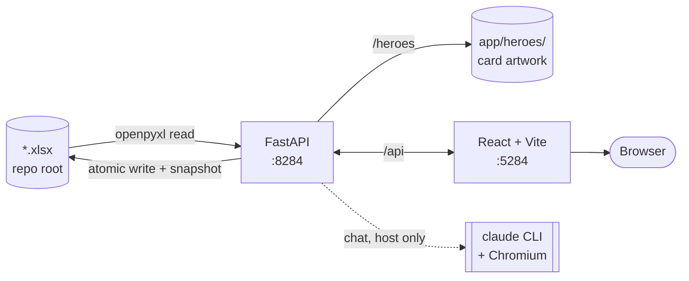
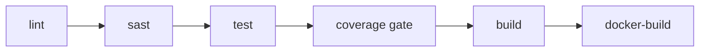

# TV Watch List

<!-- Replace OWNER/REPO in the two badge URLs below with the real GitHub path once the repo exists. -->
[](https://github.com/OWNER/REPO/actions/workflows/ci.yml)
[](https://github.com/OWNER/REPO/actions/workflows/codeql.yml)

A local web app for nineteen hand-curated watch orders — Marvel, DCU, Star Wars, Middle Earth, a
WWII chronology, and a shelf of anime — that live as Excel workbooks and stay that way.

**There is no database.** The nineteen `.xlsx` files in this repository's root *are* the data. The
app reads them with openpyxl and writes edits straight back into the same sheets, preserving each
workbook's table, dropdowns and conditional formatting, so opening one in Excel afterwards shows
exactly what you did in the browser. That is why the workbooks are committed here: a clone arrives
with the library already in it and there is nothing to import, migrate or seed.

`app/README.md` is the guide to the app itself — how a category works, how the artwork is built,
what happens when Excel is holding a file. This file is about the repository: what is in it, how to
run it on a fresh machine, and what CI does to it.

---

## The stack

| Layer | Choice |
|---|---|
| Backend | Python 3.13, FastAPI, Pydantic v2, openpyxl, uvicorn — managed by `uv` |
| Frontend | React 18, TypeScript strict, Vite, Redux Toolkit — managed by `pnpm` |
| Chat | `claude-agent-sdk`, shelling out to the Claude Code CLI, with Playwright/Chromium for pages that block plain fetches |
| Storage | The `.xlsx` workbooks themselves, plus pre-write snapshots in `app/.backups/` |
| Tests | pytest (712), Vitest (207), and a Playwright layout guard in real Chromium (152) |
| CI | GitHub Actions — lint → sast → test → coverage gate → build → docker-build, plus CodeQL |



## Layout

```
.
├─ *.xlsx                 The library. Eighteen workbooks, one per category. This is the database.
├─ run_tv.sh / .bat       Launchers: install on first run, start both servers, [r] restart, [k] stop.
├─ docker-compose.yml     The containerised alternative (no chat — see below).
├─ app/
│  ├─ README.md           How the app works.
│  ├─ backend/            FastAPI + openpyxl. src/tv_watchlist/workbook/ is the Excel layer.
│  ├─ frontend/           React 18 + TS strict + Vite + Redux Toolkit, and the layout guard.
│  ├─ heroes/             Per-category card artwork + ATTRIBUTION.md.
│  ├─ docs/               Design notes.
│  └─ .backups/           Automatic pre-write snapshots (local only, not committed).
└─ .github/workflows/     CI and CodeQL.
```

---

## Clone and run

### What the repo cannot carry

The workbooks travel; the toolchain does not. Install these first, on whichever machine you are on:

| | Why | Install |
|---|---|---|
| **uv** | runs the backend and owns its Python 3.13 | <https://docs.astral.sh/uv/getting-started/installation/> |
| **Node 20+ and pnpm 9.15.9** | run the frontend | <https://nodejs.org> then `corepack enable` — `app/frontend/package.json` pins `pnpm@9.15.9`, the version CI and the Docker image use, and corepack fetches and runs exactly that. |
| **`claude` on PATH** | chat shells out to it | `npm i -g @anthropic-ai/claude-code` |
| **Playwright's Chromium** | chat reads bot-blocked pages with it; the layout guard needs it too | see below |

`claude` is **signed in per machine**. A cloned repo carries no session — run `claude` once on the
new machine and log in there. Until both it and Chromium are ready, the launcher names what is
missing before it prints the URLs; chat answers 503 in the meantime and every other part of the app
works normally.

Nothing else has to be set up. There is no database to create, no migration to run, no seed data to
load: the workbooks arrive working.

### Windows

```bat
git clone https://github.com/OWNER/REPO.git TV
cd TV
run_tv.bat
```

### macOS / Linux

```bash
git clone https://github.com/OWNER/REPO.git TV
cd TV
chmod +x run_tv.sh      # only if your clone lost the executable bit
./run_tv.sh
```

Either launcher installs both halves on first run, starts the two servers, and then sits on a menu:
`[r]` restarts both, `[k]` stops and exits.

Both servers run in the terminal you launched from; neither launcher opens a second window.
`run_tv.bat` additionally tags every line `[backend]` or `[frontend]`, so two interleaved logs stay
tellable apart. That costs a little machinery, documented in the file itself: each server goes
through a PowerShell pipeline that adds the prefix, which in turn needs `CI=1` for the frontend so
Vite does not bind its own `r`/`q` keys and fight the menu for keystrokes, `PYTHONUNBUFFERED=1` so
uvicorn's access log is not block-buffered once its stdout is a pipe, and UTF-8 pinned for the
duration so Vite's box-drawing survives the pipe. `run_tv.sh` backgrounds both with `&` and does
not prefix them yet, so on macOS the two logs still interleave unlabelled.

| | |
|---|---|
| App | <http://localhost:5284> |
| API | <http://localhost:8284> |
| API docs | <http://localhost:8284/docs> |

Ports come from `TV_BACKEND_PORT` and `TV_FRONTEND_PORT`; the library folder from `TV_LIBRARY_DIR`.

### Chromium, for chat and for the layout guard

```bash
cd app/backend  && uv run playwright install chromium
cd app/frontend && pnpm exec playwright install chromium
```

### A note on line endings

`.gitattributes` pins `*.sh` to LF and `*.bat` to CRLF, and marks every `.xlsx` and image as binary.
That is not housekeeping: a CRLF checkout of `run_tv.sh` breaks its shebang on macOS with
`bad interpreter`, and a text-mode checkout of a workbook — an `.xlsx` is a zip — would corrupt the
whole library. Do not set `core.autocrlf` in a way that overrides it.

---

## Docker

```bash
docker compose up --build -d     # app on http://localhost:5284
docker compose down
```

Two containers: FastAPI behind an unprivileged nginx that serves the built SPA and proxies `/api`
and `/heroes`. The repo root is bind-mounted into the backend as `/library`, so the containers read
and write the very same workbooks the clone arrived with — nothing has to be exported back out.
Override `TV_LIBRARY_HOST` to point them at a copy instead.

**Chat does not work in a container**, deliberately. It needs the `claude` CLI, Chromium, and a
per-machine login, none of which belong in an image; `/api/chat` answers HTTP 503 with the same
message the launcher's preflight prints, and everything else behaves normally. Use the launchers if
you want chat.

---

## Continuous integration

`.github/workflows/ci.yml` runs six stages in order, each gated on the one before it:



| Stage | What runs |
|---|---|
| **lint** | `ruff check` + `ruff format --check`; `eslint` + `tsc -b` |
| **sast** | Semgrep (`auto` + OWASP/python/typescript/react/docker rulesets, SARIF into the Security tab), `pip-audit` over the exported lockfile, `pnpm audit --audit-level=high`, and `gitleaks` over the tree |
| **test** | pytest (712), Vitest (207), and the Playwright layout guard (152, real Chromium). Each publishes its own JUnit report — `junit-backend.xml`, `junit-frontend.xml`, `junit-layout.xml` — so the run shows per-test-case results, including when it fails |
| **coverage gate** | Holds each suite at the figure it measures today: backend **97%** lines, frontend **56%** lines / 54% statements / 45% functions / 45% branches. It ratchets — coverage may rise, never slip |
| **build** | `uv build`, `pnpm build`, and `docker compose config` |
| **docker-build** | Builds both images and scans each with `trivy --severity HIGH,CRITICAL --ignore-unfixed` |

`.github/workflows/codeql.yml` adds GitHub's own analysis for `python` and `javascript-typescript`
on every push and PR plus a weekly schedule.

**There is deliberately no `dependabot.yml`.** It was here briefly and opened eleven pull requests
in its first hour — five ecosystems on a weekly cadence, most of them proposing major version bumps
of tooling this app does not need to chase. For a personal project touched a few times a year that
is noise, and noise is how a pipeline stops being read. Dependabot *security* alerts are a
repository setting rather than a file, so they keep working: you still hear about an actual
vulnerability, just not about TypeScript 5.9 becoming 6.0.

Every `uses:` in both workflows is pinned to a 40-character commit SHA, with the release it belongs
to in the trailing comment. A tag is mutable — an action's owner can silently repoint `@v4` at new
code — and Semgrep fails the `sast` stage on any tag reference. With Dependabot gone those SHAs are
now bumped by hand, which is the trade: fewer interruptions, and an occasional deliberate afternoon
updating pins rather than a trickle of pull requests.

**About the coverage floors.** The frontend number looks low because Vitest is not the whole
frontend test story: most components are exercised by the Playwright layout guard, in a real
browser, and that produces no coverage data. The floors are set at what is measured today so a
regression is caught; raising them toward 100 is separate work and does not belong in the same
change as the pipeline that reports them.

### Running the checks yourself

```bash
cd app/backend  && uv run pytest -q                 # 712 tests
cd app/backend  && uv run ruff check .              # lint
cd app/backend  && uv run ruff format --check .     # formatting
cd app/frontend && pnpm exec tsc -b && pnpm lint    # types + lint
cd app/frontend && pnpm test                        # 207 tests
cd app/frontend && pnpm test:coverage               # with a coverage report
cd app/frontend && pnpm test:layout                 # 152 layout assertions in real Chromium
```

The SAST set, reproduced locally (all four are what CI runs):

```bash
docker run --rm -v "$PWD:/src" -w /src semgrep/semgrep semgrep scan \
  --config p/default --config p/owasp-top-ten \
  --config p/python --config p/typescript --config p/react --config p/docker \
  --severity ERROR --error --metrics=off
docker run --rm -v "$PWD:/src" ghcr.io/gitleaks/gitleaks:latest detect --source /src --no-git --redact
cd app/backend  && uv export --frozen --no-dev --no-emit-project --format requirements-txt -o /tmp/reqs.txt \
                && uvx pip-audit -r /tmp/reqs.txt --disable-pip
cd app/frontend && pnpm audit --audit-level=high
```

---

## Ports

| Port | Service |
|---|---|
| 5284 | Frontend (Vite dev server, or nginx under Docker) |
| 8284 | Backend (FastAPI) |
| 5286 | Layout-guard probe server, during `pnpm test:layout` only |

---

## Licensing

> **This repository has no licence file yet, and picking one is the owner's call.** Until a
> `LICENSE` is added, the code here is "all rights reserved" by default — nobody else may reuse it.
> Add the licence you want at the repo root and name it in this section.

The **card artwork in `app/heroes/` is licensed separately** and is not the repo owner's to
relicense. Every image came from Wikimedia Commons under a free licence — public domain, CC0, or
CC BY — and each one's source file, licence and source page are recorded in
[`app/heroes/ATTRIBUTION.md`](app/heroes/ATTRIBUTION.md). Whatever licence the code takes, those
terms continue to govern the images; the CC BY items in particular carry an attribution requirement
that `ATTRIBUTION.md` exists to satisfy.

The workbooks themselves are hand-curated content, and their contents — titles, release dates,
viewing order — are the owner's own compilation.
