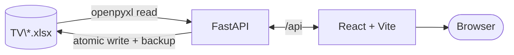

# Watch List

A local app for the `.xlsx` watch orders sitting in this repository's root folder.
The workbooks stay the source of truth — there is no database. Every change you make in the
app is written straight back into the spreadsheet, preserving its table, dropdowns, and
conditional formatting, so opening the file in Excel afterwards shows exactly what you did.

## Run it

```
run_tv.bat        (Windows)
./run_tv.sh       (bash)
```

First run installs both halves. Then:

| | |
|---|---|
| App | http://localhost:5284 |
| API | http://localhost:8284 |
| API docs | http://localhost:8284/docs |

`[r]` restarts both services, `[k]` stops and exits.

## How it works



One workbook is one category. The app opens on a wall of cards — one per category, each with
its own artwork and progress — and clicking one opens its watch order. The sidebar switches
categories from anywhere; the wordmark goes back to the cards.

The app reads the **first sheet** of each file, whatever it is called, finds its `Title` and
`Watched?` columns from the header row, and treats every other column as metadata. Nothing
about the column layout is hard-coded, which is why nineteen workbooks with eight to twelve
different columns all work.

- **Adding a category** — drop any `.xlsx` into the folder and it appears next time the app
  loads. If the sheet has no `Watched?` column, the app offers to add one with the same
  dropdown and green highlight the other workbooks use. Or use **New category** to generate a
  correctly-shaped workbook from scratch.
- **Marking things** — the circle on the rail cycles `not started → watched → watching →
  skipped`, using the sheet's own dropdown vocabulary. The rail is lit as far as your last
  watched entry, so you can see how far along an order you are.
- **Editing anything else** — the chevron opens every column of that entry. Columns Excel
  constrains with a dropdown stay constrained here, so the app cannot write a value Excel
  would reject.
- **Renaming a category** — click the title in the category header. The category name *is* the
  filename, so the field edits the filename directly and previews the display name the app
  will derive from it. It refuses names the filesystem would reject, names Windows reserves,
  and collisions with a workbook you already have. Only the file moves; nothing inside the
  workbook is touched, including its internal Excel table name.

## Card artwork

Every card has two layers. The backdrop is generated — a geometric motif picked from the
category id, drawn in that workbook's own accent colour, then rotated and scaled by a second
hash so no two categories look alike even when they share a motif. On top of it sits the
franchise logo from `app/heroes/`.

The eighteen images that ship came from Wikimedia Commons under free licences (public domain,
CC0, CC BY) — `app/heroes/ATTRIBUTION.md` lists the source file, licence and page for each.
Each was cropped to the mark and, where the original was dark line art or carried a solid
plate, recoloured or knocked out so it reads on a dark card.

To swap one, drop your own file into `app/heroes/` named after the category id:

```
app/heroes/naruto-comprehensive-master-watch-order.jpg
```

`.png` and `.svg` are treated as logo marks and sit centred on the generated backdrop;
`.jpg`, `.jpeg`, `.webp`, `.avif` and `.gif` are treated as photographs and fill the card
instead. Renaming a category changes its id, so rename the image to match.

## Safety

| Situation | What happens |
|---|---|
| First write to a workbook each session | A copy is saved to `app/.backups/` (last 10 kept) |
| The file is open in Excel | The write is refused with a clear message; nothing is written |
| The file changed on disk since the app loaded it | The write is refused and the app reloads, so an Excel edit is never clobbered |
| A save fails midway | Writes go to a temp file and are swapped in atomically — the original is never truncated |

## Controls you can actually click

jsdom has no layout engine, so no amount of component testing can see a button render where the
mouse cannot reach it. That shipped five times — the Approve button below the fold, the artwork
picks sliced out of their scroller at 1280x720, a revise's outcome ellipsised away — and every one
was found by hand, in a browser. A sixth, a toast landing on the dock's Send button, was found by
widening this guard.

`pnpm test:layout` is the standing answer. It mounts the real app, with the real stylesheets, in a
real Chromium at 1512x900, 1280x720, 1024x768 and 960x1040 — the last below the width at which the
shell stacks, which nothing else in the repo reaches — and drives it into eighteen surfaces: the
sidebar and the cards wall, a category with a row open, every dialog and the reference drawer, the
chat dock at both of its widths, and the three screens you only ever see because something already
went wrong — a file that would not open, a file another file hides, and a workbook Excel is holding.
For every control on a surface it asserts that the control is inside the window, that nothing is
painted over it, that nothing has spilled out of a box of its own underneath it, that at least half
of what the app promised of it is actually there, and that at least three quarters of it answers a
click.

Each control is judged on the area its panes have actually left visible, so a link an ancestor
ellipsises on purpose is measured at the width that is on screen rather than at the width of its
text — and a pane that ellipsises on purpose sets the size the control was promised at, so a
different pane slicing what is left still answers for it. Each is sampled across a grid of points
rather than at its centre alone, so a button 40% eaten fails instead of passing, and its perimeter
is walked besides, because occlusion arrives from an edge and the grid cannot see anything thinner
than a fifth of a control. Controls are first scrolled to through the panes a person can actually
scroll -- never `Element.scrollIntoView`, which also scrolls `overflow: hidden` boxes and would
report a sliced-off button as reachable. Five surfaces carry a toast, since a toast over a control
is invisible to every other test here. It also checks that the page never scrolls sideways, and that
a 200-row diff scrolls inside its own container.

Nothing in a run touches the network. The probes answer the app's own `fetch` boundary with
fixtures, and any request addressed off the probe server's origin fails the run.

## Layout

```
app/
├─ backend/           FastAPI + openpyxl. src/tv_watchlist/workbook/ is the Excel layer.
│  └─ tests/          712 tests, run against throwaway copies of the real workbooks.
├─ frontend/          React 18 + TypeScript strict + Vite + Redux Toolkit.
│  ├─ tests/          207 Vitest tests of behaviour, in jsdom.
│  └─ layout/         The layout guard: the real app in a real browser, at four window sizes.
├─ heroes/            Optional per-category card images, named by category id.
└─ .backups/          Automatic pre-write snapshots.
```

## Commands

```bash
cd app/backend  && uv run pytest -q                 # tests
cd app/backend  && uv run ruff check .              # lint
cd app/backend  && uv run ruff format --check .     # formatting
cd app/frontend && pnpm exec tsc -b && pnpm lint    # types + lint
cd app/frontend && pnpm test                        # tests
cd app/frontend && pnpm test:coverage               # tests, with a coverage report
cd app/frontend && pnpm test:layout                 # layout guard, in a real browser
```

Ports come from `TV_BACKEND_PORT` / `TV_FRONTEND_PORT`; the library folder from
`TV_LIBRARY_DIR`.

## Copying it to another machine

The whole `TV` folder travels as one and there is nothing to migrate: the workbooks *are* the
database, so they arrive working. Two directories must not travel with it:

```
app/backend/.venv
app/frontend/node_modules
```

Delete both before you copy. They hold binaries built for the machine they were installed on, and
the launcher's first-run check asks only whether they are there, not whether they work — so a stale
copy is worse than none at all, because the install is skipped and the first command fails instead.
Deleted, the launcher rebuilds them on the first run.

The folder carries no toolchain. Install these on the new machine first:

| | |
|---|---|
| `uv` | runs the backend and owns its Python |
| Node and `pnpm` | run the frontend |
| `claude` on `PATH` | chat shells out to it — `npm i -g @anthropic-ai/claude-code` |
| Playwright's Chromium | `uv run playwright install chromium` in `app/backend`, and `pnpm exec playwright install chromium` in `app/frontend` for the layout guard |

`claude` is signed in per machine — a copied folder carries no session, so run `claude` once on the
new machine and log in there. Until both it and Chromium are ready the launcher says so, by name,
before it prints the URLs; chat answers 503 in the meantime and everything else works.
