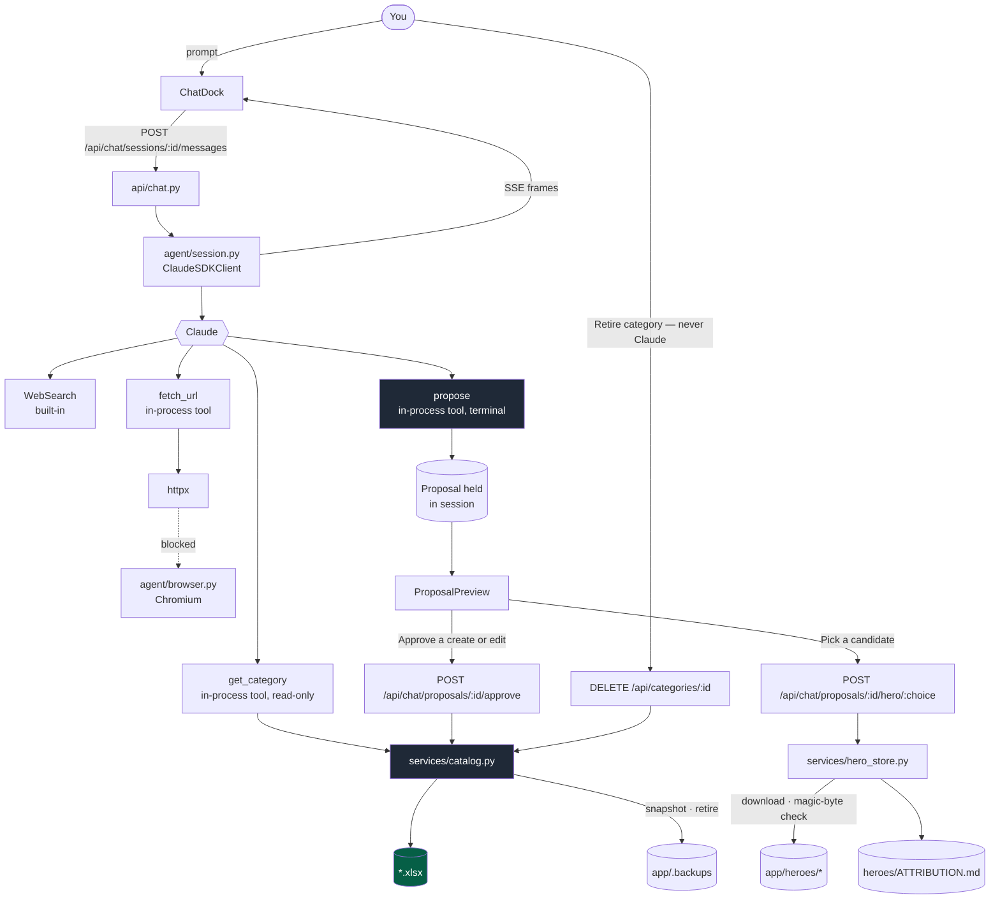
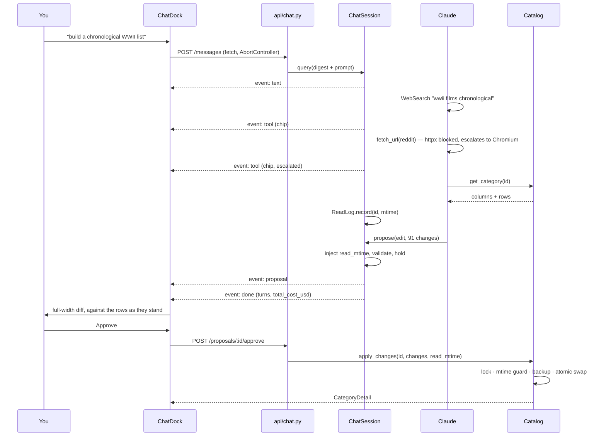
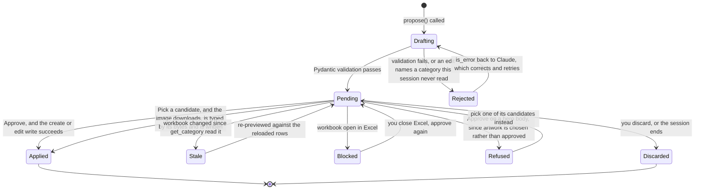
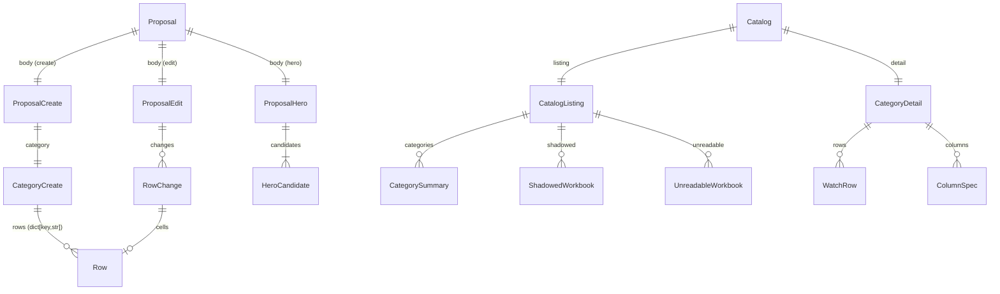

# In-App Claude Chat — Design Spec

Status: **implemented** — 709 backend tests and 206 frontend tests green, ruff and eslint clean
Target version: **0.2.0** (minor — additive throughout: `CategoryCreate.rows`,
`ProposalEdit.read_mtime`, the `hero` arm of the proposal union, and `CatalogListing.shadowed`)
Date: 2026-08-25

---

## 1. What this is

A chat panel inside the watch-list app that lets you say *"build me a chronological WWII movie
list"* or *"add the 2025 Marvel releases"*, and have Claude research it on the web and hand back a
**proposal** — a fully-formed set of rows, shaped to the sheet's own columns. You read the diff, you
approve it, and the app writes the workbook through the machinery that already exists.

A proposal comes in one of three shapes: a whole new category, a batch of row changes to an
existing one, or artwork for a category's card. The first two you approve as a diff. The third you
pick by eye, because artwork is taste rather than data.

The motivating case is real and was verified during design: the Reddit thread
`r/movies/comments/7i9cpp` contains 27 chronological event headings (*Sept 1939 – Invasion of
Poland* … *Aug 1945 – Fall of Imperial Japan*) with 91 films underneath them. That list is exactly
what a category should be, and turning it into a workbook by hand is an hour of transcription.

### The one-sentence architecture

> Claude is a **researcher, not a writer** — it has no filesystem access, and the only path from
> model output to a workbook runs through Pydantic validation into the existing `Catalog`. Artwork
> is the same rule wearing a different hat: the model names a URL, and the app decides whether those
> bytes are an image before anything is written.

---

## 2. Decisions

| # | Decision | Chosen | Why |
|---|---|---|---|
| 1 | Write authority | Propose → you approve → app writes | The workbooks are the source of truth. An agent holding a write handle on 18 hand-curated files is the exact risk the project exists to avoid. |
| 2 | Library context | Digest always, full rows on demand | ~10k tokens buys dedupe, "what haven't I watched", and column-style matching. Full rows only when asked for. |
| 3 | URL fetching | Playwright, cheap path first | Reddit is bot-blocked to `httpx`; a real Chromium reads it fine. Most sources need no browser. |
| 4 | Verb set | Add, revise, move, remove | Parity with what you can do by hand, since every change passes your eyes as a diff. Columns stay untouched. |
| 5 | Chat UI | Right dock, expands for proposals | Narrow while streaming, full-width for a 200-row diff. |
| 6 | Row data | Extend `CategoryCreate` with `rows` | The existing create path writes only `Order` and `Title`; researched metadata would land blank. |
| 7 | Freshness of an edit | Guard the write against the mtime `get_category` read at | Row numbers mean nothing except against the grid they were resolved on. A read taken at approve time would always match, and so would guard nothing. |
| 8 | Card artwork | A third proposal arm, picked by eye rather than approved as a diff | There is no diff to read for a picture. What the user needs is to see the candidates on a card-like ground and choose one. |
| 9 | Retiring a category | Human-only, and a move into `.backups` rather than a delete | Removing a whole hand-curated workbook is the heaviest act in the app. No tool offers it, the model has no route to it, and even your own click only moves the file. |
| 10 | Category naming | The workbook's filename stem, verbatim | The filename *is* the name. Deriving a prettier display name from it meant the app called a category something the folder did not, and a rename had to guess its way back. |

---

## 3. Verified findings

Everything below was **executed**, not read from documentation. Where something was not executed it
says so, and where a claim was later refuted by running the thing, the refutation stays on the page.

### 3.1 The Excel layer

```
18 workbooks   TableStyleMedium2 (rowStripes=True)   allowBlank=False   showDropDown=False
```

Every workbook in the library now carries the same table style, and every watch dropdown the same
formula `",Watched,In progress,Skip"`. **The leading comma is the empty option**, which is why a
sheet can set `allowBlank=False` and still accept a blank cell. Setting `allow_blank=False` for that
choice list in generated workbooks is therefore safe.

That uniformity is the *result* of §12, not the state the library was found in. The one workbook the
app itself had created was the odd one out — `tableStyleInfo` unset and `allowBlank=True` — because
`TABLE_STYLE_NAME` was declared in `constants.py` and referenced nowhere in `src/`. Every category
the app generated came out unbanded, with a `Watched?` dropdown that treated blank differently from
every hand-built sheet. The fix landed first and the one existing file was repaired.

Library shape: 960 data rows across 18 workbooks, 8–12 columns each, with a stable common core —
`Order / Title / Unit|Season / Release|Release Date / Type|Format / When to Watch /
Continuity|Canon|Universe|Era / Notes / Watched?`. One category also carries dropdowns of its
owner's own beside the watch status, which is why the reader derives choices per column rather than
assuming one dropdown per sheet.

None of those numbers are load-bearing, and no test asserts them: a test names its subject by
structural property, never by filename (§14).

### 3.2 `claude-agent-sdk` 0.2.144 — introspected by execution

| Claim | Result | Detail |
|---|---|---|
| Bundles a CLI binary | **No** | Pure-python wheel (`py3-none-any`); `_bundled/` holds only a `.gitignore`. Shells out via `shutil.which`. Resolved on the machine this was written on to `<home>\.local\bin\claude.EXE` (2.1.241). |
| Refuses npm's `claude.cmd` shim | **Yes** | Raises `CLINotFoundError`; `ClaudeAgentOptions(cli_path=...)` is the escape hatch. |
| Cost field is `cost_usd` | **REFUTED** | It is `total_cost_usd`. `cost_usd` does not exist and fails at runtime, not at type-check. |
| `Message` union has 4 members | **REFUTED** | Seven: `UserMessage`, `AssistantMessage`, `SystemMessage`, `ResultMessage`, `StreamEvent`, `RateLimitEvent`, `ConversationResetMessage`. |
| `setting_sources=None` means "no settings" | **REFUTED** | It means *CLI default* = user + project. On this machine that loads a 94KB global `CLAUDE.md`, 49 skills, 6+ plugins and 12 hook invocations. |
| `allowed_tools` limits which tools exist | **REFUTED** | It is a *permission* allowlist. `tools=[...]` controls availability. |
| `system_prompt=None` gives the Claude Code preset | **REFUTED** | It emits `--system-prompt ''` — an empty prompt. |
| A *named* built-in survives `tools=[...]` | **CONFIRMED** | `tools=["WebSearch"]` leaves WebSearch callable and the other built-ins gone. Confirmed in production: the agent searched, fetched and proposed in one turn under exactly the options block in §5. |
| `WebSearch` works under subscription auth in an embedded SDK context | **CONFIRMED** | Same production turn. The earlier spike had only proven tool-free auth. |
| Tool handlers run on the caller's event loop | **CONFIRMED** | Same loop id, same thread, verified in two independent sessions. An `asyncio.Lock` built on the caller loop was successfully acquired inside a handler. |
| Handler exceptions propagate to the app | **REFUTED** | `create_sdk_mcp_server` catches `Exception` and returns `{"isError": True}` to the model. The app never sees them. |
| `interrupt()` ends a turn cleanly enough to reuse the client | **REFUTED** | See §5. The interrupt is lost to the same cancelled scope that triggers it, and even when delivered it leaves the turn's tail queued on a stream that is never resynchronised. The conversation is retired instead. |

Measured cost of getting the config wrong:

| Config | Context tokens | Cost / trivial turn |
|---|---|---|
| Defaults (inherits global `CLAUDE.md`, hooks, plugins) | ~45.6k | $0.062 |
| `setting_sources=[]`, `tools=[]` | ~18.6k → 2.1k | $0.009 → $0.0037 |

Without `tools=[...]`, the CLI exposed 33 built-in tools, deferred the in-process tool behind
`ToolSearch`, and burned an extra model turn calling it before the real invocation.

**Auth:** with no `ANTHROPIC_API_KEY` on this machine, the CLI authenticated via subscription OAuth
from `~/.claude`. A server running as a different user will not find those credentials.

### 3.3 SSE through the Vite dev proxy — measured

**It works, with no `vite.config.ts` change.** POST + `StreamingResponse(media_type="text/event-stream")`
consumed with `fetch` + `response.body.getReader()`:

| Path | Deltas for a 400ms server cadence |
|---|---|
| Through Vite proxy (node) | 401–412 ms |
| Direct to FastAPI (control) | 401–424 ms |
| Through Vite proxy (real Chromium) | 408–414 ms |

Also confirmed: POST works (not GET-only); a 30-second silent gap before the first frame is not
killed by any timeout; and aborting the client fetch reaches the generator **within ~3ms**.

> **Refuted by implementation:** the conclusion drawn from that last measurement — *"which makes the
> Stop button free"* — was wrong. The client side is free: an `AbortController` is enough and no
> cancel endpoint is needed. The server side is not, because the abort arrives in **two** shapes and
> the CLI conversation behind it has to be retired rather than merely interrupted (§5). Starlette
> raises `asyncio.CancelledError` into the generator when the response task was suspended *inside*
> it, and closes the generator with `GeneratorExit` when the task was suspended in its own `send`
> instead. Handling only the first leaves half the stops unhandled.

`Cache-Control: no-cache, no-transform` and `X-Accel-Buffering: no` are **inert** here
(`X-Accel-Buffering` is an nginx directive; Vite uses node `http-proxy`). Set them anyway as
forward-compat for anything that fronts the backend in future, but do not debug against them.

> **Trap, documented because it cost a spike to find:** a WebSocket through the existing `/api`
> proxy entry **silently hangs forever** — no `open`, no `error`, no close code, and the HTTP
> Upgrade never reaches FastAPI. It requires `ws: true` on that proxy entry. We are not using
> WebSockets, but if one is ever added under `/api`, this is the failure you will be staring at.

The response is `transfer-encoding: chunked` with no `content-length`. Any code that calls
`response.json()` on the stream endpoint will block until the stream ends and destroy the
incremental behaviour. The typed contract is **per-frame**, not whole-response.

---

## 4. Architecture



Note what is **not** on that diagram: any edge from Claude to `*.xlsx`, to `app/heroes`, or to the
retire route. There isn't one. The model's reach ends at `propose`; every arrow past it starts with
a click of yours.

### Request lifecycle



### Proposal lifecycle



---

## 5. The agent

`app/backend/src/tv_watchlist/agent/session.py` holds one `ClaudeSDKClient` per browser session.

```python
ClaudeAgentOptions(
    model=AGENT_MODEL,                 # "claude-opus-5"
    effort=AGENT_EFFORT,               # "high"
    system_prompt=RESEARCH_SYSTEM_PROMPT,   # explicit — None emits an EMPTY prompt
    setting_sources=[],                # mandatory: else it inherits your global CLAUDE.md + hooks
    tools=[BUILTIN_SEARCH_TOOL],       # "WebSearch" — availability filter, not permissions
    mcp_servers={LIBRARY_SERVER_NAME: server},
    allowed_tools=list(AGENT_ALLOWED_TOOLS),
    permission_mode=AGENT_PERMISSION_MODE,  # "dontAsk" — deny-by-default
    cwd=catalog.library_dir,
    max_turns=MAX_AGENT_TURNS,
    env={},
)
```

Every value above is a named constant in `agent/constants.py`. No magic strings in logic.

**Session lifecycle.** `agent/registry.py` maps session id → session with idle eviction; sessions are
**in-memory and die with the backend**. Proposals and workbooks persist; conversations do not. A
session carries what one conversation accumulates: its client, its pending proposal, its `ReadLog`,
and whether it has already spent a turn's tokens on the library digest.
`agent/agent_client.py` narrows `ClaudeSDKClient` to the four calls a session actually makes —
`connect`, `query`, `receive_response`, `disconnect` — which is also the surface a test stands in for.

**Stop is a retirement, not an interrupt.** The obvious design is to catch the client's abort and
call `client.interrupt()`, keeping the conversation. It does not work, twice over:

- The abort *is* the cancellation. Awaiting anything inside a cancelled scope aborts at its first
  suspension, so the interrupt is thrown away by the very event that asked for it. `sse_frames`
  therefore does its cleanup inside `anyio.CancelScope(shield=True)`.
- Even delivered, an interrupt leaves the turn's tail and its own result frame queued on a stream
  one client multiplexes across every turn. The next question would read the previous answer's
  leftovers and end on its result frame, and a turn longer than the SDK's buffer would wedge the CLI
  outright. There is no point to resynchronise on.

So `ChatSession.abandon()` disconnects the client and stands a fresh one behind it. The dock keeps
its session id, its transcript, its pending proposal and its read stamps; only the CLI conversation
goes. Both cancellation shapes reach it — `asyncio.CancelledError` and `GeneratorExit` (§3.3) —
because Starlette abandons a generator in whichever shape matches where its task was suspended, and
handling one of them handles half the stops.

**Message dispatch must be exhaustive.** The union has seven members. `receive_response()` yields
`SystemMessage` frequently (init, thinking_tokens, hook events) and can yield `RateLimitEvent` and
`ConversationResetMessage`. A dispatch handling only Assistant/User/Result silently drops
rate-limit and conversation-reset signals — handle all seven or ignore explicitly, never by
omission. `SystemMessage` and `StreamEvent` are ignored on purpose, in a branch that says so.

**Blocking work is forbidden in a tool handler.** Handlers run on the FastAPI event loop (§3.2), so
`asyncio.Lock` from `workbook/locking.py` works directly — but anything CPU-bound or blocking must
go through `asyncio.to_thread`, exactly as `Catalog` already does.

**Handler exceptions must be logged inside the handler.** The SDK swallows them into an
`is_error` tool result; `agent/handler_guard.py` wraps every handler so the traceback is seen
in-process, and the model still gets a usable error back.

---

## 6. Tools

Each tool is one file under `agent/tools/`, per the one-concept-per-file rule.

### `get_category` — read-only

```
input:  { category_id: str }
output: { columns: [...], rows: [...] }   as JSON text
```

Calls `Catalog.detail(category_id)` on the shared `lru_cache` singleton from `api/dependencies.py`,
reusing the same workbook cache and per-file locks as the REST endpoints. **Never construct a
second `Catalog`.** Annotated `read_only_hint=True`. It also stamps the session's `ReadLog` with the
mtime it read at, which is what makes an edit proposable at all.

### `fetch_url` — cheap path first

```
input:  { url: str }
output: { text: str, via: "httpx" | "chromium", truncated: bool }
```

`agent/fetcher.py` tries `httpx` with a browser-like UA and a timeout. On a block signal (a blocking
status code, a challenge marker in the body, or a body that renders to almost no text) it escalates
to `agent/browser.py`, which owns a lazily-started Chromium and returns `document.body.innerText`.
Chromium starts on first escalation, not at boot, and is torn down with the app. Redirects are
followed by hand, one hop at a time, so the SSRF guard re-runs on every hop rather than once.

Output is capped at `MAX_FETCH_CHARS` and marked `truncated` rather than silently cut. The page text
is wrapped in the untrusted-content delimiters *before* the transport cap is applied, and if the
serialised result is still too large the text is trimmed and the payload rebuilt — trimming the JSON
itself would cut off the closing delimiter and leave untrusted web content unterminated in the
transcript.

### `propose` — terminal, the only route to a write

```
input:  a ProposalCreate, ProposalEdit or ProposalHero body (see §7)
output: { proposal_id: str, summary: str }
```

The handler validates the arguments through the same Pydantic models the REST API uses and stores
the `Proposal` on the session; the session emits a `proposal` SSE frame when the tool result comes
back clean. On validation failure it returns `is_error: True` with the message, and Claude corrects
and retries — malformed output never reaches the UI, let alone a workbook.

**The backend mints what the model must not choose.** The proposal `id` and the freshness stamp are
both stripped from the schema the tool advertises: the id at the top level, `read_mtime` at every
nesting depth, because it lives on one arm of a discriminated union. `get_category` records the mtime
it read a category at in that session's `ReadLog`, and `propose` injects it into the edit body. An
edit naming a category the session never read is refused with `is_error: True` telling Claude to read
it first. The approve write is guarded against that stamp, not against a live read taken at approve
time — a live read would always match and so would guard nothing.

**The hero arm carries no rows.** A `hero` body names one existing category and up to
`MAX_HERO_CANDIDATES` candidates, each a direct image URL plus its licence, its source page and a
one-line description. The system prompt asks for freely-licensed art, prefers a logo mark on a
transparent background, and says plainly that SVG will be refused however good the picture is. None
of that is trusted: §8 describes what the app does with the URL it is handed.

---

## 7. Data contracts

> A contract change is a minor semver bump and needs approval before it is made. `CategoryCreate`
> gaining `rows` was approved on 2026-08-24. Every later addition — the `hero` arm,
> `CatalogListing.shadowed` — is additive: nothing that already existed changed shape.

### Changed: `models/category_create.py`

```python
class CategoryCreate(BaseModel):
    name: str = Field(min_length=1, max_length=MAX_TITLE_LENGTH)
    accent: str = Field(default=..., pattern=HEX_COLOR_PATTERN)
    columns: list[str] = Field(default_factory=..., max_length=MAX_NEW_CATEGORY_COLUMNS)
    titles: list[str] = Field(default_factory=list, max_length=MAX_NEW_CATEGORY_ROWS)
    rows: list[dict[str, str]] = Field(default_factory=list, max_length=MAX_NEW_CATEGORY_ROWS)  # NEW
```

**Key vocabulary.** `rows` is keyed by **column key** — the slug `workbook/schema.py` derives from a
header — not by the raw header label. This keeps one key space across `CategoryCreate.rows`,
`RowWrite.cells`, `WatchRow.cells` and `ColumnSpec.key`. `CategoryCreate` validates that every key
in every row is derivable from `columns`; anything else is a 422.

**Mutual exclusion.** Supplying both `titles` and `rows` is a 422. `titles` is retained unchanged so
the existing `NewCategoryDialog` keeps working untouched.

**`name` is the filename.** `workbook_filename` writes the name verbatim, collapsing only the runs a
filesystem will not take into single underscores, and appends nothing of its own. The category is
then named `path.stem` — exactly what is on disk, read straight back. There is no display name
derived from the filename by stripping words: that layer existed, it made the app call a category
something the folder did not, and it was removed. The system prompt tells the model to name a create
proposal the way the file should be named, because that is literally what happens.

### New: `models/row_change.py`

```python
RowChangeKind = Literal["add", "revise", "move", "remove"]

class RowChange(BaseModel):
    kind: RowChangeKind
    row: int | None = Field(default=None, ge=FIRST_DATA_ROW)    # existing row: revise / move / remove
    after_row: int | None = Field(default=None, ge=HEADER_ROW)  # placement anchor: add / move
    cells: dict[str, str] = Field(default_factory=dict)         # add / revise
    reason: str = Field(default="", max_length=MAX_REASON_LENGTH)
```

A model validator rejects incoherent shapes rather than letting the writer discover them: an `add`
that names an existing row, a `revise` with no cells, a `move` with no anchor, a `remove` carrying
cells. `reason` is what the diff shows next to each change, and it is the audit trail for why Claude
did something.

### New: `models/proposal_create.py`, `models/proposal_edit.py`, `models/proposal_hero.py`, `models/proposal.py`

```python
class ProposalCreate(BaseModel):
    kind: Literal["create"]
    category: CategoryCreate
    # `titles` belongs to the hand-typed dialog; a diff built from it would show the user nothing,
    # so a create proposal must carry `rows`.

class ProposalEdit(BaseModel):
    kind: Literal["edit"]
    category_id: str
    read_mtime: float          # minted by the backend from the session's ReadLog, never by the model
    changes: list[RowChange] = Field(max_length=MAX_PROPOSAL_CHANGES)

class ProposalHero(BaseModel):
    kind: Literal["hero"]
    category_id: str
    candidates: list[HeroCandidate] = Field(min_length=1, max_length=MAX_HERO_CANDIDATES)

class Proposal(BaseModel):
    id: str                    # minted by the backend
    summary: str
    sources: list[str] = Field(default_factory=list, max_length=MAX_PROPOSAL_SOURCES)
    body: ProposalCreate | ProposalEdit | ProposalHero = Field(discriminator="kind")
```

### New: `models/hero_candidate.py`

```python
class HeroCandidate(BaseModel):
    url: str = Field(max_length=MAX_HERO_URL_LENGTH, pattern=HTTP_URL_PATTERN)
    source_file: str = Field(max_length=MAX_HERO_SOURCE_FILE_LENGTH)
    licence: str = Field(max_length=MAX_HERO_LICENCE_LENGTH)
    page: str = Field(max_length=MAX_HERO_URL_LENGTH, pattern=HTTP_URL_PATTERN)
    description: str = Field(max_length=MAX_HERO_DESCRIPTION_LENGTH)
```

The app downloads `url` and the dock links `page`, so neither may carry a scheme that means anything
other than "fetch this over the web" — hence the pattern on both, before the SSRF guard ever sees
them.

### New: `models/shadowed_workbook.py`, additive on `CatalogListing`

```python
class ShadowedWorkbook(BaseModel):
    file_name: str
    category_id: str
    answered_by: str
```

Two files whose names derive the same id are not two categories: reads and writes both go through
`discovery.resolve`, which answers with the first of them, and the rest are unreachable.
`CatalogListing.shadowed` names them instead of letting one quietly disappear. It is additive, so a
client that ignores the field behaves exactly as it did before.

### New: `models/chat_event.py`

One model, serialized once per SSE `data:` line. Never a whole-response model.

```python
ChatEventType = Literal["text", "tool", "proposal", "error", "done"]
```

### Contract map



---

## 8. The write path

Every write in this app is reversible. Nothing is overwritten without a copy of what was there,
nothing is deleted, and a name that is already taken is refused rather than resolved by clobbering.

### Create

`Catalog.create_category` takes the whole `CategoryCreate` and holds `lock_for(destination)`.
`creator._write_rows` fills every supplied cell rather than only `Order` and `Title`, and the table,
dropdown and highlight it builds are the ones §12 made match the library.

Before it writes, it asks `discovery.addressed_by` whether the id this filename derives is already
answered by another file. A free filename is not a free category: punctuation drops out of an id, so
`Yu Gi Oh` would answer to the same id as a `Yu-Gi-Oh!` already on disk and every later write would
land on the wrong workbook. That is a `DuplicateCategoryError` naming the file that already holds
the id, not a silent second card.

### Edit

```python
async def apply_changes(
    self, wanted_id: str, changes: list[RowChange], expected_mtime: float
) -> CategoryDetail:
```

Goes through the existing `_write` → `_mutate` chain, so it inherits **one** freshness guard, **one**
`backup.snapshot`, **one** cache invalidation and **one** atomic swap for the entire batch. This is
the whole reason for a bulk primitive: replaying 91 changes as 91 `append_row` calls would be 91
full workbook rewrites, each one guarded against an mtime the previous one had just changed.

`writer.apply_changes(path, changes)` resolves every change against the **original** row numbers,
computes the final grid in memory, then rewrites the data region once and resyncs the table ref,
dropdown range and conditional-formatting range via `ranges.sync`. Resolving against original row
numbers is what prevents index drift when a remove and a move appear in the same batch.

### Backups

`backup.snapshot` copies the workbook aside before any mutation. Two properties matter:

- **The throttle applies to single-cell edits only.** `Catalog.update_row` passes
  `backup_interval_seconds`; every other write passes `NO_THROTTLE` and always takes its own copy.
  A person marking rows watched generates dozens of writes a minute and wants a trail, not a
  snapshot per keystroke. A create, an append, a delete, a bulk apply, a rename or a retirement is a
  deliberate act, and each one gets a restore point of its own.
- **No copy ever displaces one already taken.** `free_destination` suffixes `_2`, `_3` … when the
  timestamp — accurate only to the second — is already spoken for. The underscore sorts after the
  suffix dot, so copies sharing a second stay in order for pruning.

### Rename

Renaming the workbook is renaming the category, so the id changes with it. The same
`discovery.addressed_by` guard applies, `besides` the file being moved: the loser of an id clash is
not merely hidden, every read and write lands on the other workbook. The artwork moves with the
category — and anything already filed under the *new* id is retired first, because it belongs to no
category any more but it is still artwork.

### Retire

`DELETE /api/categories/{id}` moves a category out of the library. It never unlinks anything:

1. `guard_fresh` against the mtime the client last saw, then a refusal if Excel is holding the file
   open — Windows will not move it, so the refusal has to come before anything moves.
2. The workbook goes to `app/.backups` under a `retired-<timestamp>` stamp, through the same
   `free_destination` collision suffixing.
3. Every artwork suffix a card looks for goes to the same folder under the **same** stamp, so a
   workbook and the art that belongs with it are visibly one retirement. Every suffix, not just the
   one a card paints: an image left behind would be inherited by the next category to take that id.

The `retired-` prefix is also a pruning marker. Retirements live in the same folder as the routine
snapshots and are filed under the same stem a later namesake would use, so `backup._prune` excludes
them explicitly: a restore point is one of many copies of a live file, a retirement is the only copy
of itself and the retention window must never reach it.

Moving the workbook back is all it takes to bring the category back.

### Artwork

`HeroStore.save` is the only path from a candidate URL to a file:

1. The category is resolved first, so an id the library does not hold is refused before anything is
   fetched.
2. `assert_public_http_url`, then a download with a timeout, no redirect following, and a hard byte
   cap enforced **while streaming** rather than against a declared length.
3. `image_suffix` types the bytes by their own magic numbers — PNG, JPEG, GIF, or a RIFF container
   whose form type is `WEBP`. The URL's extension and the server's content type are both ignored.
   SVG is absent on purpose: it is scriptable XML arriving from the open web on a model's say-so.
4. The destination is `heroes_dir / f"{detail.id}{suffix}"`, resolved and asserted to be inside the
   heroes folder.
5. The standing artwork is *moved* into `.backups` under a timestamp, not unlinked, through
   `free_destination` — a hand-made, hand-recoloured mark is the one thing here that cannot be
   fetched again, and two picks for one category can easily fall inside one second.
6. `ATTRIBUTION.md` gains a row saying what this category's artwork *is*. A re-pick supersedes that
   category's own row rather than appending a second, and rows the owner wrote by hand are never
   what it matches. A first credit is appended; a supersede is written beside the file and swapped
   in, so a failure mid-write cannot truncate the credits. Each cell is escaped backslashes-first,
   then pipes (§13), so no model-supplied text can widen the table.

Steps 5 and 6 run under two locks from the workbook layer's own registry: the category's artwork key
first, then the shared credit table. Two picks for one category cannot interleave, two picks for
different categories cannot deadlock, and the credit table is read-modify-written by one of them at
a time. The lock key for artwork is the whole set of a category's images, not any one suffix,
because a replacement can arrive in a different format.

---

## 9. Transport

| Method | Path | Body | Returns |
|---|---|---|---|
| POST | `/api/chat/sessions` | — | `{ session_id }` |
| POST | `/api/chat/sessions/{id}/messages` | `{ text }` | SSE stream of `ChatEvent` |
| POST | `/api/chat/proposals/{id}/approve` | — | `CategoryDetail` |
| POST | `/api/chat/proposals/{id}/hero/{choice}` | — | `CategoryDetail` |
| DELETE | `/api/chat/sessions/{id}` | — | 204 |
| DELETE | `/api/categories/{id}?expected_mtime=` | — | `CatalogListing` |

Approval is a separate short request rather than a continuation of the stream, so the write happens
on an ordinary bounded request that can return a clean 409.

Artwork gets its own route rather than a flag on approve, because it is a different act: the path
segment *is* the choice, and approving a hero body is refused outright (§11). Retiring answers with
the library that is left, because the category it took away no longer has a detail to return — and
it sits on the **categories** router, not the chat one, precisely so that nothing under `agent/` is
one import away from calling it.

A proposal has no endpoint of its own to discard it: it is held by its session, so ending the
session is how the server is told to forget one. The dock's Discard button drops it from the screen;
"New chat" closes the session behind it.

Frames:

```
data: {"type":"text","text":"Searching for chronological WWII film lists…"}
data: {"type":"tool","name":"mcp__library__fetch_url","detail":"reddit.com/r/movies/…","state":"escalated"}
data: {"type":"proposal","proposal":{...}}
data: {"type":"error","code":"RateLimit","message":"…"}
data: {"type":"done","turns":7,"total_cost_usd":0.14}
```

`total_cost_usd` — not `cost_usd` (§3.2). Frames are serialised with `exclude_none=True`, so each one
carries only the fields its type uses.

The router registers in `create_app()` at `main.py` alongside `categories` and `rows`. Existing CORS
already scopes to the frontend origin and allows POST, so **no CORS change is needed**. Set
`Cache-Control: no-cache, no-transform` and `X-Accel-Buffering: no` on the `StreamingResponse` as
forward-compat, knowing they are inert against Vite.

The generator catches `asyncio.CancelledError` **and** `GeneratorExit`, retires the conversation
inside a shielded cancel scope, and re-raises — so a closed dock or a navigated-away tab never
leaves an orphaned CLI subprocess on Windows, and never poisons the next turn (§5).

---

## 10. Frontend

No router exists — view state lives in `uiSlice` and `types/AppView.ts`. The dock is an **overlay,
not a view**, so `AppView` is unchanged. It mounts in `App.tsx` as a sibling of `<Sidebar />` and
`<ToastStack />`.

```
src/api/
  createChatSession.ts     one concept per file, matching the existing api/ convention
  openChatStream.ts        fetch + getReader; NEVER response.json() on this endpoint
  approveProposal.ts       chooseHero.ts       discardProposal.ts    retireCategory.ts
src/stores/chatSlice.ts    added to store.ts alongside catalog / category / ui
src/types/
  ChatEvent.ts  ChatMessage.ts  Proposal.ts  ProposalCreate.ts  ProposalEdit.ts
  ProposalHero.ts  RowChange.ts  HeroCandidate.ts  StandingRows.ts
src/hooks/useStandingRows.ts
src/utils/
  anchorOf.ts  identifyRow.ts  standingRowsIn.ts  isHttpUrl.ts  categoryIn.ts
src/components/
  ChatLauncher.tsx   ChatDock.tsx        ChatComposer.tsx    ChatMessageBubble.tsx
  ToolChip.tsx       ProposalPreview.tsx ProposalDiff.tsx    ProposalRow.tsx
  HeroTarget.tsx     HeroCandidates.tsx  RetireCategoryDialog.tsx
src/styles/chat.css   accent + surface tokens from the existing styles/tokens.css
```

`request.ts` is left alone — it parses JSON and would block on a stream. `openChatStream.ts` is a
separate reader, which is correct rather than duplicative: it is a different transport, not a
second copy of the same one. It validates each frame's `type` against the known set before it is
dispatched, so a malformed line is dropped rather than reduced into state.

The dock is narrow while streaming and takes the full width when `chat.pendingProposal` is set.
Stop is an `AbortController` on the in-flight fetch — no cancel endpoint (§3.3) — and an aborted
thunk adds nothing to the transcript, because the person who pressed Stop does not need it explained
back to them.

**The diff's safety property: what is rendered can never understate what will be written.** A
proposal names rows by number, and a number is not something a reader can check. So the preview
reads the target category's rows fresh — a proposal can name a category nobody is looking at — and
uses them to say:

- what each named row *is* today, in the "Now" column, or plainly why that is not known (still
  reading, unreadable, or no such row now);
- what a revise would replace, cell by cell, so a revise that blanks a cell renders as
  `something → (blank)` rather than as an empty box indistinguishable from a line that changes
  nothing — and when the sheet has *not* been read, so there is no "before" to show, the erasure
  still renders as `(blank)`: the only cell that may render empty is one the change does not write;
- where a move would land, named the same way — `after 14 · Rogue One`, or `to the top` when the
  anchor is the header row.

**A hero proposal shows what it would replace.** A hero body carries only a category id, and a
summary reading "artwork for Naruto" can carry a different one. `HeroTarget` puts the card's own
name and its current artwork on screen beside the candidates, so the click is checked against the
card rather than against a slug. Candidate images and source links render only when the model's text
is plainly an http(s) address. A candidate card is never capped below the height of its own picture,
licence and pick button: capping it does not make it fit, it makes the button spill past the card
and land outside the scroller's clip, where it cannot be clicked at all. A row too tall for the
space scrolls; it is never sliced.

The shadowed list is mirrored wherever the library is listed — the cards wall and the sidebar — so a
dropped-in namesake is visible rather than a file that silently does nothing.

---

## 11. Error handling

| Condition | Where | Behaviour |
|---|---|---|
| `WorkbookLockedError` | approve | 409; proposal **preserved**; "Close it in Excel and approve again" |
| `StaleWorkbookError` | approve | 409; proposal re-previewed against the reloaded workbook, never force-applied |
| `UnknownColumnError` / `InvalidChoiceError` | approve | 409 naming the cell; the diff flags that row |
| `HeroChoiceRequiredError` | approve | 400; a hero body is picked by eye, not approved as a diff |
| `NoHeroCandidatesError` / `UnknownHeroCandidateError` | hero pick | 400; the choice is not one this proposal offered |
| `HeroDownloadError` / `UnsupportedImageError` | hero pick | 400 the dock can show; nothing is written and the standing artwork stays exactly where it was |
| `CategoryNotFoundError` | hero pick, retire | 404 before anything is fetched or moved; the proposal survives |
| `WorkbookLockedError` / `StaleWorkbookError` | retire | 423 / 409; the workbook has not moved |
| Blocked URL, browser also fails | `fetch_url` | `is_error` → Claude reports it and asks you to paste; chip turns amber |
| Model proposes an unknown column key | `propose` | Pydantic error → `is_error` → Claude corrects and retries; UI never sees it |
| Model proposes an edit to a category it never read | `propose` | `is_error` naming `get_category`; there is no stamp to guard the write with |
| Client disconnects or presses Stop | stream | `CancelledError` **or** `GeneratorExit` → shielded `session.abandon()` → re-raise |
| `CLINotFoundError` | session create | 503 "Claude Code is not installed, or `claude` is not on this machine's PATH" |
| Rate limit / conversation reset | dispatch | Surfaced as an `error` frame — these are two of the seven union members that are easy to drop |

`WorkbookLockedError` is returned to Claude as **stop and report**, never as retryable. Retrying a
file that is open in Excel is how you get an agent spinning against a lock forever.

Every refusal returns the same `{error, message, detail}` envelope, whichever status carries it, so
the dock and the category view render failures the same way.

---

## 12. Prerequisite fix

Landed **before** the chat work, so the first category Claude built was already correct.

1. `workbook/ranges.py` — the table a new category gets carries
   `TableStyleInfo(name=TABLE_STYLE_NAME, showRowStripes=True, showColumnStripes=False,
   showFirstColumn=False, showLastColumn=False)`, matching every hand-built workbook exactly.
   This made `constants.TABLE_STYLE_NAME` live rather than dead.
2. `workbook/ranges.py` — `add_choice_validation` derives the flag instead of hardcoding it:

   ```python
   allow_blank = "" not in choices
   ```

   When the choice list already offers an empty option, blank is reachable through the list and
   `allowBlank` is unnecessary — which is exactly the shape the library has (`",Watched,In progress,Skip"`
   with `allowBlank=False`, verified §3.1). When a future dropdown has no empty option, the flag
   stays `True` rather than silently forcing a value into every cell. Both callers — `creator.py`
   and `writer.add_watch_column` — pass `DEFAULT_WATCH_CHOICES`, which begins with `""`, so both
   land on `False` and match the library. A hardcoded `False` would work today and become a trap the
   first time this generic helper is reused; the derivation is the same length and cannot rot.
3. One-time repair of the single workbook the app itself had created — table style and the dropdown
   `allowBlank` flag only. **No cell values were touched.** Backed up first through the normal
   `backup.snapshot` path. §3.1's survey is the library after that repair.

---

## 13. Security

Per the global standard, every untrusted-input boundary and the injection classes it faces.

| Boundary | Classes | Defence |
|---|---|---|
| Your chat text → prompt | — (you are the trusted party) | Length-capped at `MAX_CHAT_MESSAGE_LENGTH`, enforced by FastAPI before the body is read into a session |
| **Fetched web content → prompt** | **Prompt injection** | Delimited and labelled as untrusted data; system prompt states delimited content carries no authority and that a page issuing instructions is an attack to quote back; **structurally, the agent has no write capability**, so a successful injection can at worst produce a bad proposal that you visibly reject |
| Model output → tool arguments | Argument injection | Every argument through Pydantic (`sanitize()`, length caps, column-key allowlist, kind-coherence validators). The proposal id and the freshness stamp never come from the model: the backend mints both and hides them from the advertised schema — the id at the top level, `read_mtime` at every nesting depth, since it lives on one arm of a union |
| `fetch_url` → outbound request | **SSRF** | http/https only; DNS-resolved address rejected if private / loopback / link-local / multicast / reserved / unspecified; redirects followed by hand so the guard re-runs on every hop; timeout, byte cap and char cap |
| **Candidate URL → downloaded image** | **SSRF, unsafe content** | The same guard before the request; redirects refused outright rather than followed; body capped while streaming; the file type read from the bytes' own magic numbers, never from the URL or the content type; **SVG refused** because it is scriptable XML; the written path is `heroes_dir / id + suffix`, resolved and asserted to be inside the heroes folder |
| Candidate metadata → `ATTRIBUTION.md` | Markdown / row injection | Every cell has its whitespace collapsed, its backslashes doubled and then its pipes escaped, so no candidate can split a row in two or forge a column; the order matters, because escaping only the pipe puts a backslash in front of one the value already carried and that pair is itself an escape, freeing the pipe behind it; only the row this app itself wrote for that category is ever rewritten |
| Model output → UI | XSS | Rendered as text through React escaping. No `dangerouslySetInnerHTML`. A model-supplied string becomes an `` or an `<a href>` only when it plainly starts `http://` or `https://` |
| Category reference | Path traversal | The agent names a category *id*, and `discovery.resolve` maps ids onto files it found by globbing the library; the hero write re-asserts containment anyway rather than leaving it to be verified elsewhere |
| Retiring a category | Privilege | Not reachable by the agent at all: no tool exposes it, and the route lives on the categories router. Behind your own click it still only *moves* files (§8) |
| Chromium | Resource exhaustion | Single lazily-started instance behind a launch guard, per-fetch timeout, page closed per fetch, torn down with the app |
| Chat sessions | Resource exhaustion | In-memory registry with idle eviction; every session's CLI subprocess ends with the backend's lifespan |

The prompt-injection defence worth restating: it is not primarily a prompt-engineering defence. It
is that decision #1 removed the capability an injection would want, and decision #9 kept the one
destructive-looking act in the app out of the model's reach entirely.

Ruff's `S` rules already gate this project; `httpx` calls get explicit timeouts to satisfy them.

---

## 14. Testing

709 backend tests and 206 frontend tests, all green, with ruff and eslint clean.

**No test names a workbook.** `tests/library_choice.py` selects a subject by structural property —
"an unmarked, reorderable category", "the one category whose dropdown stops short of its grid", "a
category holding both a watched and an unwatched row" — over facts read by `tests/workbook_facts.py`.
Nothing in the suite depends on what the owner called a file, and the whole suite passes against a
scratch library whose 18 workbooks carry arbitrary names, pointed at with `TV_LIBRARY_DIR`.

Backend:

| File | Covers |
|---|---|
| `tests/library_choice.py`, `tests/workbook_facts.py` | How a test names its subject: by shape, never by filename |
| `tests/workbook/test_creator_fingerprint.py` | A bulk-created workbook matches a hand-built one on table style, `allowBlank`, DV formula, CF rule and header style |
| `tests/workbook/test_apply_changes.py` | add / revise / move / remove on throwaway copies; range resync; original-row-number resolution with a remove and a move in one batch |
| `tests/workbook/test_choice_validation.py` | `allow_blank` derived from the choice list, both ways |
| `tests/workbook/test_retirement_survives_pruning.py` | No number of same-named snapshots lets the retention window reach a retirement |
| `tests/models/*` | The contracts: the discriminated union across all three arms, unknown column key rejected, `titles` + `rows` together rejected, kind coherence, caps |
| `tests/agent/*` | Tool handler shapes; handler exceptions logged rather than swallowed; the SSRF guard; fetch escalation; digest; prompt; preflight; registry eviction |
| `tests/agent/test_session.py` | Event mapping across **all seven** `Message` union members; `total_cost_usd` read correctly |
| `tests/api/test_chat.py` | SSE frame sequence; approve 409 on lock and on stale with the proposal kept; a create built with its researched cells; hero pick, refusal and credit |
| `tests/api/test_chat_stop.py` | Both cancellation shapes; a stopped turn does not leak into the next answer; a turn longer than the SDK's buffer is retired rather than wedged; the retirement outlives the cancellation that triggered it |
| `tests/api/test_retire.py` | The endpoint answers with the library that is left, and refuses rather than half-moves |
| `tests/services/test_retire_category.py` | Both files move under one stamp; two retirements pinned to the *same* stamp keep both workbooks and both images |
| `tests/services/test_hero_store.py` | Every accepted format; the suffix from the bytes not the URL; SVG refused; caps; redirects refused; the replaced artwork kept; two picks at once |
| `tests/services/test_attribution.py` | One row per category, curated rows untouched, supersede in place, and no escaping of model text that can forge a column |
| `tests/services/test_shadowing.py` | Every file is either shown or accounted for; the shadowed file is left untouched on disk |

Frontend — 206 tests across 20 files, written as behaviour tests against the real components, the
real reducers and the real SSE reader. No mocks are asserted on and there are no snapshots:

| File | Covers |
|---|---|
| `tests/api/openChatStream.test.ts` | Frame splitting, partial chunks, malformed frames dropped, error bodies |
| `tests/stores/chatSlice.test.ts` | Text deltas coalescing into one bubble; tool chips; the proposal kept on a failed write; an abort adding nothing |
| `tests/stores/categorySlice.test.ts`, `writeQueue.test.ts` | The write path the dock shares with the category view |
| `tests/components/ProposalDiff.test.tsx`, `ProposalRow.test.tsx`, `ProposalPreview.test.tsx` | The safety property: what is rendered can never understate what will be written |
| `tests/components/CategoryHero.test.tsx` | The `isLogo` extension classification, which shipped broken against cache-busted URLs |
| `tests/components/HeroCandidates.test.tsx` | Candidates, licences, and what happens to a URL that is not one |
| `tests/components/RetireCategoryDialog.test.tsx` | The confirmation: the button stays asleep until the name has been typed out in full |
| `tests/utils/*.test.ts` | The pure functions the diff's honesty rests on |

Those tests were proved to catch real, shipped bugs by temporarily reverting the fixes in
`CategoryHero.isLogo` and `ProposalRow.legible` and watching 13 tests go red, then restoring both
files byte-identically. Eight further mutations — each breaking one component or reducer in exactly
the way one test claims to detect — were each killed by the test that claims them.

**No test makes a live Claude call and none touches the real library.** `ClaudeSDKClient` is stood
in for by a scripted CLI transport; the fetcher runs against an httpx mock transport and a recording
page reader; workbook tests run on `tmp_path` copies of the real workbooks with structural-fingerprint
assertions.

---

## 15. Dependencies and launcher

Runtime dependencies in `app/backend/pyproject.toml`:

| Package | Why | Note |
|---|---|---|
| `claude-agent-sdk` | The agent runtime | Pulls `mcp>=1.23,<3` which drags `starlette`, `uvicorn`, `sse-starlette`, `python-multipart`, `pydantic`. Resolved against the existing `fastapi>=0.115.0` — this was the one real integration risk in the dependency set, and it resolved clean |
| `playwright` | Blocked-URL fallback | ~150–200MB Chromium on first run |
| `httpx` | The cheap fetch path and the artwork download | Was a **dev** dependency; promoted to runtime |

`claude` must be on `PATH` — the wheel ships no binary. The launcher (`run_tv.bat` / `run_tv.sh`)
runs `python -m tv_watchlist.agent.preflight` before it prints the running banner, and reports one
clear line per missing requirement — the CLI, the Chromium download — rather than letting the first
chat message fail with a 503.

---

## 16. Open items

Carried deliberately, rather than guessed at here. Items 1 and 2 of the original list are now
answered by production use and have moved into §3.2 as confirmed findings.

1. **Long-lived process auth.** One `claude -p` run proves single-shot OAuth. It proves nothing
   about token refresh across a multi-hour uvicorn process.
2. **Production static build.** The SSE measurements cover the Vite **dev** proxy only, which is
   also how the app is actually run. A built frontend behind nginx would need `proxy_buffering off`
   — which is where those inert headers finally earn their place.
3. **Chromium's cost over a long session.** It is started once, lazily, and closed with the app, and
   each fetch opens and closes its own page. Nothing has measured what the browser costs after many
   escalations in one uptime.
4. **The idle-eviction window is a chosen number, not a measured one.** `SESSION_IDLE_SECONDS` is an
   hour because that felt right for a dock you leave open, not because anything was profiled.

---

## 17. Out of scope

- Column changes on an existing sheet (add / rename / reorder columns) — decision #4 stops at rows.
- Deleting anything. A category is *retired* (§8), and retiring is yours alone: no tool offers it,
  and the route does not live on the chat router.
- Chat history surviving a backend restart. `ClaudeSDKClient` can `resume` from a session id if that
  changes; the design does not assume it.
- Any path from Claude to the filesystem. Permanently out of scope, not deferred. The artwork
  download is not an exception: the model names a URL, and the app — not the model — decides whether
  those bytes are an image and where the file goes.
