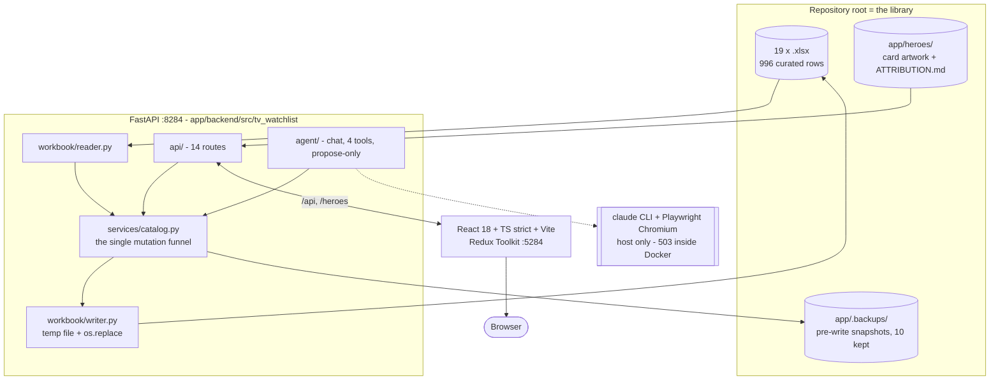
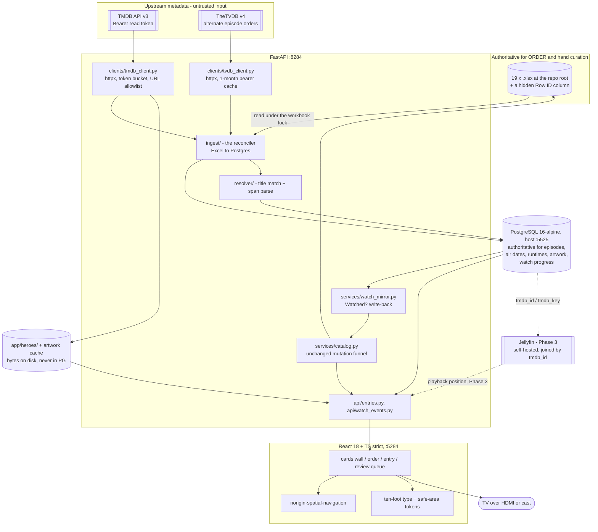
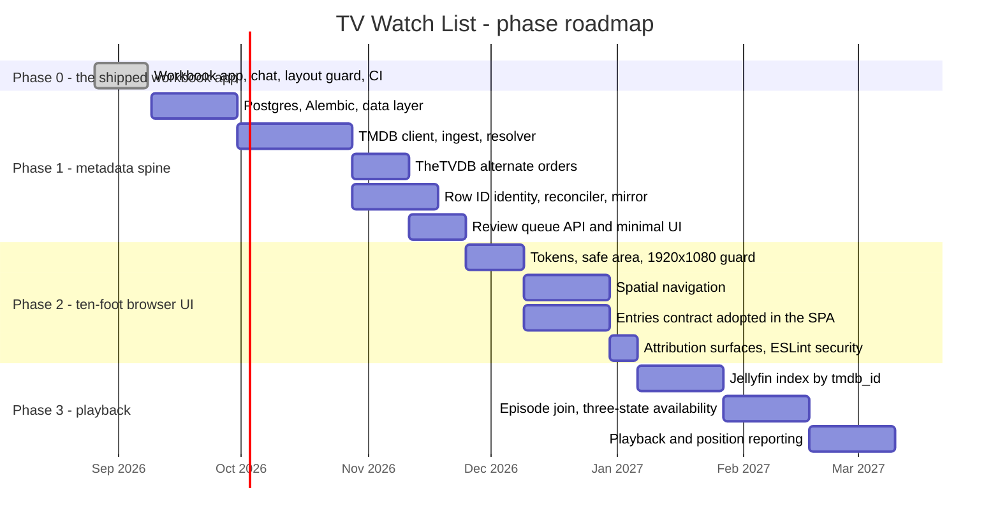
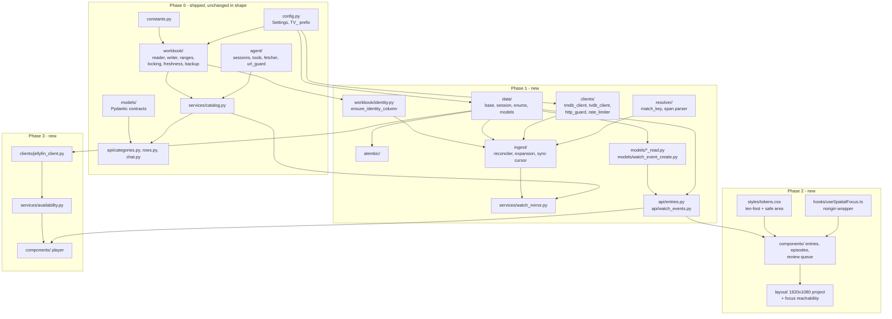
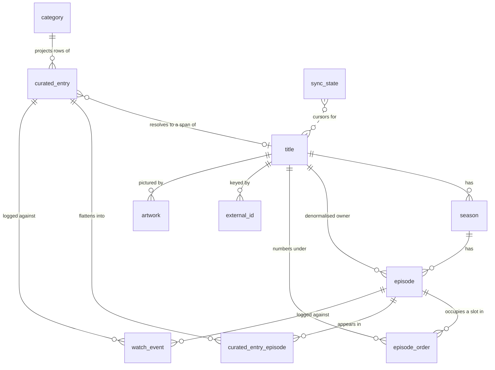
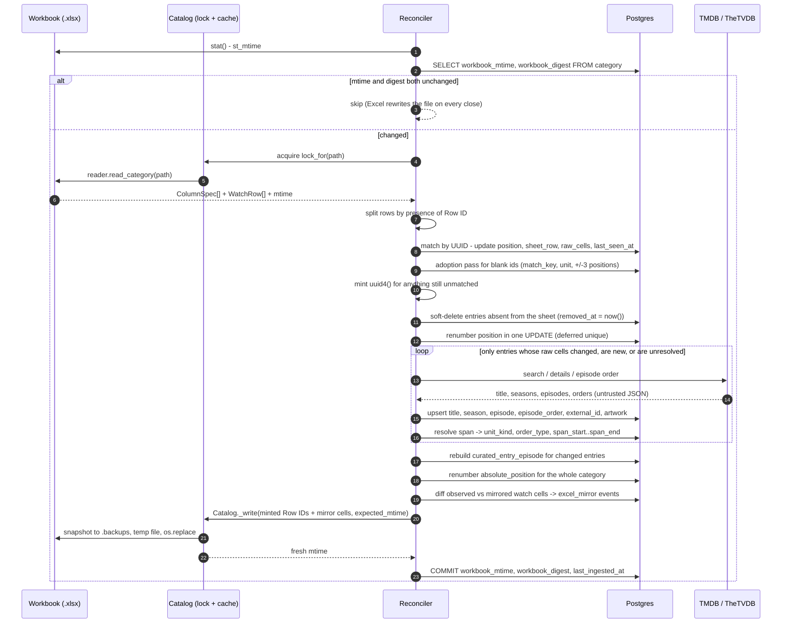
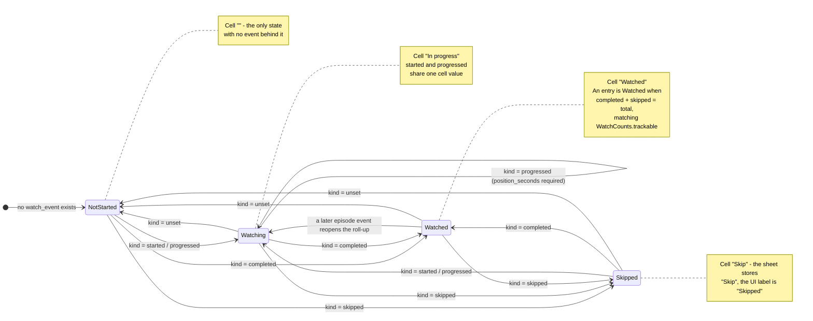
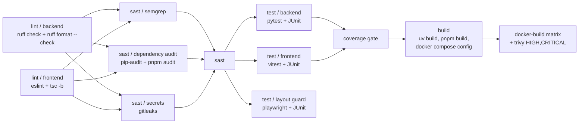
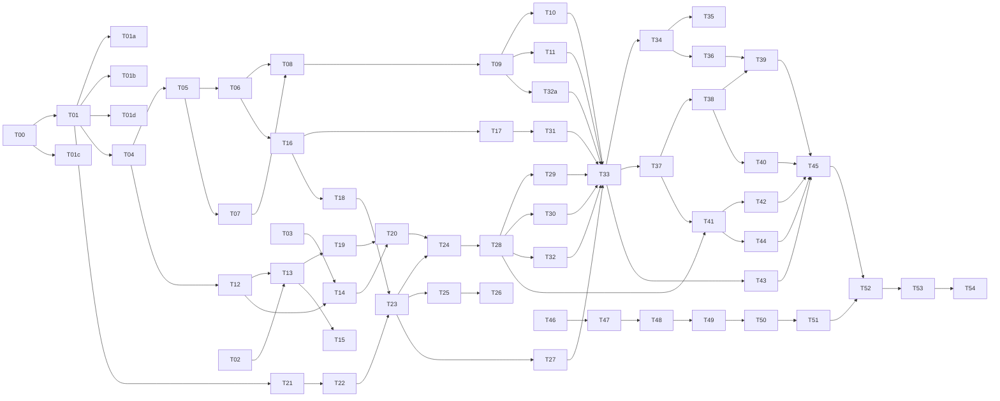

# TV Watch List — Master Plan

**Status:** authoritative. This document is the source of truth for goals, phases, architecture
decisions, technology choices, cross-phase contracts, per-phase completion gates, and the task list.
Read it in full before any non-trivial change, alongside the project `CLAUDE.md`, `docs/status.md`
and `docs/versions.md`.

**Repository:** `C:\Users\Amram\IMPORTANT\Personal\TV` — a public GitHub repository.
**Current versions:** `app/backend/pyproject.toml` = `0.1.0`, `app/frontend/package.json` = `0.1.0`.
Those two fields are the semver source of truth and are bumped by the release pipeline, never by
hand. The third copy of that number — the `version="0.1.0"` argument to `FastAPI(...)` at
`app/backend/src/tv_watchlist/main.py:27`, which is what `/openapi.json` advertises — **is kept in
step by the release pipeline, not hand-edited by a session.** Introducing this document is a
docs-only change and computes to **`0.1.1`** (patch).

### Where each document lives, and what belongs in it

| File | Owns |
|---|---|
| `docs/TV_MASTER_PLAN.md` | This file. Goals, phases, ADRs, contracts, gates, tasks. |
| `docs/status.md` | What is true *right now*: what was just built, what is next. Not a log. |
| `docs/versions.md` | Semver changelog, newest first. One unreleased heading at a time. |
| `README.md` | Human-facing repository guide: what it is, how to clone and run it, what CI does. |
| `app/README.md` | How the app itself behaves — categories, artwork, safety, the layout guard. |
| `app/docs/` | Design notes for features already shipped (`chat-feature-design.md`). Stays as-is. |
| `CLAUDE.md` (repo root, to be written) | The rules an AI session must hold in its head before editing. Its sections are numbered **0-22, continuously**: 0-5, then 6 Containerization, 7 CI/CD, 8 Environment configuration, 9 Observability, **10 Security**, 11 Required calculations, then 12-22. This plan refers to them as "section N", never by XML tag. |
| `docs/resolver-dry-run.md` | The Phase 1 resolver dry-run measurement, per workbook. Durable, and deliberately not `status.md`. |
| `C:\Users\Amram\IMPORTANT\Projects\PORT_ASSIGNMENTS.md` | The machine-wide host-port registry. |

---

## 1. Goals and motivation

### 1.1 What this is

Nineteen hand-curated watch orders — `Attack_On_Titan`, `Bleach`, `DCU`, `Demon_Slayer`,
`Fullmetal_Alchemist`, `HunterXHunter`, `Inuyasha`, `Marvel`, `Middle_Earth`, `Misc_Anime`,
`Misc_Movies`, `Misc_TV`, `My_Hero_Academia`, `Naruto`, `One_Piece`, `Pokemon`, `Star_Wars`, `WWII`,
`Yu-Gi-Oh!` — each an `.xlsx` workbook committed at the repository root, together holding **996 data
rows**, counted with the reader's own `last_data_row` plus blank-row-skip algorithm
(`workbook/cells.py:41-46`, `workbook/reader.py:70-85`).

These orders are not lists of titles. Marvel's 141 rows walk X-Men → Blade II → Spider-Man →
Daredevil across four studios and three continuities. WWII's 84 rows are 84 different films arranged
by the historical event each depicts, not by release date. One Piece's 71 rows interleave one series
with its own films, OVAs and specials at particular episode boundaries. **The value in this
repository is the chronology a human authored**, and no sort by air date reproduces it.

A working local app already sits on top of them: FastAPI + openpyxl reading and writing the sheets in
place (`app/backend/src/tv_watchlist/`, 83 modules / 4160 lines), a React 18 + TypeScript strict SPA
(`app/frontend/`), a Claude-backed research chat that can only ever *propose* changes a human
approves, generated card artwork, atomic writes with pre-write snapshots, and a Playwright layout
guard driving 18 surfaces at four viewport sizes in real Chromium.

### 1.2 Why this plan exists — the three things the app cannot do today

1. **It knows nothing about episodes.** A row that reads `One Piece` / `E19–53` is a string. The app
   cannot say how many episodes that is, when they aired, how long they run, or how far into them the
   user is. Every workbook's `Release` column is free text (`2002`, `1999–2000`, `1977-05-25`), never
   a date cell. There are no per-episode runtimes, air dates or stills anywhere in the system.
2. **It is a desk app watched on a TV.** The screen it is used on is a television, driven by a PC or
   laptop over HDMI or cast. The type scale tops out at 36 px (`--step-6`, `tokens.css:29-35`), there
   is no focus treatment legible from three metres, and nothing in the codebase responds to a d-pad
   or a remote. The layout guard's widest viewport is 1512 × 900; the real target is 1920 × 1080.
3. **It cannot play anything.** The end state plays video from the owner's *own* library. No video
   files exist locally yet, so playback is designed for and deliberately not built.

### 1.3 The goal, stated once

> A ten-foot browser application, driven from the sofa, that renders a hand-authored cross-title
> watch order enriched with real episode data, tracks progress at episode granularity, keeps the
> nineteen workbooks meaningful when opened standalone in Excel, and — once a real file library
> exists — plays the next thing from a self-hosted Jellyfin server joined by `tmdb_id`.

### 1.4 Non-goals, explicitly

| Not doing | Why |
|---|---|
| A native TV application (Tizen `.wgt`, webOS `.ipk`, `react-native-tvos`, an app-store listing) | The device is a browser on a PC or laptop over HDMI or cast. ADR-002. |
| Replacing the workbooks with a database | The workbooks are the curation surface and must keep working in Excel alone. ADR-001. |
| A multi-user service, accounts, or sharing | Single user, one machine, `127.0.0.1`. `watch_event` deliberately carries no `user_id`. |
| Trakt, Simkl, or any third-party scrobble service | ADR-004. |
| Plex | ADR-005. |
| Anything at all from streambert | ADR-006. |
| Commercial use of any kind | TMDB's licence prohibits commercial use without a signed agreement, and separately prohibits using its content "in connection with, including for training" any machine-learning or AI application, which covers this app's chat (§9.4). |

**AniList is not a non-goal — it is *not adopted now*.** It sits outside the table deliberately,
because the decision is revisitable behind an ADR and a feature flag rather than closed. The
rationale is sourced, not preferential: **TheTVDB already supplies absolute order**, which is the
one thing AniList would be reached for; and AniList's public API is currently degraded to **30
requests per minute**, with rate-limit-increase requests not being accepted, and it returns
**HTTP 403 during outages**. A dependency that cannot be raised past 30 rpm and fails closed with a
403 is not one to build a bulk ingest on while a working alternative is already in the design.
Revisit only if franchise-graph chaining across separately-titled entries becomes a real
requirement — and then as an ADR, not as a drive-by.

---

## 2. Where the system stands today — the end of Phase 0

Verified against the working tree, not remembered. Everything in this section is **Phase 0**, the
shipped workbook app (§4.0); Phase 1 begins where it ends.



Load-bearing facts a plan must not break:

- **A category's identity is its filename.** `id = slugify(path.stem)` (`workbook/naming.py:22-24`);
  `name` and `file_name` derive from the same stem (`workbook/reader.py:70, 88-90`). Renaming the
  file renames the category and changes its id.
- **Every mutating call carries `expected_mtime`** — in the body for `RowWrite` and `CategoryRename`,
  as a required query parameter for retire / delete-row / add-watch-column, and as
  `ProposalEdit.read_mtime` for a chat approval. `guard_fresh` compares with a `1e-6` tolerance
  (`workbook/freshness.py:11, 14-17`), because an mtime crosses the wire as a JSON float and comes
  back rounded.
- **`Catalog._write` / `_mutate` is the only funnel**: freshness guard → backup snapshot → writer →
  cache invalidate → re-read, under `lock_for(path)`, on a worker thread
  (`services/catalog.py:122-141`). Chat approvals reuse it verbatim.
- **Every write is temp-file-plus-`os.replace`.** The original is never truncated; the temp is
  unlinked on any exception.
- **Nothing is ever deleted.** Retirement *moves* a workbook and its artwork into `.backups` under a
  `retired-` stamp that pruning can never reach (`services/retirement.py`).
- **The model can never write.** `propose` records a validated `Proposal` in memory; a human
  `POST /api/chat/proposals/{id}/approve` is what reaches disk (`api/chat.py:101-112`).
- **The `Watched?` cell is a four-value inline dropdown** — `""`, `Watched`, `In progress`, `Skip`
  (`constants.py:12-15`; the tuple they form is `DEFAULT_WATCH_CHOICES` at `:16`) — present and
  validated on all 19 sheets.
- **Row numbers are coordinates, not identity.** `writer._resequence`
  (`workbook/writer.py:147-149`) renumbers the whole `Order` column on every append (`:234`),
  delete (`:260`) and batch (`:387`), whenever `_sequential_orders` (`:139-144`) says the column was
  already `1..N` — which it is in all nineteen workbooks. And `_planned_values` (`:325-346`)
  snapshots each row as a whole value array before anything moves, which `_rewrite` (`:349-366`)
  then relays into its new slot.

---

## 3. Target architecture



Three sentences carry the design:

1. **The curated order is a two-level order** — the user's `position` over entries, taken straight
   from the sheet and never derived, and each entry's `(order_type, span_start..span_end)` over that
   title's own dense 1-based numbering. That single choice makes aired, dvd and absolute the same kind
   of object instead of three special cases.
2. **Identity of a sheet row is a UUID living in a hidden `Row ID` column of the sheet**, because the
   existing writer already relays whole rows through reorders and therefore carries that identity for
   free, while any side-table scheme would re-derive identity heuristically on every read and fail
   silently.
3. **Progress is an append-only log** (`watch_event`) with status derived by `DISTINCT ON`, and the
   four-value `Watched?` cell is a lossy one-directional projection of it that is never read as truth
   — only as a signal that a human changed it, which appends one more coarse event on top rather than
   overwriting anything.

---

## 4. Phases



Durations are shape, not commitment. This is a personal project touched a few times a year; the
dependency order is the part that binds. The bar dates for Phase 0 are the repository's own: first
commit `5e3d25d` on 2026-08-26, `HEAD` `10c3205` on 2026-09-07. Everything after 2026-09-08 is
shape.

### 4.0 Phase 0 — the shipped workbook app

**Already shipped, and closed by this documentation pass.** Phase 0 is not a planning artefact
invented after the fact; it is what §2 describes — the workbook app, the propose-only chat, the
Playwright layout guard, and the GitHub Actions pipeline — everything that exists in the tree
today. Its one remaining gap is documentation. **Phase 0 closes on five tasks: T00, T01, T01a, T01b
and T01c.** The phase sequence this plan reasons about is therefore **P0 → P1 → P2 → P3**, and every
diagram, gate and status document draws it that way rather than starting at P1.

| # | Deliverable | State |
|---|---|---|
| 0.1 | Nineteen `.xlsx` workbooks, 996 curated rows, committed at the repository root | shipped |
| 0.2 | FastAPI backend — reader, writer, the `Catalog` mutation funnel, atomic writes, backups, retirement | shipped |
| 0.3 | React 18 + TS strict SPA with Redux Toolkit | shipped |
| 0.4 | Propose-only Claude research chat, four tools, human approval the only path to disk | shipped |
| 0.5 | Playwright layout guard, 18 surfaces at four viewport sizes in real Chromium | shipped |
| 0.6 | GitHub Actions `lint → sast → test → coverage gate → build → docker-build`, plus CodeQL | shipped |
| 0.7 | `docs/` — this plan, `status.md`, `versions.md` | **T00, closing now** |
| 0.8 | Root `CLAUDE.md` | **T01, closing now** |
| 0.9 | `.claude/` wiring — `settings.json` with the `.cjs` hook set, `commands/`, `skills/` | **T01a, closing now** |
| 0.10 | `.env.example` — every variable with a placeholder and a one-line comment | **T01b, closing now** |
| 0.11 | README reconciliation, including the P0 → P1 → P2 → P3 phase-flow diagram | **T01c, closing now** |

### 4.1 Phase 1 — the metadata spine

**Objective.** Postgres becomes authoritative for episodes, air dates, runtimes, artwork and watch
progress, while the workbooks stay authoritative for order and curation. The existing UI keeps
working, untouched, for the whole phase.

| # | Deliverable | Notes |
|---|---|---|
| 1.1 | `postgres:16-alpine` in `docker-compose.yml` | `${TV_POSTGRES_PORT:-5525}:5432`, named volume `tv_postgres_data`, database `${TV_POSTGRES_DB:-tv}`, `healthcheck: pg_isready -U ${TV_POSTGRES_USER:-tv} -d ${TV_POSTGRES_DB:-tv}`; the backend gains `depends_on: { postgres: { condition: service_healthy } }` and runs `alembic upgrade head` before `uvicorn`. Host port **5525** is allocated (§6.8). |
| 1.2 | `app/backend/src/tv_watchlist/data/` | `base.py` (naming convention, `UuidPk`, `TimestampMixin`), `session.py` (async engine, `expire_on_commit=False`, `autoflush=False`), `enums.py`, and `models/` with one class per file. |
| 1.3 | Eleven tables | `category`, `curated_entry`, `curated_entry_episode`, `title`, `season`, `episode`, `episode_order`, `external_id`, `artwork`, `watch_event`, `sync_state`. Shapes and constraints in §6.3. |
| 1.4 | Alembic against the async engine | `alembic/env.py` bridging with `connection.run_sync`, `poolclass=NullPool`, an `include_object` hook that keeps autogenerate away from the two views, and a URL whose `%` is doubled because `set_main_option` writes into a `ConfigParser`. |
| 1.5 | Append-only enforcement | The `watch_event_reject_mutation()` trigger raising `restrict_violation` on `UPDATE` and `DELETE`, plus the `episode_watch_state` and `curated_entry_watch_state` views, all in `op.execute()` calls with a hand-written `downgrade`. |
| 1.6 | `clients/tmdb_client.py` | httpx, Bearer read token, one serialised token-bucket worker (the limit is per **IP** at the CDN, so a second API key buys nothing), conditional requests and payload digests through `sync_state`, and a hard cache TTL below six months. |
| 1.7 | `clients/tvdb_client.py` | `POST /v4/login` token cached with its issue time and refreshed proactively at ~25 days (there is no refresh endpoint); `GET /v4/seasons/types` fetched once and cached; **never** a hard-coded season-type list. |
| 1.8 | The reconciler | `ensure_identity_column` → UUID match → adoption pass → mint → soft-delete → scoped re-resolution → expansion rebuild → `absolute_position` renumber → mirror diff, in one transaction and one `Catalog._write`. Algorithm in §6.5. |
| 1.9 | `ColumnSpec.role` gains `"identity"` | A cross-boundary contract change touching the Pydantic model and the TypeScript type (§6.2). Minor bump on the implementation commit; written into `CLAUDE.md` before the code lands. |
| 1.10 | `GET /api/categories/{id}/entries` | The Postgres projection, served **alongside** the existing `CategoryDetail`, not replacing it. Replacing a live contract and adding a database in one step would break the running app for the length of the phase. |
| 1.11 | `POST /api/watch-events` | The only write path into the log. `WatchEventCreate` with `extra="forbid"` and a validator duplicating the database `CHECK`. |
| 1.12 | The mirror | `watch_cell(kind)`, the `mirrored_watch_cell` / `observed_watch_cell` echo defence, and write-back through `Catalog._write` so a mirror pass against a workbook open in Excel fails cleanly and retries. |
| 1.13 | Dry-run resolver report | Run the resolver against all 19 workbooks and record how many of the 996 rows land in the review queue **before** the schema is committed to (§12, risk R1). It gets a durable home of its own — **`docs/resolver-dry-run.md`**, not `docs/status.md`, which is explicitly a statement of *now* and not a log. One row per workbook, columns: **rows, confirmed, auto-resolved, unresolved**, plus the **worst-confidence examples** for that workbook. |
| 1.14 | Tests against a real Postgres 16 | A GitHub Actions service container against database `tv_test`. No mocking of the database. Includes `alembic upgrade head && alembic downgrade base && alembic upgrade head`. |
| 1.15 | Attribution copy in place | The verbatim TMDB notice plus logo, and TheTVDB's link, rendered where metadata is visible (§9.4). |
| 1.16 | The launchers gain `[q]` and `[v]` | `run_tv.sh` / `run_tv.bat` offer only `[r]` and `[k]` today — not because that is right, but because **neither launcher invokes `docker compose` at all**; they run the host toolchain directly, so there is nothing for `[q]` or `[v]` to clean up. Phase 1 changes that: compose gains a Postgres service and a named volume, so the launchers gain both terminal options. `[q]` runs `docker compose down --remove-orphans` and removes images matching the `tv-watchlist` prefix, **keeping volumes**. `[v]` additionally passes `--volumes` and drops `tv_postgres_data`. Adapted from `llm-knowledge-base`'s canonical `[k]/[q]/[v]/[r]` loop. |

**Explicitly deferred out of Phase 1:** every ten-foot presentation change, all spatial navigation,
all Jellyfin code, AniList, modelling of the reference sheets (`Media Inventory`, `Scope & Sources`,
`Series Inventory`, `Verified Media Inventory`, `Summary`, `Notes` stay as the existing
`ReferenceSheet` read-through), and interpretation of `Misc_Anime`'s own `Started?` / `Progress` /
`Priority` columns — they land verbatim in `raw_cells` and are never read, because interpreting them
would fork the progress vocabulary.

### 4.2 Phase 2 — the ten-foot browser UI

**Objective.** The same browser app, usable from a sofa at 1920 × 1080 with a remote or a d-pad,
showing the Phase 1 data. No native target, no second codebase.

| # | Deliverable | Notes |
|---|---|---|
| 2.1 | Ten-foot type and spacing tokens | New rungs above the current ceiling of 36 px, added to `src/styles/tokens.css`, which is the one place tokens are declared and which every stylesheet already consumes by `var()`. Additive, not a rewrite. |
| 2.2 | Safe-area tokens | The first `env(safe-area-inset-*)` references in the project, plus an overscan inset for panels that crop. `--launcher-width` and `--toast-lane-max` are the precedent: layout tokens carrying a comment saying why they are layout rather than styling. |
| 2.3 | `@noriginmedia/norigin-spatial-navigation` (MIT) | Focus ownership moves to the library; React state stays for UI-only concerns and Redux Toolkit keeps app state. ADR-008. |
| 2.4 | A focus treatment legible at three metres | The accent is per-workbook data lifted by `accentPalette` (`utils/accentPalette.ts:67-77`), so the ring has to read against all nineteen accents, including the several sheets that share `#111827` and are given a hashed hue. |
| 2.5 | `1920x1080` added to the layout guard | A fifth chromium project in `layout/playwright.config.ts` beside `1512x900`, `1280x720`, `1024x768` and `960x1040`. Every one of the 18 surfaces must pass at the new size. |
| 2.6 | A focus-reachability assertion | The guard proves every control can be *clicked*; a ten-foot UI additionally needs every control to be *reachable by focus movement* from the surface's entry point. New assertion, same measurement harness. |
| 2.7 | The SPA adopts `/entries` | `CuratedEntryRead` becomes the row contract for reading; the workbook `CategoryDetail` contract stays for editing until it is retired deliberately, in its own change. |
| 2.8 | Episode-level progress UI, and **Up next** | Marking an episode, resuming a span, and **Up next** — the next item in the category's curated order, episode *or film* (§6.9) — one indexed scan over `curated_entry_episode.absolute_position`, which holds each movie entry as a single slot (ADR-010). |
| 2.9 | Review queue UI | Backed by the partial index `ix_curated_entry_needs_review`. If risk R1 lands badly this becomes the phase's main deliverable rather than a side panel. |
| 2.10 | `eslint-plugin-security` + `eslint-plugin-no-unsanitized` | Closes the standing gap named in §9.2. `pnpm lint` gains `--max-warnings 0`, or the rules are set to `error` explicitly, because the security plugin's recommended config sets every rule to `warn` and a bare `eslint .` still exits 0. |
| 2.11 | CSP tightened | Artwork proxied through the backend so `img-src` can drop the blanket `https:` currently at `app/frontend/nginx.conf:40`. |

**Explicitly deferred out of Phase 2:** any playback, any Jellyfin code, any native TV packaging.

### 4.3 Phase 3 — playback

**Objective.** Play the next thing, from the owner's own files, through a self-hosted Jellyfin
server. **Gated on a real file library existing.** Until one does, this phase is designed for and not
built; the join key is chosen now so nothing has to be retrofitted.

| # | Deliverable | Notes |
|---|---|---|
| 3.1 | Jellyfin client, server-side only | A Jellyfin API key is a bearer credential for the entire media server: env var, read by the backend, never in the frontend bundle. A configurable base URL is an SSRF boundary and goes through the same allowlist as every other outbound call. |
| 3.2 | The `tmdb_id → Jellyfin Id` index | Built by paging `GET /Items?recursive=true&includeItemTypes=Series,Movie&hasTmdbId=true&fields=ProviderIds`, because **Jellyfin cannot filter or query items by provider id at all** — only `hasImdbId` / `hasTmdbId` / `hasTvdbId` booleans exist, and `/Search` has no equivalent. Cached; refreshed on `minDateLastSaved`. |
| 3.3 | Episode join | `GET /Shows/{seriesId}/Episodes`, keyed on `(ParentIndexNumber, IndexNumber)` and performed **after** the entry has resolved to a stored `order_type`, never before. `IndexNumberEnd` non-null means one file covers several watch-list rows. |
| 3.4 | Three-state availability | `IN_LIBRARY` / `NOT_IN_LIBRARY` / `AMBIGUOUS` per entry, modelled explicitly rather than as a nullable id. The ambiguous case is real — absolute-versus-official numbering, multi-episode files — and collapsing it into "not in library" produces a UI that quietly lies. |
| 3.5 | Playback surface | Browser `<video>` against a Jellyfin stream URL, or handing the Jellyfin web client an item id. Decided at the start of the phase, not now. |
| 3.6 | Position reporting | `PlaybackPositionTicks` is .NET ticks (100 ns). Converted to whole seconds once, at the boundary, and stored as `watch_event.position_seconds` with `source = 'jellyfin'`. |
| 3.7 | Jellyfin version decision | Jellyfin 12.0 went stable on 2026-09-08; the latest stable `@jellyfin/sdk` (0.13.0) maps to 10.11.x, and the `unstable` npm tag is regenerated from the current spec so it cannot be pinned. Which server version this project targets is decided at phase start, not defaulted. |
| 3.8 | **Next** and **Autoplay** | A Next button and an Autoplay toggle that advance through the category's curated order across episodes and films, and never silently past an item that cannot be played. Rules in §6.9; ADR-010. |
| 3.9 | Audio and subtitle language | Dub versus sub is a property of each video file — which audio and subtitle tracks it carries — not of TMDB or TheTVDB, which supply metadata only. Which track plays by default, and whether this app sets that or leaves it to Jellyfin, is decided at phase start from the files that actually exist. |

---

## 5. Module dependency map



Two rules this map encodes:

- **`clients/` never imports `data/`, and `data/` never imports `clients/`.** The ingest layer is the
  only thing that knows both. A provider client is importable and testable on its own, against
  recorded fixtures, with no database in the process.
- **`workbook/` gains exactly one new module** (`identity.py`) and otherwise stays as it is. The
  Excel layer earned its shape through five shipped layout bugs and a documented set of atomic-write
  and lock invariants; Phase 1 builds beside it, not through it.

---

## 6. Cross-phase concerns

These are the contracts every phase inherits. Changing one is an architectural decision requiring
approval and a minor semver bump, not an implementation detail.

### 6.1 The canonical identifier scheme

| Identifier | Shape | Scope | Stability |
|---|---|---|---|
| `category.slug` | `slugify(path.stem)`, e.g. `one-piece` | one workbook | **Changes on rename.** A projection of the filename, never an identity. |
| `category.id` | UUID | one workbook | Stable across renames. |
| `curated_entry.id` | UUID, canonical 36-character string | one sheet data row | **The sync key.** Written verbatim into the sheet's hidden `Row ID` column. Survives reorder, insert, delete and a full Excel re-sort of the curated columns. |
| `title.tmdb_id` + `title.media_type` | `int` + `movie \| tv` | one work | The spine. `uq(media_type, tmdb_id)`. |
| `tmdb_key` | `movie:603`, `tv:1399:s2:e5` | one work / season / episode | **The durable pointer.** Carried on every `watch_event` so the log outlives a full metadata rebuild, and the same key Phase 3 joins Jellyfin on. |
| `episode.tmdb_episode_id` | `int`, globally unique | one episode | TMDB's own episode id; the only episode key that is stable when TMDB renumbers. |
| `episode_order.sequence` | dense, 1-based `int` per `(title_id, order_type, label)` | one slot in one numbering | What the app computes with. `order_season_number` / `order_episode_number` are what the UI prints. |
| `curated_entry.position` | dense, 1-based `int` per category | the authored chronology | Comes straight from the sheet. Postgres never invents or reorders it. |
| Excel row number | 1-based, header is row 1 | a coordinate | **Never an identity.** Recorded as `curated_entry.sheet_row` for diagnostics only. |
| `Order` column value | free text / int | curation prose | **Never an identity.** `_resequence` rewrites `1..N` on every append, delete and batch. |

`tmdb_id` is the join key to any future media server, chosen now, before playback exists, precisely
so nothing has to be retrofitted later.

### 6.2 Shared data models, and what changes

**Unchanged in Phase 1** (the existing wire contract, both sides): `ColumnSpec`, `WatchRow`,
`WatchCounts`, `CategorySummary`, `CategoryDetail`, `CatalogListing`, `ReferenceSheet`,
`ShadowedWorkbook`, `UnreadableWorkbook`, `RowWrite`, `RowChange`, `CategoryCreate`,
`CategoryRename`, `Proposal` and its three bodies, `HeroCandidate`, `ChatEvent`. Field names stay
snake_case across the wire; camelCase appears only in frontend-only shapes.

**The one contract change Phase 1 forces**, flagged here rather than smuggled in:

> `ColumnRole` is `Literal["order", "title", "watch", "other"]` today
> (`models/column_spec.py:10`, mirrored at `src/types/ColumnSpec.ts:2`). It **gains `"identity"`**.
> `workbook/schema.py:_role_for` learns the new alias, and `workbook/reader.read_category` excludes
> identity columns from both `columns` and `WatchRow.cells`, so the grid the UI renders is byte-for-byte
> what it renders today.

That is a cross-boundary type change touching the Pydantic model and the TypeScript type. Per the
versioning rule it is a **minor** bump on the implementation commit, it is recorded in the project
`CLAUDE.md` data-contract section *before* the code lands, and both sides change in the same commit.

**New in Phase 1**, one model per file, `from_attributes=True` and `frozen=True` on responses,
`extra="forbid"` on requests: `CuratedEntryRead`, `TitleRead`, `SeasonRead`, `EpisodeRead`,
`EntryProgress`, `ArtworkRead`, `WatchEventCreate`, `WatchEventRead`, `ResolutionUpdate`.

`CuratedEntryRead` exposes `raw_cells` under `validation_alias="raw_cells"` as `cells`, so the wire
shape matches the existing `WatchRow.cells` contract and the frontend's row renderer is unchanged.

**The one asyncio rule that breaks everything if ignored:**

> Nothing crosses the `from_attributes` boundary unless it was eagerly loaded.

Under asyncio, touching an unloaded relationship or an expired attribute triggers a lazy load outside
a greenlet and raises `MissingGreenlet` at serialisation time, deep inside FastAPI, with a stack trace
that does not name the relationship. Hence `expire_on_commit=False` on the session factory,
`lazy="raise_on_sql"` on every relationship, and `selectinload` at the query site.

### 6.3 The dual-store contract



| Table | Grain | Authority | Structural constraint |
|---|---|---|---|
| `category` | one `.xlsx` file | Excel for order, PG for progress | `uq(slug)` |
| `curated_entry` | one sheet data row | **Excel** | `uq(category_id, position)` deferrable; `id` is written into the sheet |
| `curated_entry_episode` | one episode of one entry's span | derived cache | `uq(category_id, absolute_position)` deferrable |
| `title` | one movie or one series | **TMDB** | `uq(media_type, tmdb_id)` |
| `season` | one TMDB season | TMDB | `uq(title_id, season_number)` |
| `episode` | one episode | TMDB | `uq(season_id, episode_number)`, `uq(tmdb_episode_id)` |
| `episode_order` | one episode's slot in one numbering | TMDB / TheTVDB | `uq(title_id, order_type, label, sequence)` deferrable |
| `external_id` | one provider id for one entity | providers | `uq(source, entity_kind, value)` + `num_nonnulls(...) = 1` |
| `artwork` | one image's metadata | TMDB / TheTVDB | `uq(source, remote_path)` + three partial primary indexes |
| `watch_event` | one immutable fact | **the user** | append-only trigger; `tmdb_key` is the durable pointer |
| `sync_state` | one ingest cursor | the ingest | `uq(source, resource_type, resource_key)` |

**Who owns what, without ambiguity:**

| Concern | Authoritative store | The other store's copy |
|---|---|---|
| The order of entries within a category | the `.xlsx` sheet | `curated_entry.position`, refreshed on every ingest |
| Which title / span a row means | the `.xlsx` cells (`Title`, `Unit`, `Release`) | `raw_title` / `raw_unit` / `raw_release` verbatim, plus the resolved `title_id` and span |
| Any column a human invented | the `.xlsx` sheet | `curated_entry.raw_cells` (JSONB), verbatim, never interpreted |
| Episodes, air dates, runtimes, stills, posters | Postgres, from TMDB / TheTVDB | none — the sheet never holds them |
| Watch progress at episode granularity | Postgres (`watch_event`) | the four-value `Watched?` cell, lossy and one-directional |
| Whether a human changed a status by hand | the `Watched?` cell, compared against `mirrored_watch_cell` | — |

**The reconciliation tax, stated honestly.** A dual store is two stores. The costs are real and are
accepted deliberately:

- Every mirror write is a real workbook write — backup snapshot, Excel-lock check, `expected_mtime`
  guard, temp file, `os.replace`. It is not free and it can fail.
- The mirror is lossy by construction. The cell cannot express "9 of 35 episodes done", "42 minutes
  into episode 12", or "1–8 completed, 9–12 skipped". All of that lives in `watch_event`, and writing
  the cell deletes none of it.
- Without `mirrored_watch_cell`, every mirror write would look like a human edit on the next ingest,
  producing an `excel_mirror` event, re-deriving the same status, and rewriting the same cell — a
  stable but ever-growing loop. The stored last-written value is the entire defence.
- A human editing a workbook in Excel while the mirror pass runs makes one of the two lose. Both go
  through `Catalog._write` with an `expected_mtime` guard, so one loses *cleanly* with
  `StaleWorkbookError`. **The mirror is the one that must lose and retry**, and that ordering is
  implemented deliberately rather than left to chance.
- Bootstrap writes all nineteen workbooks once, minting 996 UUIDs and 19 hidden columns, landing 19
  backup snapshots in `.backups`. That is the intended audit trail for a one-way structural change.
- A user who sorts a range that excludes the last column detaches every id at once. The reconciler
  detects the near-total mismatch, refuses the ingest for that workbook, sets
  `category.last_ingest_error`, and surfaces it — rather than re-keying 141 rows against wrong history.

The tax is paid because the alternative is worse: a database that becomes the truth turns nineteen
hand-curated workbooks into export artefacts, and the whole point of this repository is that they are
not.

### 6.4 Units, dates and numeric types — decided once

| Quantity | Type | Rule |
|---|---|---|
| Any duration | `Integer`, column named `*_seconds`, with a `CHECK` | TMDB returns runtime in whole **minutes**; the ingest multiplies by 60 once, at the boundary. No mixed unit survives that boundary — the unit is in the column name. |
| Playback position | `Integer` seconds | Jellyfin reports .NET ticks (100 ns); converted once at the boundary. `<video>.currentTime` is float seconds; rounded once at the boundary. |
| Why not `INTERVAL` | — | Every comparison the app makes is `position_seconds >= runtime_seconds * threshold`. With `INTERVAL` on one side every predicate needs a cast, and msgpack/JSON carry an int rather than a `timedelta` anyway. |
| Air dates | `Date` | `air_date`, `first_air_date`, `last_air_date`. Real dates, never strings. |
| The sheet's `Release` column | `Text` (`curated_entry.raw_release`) | Free text — `2002`, `1999–2000`, `1977-05-25`. Kept verbatim as curation prose and **never** coerced into a date column. |
| Row lifecycle stamps | `DateTime(timezone=True)` → `timestamptz` | Always timezone-aware, `server_default=func.now()`. |
| Workbook freshness | `Float` (`category.workbook_mtime`) | The same `st_mtime` float the live API already carries end to end (`CategorySummary.mtime`, `RowWrite.expected_mtime`, `guard_fresh`). Re-typing it here would fork a live contract. |
| Confidence | `Numeric(3,2)`, `CHECK 0..1` | `resolution_confidence`. A fraction, never a percentage. |
| Colour | `String(7)`, `#RRGGBB` | Matches the existing `HEX_COLOR_PATTERN` and `CategorySummary.accent`. |

### 6.5 Excel → Postgres sync



Rules that matter inside that flow:

1. **Change detection needs both.** Skip only when `st_mtime` matches *and* the sha256 over the
   normalised grid matches `workbook_digest`. Excel rewrites the file on every close, so mtime alone
   would re-ingest constantly; the digest is what makes a no-op cheap.
2. **One read, through the existing lock and reader.** Never a second way of opening the workbook.
3. **Adoption reuses the existing UUID**, so watch history survives a user who cleared the column.
4. **Reordering is free.** Identity is the UUID, so a reorder is a new `position` on existing rows;
   `uq(category_id, position)` is `DEFERRABLE INITIALLY DEFERRED` so the whole category renumbers in
   one statement without tripping on transient duplicates.
5. **A `confirmed` entry whose raw cells did not change is never re-resolved.** A human decision is
   not overwritten by a heuristic.
6. **The post-write `st_mtime` is what gets stored**, so the next pass does not see our own write as a
   change.
7. **Nothing in the curated chain is hard-deleted.** `watch_event.curated_entry_id` is
   `ON DELETE RESTRICT`; the database would refuse, and that refusal is the point.

### 6.6 A progress write that lands in both stores

```mermaid
sequenceDiagram
    autonumber
    actor U as User (remote / d-pad)
    participant F as React SPA
    participant A as POST /api/watch-events
    participant P as Postgres
    participant M as watch_mirror
    participant C as Catalog
    participant W as Workbook (.xlsx)

    U->>F: mark episode 27 watched
    F->>A: WatchEventCreate {subject_kind: episode, kind: completed, ...}
    A->>A: Pydantic validate (extra=forbid) + map subject to typed FK
    A->>P: INSERT watch_event (append-only, tmdb_key carried)
    P-->>A: committed
    A->>P: SELECT from curated_entry_watch_state (DISTINCT ON)
    P-->>A: EntryProgress {kind, episode_total, completed, skipped, started}
    A-->>F: 201 + EntryProgress (UI repaints from the derived view, not the request)
    A->>M: schedule mirror for this entry
    M->>M: watch_cell(kind) vs entry.mirrored_watch_cell
    alt unchanged
        M-->>M: no workbook write at all
    else changed
        M->>C: apply_changes(category_id, [Watched? cell], expected_mtime)
        C->>W: snapshot, lock check, temp file, os.replace
        alt workbook open in Excel or mtime stale
            C--xM: WorkbookLockedError / StaleWorkbookError
            M-->>M: mirror loses deliberately; identical diff replays next pass
        else written
            W-->>C: fresh mtime
            C-->>M: ok
            M->>P: UPDATE mirrored_watch_cell, category.workbook_mtime (same transaction)
        end
    end
```

Two properties make this idempotent: the mirror writes only when the projection actually differs from
the last value it wrote, and `mirrored_watch_cell` plus `workbook_mtime` update in the *same*
transaction as the successful `apply_changes` — so if the write raises, neither updates and the next
pass replays the identical diff.

### 6.7 The watch status lifecycle

Status is **never stored**. It is derived, per subject, from the append-only log by `DISTINCT ON`
over `(subject, occurred_at DESC, recorded_at DESC, id DESC)` — the third key is not decoration:
without it, two events carrying identical timestamps make the derived status non-deterministic across
query replans.



Four rules govern every transition:

1. **Nothing is ever overwritten.** A transition is one new immutable row in `watch_event`; the arrow
   is a re-derivation, not an `UPDATE`. The database enforces this with a trigger, not a convention —
   an Alembic data migration, a `psql` session or a `session.merge()` on a detached instance would
   each otherwise rewrite history silently.
2. **Entry status and episode status are two subjects, resolved by recency.** For a curated entry:
   *an entry-level event later than every episode-level event in that entry wins; otherwise the
   episode roll-up wins.* That is what lets a coarse `Watched` typed into Excel sit on top of
   fine-grained episode history without erasing it, and lets the next episode-level event take the
   wheel back automatically.
3. **The roll-up counts a skip as done.** `completed + skipped = total` is complete, matching the
   existing `WatchCounts.trackable` exactly, so the two progress readouts in the app cannot
   disagree. The field is declared at `models/watch_counts.py:16` (the model is
   `models/watch_counts.py:8-16`); the arithmetic `trackable = total - skipped` is not in the model
   at all — it is computed by the reader's `_count`, at `workbook/reader.py:53`.
4. **The four states project onto exactly four cell values.** `started` and `progressed` share
   `In progress`; `unset` projects onto `""`. A movie entry — an entry whose expansion is empty,
   which is the whole of Marvel, WWII and DCU — derives its status entirely at the entry level, and
   an entry with a span derives it from the roll-up unless a later entry-level event overrides. The
   mixed case is the norm, not an edge case: One Piece has both.

### 6.8 Ports

`C:\Users\Amram\IMPORTANT\Projects\PORT_ASSIGNMENTS.md` is the authoritative machine-wide registry
and explicitly covers `Personal/TV`. Current and allocated:

| Host port | Service | Status |
|---|---|---|
| `5284` | frontend — Vite natively, or nginx via compose (`${TV_FRONTEND_PORT:-5284}:8080`) | live, registered |
| `8284` | backend FastAPI (`${TV_BACKEND_PORT:-8284}:8284`) | live, registered |
| `5286` | layout-guard probe server, bound only while `pnpm test:layout` runs | live, registered |
| **`5525`** | **PostgreSQL 16 (`${TV_POSTGRES_PORT:-5525}:5432`)** | **allocated for Phase 1** — the first free slot in the documented `5520-5591` range, continuing the contiguous run and adjacent to `Torah_Learning_Sidra` at `5524` |

**`5525` is the only new host port this plan allocates, across all three phases**, and no port is
held in reserve for anything else. **The TMDB / TheTVDB response cache lives in Postgres and this
project has no Redis** — that cache is what `sync_state` and the six-month TMDB cache ceiling are. A
single-user, one-machine design has no second process to publish to, no session store and no queue,
so no second datastore appears anywhere in Phases 1-3.

Host `5432` is the machine's single shared local PostgreSQL listener and is for **client connections
to distinct databases only**. This project runs its own containerised Postgres and therefore publishes
it on a unique host port. Database names: **`tv`** for the app and **`tv_test`** for the CI service
container, both inside the project's own container. The env var is **`TV_POSTGRES_DB`**, defaulting
to `tv`, and it is that name every compose snippet, every `pg_isready` healthcheck, the `Settings`
default and the registry line all carry. (`tv_watchlist` remains correct as the Python package name
and as the compose project / image prefix — it is never a database name.)

`PORT_ASSIGNMENTS.md` gains the `5525` row in the Final Host Listener Map and the matching per-project
inventory bullet **as part of the Phase 1 implementation commit that adds the compose service** — not
before, and not after.

### 6.9 Playback order — Next and Autoplay follow the curated order

**Requirement, from the owner (2026-09-15).** Once a category has a watch order, playing something
from it must *respect* that order, not merely display it. The app has a **Next** button and an
**Autoplay** toggle, and both advance to whatever the workbook says comes next — whatever kind of thing
that is. Watching a One Piece episode whose next row is a film, Next (or Autoplay, when the episode
ends) plays the film; if the row after the film is episodes again, the next episode in that span plays
after it. The order is visible *and* followed.

**Why this needs a Phase 1 change.** "What comes next" is one ordered list per category — the flattened
queue `curated_entry_episode`, ordered by `absolute_position` (`CLAUDE.md` section 5.13, and section 11,
rule 11). As first designed, **movie entries contributed no rows to that list**, so a Next computed from
it would have jumped from the episode before a film straight to the episode after it — exactly the wrong
answer for this requirement. The queue therefore holds **every playable unit**: one row per episode in
each entry's resolved span, and **one row per movie entry**. See ADR-010.

**The rules Next and Autoplay follow.** Rules 1-3 and 7 are the requirement. Rules 4-6 are defaults,
recorded so they are decided once, and flagged for the owner to confirm or overturn:

1. **The order is the category's `absolute_position`** — episodes and films interleaved exactly as the
   workbook orders its rows, each span expanded in its stored `order_type`.
2. **Next** plays the item at the next `absolute_position` after the one playing now.
3. **Autoplay**, when on, starts that same item when the current one completes — the same completion
   rule that marks an item watched — after a short on-screen countdown the viewer can cancel.
4. **Items marked `Skip` are passed over**, because the owner marked them deliberately. *Default —
   confirm.*
5. **An item that cannot be played is never silently jumped.** If the next item is `NOT_IN_LIBRARY` or
   `AMBIGUOUS`, or its entry is `unresolved`, Next and Autoplay stop *on* it and show why, with an
   explicit "skip to the next playable item" action. Jumping past it silently would break the order this
   feature exists to respect. *Default — confirm.*
6. **The queue is one category's order.** At a category's last item, Next and Autoplay stop; they do not
   cross into another workbook. *This reads "any category or all categories" as "every category that
   has an order" — confirm, if a cross-category queue was meant.*
7. **Finishing an item records it** exactly like a manual mark: a `watch_event` with
   `source = 'jellyfin'`, mirrored into the workbook's `Watched?` cell through `Catalog._write`.

**Where each part lands.**

| Phase | What ships |
|---|---|
| P1 | The flattened queue includes movies (T24), with a test against the real `One_Piece.xlsx` proving its queue interleaves episodes and films in workbook order. |
| P2 | **Up next** (deliverable 2.8): the next item in curated order, episode or film, visible from the sofa. No playback. |
| P3 | The **Next** button and the **Autoplay** toggle actually play it (deliverable 3.8, task T53a), under rules 1-7. |

---

## 7. Technology choices, and what each beat

Every choice below is made for the final form of the project. Nothing here is a stepping stone.

### 7.1 Backend

| Choice | Beat | Why |
|---|---|---|
| Python 3.13, `from __future__ import annotations` | older Pythons | Already in force; `requires-python = ">=3.13"`. |
| FastAPI | Flask, Django, Starlette raw, aiohttp | Already shipped, async and WebSocket-capable, auto-generated OpenAPI (which is also the container healthcheck target, chosen because `/openapi.json` touches no workbook). |
| Pydantic v2 (`>=2.6.0`) | dataclasses, attrs, marshmallow | Already the entire contract layer. `extra="forbid"` on requests and `frozen=True` on responses are what make the new boundaries safe by default. |
| SQLAlchemy 2.0 + asyncio + asyncpg | Django ORM, Tortoise, Peewee, raw asyncpg, SQLModel | Deferrable constraints, partial indexes, `num_nonnulls` CHECKs, native enums with `values_callable`, and read-only view mapping — this schema uses all of them. Raw asyncpg would mean hand-writing every one and losing Alembic autogenerate. |
| Alembic | hand-run SQL, `create_all` | The views and the append-only trigger are hand-written `op.execute()` inside a versioned migration with a hand-ordered `downgrade`. `create_all` cannot express any of it. |
| PostgreSQL 16-alpine | SQLite, MySQL | `gen_random_uuid()` in core from 13 (no `pgcrypto`), `DISTINCT ON`, partial and deferrable unique indexes, JSONB, native enums, `pg_trgm`. Every one is load-bearing here. SQLite has none of them and would be the exact "start simple, upgrade later" trap this project refuses. |
| `uv` | pip, poetry, pipenv, conda | Already the toolchain; `uv.lock` is what CI audits with `pip-audit`. |
| httpx | requests, urllib, aiohttp | Already a dependency; async, and the client the SSRF guard is written around. |
| pytest + pytest-asyncio (`asyncio_mode = "auto"`) + pytest-cov | unittest, nose | Already configured; 722 tests collected today. |
| ruff, line-length 120, `select = ["E","F","I","N","UP","ANN","S"]` | black + flake8 + isort + pylint | Already configured, `S` (flake8-bandit) included, `S101` ignored under `tests/` only. `S608` gains something real to check in Phase 1. |

### 7.2 Frontend

| Choice | Beat | Why |
|---|---|---|
| React 18 + TypeScript strict | anything else | Already shipped, with `noUncheckedIndexedAccess`, `exactOptionalPropertyTypes`, `verbatimModuleSyntax`, `noFallthroughCasesInSwitch` all in force — stricter than `strict`. |
| Vite 6 | CRA, hand-rolled webpack | Already shipped; one external module bundle is why the CSP carries no `'unsafe-inline'` on `script-src`. |
| pnpm 9.15.9, pinned in `packageManager` | npm, yarn, bun | Already pinned and matched by the Dockerfile's `corepack prepare`. |
| Redux Toolkit | Zustand, MobX, Recoil | Already the store; the optimistic pending-patch replay and the per-workbook write queue depend on its thunk lifecycle. |
| Vitest + React Testing Library | Jest, Enzyme | Already shipped, 207 tests. |
| Playwright layout guard | more jsdom tests | jsdom has no layout. Five shipped bugs were controls rendering where a mouse could not reach them. Phase 2 extends this guard rather than replacing it. |
| `@noriginmedia/norigin-spatial-navigation` | `react-tv-space-navigation`, `bbc/lrud`, hand-rolled | ADR-008. |
| **No** router, no chart library, no CSS framework, no UI kit | — | None is present today, and nothing in Phases 1–3 earns one. The app is a shell with two views and overlays. |

### 7.3 Metadata providers

| Choice | Beat | Why |
|---|---|---|
| **TMDB as the spine** | TheTVDB alone, OMDb, IMDb datasets | Best search, best images, instant self-serve key, and `ProviderIds.Tmdb` is what a Jellyfin library actually carries — which makes it the join key for Phase 3. |
| **TheTVDB v4 for alternate orders** | TMDB Episode Groups alone | TMDB's Episode Groups have no canonical group: names are free text, several groups share a `type`, and episode counts disagree by hundreds (One Piece has 13+ groups ranging from 767 to 1220 episodes). Picking "the first group of type 2" is a guess. TheTVDB exposes named season types behind a single documented endpoint — **seven of them live in production (measured against `GET /v4/seasons/types`, 2026-09-15)**: `official`, `dvd`, `absolute`, `alternate`, `regional`, `altdvd`, `alttwo`. |
| Bearer read token over `?api_key=` | v3 query key | TMDB issues both. The header keeps the credential out of request URLs, proxy logs and browser history. |
| Trakt | — | Rejected. ADR-004. |
| AniList | — | **Not adopted now**, revisitable behind an ADR and a feature flag — not a permanent non-goal. TheTVDB already supplies absolute order; AniList's API is degraded to 30 requests/minute with rate-limit-increase requests not accepted, and returns HTTP 403 during outages. §1.4. |
| Plex | — | Rejected. ADR-005. |
| Jellyfin | Plex, Emby | Free, self-hosted, open source, no paywall on third-party API clients, and it exposes `ProviderIds` on items. ADR-005. |

**The single hardest upstream fact**, restated because every join in Phase 3 sits on it: TMDB numbers
anime episodes **absolutely and continuously across seasons**. One Piece (`tv/37854`) is split into 23 regular seasons plus a season 0 of specials (24 entries in its `seasons` array) and *season 2's episode numbers run 62–77, not 1–16*. `(season_number, episode_number)` is a
valid primary key but is **not** a human-meaningful `SxxEyy` and never matches a media-library
season/episode pair. Store the TMDB episode id as the key, treat the numbers as display data, and
reconcile against a TheTVDB order before any join. This is silently right for Western TV and wrong for
anime — the worst failure shape there is.

**The single hardest TheTVDB fact:** an unrecognised `season-type` returns **HTTP 200 with an empty
`episodes` array**, not a 4xx. A Jellyfin plugin treated that empty list as authoritative and deleted
194 real seasons per library scan. Defence, non-negotiable in `clients/tvdb_client.py`: validate the
season type against the cached `/v4/seasons/types` list before building the URL, and treat a
zero-length `episodes` array as *"unknown, do not mutate state"* — never as *"this series has no
episodes"*.

**And the list of season types is not closed.** Seven are live in production, verified 2026-09-08 —
`official`, `dvd`, `absolute`, `alternate`, `regional`, `altdvd`, `alttwo` — but TheTVDB's OpenAPI
spec presents them as **examples, not an `enum`**, so nothing upstream promises the set stays at
seven. The operative rule everywhere alternate orders are discussed in this plan, and the reason
deliverable 1.7 and task T14 exist in the shape they do: **the season-type list is read at runtime
from a cached `GET /v4/seasons/types` and is never hard-coded** — not as a Python `Literal`, not as
a `CHECK` constraint enumerating them, not as a TypeScript union. A type the app has never heard of
must be storable and ignorable, not a crash and not a silent empty result.

### 7.4 Infrastructure and CI

| Choice | Beat | Why |
|---|---|---|
| Docker + compose v2 | native only | Already shipped: two services, healthchecks, `depends_on: service_healthy`, `${VAR:-default}` everywhere. Phase 1 adds a third with a named volume. |
| GitHub Actions | GitLab CI | This is a **public** repository; the fleet rule sends public projects to GitHub. `.github/workflows/ci.yml` already implements lint → sast → test → coverage gate → build → docker-build, with CodeQL alongside. |
| `dorny/test-reporter@v1`, `reporter: java-junit`, `checks: write`, `if: ${{ !cancelled() }}` | other JUnit publishers | Fleet standard, already wired for all three test jobs with three distinct filenames. |
| Ratcheting coverage floors | a single global percentage | The floors are measured, not aspirational: backend **97%** lines, frontend **56%** lines / 54% statements / 45% functions / 45% branches. They exist so a regression fails the build. Raising them is separate work; lowering one is a regression. |
| No `dependabot.yml` | Dependabot | Removed deliberately after eleven PRs in its first hour. Security *alerts* are a repository setting and keep working. Action SHAs are bumped by hand. |

---

## 8. Architecture Decision Records

### ADR-001 — Dual store: Excel authoritative for order and curation, Postgres for episodes and progress

**Context.** Nineteen `.xlsx` workbooks at the repository root hold 996 hand-curated rows and are the
entire value of this repository. They are committed on purpose so a clone arrives with the library in
it. The app has no database. What is missing is everything an episode has — air dates, runtimes,
stills, counts — and any progress finer than a four-value cell. Two obvious answers exist and both are
wrong: keep the workbooks as the only store and never have episode data, or import them into Postgres
once and treat the sheets as an export artefact.

**Decision.** Both stores are authoritative, for disjoint concerns.

- The `.xlsx` files stay authoritative for **watch order and hand curation**: `position`, which title
  and unit a row names, and every column a human invented. They remain editable in Excel, standalone,
  with no app running.
- Postgres becomes authoritative for **episodes, seasons, air dates, runtimes, artwork metadata,
  alternate orderings, resolution state and watch progress**.
- Sync runs Excel → Postgres on read, keyed by a UUID the workbook itself carries in a hidden
  `Row ID` column (ADR-007).
- Progress is written to **both**: append-only to `watch_event`, and projected back into the sheet's
  four-value `Watched?` cell so a workbook opened alone still means something.
- The `Watched?` cell is **never read as truth** — only to detect that a human changed it, which
  appends one coarse `excel_mirror` event on top of the fine-grained history rather than erasing it.

**Consequences.**

- *Positive.* The curation surface a human actually likes using survives untouched. Every existing
  invariant — the mutation funnel, atomic writes, backups, Excel-lock detection, `expected_mtime` —
  is reused rather than replaced. A total Postgres loss costs metadata and progress, not the orders.
- *Negative, and accepted.* This is the reconciliation tax in §6.3: every mirror write is a real
  workbook write that can fail; the projection is lossy; `mirrored_watch_cell` exists purely to break
  an echo loop that would otherwise grow forever; a two-writer race has to be resolved deliberately
  with the mirror losing; bootstrap rewrites all nineteen files once.
- *Negative.* Two stores means two sources of "current", and every future feature must state which one
  owns its data. §6.3's ownership table is that statement and must be extended, never bypassed.

### ADR-002 — Browser-only ten-foot UI; no native TV target

**Context.** The app is watched on a television driven by a PC or laptop over HDMI or cast. Native TV
targets exist — Tizen `.wgt` for Samsung, webOS `.ipk` for LG, `react-native-tvos` for Apple TV and
Android TV — and each promises a "real" remote experience.

**Decision.** It stays a browser app. No `.wgt`, no `.ipk`, no `react-native-tvos`, no app-store
listing, no second codebase. Ten-foot treatment is delivered as **CSS tokens plus a focus /
spatial-navigation library**, inside the existing React + Vite SPA.

**Consequences.**

- *Positive.* One codebase, one test suite, one CI pipeline, one deployment. The existing layout
  guard extends to a fifth viewport instead of a second app needing its own harness. No store review,
  no signing keys, no platform SDK versions to chase for an app with one user.
- *Positive.* The input device is whatever drives the browser — keyboard, remote acting as a keyboard,
  d-pad gamepad. Spatial navigation over DOM focus covers all of them.
- *Negative.* No platform remote integration: no Samsung/LG media keys, no native back-button
  semantics, no platform voice search. Accepted; none is needed to drive a page from a sofa.
- *Negative.* Browser autoplay, fullscreen and codec behaviour on a TV-connected machine is the
  browser's, not a certified TV runtime's. That is a Phase 3 concern and is why the playback surface
  decision is deferred to phase start rather than made here.

### ADR-003 — TMDB as the spine, TheTVDB for alternate episode orders

**Context.** Nothing in the workbooks carries an id. Rows say `One Piece` / `E19–53` or
`Pokémon: Indigo League` / `Season 1`. Resolving those needs a provider with good search, good images
and stable ids. Ordering them needs something TMDB does not reliably provide.

**Decision.** TMDB is the identity, metadata and artwork spine: `uq(media_type, tmdb_id)` on `title`,
`tmdb_id` carried as the future Jellyfin join key, images built from `/3/configuration`, cache
invalidated through `/3/tv/changes`. TheTVDB v4 Free supplies alternate episode **orders**. Seven
season types are live in production (measured against `GET /v4/seasons/types`, 2026-09-15) — `official`, `dvd`, `absolute`, `alternate`, `regional`, `altdvd`, `alttwo` — and they land in `episode_order` with `source = 'tvdb'`. The
seven are **not a closed set**: the OpenAPI spec lists them as examples rather than an `enum`, so the
client reads them at runtime from a cached `GET /v4/seasons/types` and hard-codes none of them
(§7.3). `aired` is the only order guaranteed to exist and is the fallback; when a curated
entry names an order a title does not have, the fallback is **recorded on the entry**
(`resolution_note`), never silently applied.

**Consequences.**

- *Positive.* One provider owns identity, so there is exactly one `title` row per work and one join
  key for Phase 3. One provider owns ordering, so the app can always say which numbering it is
  showing rather than silently blending two that disagree.
- *Positive.* Both directions of round-trip verification exist:
  `/3/find/{tvdb_id}?external_source=tvdb_id` and TheTVDB's `/v4/search/remoteid/{id}`.
- *Negative.* Two providers, two auth models, two rate-limit postures, two attribution obligations
  (§9.4). TheTVDB's is the stricter: a direct link to TheTVDB.com must be shown to end users *viewing
  metadata*, not buried in an About page.
- *Negative.* TMDB's licence caps caching at **six months**, hard. `sync_state` plus a scheduled
  refresh is not optional garnish; it is a licence term, built in at the start rather than retrofitted.
- *Negative.* TheTVDB's rate limit is **undocumented**. Self-throttle conservatively and assume one
  exists and is enforced silently.
- *Negative.* Alternate-order coverage is patchy: `official` and `absolute` are broadly populated for
  major anime, `dvd` is materially incomplete, and `alternate` / `alttwo` / `regional` are effectively
  absent for most titles. The design treats anything beyond `official`/`absolute` as best-effort.

### ADR-004 — Trakt rejected as a service; its scrobble design borrowed

**Context.** Trakt is the obvious incumbent for watch tracking, with a mature scrobble model —
start / pause / stop with a percentage, a play history, and a "next up" queue. Adopting it would mean
progress lives in Trakt and this app becomes a client.

**Decision.** Trakt is **not adopted as a service**. Its *design* is adopted: progress is an
append-only event log of discrete facts (`started`, `progressed`, `completed`, `skipped`, `unset`),
each carrying `occurred_at`, `position_seconds` and `runtime_seconds`, from which current status is
derived rather than stored.

**Consequences.**

- *Positive.* No third-party account, no network dependency on a service to know what the user has
  watched, no rate limit between the sofa and the play button, and no data-portability problem — the
  log is local and complete.
- *Positive.* The borrowed shape is genuinely better than a status column: it survives a full metadata
  rebuild (via `tmdb_key`), it explains itself in a history panel, and it lets a coarse Excel edit sit
  on top of fine-grained history without erasing it.
- *Negative.* No cross-device sync, no social features, no community "what's next" data. All are
  non-goals for a single-user app on one machine.
- *Blocking commercial fact.* As of February 2026 Trakt's free tier caps a user at **1,000 total list
  items**. This library alone is 996 curated rows and expands to many thousands of episodes once spans
  are flattened. The free tier does not fit the data that already exists, and paying a subscription to
  store facts about files the user owns, on someone else's server, is the wrong trade.

### ADR-005 — Plex rejected; Jellyfin designated for Phase 3

**Context.** Phase 3 needs a media server that indexes the owner's own files and exposes them over an
API keyed by something this app already stores. Plex and Jellyfin are the two candidates.

**Decision.** **Jellyfin**, self-hosted, joined by `tmdb_id`. Plex is rejected.

**Consequences.**

- *Positive.* Jellyfin is free and open source, runs on the same machine as everything else, imposes
  no rate limit beyond hardware, requires no attribution, and returns `ProviderIds` on items — so
  `ProviderIds.Tmdb` maps directly onto the `title.tmdb_id` this project already stores.
- *Negative, and the trap that shapes Phase 3.* **Jellyfin cannot filter or query items by provider
  id.** `/Items` has 88 parameters and the only provider-related ones are the booleans `hasImdbId`,
  `hasTmdbId`, `hasTvdbId`; there is no `providerIds` filter and no equivalent on `/Search`. The
  integration must therefore page the library once with `fields=ProviderIds`, build its own inverted
  `tmdb_id → Jellyfin Id` map, cache it, and refresh it on `minDateLastSaved`. Anyone assuming a
  `?tmdbId=` filter exists discovers it does not only after the data model is built around it.
- *Negative.* The episode layer still has to survive the anime numbering mismatch (§7.3), which is why
  the resolved `order_type` is stored and used before any `(ParentIndexNumber, IndexNumber)` join.
- *Why Plex is out.* In 2026 Plex extended its remote-streaming paywall to third-party API clients.
  Building the playback layer of a personal app on a vendor that has just started charging for the
  exact integration path being used is a dependency with a known, moving price. Jellyfin has no such
  lever to pull.

### ADR-006 — streambert rejected outright

**Context.** `github.com/truelockmc/streambert` was evaluated as prior art for a TV-oriented viewing
client.

**Decision.** Rejected. It is recorded as ADR-006 in `docs/TV_MASTER_PLAN.md` and summarised in the
status and versions entries for this change. Nothing from it is adopted — not code, not design, not
dependencies. Three independent grounds, any one of them sufficient.
First, **zero technical overlap**: it is an Electron desktop client whose subject is discovering and
playing streams, whereas this project is a browser app over hand-curated Excel workbooks with a
FastAPI/Postgres metadata spine — there is no component, contract or pattern to borrow. Second,
**licence contagion**, a ground that does not depend on the repository's own licence being settled:
it is GPL-3.0, and the repository currently carries no `LICENSE` file (`README.md:234-236` records
that choosing one is the owner's call, so the code is "all rights reserved" by default). Vendoring
GPL-3.0 code would therefore settle the licence question as a side effect of a code-reuse
convenience, rather than as a decision — and would settle it on GPL-3.0. That is reason enough on its
own, before the other two grounds.
Third, and decisively, **its purpose is unlicensed streaming**: it
scrapes unlicensed stream hosts (VidSrc, videasy, vidking, allmanga.to) and rips m3u8 streams to disk
with ffmpeg, and self-describes as piracy. This project plays files the owner already has, from the
owner's own server. Adopting anything from it would import legal exposure into a repository whose
entire premise is a personal, lawful library.

**Consequences.** None, beyond the cost of having looked. The evaluation is recorded so it is not
repeated.

### ADR-007 — Stable UUIDs in the sheet replace the Excel row number as identity

**Context.** Postgres needs a stable key for "this curated row". Three candidates exist in the sheet
and all three fail, verifiably in the current code. **Row number**: `writer.apply_changes`
(`workbook/writer.py:369-389`) rewrites the grid through `_rewrite` (`:349-366`), which lays the
planned rows out from `FIRST_DATA_ROW` down, and `writer.delete_row` (`:240-262`) shifts everything
below the gap — row 47 after a batch is not the row 47 that went in; and a user inserting a row in
Excel shifts everything beneath it without the app ever seeing the operation.
**The `Order` value**: `_resequence` (`:147-149`) rewrites `1..N` on every append (`:234`), delete
(`:260`) and batch (`:387`) whenever `_sequential_orders` (`:139-144`) found the column already
sequential, which it is in all nineteen workbooks. **A content hash**:
correcting the typo in `Misc_Movies`' `Nueremberg Trials` would orphan that row's entire watch
history — precisely the moment the history matters most.

**Decision.** Identity is `curated_entry.id`, a UUID, written verbatim as a 36-character string into a
hidden `Row ID` column appended at the far right of each sheet. `ColumnSpec.role` gains `"identity"`;
`reader.read_category` excludes the column from `columns` and from `WatchRow.cells`, so the rendered
grid is unchanged. Client-side `default=uuid.uuid4` is deliberate: the value must exist *before* flush
so it can be written into the cell in the same pass.

**Consequences.**

- *Positive, and the decisive argument.* `writer._planned_values` (`workbook/writer.py:325-346`)
  snapshots each row as a whole value array before anything moves, and `writer._rewrite` (`:349-366`)
  relays that array into its new slot. An identity stored in a cell
  therefore travels with its row through add, move, revise and remove **with zero changes to the
  writer**. A side table would need every one of those operations to also rewrite an external mapping,
  in a different transaction from the file write, with no way to make the pair atomic — and it would
  drift silently the first time a write half-failed.
- *Positive.* A UUID always contains hyphens, so `writer._numeric_columns` never treats the column as
  numeric and never coerces it to a float. `ranges.sync(sheet, last_row, width)` already exists to
  keep the openpyxl table ref covering the new column.
- *Negative.* A copy/paste in Excel duplicates an id. The reconciler keeps the lowest-positioned
  occurrence, mints fresh ids for the rest, and records a `resolution_note`. Which one is "the
  original" is a guess, and it is logged as one.
- *Negative.* Sorting a range that excludes the last column detaches every id at once. Detectable as a
  near-total mismatch; the reconciler refuses that workbook's ingest and surfaces
  `category.last_ingest_error` rather than re-keying rows against wrong history.
- *Negative.* Deleting the column loses every id — handled by falling back to the adoption pass, which
  is the same code path as bootstrap and therefore runs regularly and is trusted.
- *Negative.* A contract change across the backend/frontend boundary, and a one-way structural write
  to all nineteen workbooks on first ingest.
- *Rejected alternative, for the record.* A side table keyed by fuzzy match on
  `(category_slug, position, title, unit)`. Its only advantage is requiring no workbook change. It
  re-derives identity heuristically on every read, so its failure mode is silent misattribution of
  watch history — the worst possible failure for a dual store whose entire purpose is that the
  workbook keeps meaning something on its own. It is used only as the bootstrap and repair path.

### ADR-008 — `@noriginmedia/norigin-spatial-navigation` for focus

**Context.** A ten-foot UI is driven by directional input. Focus has to move spatially — "the thing to
the right of this thing" — not in DOM order. Three candidates and a fourth option of hand-rolling it.

**Decision.** `@noriginmedia/norigin-spatial-navigation` (MIT), a hooks-first React library that owns
focus while React owns rendering and Redux Toolkit owns app state.

**Consequences.**

- *Positive.* MIT licence, actively maintained, React-hooks API that fits the existing function
  components, and no requirement for a native runtime — it is DOM focus, which is exactly what a
  browser-only ten-foot app (ADR-002) needs.
- *Positive.* It composes with the existing `useFocusTrap` overlay behaviour rather than fighting it,
  and with the layout guard: a control the guard proves is clickable can additionally be asserted
  focus-reachable using the same measurement harness.
- *Negative.* Focus becomes library-owned state, so every new interactive surface must register with
  it. That is a discipline cost paid on every component, and it belongs in the project `CLAUDE.md` as
  a rule, not in a reviewer's memory.
- *Rejected alternatives.* `react-tv-space-navigation` — stale, and oriented at React Native TV, which
  ADR-002 rules out. `bbc/lrud` — archived by its authors; adopting an archived dependency for a
  multi-year project is the "we'll replace it later" trap in another costume. Hand-rolling — spatial
  navigation is a solved geometry problem with well-known edge cases (scroll containers, wrapping,
  overlays, disabled elements) and reimplementing it is effort spent on nothing this project is about.

### ADR-009 — Repository licence — OPEN

**Context.** The repository is public and carries **no `LICENSE` file**, which means "all rights
reserved" by default — nobody may reuse it. `README.md:234-236` records the gap and defers the
choice to the owner.

**Decision.** **Repository licence — OPEN. The owner has not decided. No licence has been chosen and
none is implied by this plan.** Nothing in this document commits the repository to being open source,
to a permissive licence, or to a copyleft one; naming a licence here would be inventing a decision on
the owner's behalf. **T01d records the choice once the owner makes it. It is blocked on that decision
and is a gate item for no phase** — an undecided owner question never blocks a phase gate.

**The one settled constraint.** The card artwork in **`app/heroes/` is not the owner's to
relicense.** Every image came from Wikimedia Commons under a free licence — public domain, CC0 or
CC BY — and each one's source file, licence and source page are recorded in
`app/heroes/ATTRIBUTION.md`. **That artwork stays governed by `ATTRIBUTION.md` whatever the
repository's own licence becomes**, and whatever `LICENSE` is eventually chosen must say so
explicitly rather than appearing to sweep the images under itself. The existing
`services/attribution.py` machinery is what keeps that record honest and is reused, not replaced,
when provider artwork arrives in Phase 1 (§9.4).

**Consequences.**

- *Neutral.* ADR-006's second ground stands on its own and waits on nothing here: vendoring GPL-3.0
  code would settle the licence question as a side effect of a code-reuse convenience, and settle it
  on GPL-3.0.
- *Open.* Until `LICENSE` exists, the repository remains all-rights-reserved in law regardless of
  intent, so this is not a gap that closes itself — and not one this plan closes for the owner.

### ADR-010 — Playback follows the curated order; the flattened queue includes movies

**Context.** The owner's requirement (§6.9): Next and Autoplay must advance to whatever the workbook
orders next, episode or film. The flattened queue `curated_entry_episode` answers "what comes next" by
`absolute_position`, but as first designed it held episodes only — movie entries contributed no rows —
so the item after an episode that precedes a film would have been the episode *after* the film.

**Decision.** The queue holds every playable unit. A row carries **either** an `episode_id` **or** a
`movie_title_id` — both nullable, with `CHECK num_nonnulls(episode_id, movie_title_id) = 1` — so a movie
entry occupies exactly one slot, at `position_in_entry = 1`, in its curated position.
`absolute_position` then orders episodes and films together. Next is the next `absolute_position`;
Autoplay is Next on completion. The behavioural rules are §6.9.

**Consequences.**
- *Positive.* "What plays next" stays one indexed scan, now correct for mixed categories. "How far
  through am I" counts films and episodes on one axis.
- *Negative.* Runtime sums over the queue must treat movie rows explicitly — episode sums join on
  `episode_id`, film runtimes come from `title.runtime_seconds` — which `CLAUDE.md` section 11, rule 8,
  spells out.
- **Open, for the owner:** the name `curated_entry_episode` no longer describes what the table holds.
  Renaming it — proposed: `curated_entry_item` — is a contract change and is **not** made here. It is
  settled before T24 is implemented, because a rename after the first migration exists costs a revision.

### ADR-011 — The app never switches a VPN — PROPOSED, awaiting the owner's review

**Context.** The owner asked for worldwide availability: for each title, the app would switch NordVPN to
whichever country's catalog carries it, then open the service (`docs/status.md` §2.14). Before planning
that, the services' own pages, their terms and NordVPN's documentation were checked
(`docs/status.md` §2.16, §2.20). Five findings:
- **Catalogs follow the account, not the VPN.** Netflix: "With a VPN, you may only be shown TV shows and
  movies Netflix has worldwide licensing for", and the account country "can't be changed unless you move to
  a new one". Prime Video ties its catalog to the account's home country. HBO Max takes the home country
  from where the subscription was bought and requires a payment method issued there. Disney+ serves
  regional libraries.
- **Two of the owner's services forbid it outright; Netflix confines viewing to the account country.**
  - Prime Video, Terms §3: "You may not use any technology or technique to obscure or disguise your
    location."
  - Crunchyroll, Terms §5: "the use of VPNs, proxy servers, IP spoofing, or similar methods to circumvent
    geo-filtering mechanisms is strictly prohibited."
  - Netflix, Terms §1.5: access to content is "primarily within the country in which you have established
    your account".

  A breach falls under each service's suspension and termination clauses.
- **Hulu, Paramount+, Peacock and JioHotstar are not sold in Israel** and require US or Indian residency
  or presence.
- **NordVPN can only partly be driven from software.** On Windows, connect and disconnect are documented,
  but there is no status command, so a switch could only be confirmed by checking the public IP afterwards.
  On macOS, NordVPN documents no command line at all.
- **The measured best case assumed the opposite.** With perfect switching across every NordVPN country,
  coverage came to 82% of titles (`docs/status.md` §2.17). That figure depends on catalogs following
  the VPN, and the first finding shows they do not.

**Decision (proposed).**
- The app never controls a VPN and never chooses a country for a title.
- Availability is looked up for **Israel**, the account country of every service the owner pays for.
- A title offers only what the owner's own accounts can legitimately play there.
- This holds in every phase: no NordVPN integration, no country picker, no per-title switching.

**Consequences.**
- *Positive.*
  - No term that risks account suspension is broken.
  - No integration with a command line that cannot report its own state.
  - One country's availability data to keep fresh, instead of 116.
- *Negative.*
  - Coverage is Israel's, not the world's. With Netflix, Prime Video, Crunchyroll, Disney+ and HBO Max,
    it measures between 21% and 82% of titles, or 25% and 86% of rows (`docs/status.md` §2.21).
  - The low end is known to undercount, because TMDB's Israel data is incomplete.
  - A title carried only in another country's catalog shows as unavailable.
- *Out of scope.* Whether the owner keeps NordVPN for anything else is not this app's business.
- *Open, for later.* The launcher might warn when a VPN is detected, since a VPN can shrink what Netflix
  shows. That choice belongs to the launcher's design, not to this ADR.

### ADR-012 — Playback starts as a launcher to the owner's own subscriptions — PROPOSED, awaiting the owner's review

**Context.** The owner has no video files and chose "launcher now, files later" (`docs/status.md` §2.14).
`CLAUDE.md` §2.2 lists "Deep links to Netflix/Disney+/Prime, 'where to watch' providers" as *never*, so
no launcher code may be written before this ADR is accepted. The research in `docs/status.md`
§2.26–§2.30 settles what a launcher can do:
- **Availability data.** For Israel it comes from the Streaming Availability API.
  - The free plan allows 1,000 requests a month and needs no payment details.
  - It covers Netflix, Prime Video, HBO Max, Apple TV and Crunchyroll in Israel. **It does not cover
    Disney+.**
  - Episodes come with links but without season or episode numbers.
- **Automation.** A browser opens a new tab only within 5 seconds of a press, and the app cannot see when a
  title ends. Every service's terms forbid robots, scrapers and code inserted into the service, and
  Netflix, Disney+ and HBO Max also tie those bans to AI tools.
- **Getting the picture to the TV.** HDMI from the PC is the only route with documented requirements.
  Casting protected video is undocumented.

**Decision (proposed).**
1. **One press opens a title, in a new tab, on the owner's own subscription.**
   - The launcher never plays, proxies, frames, scrapes, reads or controls a service's page.
   - It never links to an unlicensed source; ADR-006 stands.
2. **Availability is looked up for Israel only** (ADR-011).
   - One Streaming Availability API call per title, with `country=il`, cached.
   - Refreshed within the free quota.
   - Attributed as the API's terms require.
   - None of the API's images or descriptions are shown.
3. **Disney+ availability is marked by hand**, because no data source covers Disney+ in Israel. A Disney+
   title opens its `/browse/entity-…` page.
4. **Next opens the next item in the curated order, on a press.**
   - §6.9 rules 1, 2 and 4–6 apply unchanged.
   - When the viewer returns to the app's tab, it offers to mark the item watched and open the next one.
5. **There is no Autoplay across streaming services.** No timer opens titles and no browser extension
   watches a player. True Autoplay stays in Phase 3, for files the app plays itself.
6. **Episodes are matched by title and air year, never by a service's season numbers.**
   - The first real API call proves this on One Piece before anything relies on it.
   - When a span cannot be matched exactly, the launcher opens the series page and names the episode to
     pick.
7. **The chat never sees availability data and never visits a streaming service's site.** A denylist of
   their domains is added to the chat's fetch tool.
8. **Phase placement: Phase 2**, beside the ten-foot UI, because the TV screen is where titles are
   launched. It needs Phase 1's resolved titles and curated queue.

**Consequences.**
- *Positive.*
  - The owner can watch from the app long before any file library exists.
  - The availability data most likely costs nothing, within the free plan.
- *Negative.*
  - Coverage is limited to what the owner's Israeli subscriptions carry.
  - Next needs a press for every item.
  - Disney+ needs hand marking.
  - The services' terms do not settle how HBO Max's "link to" or Crunchyroll's "deep-link" wording applies
    to a personal launcher.
- *Once accepted, this ADR changes three contracts:*
  - `CLAUDE.md` §2.2's *never* row narrows to links to unlicensed sources and stream-host scrapers.
  - The Streaming Availability API client, with its key as a `SecretStr` setting, joins §10 as a new
    input boundary.
  - Phase 2 gains deliverables, tasks and a gate item.
- *Open, for the owner:*
  - Whether to accept this ADR.
  - Whether Phase 2 is the right place for the launcher, or it should come sooner.
  - Signing up for the free API key.
  - The metadata question behind ADR-003: TMDB's written answer on its AI clause, or TheTVDB as the fallback
    source (`docs/status.md` §2.24).

---

## 9. Security architecture

Security is part of the Definition of Done for every task, not a phase. The pipeline already
implements the fleet standard; Phase 1 adds new input boundaries and Phase 2 closes one standing gap.

### 9.1 The SAST tool set wired into the pipeline

`.github/workflows/ci.yml` runs `lint → sast → test → coverage gate → build → docker-build` expressed
with `needs:`, plus `.github/workflows/codeql.yml` alongside.



| Tool | Where | Gate |
|---|---|---|
| **Semgrep** | `sast / semgrep`, `docker run semgrep/semgrep semgrep scan` with `p/default`, `p/owasp-top-ten`, `p/python`, `p/typescript`, `p/react`, `p/docker` | `--severity ERROR --error`. SARIF uploaded to the Security tab so WARNING/INFO stay visible without blocking. Six named packs instead of `--config auto`, which produced 41 findings in an hour, none about this app's code. `semgrep scan`, never `semgrep ci` — the `ci` subcommand rejects `--error` and exits 2. |
| **ruff `S` rules** | `lint / backend` | `select = ["E","F","I","N","UP","ANN","S"]`, `per-file-ignores` `"tests/*" = ["S101"]`. Catches `shell=True`, `eval`/`exec`, `pickle`, `yaml.load`, weak hashes and string-built SQL (`S608`) before SAST runs. |
| **`eslint-plugin-security` + `eslint-plugin-no-unsanitized`** | `lint / frontend` | **Not present today — Phase 2 deliverable 2.10.** Neither plugin is in `eslint.config.js` or `package.json`, and `pnpm lint` is a bare `eslint .` with no `--max-warnings 0`. Adding them requires setting the rules to `error` or adding `--max-warnings 0`, because the security plugin's recommended config is all `warn` and a bare run still exits 0. Also add `react/no-danger`: neither plugin covers `dangerouslySetInnerHTML`. |
| **`pip-audit`** | `sast / dependency audit` | `uv export --frozen --no-dev --no-emit-project` then `uvx pip-audit -r requirements-audit.txt --disable-pip`. The lockfile is the subject, so the project environment is never built. |
| **`pnpm audit --audit-level=high`** | `sast / dependency audit` | Reads `pnpm-lock.yaml` directly, no install. |
| **gitleaks** | `sast / secrets` | `gitleaks detect --source /src --no-git --redact` from the image, every run. A leaked credential is always a failure. |
| **Trivy** | `docker-build` matrix | `--severity HIGH,CRITICAL --ignore-unfixed --scanners vuln --exit-code 1` against each freshly built image. `--ignore-unfixed` is deliberate: a slim base always carries CVEs with no fix available, and failing on those makes the gate noise. Both Dockerfiles already run `apt-get upgrade` / `apk upgrade` and the backend deletes `pip` and `pkg_resources` so the gate stays honest. |
| **CodeQL** | separate workflow | `python` and `javascript-typescript`, `security-and-quality`, on push, PR and a weekly Monday 04:17 UTC schedule. |

**Local parity**, reproducing the whole set, documented in `README.md` and to be listed in the project
`CLAUDE.md` under Local commands:

```bash
docker run --rm -v "$PWD:/src" -w /src semgrep/semgrep semgrep scan \
  --config p/default --config p/owasp-top-ten \
  --config p/python --config p/typescript --config p/react --config p/docker \
  --severity ERROR --error --metrics=off
docker run --rm -v "$PWD:/src" ghcr.io/gitleaks/gitleaks:latest detect --source /src --no-git --redact
cd app/backend  && uv export --frozen --no-dev --no-emit-project --format requirements-txt -o /tmp/reqs.txt \
                && uvx pip-audit -r /tmp/reqs.txt --disable-pip
cd app/frontend && pnpm audit --audit-level=high
```

Every `uses:` in both workflows is pinned to a 40-character commit SHA with the release in the
trailing comment; Semgrep's `github-actions-mutable-action-tag` rule fails the sast stage on any tag
reference. The scanners themselves are the deliberate exception and run from `:latest`, because
pinning a scanner freezes its rule set and vulnerability database.

### 9.2 Input-boundary inventory

Everything below is treated as hostile until it has crossed a typed validation boundary.

#### Boundaries that exist today

| Boundary | Injection classes | Defence in the code |
|---|---|---|
| `POST`/`PATCH`/`DELETE` request bodies and query params (14 routes) | Deserialization, resource exhaustion, header/log injection | Pydantic v2 models with explicit `Field` bounds — `MAX_CELL_LENGTH=2000`, `MAX_TITLE_LENGTH=120`, `MAX_NEW_CATEGORY_ROWS=500`, `MAX_NEW_CATEGORY_COLUMNS=64`, `MAX_PROPOSAL_CHANGES=500`, `MAX_CHAT_MESSAGE_LENGTH=16000`; `sanitize()` strips control characters Excel rejects; nginx `client_max_body_size 1m`. |
| The workbook file loader (any `.xlsx` dropped into the library) | Deserialization, path traversal, denial of service | Files are discovered, never named by a request; an unparseable file becomes an `UnreadableWorkbook` entry rather than a 500; `openpyxl`'s `IllegalCharacterError` has its own handler so it cannot become a 500. |
| Filenames from rename / create | Path traversal, reserved-name abuse | `stem.validate_stem` rejects `ILLEGAL_FILENAME_CHARACTERS`, Windows reserved stems (`con`, `prn`, `aux`, `nul`, `com1-9`, `lpt1-9`) and anything over 120 characters; the resulting path is always `library_dir / f"{stem}.xlsx"`. |
| The chat agent's `fetch_url` tool | **SSRF**, prompt injection, resource exhaustion | `assert_public_http_url` resolves the host and refuses if **any** resolved address is private, loopback, link-local, multicast, reserved or unspecified; scheme must be `http`/`https`; redirects are followed manually with the guard re-run on every hop, max 5; `MAX_FETCH_BYTES=4_000_000`, `MAX_FETCH_CHARS=30_000`, `MAX_TOOL_RESULT_CHARS=48_000`, `FETCH_TIMEOUT_SECONDS=20`. |
| Fetched page text reaching the model | **Prompt injection** | Wrapped in `<<<UNTRUSTED_WEB_CONTENT>>>` / `<<<END_UNTRUSTED_WEB_CONTENT>>>`; the system prompt names a page that tells the model to ignore its rules an *attack*; trimming rebuilds the payload rather than cutting the closing delimiter off. |
| Model output | Prompt injection → privilege escalation | The model has four tools and none touches the filesystem. `propose` mints the proposal `id` and `read_mtime` **server-side** — a model-chosen id would collide with a real proposal and a model-chosen freshness stamp would defeat the guard it is compared against. A human approval is the only path to disk. |
| Hero image download | SSRF, content-type confusion | Same `assert_public_http_url`; magic-byte sniffing accepts only PNG/JPEG/GIF/WEBP (**SVG deliberately absent** — it is script-capable); `MAX_HERO_BYTES=8_000_000`; the destination path is derived from the category id, never from the URL. |
| The browser | **XSS** | React's default escaping; no `dangerouslySetInnerHTML` anywhere; CSP at `nginx.conf:40` with `script-src 'self'` (no `unsafe-inline`), `object-src 'none'`, `frame-ancestors 'none'`, plus `nosniff`, `X-Frame-Options: DENY`, `Referrer-Policy: strict-origin-when-cross-origin`, `Permissions-Policy`. |
| CORS | Cross-origin abuse | Exactly two origins built from `settings.frontend_port`; methods `GET, POST, PATCH, DELETE`; header `Content-Type` only; **no `allow_credentials`, no wildcard**. |

#### New boundaries this plan introduces

| Boundary | Injection classes | Defence |
|---|---|---|
| **Outbound TMDB HTTP client** (`clients/tmdb_client.py`) | **SSRF**, unsafe deserialization, resource exhaustion | The base URL is a **constant**, never configuration and never derived from input. Only the path segment and query values vary, and they are **typed int ids and URL-encoded path segments**. Every response body is size-capped before parsing, parsed as JSON (never `pickle`, never `yaml.load`), and immediately validated through a Pydantic model with `extra="ignore"` so an upstream field addition cannot inject an attribute. Timeouts on every call. One serialised token-bucket worker holds the whole process to a rate the CDN accepts — the limit is per **IP**, so a second key buys nothing and per-request fan-out is the failure mode. Bearer token from an env var, never logged, never in a URL, never in the frontend bundle. |
| **Outbound TheTVDB HTTP client** (`clients/tvdb_client.py`) | **SSRF**, unsafe deserialization, resource exhaustion, logic injection via an unvalidated path segment | Same constant-base-URL rule and the same size caps, JSON-only parsing and Pydantic validation. Additionally: the `{season-type}` path segment is validated against the cached `/v4/seasons/types` list **before** the URL is built, because an unrecognised type returns **HTTP 200 with an empty array**, and a zero-length `episodes` array is treated as *"unknown, do not mutate state"*. Rate limit is undocumented, so the client self-throttles conservatively. The bearer token (1-month lifetime) is cached with its issue time, refreshed proactively, and stored in memory only. If a subscriber PIN is used, it is an env var and is redacted from every log line. |
| **TMDB / TheTVDB response data rendered into the UI** | **XSS** | Overviews, episode names, season names and artwork descriptions are attacker-influencable text from a community-edited database. They cross the wire as JSON, land in typed Pydantic fields with length bounds, and are rendered by React as **text nodes only**. `dangerouslySetInnerHTML` stays banned, and `react/no-danger` becomes an enforced rule in Phase 2 so the ban is mechanical rather than cultural. No provider string is ever fed to `innerHTML`, a template, or a URL constructor. |
| **Artwork URLs and cached image files on disk** | **Path traversal**, SSRF, content-type confusion, disk exhaustion | A TMDB `file_path` is provider-supplied text. The remote URL is composed only as `secure_base_url + size + file_path` where `size` comes from a fixed allowlist read from `/3/configuration`, and `file_path` is rejected unless it matches a strict pattern (leading `/`, no `.`, no `\`, no `%`, no path separators beyond the leading one). The **local** filename is never the remote path: it is derived from `artwork.id` (a UUID) plus the sniffed extension, resolved with `Path(base, name).resolve()` and verified `is_relative_to(base.resolve())` before any open/write/delete. Magic-byte sniffing reuses `services/image_format.py` — PNG/JPEG/GIF/WEBP only, SVG still refused. Per-file and per-run byte caps. Bytes never enter Postgres; `artwork.local_path` points at the existing `heroes/`-style on-disk cache whose attribution machinery is reused, not reimplemented. |
| **The Postgres layer** | **SQL injection** | Every query is a SQLAlchemy 2.0 Core/ORM construct with bound parameters. `text()` is permitted **only** with `:named` binds — never an f-string, `%`, `.format()` or concatenation. Table and column names are never taken from input; the dynamic cases (ordering, filtering by column role) go through an allowlist map. Ruff `S608` and Semgrep's SQLAlchemy rules enforce this, and Phase 1 is the first change that gives `S608` anything to check. Credentials come from env vars; `Settings.database_url` renders the password exactly once, via `SecretStr.get_secret_value()` and `quote_plus`, and is never logged. |
| **The existing chat agent's LLM boundary, now seeing richer content** | **Prompt injection** | Unchanged in kind, larger in surface. Workbook cell text and TheTVDB response text are **data, never instruction**; TMDB content never reaches a prompt at all (below). Any other provider content that reaches a prompt is delimited exactly as fetched web content already is, and the system prompt's existing rule — that delimited content carries no authority and a page telling the model to ignore its rules is an attack — extends to it verbatim. Model output still selects nothing: no tool, URL, file path or SQL identifier is chosen by the model without passing the same typed allowlist a human input would. Tool invocations stay logged so an injection attempt is auditable. **The licence line, stated once so a future session does not re-derive it:** TMDB's API Terms (§1.C, 2023-10-20) prohibit using TMDB content "in connection with, including for training, a machine learning (ML) or artificial intelligence (AI) based Application". That covers inference as well as training, so **no TMDB content ever reaches a chat prompt, tool result or agent context**; TMDB data is displayed in the UI and used by the non-AI resolver only. (An earlier draft said inference-time use was permitted; the terms text, verified 2026-09-15, governs.) |
| **New env vars** (`TV_TMDB_READ_ACCESS_TOKEN`, `TV_TVDB_API_KEY`, `TV_TVDB_PIN`, `TV_POSTGRES_PASSWORD`, later `TV_JELLYFIN_TOKEN`) | Secret leakage | `SecretStr` in `Settings`, whose `env_prefix = "TV_"` derives each field name mechanically — `TV_TMDB_READ_ACCESS_TOKEN` → `tmdb_read_access_token`. Never rendered into a log, an error message, an OpenAPI example, or a URL that is logged. Writes to `.env*` **will be blocked by the `PreToolUse` hook once `.claude/` lands (T01a); until then the rule is discipline.** `.gitignore` already excludes `.env` and `.env.*` while negating `!.env.example` (`.gitignore:30-32`); gitleaks runs over the tree every pipeline. |
| **Jellyfin base URL and API key** (Phase 3) | SSRF, credential exposure | A Jellyfin API key is a bearer credential for the entire media server. Backend-only, env var, all calls proxied. If the base URL is ever user-configurable it goes through the same public/private address validation as every other outbound call — with the deliberate carve-out that a *self-hosted* server is normally on a private address, so the allowlist is an explicit configured host rather than the public-only rule, and that carve-out is written down rather than discovered. |

### 9.3 Resource exhaustion at the boundary

Body-size limits (`client_max_body_size 1m` in nginx; Pydantic `max_length` everywhere), bounded JSON
decode sizes on every provider response, pagination caps on the new list endpoints, timeouts on every
outbound call, and a bounded ingest: the reconciler processes one workbook at a time under its lock,
and re-resolution is scoped to entries whose raw cells actually changed.

### 9.4 Attribution — a licence obligation, tracked as a deliverable

Both providers impose it, and TheTVDB's is stricter than a credits page.

- **TMDB**, verbatim from the API Terms of Use, Section 3, with the bracketed word substituted:
  > This product uses TMDB and the TMDB APIs but is not endorsed, certified, or otherwise approved by
  > TMDB.

  The TMDB logo must appear, unmodified in colour and aspect, and **less prominent** than this app's
  own mark, linking to `https://www.themoviedb.org`.
- **TheTVDB**: attribution *with a direct link to TheTVDB.com* must be **displayed to end users
  viewing metadata** — on the screen where the data appears, not in a settings page. Their published
  sample text:
  > Metadata provided by TheTVDB. Please consider adding missing information or subscribing.

- **TMDB caching is capped at six months, hard.** `sync_state.last_success_at` plus a scheduled
  refresh or purge is how that term is met; it is designed in from the first migration rather than
  retrofitted onto a grown cache.
- **TMDB and AI — verified 2026-09-15, and stricter than first written.** TMDB's API Terms (§1.C, last
  updated 2023-10-20) prohibit using TMDB content "in connection with, including for training, a
  machine learning (ML) or artificial intelligence (AI) based Application", and §2.A counts LLM
  chatbots as commercial use. An earlier draft of this bullet said inference-time use was allowed; it
  is not. **No TMDB content ever reaches the chat agent.** TMDB data is displayed in the UI and used by
  the non-AI resolver only. Whether TMDB may be used at all in an app that also contains an AI chat is
  unresolved by the terms and is an owner decision; asking TMDB for written permission is the clean
  route. TheTVDB's terms (2020-10-23) have no comparable clause. This is written down here and in
  §9.2's LLM boundary row so a future session inherits the rule rather than re-deriving it.
- The existing `app/heroes/ATTRIBUTION.md` machinery (`services/attribution.py`) already handles
  per-image licence attribution for the Wikimedia Commons artwork and is reused for provider artwork
  rather than duplicated.

---

## 10. Definition of Done — per-phase gates

Every gate below is in addition to the universal Definition of Done in the global `CLAUDE.md`
(type annotations, matching test files, reference-validated tests, no hard-coded domain parameters,
documented units, clean `docker compose up --build`, green CI end to end with JUnit published per test
job, `docs/status.md` and `docs/versions.md` updated).

### 10.0 Phase 0 gate — the shipped workbook app

Phase 0 is code-complete; only its documentation was missing. The gate is therefore short, and this
documentation pass is what closes it. **Phase 0 closes on five tasks: T00, T01, T01a, T01b and
T01c** — the five checkboxes below and nothing else. **T01d is deliberately not here**: the licence
is the owner's undecided call (ADR-009), and an undecided owner question never blocks a phase gate.

- [ ] `docs/` exists at the repository root with `TV_MASTER_PLAN.md`, `status.md` and
      `versions.md` (`0.1.1`, one unreleased heading). **T00.**
- [ ] The root `CLAUDE.md` exists, sections numbered **0-22 continuously**. **T01.**
- [ ] `.claude/` exists — `settings.json` with the OS-agnostic `.cjs` hook set reading tool data from
      stdin, plus `commands/` and `skills/`. No shell hooks anywhere. **T01a.**
- [ ] `.env.example` lists every variable with a placeholder and a one-line comment. **T01b.**
- [ ] The README reconciliation has landed, including the P0 → P1 → P2 → P3 phase-flow diagram.
      **T01c.**

### 10.1 Phase 1 gate — metadata spine

**This section is the canonical Phase 1 gate.** The project `CLAUDE.md` phase-gate section opens by
saying so and lists project-specific items *in addition to* these, never as a replacement. Anything
that was only ever in that list belongs here, and the four items that were are now merged in below:
the session/relationship loading rules, recorded fixtures with no live network in tests, the
`CLAUDE.md` security section (section 10), and the one line of the README that Phase 1 falsifies.

- [ ] `docker compose up --build` brings up `postgres`, `backend` and `frontend`; the backend waits on
      `condition: service_healthy` and runs `alembic upgrade head` before `uvicorn`. The Postgres
      service uses database `${TV_POSTGRES_DB:-tv}` and its `pg_isready` healthcheck names it.
- [ ] `alembic upgrade head && alembic downgrade base && alembic upgrade head` passes in CI against a
      real Postgres 16 service container, including the two views and the append-only trigger.
- [ ] An `UPDATE` and a `DELETE` against `watch_event` each raise, proven by a test — the guarantee is
      structural, not a service-layer convention.
- [ ] All nineteen workbooks ingest. Every one gains a hidden `Row ID` column; all 996 rows carry a
      UUID; nineteen backup snapshots exist in `.backups`.
- [ ] A second ingest with no file change performs **zero** workbook writes and **zero** episode-row
      updates (digest and `sync_state` both short-circuit).
- [ ] Reordering rows in Excel, saving, and re-ingesting changes only `position` — no watch history is
      re-keyed, no entry is soft-deleted, no UUID is re-minted.
- [ ] Deleting the `Row ID` column and re-ingesting recovers identity through the adoption pass with
      watch history intact, or refuses the ingest with `category.last_ingest_error` set. It never
      silently misattributes.
- [ ] A mirror pass against a workbook open in Excel fails cleanly with `WorkbookLockedError`, writes
      nothing, and replays the identical diff on the next pass.
- [ ] A round trip proves the echo defence: mirror writes a cell, next ingest sees it equal to
      `mirrored_watch_cell`, and appends **no** `excel_mirror` event.
- [ ] `GET /api/categories/{id}/entries` and `POST /api/watch-events` are live; every pre-existing
      route behaves exactly as before, proven by the unchanged backend test suite.
- [ ] `ColumnSpec.role` carries `"identity"` on both sides of the wire in the same commit, the change
      is recorded in the project `CLAUDE.md` data-contract section, and `docs/versions.md` records the
      minor bump with its reasoning.
- [ ] **`docs/resolver-dry-run.md` exists** and carries one row per workbook with columns **rows,
      confirmed, auto-resolved, unresolved**, plus that workbook's **worst-confidence examples**. It
      is the durable home for this measurement — not `docs/status.md`, which states *now* and is not
      a log.
- [ ] TMDB and TheTVDB clients each have a test proving the failure mode that matters: TMDB that
      anime `episode_number` is not `SxxEyy` and is stored as such; TheTVDB that a zero-length
      `episodes` array is treated as *unknown* and mutates nothing.
- [ ] The season-type list is **read at runtime** from a cached `GET /v4/seasons/types` and hard-coded
      nowhere — no `Literal`, no `CHECK` enumerating the seven, no TypeScript union. A type the app
      has never seen is storable and ignorable.
- [ ] **The session and relationship rules hold**: `expire_on_commit=False` on the session factory,
      `lazy="raise_on_sql"` on every relationship, `selectinload` at the query site. No response
      serialises an unloaded attribute — proven by a test that would otherwise raise `MissingGreenlet`.
- [ ] **Provider clients are tested against recorded fixtures with zero live network in tests.** No
      test reaches TMDB or TheTVDB; a client is importable and testable with no database in the
      process (§5).
- [ ] **The project `CLAUDE.md` security section (section 10) is updated** for every input boundary this phase
      added — the two outbound clients, the artwork cache on disk, the Postgres layer, the new env
      vars — each naming its injection classes and its defence.
- [ ] **The README's "There is no database." opening has been rewritten**, because Phase 1
      falsifies it. That single line is all this gate takes from T01c; the rest of the README
      reconciliation is Phase 0's and is checked at §10.0.
- [ ] **The launchers offer `[k]`, `[q]`, `[v]` and `[r]`.** `[q]` runs
      `docker compose down --remove-orphans` and removes images matching the `tv-watchlist` prefix
      while **keeping volumes**; `[v]` additionally passes `--volumes` and drops `tv_postgres_data`.
      Both `run_tv.sh` and `run_tv.bat`, with `[r]` still hittable an unlimited number of times.
- [ ] Backend line coverage ≥ the ratchet (97% today) and no frontend floor regresses.
- [ ] Attribution copy for both providers is rendered where metadata is visible.
- [ ] `PORT_ASSIGNMENTS.md` carries the `5525` row and the per-project inventory bullet, in the same
      commit that adds the compose service. `5525` is the **only** new host port; no other is claimed
      or reserved.
- [ ] **The flattened queue includes movies**: each movie entry occupies exactly one `curated_entry_episode` slot, and a test against the real `One_Piece.xlsx` proves `absolute_position` interleaves episodes and films exactly as the workbook orders them (ADR-010).
- [ ] **SAST is green with zero HIGH findings** — Semgrep, `pip-audit`, `pnpm audit`, gitleaks and
      Trivy all clean; every MEDIUM either fixed or suppressed inline with a written justification.

### 10.2 Phase 2 gate — ten-foot browser UI

- [ ] The layout guard runs a fifth chromium project at **1920 × 1080** and all 18 surfaces pass every
      existing assertion there.
- [ ] Every control on every surface is **focus-reachable** from that surface's entry point using only
      directional input, asserted by the guard, not by hand.
- [ ] Every interactive element has a focus treatment legible at three metres, verified against all
      nineteen workbook accents including the greys that receive a hashed hue.
- [ ] Ten-foot type and safe-area tokens live in `src/styles/tokens.css` and nowhere else; no
      stylesheet declares a raw value the token layer should own.
- [ ] The SPA reads its rows from `/api/categories/{id}/entries`; episode-level progress is markable
      and resumable from the sofa.
- [ ] **Up next** shows the next item in curated order — episode or film — and a mixed category such as One Piece shows a film when a film is next.
- [ ] The review queue is usable end to end: an `unresolved` or `auto` entry can be confirmed,
      corrected or rejected, and a `confirmed` entry is never re-resolved by a later ingest.
- [ ] `eslint-plugin-security`, `eslint-plugin-no-unsanitized` and `react/no-danger` are configured
      **and gating** — `pnpm lint` fails on a security warning, proven by a deliberate temporary
      violation in review.
- [ ] `img-src` in `app/frontend/nginx.conf` no longer carries a blanket `https:`.
- [ ] No native TV artefact exists anywhere in the tree: no `.wgt`, no `.ipk`, no React Native, no
      second application codebase.
- [ ] Frontend coverage floors rise or hold; none regresses.
- [ ] **SAST is green with zero HIGH findings**, with the newly gating ESLint security rules included
      in that statement.

### 10.3 Phase 3 gate — playback

- [ ] A real local file library exists. **This gate cannot be opened without one.**
- [ ] The `tmdb_id → Jellyfin Id` index builds from a paged library scan, is cached, and refreshes on
      `minDateLastSaved`. No code anywhere assumes a provider-id filter exists.
- [ ] Every curated entry reports `IN_LIBRARY` / `NOT_IN_LIBRARY` / `AMBIGUOUS`, and the UI shows the
      ambiguous state as ambiguous rather than as absent.
- [ ] Series matching is by provider id only. No fuzzy series-title matching exists in the Jellyfin
      path — an anime title variant must never produce a silent wrong match.
- [ ] The episode join uses the entry's stored `order_type`, and the order actually used is visible in
      the UI.
- [ ] Playing something records `watch_event` rows with `source = 'jellyfin'` and
      `position_seconds` converted from .NET ticks exactly once, at the boundary; a completion mirrors
      into the workbook through the same path as a manual mark.
- [ ] **Next and Autoplay follow the curated order** (§6.9): from an episode whose next row is a film, both play the film; after the film, the next episode in order plays; `Skip` items are passed over; and an unplayable next item stops playback on it with an explicit skip action rather than being silently jumped.
- [ ] The Jellyfin token is backend-only and appears in no bundle, no log and no error body, proven by
      grepping the built `dist/`.
- [ ] The targeted Jellyfin server version and matching SDK are pinned and recorded in `CLAUDE.md`.
- [ ] **SAST is green with zero HIGH findings**, including Trivy against images that now carry the
      Jellyfin client.

---

## 11. Task list with dependencies

Tasks are the unit a commit is scoped to. The **Phase** column is `0`/`1`/`2`/`3` and reads
P0 → P1 → P2 → P3; a row marked *prerequisite* (T46) is a precondition, not work to be scheduled,
and a row whose Phase reads **blocked** (T01d) waits on an owner decision, has no due phase and gates
nothing.

| Id | Task | Depends on | Phase |
|---|---|---|---|
| T00 | Create root `docs/` with `TV_MASTER_PLAN.md`, `status.md`, `versions.md` (`0.1.1`) | — | 0 |
| T01 | Write the root `CLAUDE.md` — critical context, phase constraints, data contracts, security section (section 10), local commands, completion checklist. Sections run **0-22 continuously**: 0-5, then 6 Containerization, 7 CI/CD, 8 Environment configuration, 9 Observability, 10 Security, 11 Required calculations, then 12-22 | T00 | 0 |
| T01a | **Copy and adapt the `.claude/` wiring from a reference project**: `settings.json` with the OS-agnostic `.cjs` hook set (`session-start`, `pre-tool-use`, `post-tool-use`, `pre-compact`, `stop`, `stop-memory`, plus the shared `hookUtils`), `commands/` and `skills/`. **Node `.cjs` only, never shell hooks**; tool data is read from **stdin**, never from `$CLAUDE_*` env vars. Until this lands, the `.env*` write block is discipline, not enforcement | T01 | 0 |
| T01b | Write `.env.example` — every variable with a safe placeholder and a one-line comment (`TV_POSTGRES_DB`, `TV_POSTGRES_PORT`, `TV_POSTGRES_USER`, `TV_POSTGRES_PASSWORD`, `TV_TMDB_READ_ACCESS_TOKEN`, `TV_TVDB_API_KEY`, `TV_TVDB_PIN`, `TV_BACKEND_PORT`, `TV_FRONTEND_PORT`, `TV_LIBRARY_HOST`). `.gitignore:30-32` already carries the `!.env.example` negation | T01 | 0 |
| T01c | **README reconciliation pass** — replace `OWNER/REPO` in the two badge URLs and the two clone commands with **`amrambouskila/watch-list`** (the `origin` remote, confirmed 2026-09-15); correct "Eighteen workbooks" to nineteen; correct the 712 backend test count to the real one; correct the Semgrep description to name the six packs the workflow actually uses (`p/default`, `p/owasp-top-ten`, `p/python`, `p/typescript`, `p/react`, `p/docker`, **not** `auto`); rewrite the "There is no database." opening so it survives Phase 1; and **add a P0 → P1 → P2 → P3 phase-flow Mermaid diagram**, which the global contract requires of a phased project's README | T00 | 0 |
| T01d | Record the owner's licence choice in **ADR-009**: add `LICENSE` at the repo root, name it in `README.md`, and state explicitly that `app/heroes/` artwork stays governed by `app/heroes/ATTRIBUTION.md`. **Blocked on an owner decision**; it is not a gate item for any phase | T01 | **blocked** |
| T02 | Obtain a TMDB API read access token; record the attribution obligations | — | 1 |
| T03 | Obtain a TheTVDB v4 key. **Decided: the "End-User Subscriptions" funding model**, the instant-approval path — hold a TheTVDB user subscription, create the v4 key with that model, and send the subscriber PIN as `pin` on every `POST /v4/login`. `TV_TVDB_PIN` is therefore **required whenever the TheTVDB client runs**, not conditional. "Negotiated Contract" was rejected: its key stays inactive until a human sales review and can block T14 indefinitely | — | 1 |
| T04 | Add `sqlalchemy[asyncio]`, `asyncpg`, `alembic` to `pyproject.toml` dependencies; do not touch `version` | T01 | 1 |
| T05 | `data/base.py`, `data/session.py`, `data/enums.py` | T04 | 1 |
| T06 | The eleven ORM models, one class per file, `lazy="raise_on_sql"` throughout | T05 | 1 |
| T07 | `alembic.ini` + `alembic/env.py` (async bridge, `NullPool`, `include_object`, `%`-doubling) | T05 | 1 |
| T08 | First revision: tables, `pg_trgm`, the trgm index, the append-only trigger, both views, a hand-ordered `downgrade` | T06, T07 | 1 |
| T09 | `postgres:16-alpine` compose service on `${TV_POSTGRES_PORT:-5525}:5432` + named volume + healthcheck + backend `depends_on` + `alembic upgrade head` at entry | T08 | 1 |
| T10 | Postgres service container in CI; per-test transaction-rollback fixture; the up/down/up migration test | T09 | 1 |
| T11 | `PORT_ASSIGNMENTS.md`: add the `5525` row and inventory bullet | T09 | 1 |
| T12 | `clients/` scaffolding — shared httpx transport, timeout policy, outbound URL guard, token-bucket rate limiter | T04 | 1 |
| T13 | `clients/tmdb_client.py`: search, tv details, season details, movie details, external ids, configuration, changes, **and `alternative_titles`** — the 2026-09-09 coverage probe found a class of rows whose workbook string is not a TMDB *primary* title at all, and one extra call closes it | T12, T02 | 1 |
| T14 | `clients/tvdb_client.py`: login + token cache, `/seasons/types` cache, `/series/{id}/episodes/{type}` with the empty-array guard, `/updates`. **Request names through the `/eng` language variants** (`/series/{id}/translations/eng`, `/series/{id}/episodes/{type}/eng`) — the default is the original language, Japanese for anime (verified 2026-09-15). **No series search in the resolution path**: the TheTVDB id arrives from TMDB `external_ids` (T20) | T12, T03 | 1 |
| T15 | `sync_state` cursor handling: ETag, `Last-Modified`, payload digest, backoff, the six-month TMDB cache ceiling | T06, T13 | 1 |
| T16 | `resolver/match_key.py` — normalisation (lowercase, NFKD fold diacritics, fold dashes and quotes, strip punctuation and parentheticals, normalise numerals, drop leading article, append year). **Plus franchise-prefix expansion**: try the bare title, then the title with each franchise template prepended, derived from the workbook filename (`One_Piece.xlsx` → `One Piece: {title}`, `Naruto.xlsx` → `Naruto the Movie: {title}`, `Marvel.xlsx` → `Marvel One-Shot: {title}`). The probe measured this as the single highest-yield fix — ~17% of pairs — and it is deterministic. **Plus positional-suffix stripping** for `… — Part N`, which is an episode index, not a title | T06 | 1 |
| T17 | `resolver/span.py` — parse the `Unit` vocabulary into `(unit_kind, order_type, span_start, span_end)`, refusing to invent when ambiguous | T16 | 1 |
| T18 | Title resolution: TMDB search → candidate scoring → `resolution_state` / `confidence` / `note`. **Three requirements the coverage probe made non-optional.** (a) A **second pass inside a matched parent**: ~17% of pairs exist only as a season or a **season-0** episode with no top-level entry, so a failed top-level search must search the parent's seasons and specials before giving up. (b) **Verification before acceptance** — TMDB media type against the workbook `Type`/`Format` column, and runtime or episode count against expectation; reject a movie match for a row typed TV and vice versa. This is what stops the observed failure of a theatrical compilation shadowing the TV arc it compiles. (c) **Never rank by popularity alone** — eight films are titled exactly `Superman` and TMDB's default order puts 2025 above the 1978 one a DCU row means. Anything unverified is `auto`, never `confirmed` | T13, T16 | 1 |
| T19 | Ingest of `title` / `season` / `episode` / `external_id` / `artwork` from TMDB | T13, T06 | 1 |
| T20 | `episode_order` ingest: `aired` ranked from TMDB; `dvd`/`absolute`/`alternate`/`regional`/`altdvd`/`alttwo` from TheTVDB with `source` recorded, the available types read at runtime from the cached `/seasons/types`. **The TheTVDB series id comes from TMDB `/tv/{id}/external_ids.tvdb_id`, never from TheTVDB search** — that search ranked the One Piece anime 8th behind a 2023 live-action namesake (verified 2026-09-15) | T14, T19 | 1 |
| T21 | `workbook/identity.py` — `ensure_identity_column`, hidden, far right, width 38 | T01 | 1 |
| T22 | `ColumnSpec.role` gains `"identity"`: Pydantic + `schema.py:_role_for` + `reader` exclusion + `src/types/ColumnSpec.ts`, all in one commit | T21 | 1 |
| T23 | The reconciler: UUID match, adoption pass, mint, soft-delete, position renumber, scoped re-resolution | T22, T18, T06 | 1 |
| T24 | `curated_entry_episode` expansion rebuild + `absolute_position` renumber — **including one slot per movie entry** (`movie_title_id`, ADR-010), so the queue interleaves films and episodes in workbook order. Settle the proposed `curated_entry_item` rename first | T23, T20 | 1 |
| T25 | `services/watch_mirror.py` + the `mirrored_watch_cell` echo defence + write-back through `Catalog._write` | T23 | 1 |
| T26 | Two-writer race: prove the mirror loses and retries against a UI write | T25 | 1 |
| T27 | Bootstrap run over all nineteen workbooks; 996 UUIDs; nineteen snapshots | T23, T24, T25 | 1 |
| T28 | Read models + `GET /api/categories/{id}/entries` (eager loading, no `MissingGreenlet`) | T24 | 1 |
| T29 | `WatchEventCreate` + `POST /api/watch-events` + the derived-state read | T06, T28 | 1 |
| T30 | Resolution-review API: list `unresolved`/`auto`, confirm, correct, reject | T28 | 1 |
| T31 | **Dry-run resolver report over all nineteen workbooks**, written to **`docs/resolver-dry-run.md`** — per workbook: rows, confirmed, auto-resolved, unresolved, worst-confidence examples | T18, T17 | 1 |
| T32 | Attribution surfaces for TMDB and TheTVDB | T28 | 1 |
| T32a | Launchers gain `[q]` and `[v]`: `run_tv.sh` and `run_tv.bat` both, adapted from `llm-knowledge-base`'s canonical loop, now that compose owns a Postgres service and `tv_postgres_data` | T09 | 1 |
| T33 | Phase 1 gate audit (§10.1) | T10, T27, T29, T30, T31, T32, T32a, T11 | 1 |
| T34 | Ten-foot type tokens in `tokens.css` | T33 | 2 |
| T35 | Safe-area and overscan tokens | T34 | 2 |
| T36 | `1920x1080` chromium project added to the layout guard; all 18 surfaces pass | T34 | 2 |
| T37 | Add `@noriginmedia/norigin-spatial-navigation`; wrap it in one hook | T33 | 2 |
| T38 | Register every interactive surface with spatial navigation; compose with `useFocusTrap` | T37 | 2 |
| T39 | Focus-reachability assertion in the layout guard | T38, T36 | 2 |
| T40 | Focus treatment legible at three metres, across all nineteen accents | T38, T34 | 2 |
| T41 | SPA reads `/entries`; episode-level progress UI; **Up next** in curated order across episodes and films (§6.9) | T28, T37, T24 | 2 |
| T42 | Review queue UI | T30, T41 | 2 |
| T43 | `eslint-plugin-security` + `eslint-plugin-no-unsanitized` + `react/no-danger`, gating | T33 | 2 |
| T44 | Proxy artwork through the backend; tighten `img-src` | T28, T41 | 2 |
| T45 | Phase 2 gate audit (§10.2) | T39, T40, T41, T42, T43, T44 | 2 |
| T46 | **A real file library exists** (prerequisite, not a task) | — | 3 |
| T47 | Decide the Jellyfin server version and SDK pin | T46 | 3 |
| T48 | `clients/jellyfin_client.py`, backend-only credential | T47 | 3 |
| T49 | `tmdb_id → Jellyfin Id` index, cached and refreshed | T48 | 3 |
| T50 | Episode join using the stored `order_type`; `IndexNumberEnd` handling | T49, T20 | 3 |
| T51 | `services/availability.py` — the three-state model | T50 | 3 |
| T52 | Playback surface | T51, T45 | 3 |
| T53 | Position reporting → `watch_event` with `source = 'jellyfin'` | T52, T29 | 3 |
| T53a | **Next** button and **Autoplay** toggle following the curated order across episodes and films, under §6.9 rules 1-7 | T52, T53, T24 | 3 |
| T54 | Phase 3 gate audit (§10.3) | T53, T53a | 3 |



---

## 12. Risks and open problems

### R1 — Turning a hand-written `Unit` string into a correct span (the hardest unsolved problem)

Everything else in this plan is mechanical. This is not, and there is no solution here — only
containment.

The `Unit` column is free text written by one human across nineteen workbooks at different times with
no controlled vocabulary. Real values include `Movie`, `Season 1`, `E1–18`, `E19–53`, `Movie 1`,
`Movie short`, `OVA`, `OVA collection`, `Special`, `TV Special`, `Episode IV`,
`Season / Episode Block`, `Seasons 1–25`, and empty. A parser handles the regular ones. **The
regular-looking ones are the dangerous ones**, because they parse successfully and land on the wrong
episodes. Four demonstrable failures:

1. **`Pokemon` row 1 is `Pokémon: Indigo League` / `Season 1`, and that is not TMDB season 1.**
   "Indigo League" is an English marketing season; TMDB numbers the series by Japanese production runs.
   The workbook's own `Media Inventory` sheet says `English Seasons 1–25` under one `Category`, which
   is itself an admission that the two numberings differ. A parser mapping `Season 1 → season_number
   = 1` produces a span that is confidently wrong and looks right in the UI.
2. **`E19–53` is absolute numbering, but only sometimes.** For One Piece — flat single-season Japanese
   broadcast — TMDB's aired sequence and the absolute sequence coincide. For Bleach or Naruto, where
   TMDB splits into seasons and TheTVDB carries a separate `absolute` order, the same string means the
   absolute order and `aired` would be off by the specials. Nothing in the cell says which.
3. **The `Title` column names a franchise, not a work.** `Pokémon: Indigo League` is a TMDB *series*
   and `Pokémon: The First Movie` is a TMDB *movie*; both are "Pokémon". The `Type` column
   disambiguates in fifteen workbooks — but `Misc_Movies` has only `Order` and `Title`, every other
   cell `None`, and its `Nueremberg Trials` is both misspelt and ambiguous between a 2000 miniseries
   and a 1945 documentary.
4. **A stored span silently rots.** Storing a range over a numbering is what makes it survive
   renumbering — and that cuts both ways. If TMDB inserts a recap episode at absolute position 25,
   `E19–53` still resolves, still returns 35 episodes, and now ends one episode earlier in the story
   than intended. Nothing in the data detects that. Freezing the span as a list of `episode_id`s makes
   it detectably stale but breaks on the far more common case of TMDB *correcting* its numbering and
   orphans the entry on any metadata rebuild.

**Containment, not a fix.** `resolution_state` is a first-class column and `auto` is **not trusted**;
the review queue is backed by a partial index; `resolution_confidence` and `resolution_note` are
stored so the queue sorts worst-first and every guess is auditable; an `unresolved` entry stays fully
usable — it renders, it sorts, it accepts an entry-level watch event; and span resolution **never
invents** — when a parse is ambiguous or a title lacks the named order, the entry is left
`unresolved` with a note rather than silently falling back to `aired`.

**What is not known:** how many of the 996 rows land in the queue. Reading the sheets suggests the
**524** rows in the six film-led workbooks (Marvel 141, WWII 84, DCU 202, Star_Wars 77, Middle_Earth
16, Misc_Movies 4) resolve cleanly on title plus year, and that a large share of the remaining **472**
rows — the twelve anime workbooks (**456**) plus `Misc_TV` (**16**), which with the film-led six is
nineteen workbooks and 996 rows — do not, because that is where every `E19–53` and `Season 1` lives.
**T31 exists to replace that estimate with a measurement before the schema is
committed to**, and the measurement gets a durable home of its own: **`docs/resolver-dry-run.md`**,
one row per workbook, columns **rows / confirmed / auto-resolved / unresolved** plus that workbook's
**worst-confidence examples**. It does not go in `docs/status.md`, which states what is true now and
is explicitly not a log. If the number is large, the review UI stops being a nice-to-have and becomes Phase 2's
main deliverable, and the right answer may be to make `unresolved` the default rendering mode rather
than an exception state — a UI decision this schema supports but does not force.

### R2 — Other open issues

| Issue | Status |
|---|---|
| **Two-writer race**: the mirror writes `Watched?` while the user edits a row in the UI. Both go through `Catalog._write` with an `expected_mtime` guard so one loses cleanly. The mirror must be the loser. | Design known; implemented deliberately as T26, not left to chance. |
| **Duplicate `Row ID` after a copy/paste in Excel.** The reconciler keeps the lowest-positioned occurrence and re-mints the rest. Which is "the original" is a guess. | Guess, logged. No better answer exists. |
| **Reference sheets are not modelled.** `Media Inventory`, `Scope & Sources`, `Series Inventory`, `Verified Media Inventory`, `Summary`, `Notes` stay as the existing read-through, although they contain real resolution signal (Bleach: "366 episodes"; Naruto: OVA release dates). | Deferred past Phase 1, deliberately. |
| **`Misc_Anime`'s own `Started?` / `Progress` / `Priority` columns** duplicate progress in a second, incompatible vocabulary. They land in `raw_cells` uninterpreted. | Deferred. Interpreting them would fork the progress model. |
| **A handful of rows exist in no provider at all.** The 2026-09-09 coverage probe found 1 genuine absence in 140 (`Fullmetal Alchemist: Brotherhood — Simple People`, carried by TMDB only inside a bundled OVA Collection), extrapolating to ~4 rows library-wide with a 95% upper bound of ~34 pairs. | **`title.tmdb_id` must be nullable and a manually-entered local title must be a first-class record**, not an error state. At ~4 rows it costs nothing to support and it removes the only existential risk the probe found. |
| **No user identity.** `watch_event` has no `user_id`. Single-user app; a speculative column is tech debt. Adding one later is a nullable column plus a backfill. | Intentional. |
| **`episode.title_id` vs `season.title_id`** cannot be enforced by a cross-table `CHECK`. | Asserted in the ingest test suite. |
| **Native Postgres enum growth** needs its own Alembic revision — `ALTER TYPE … ADD VALUE` commits before the new label is usable. | Documented; it will bite exactly once. |
| **TheTVDB rate limit is undocumented**, and its data-retention terms were not found on the API information page. | Self-throttle conservatively; assume a limit exists and is enforced silently. Re-check the site-wide Terms of Service before Phase 1 ships. |
| **TheTVDB key approval** — **closed.** T03 chose "End-User Subscriptions", so the key is active on creation and no sales review sits in the critical path. The price is a TheTVDB user subscription and a subscriber PIN on every login. | Closed. `TV_TVDB_PIN` is required whenever the client runs, and a login that omits it fails. |
| **Jellyfin `ProviderIds` key casing** (`Tmdb` vs `TMDB` vs `tmdb`) is `additionalProperties: string` with no enum. | Confirm against a live server before hard-coding, in T49. |
| **`test-layout` is a dangling leaf in CI** — nothing `needs:` it, so a layout-guard failure marks the run failed but does not stop `build` or `docker-build`. | Known deviation. Revisit when Phase 2 makes the guard load-bearing for the ten-foot UI. |
| **README drift**, several kinds at once: `OWNER/REPO` placeholders still in both badge URLs and both clone commands; "Eighteen workbooks" where there are nineteen; a backend test count of 712 against a real collection of **722**; a Semgrep description saying `auto` when the workflow uses six named packs; and a "There is no database." opening that Phase 1 falsifies. | **T01c**, one deliberate reconciliation pass, not a drive-by. It also adds the P0 → P1 → P2 → P3 phase-flow diagram the global contract requires of a phased project's README. |
| **No release workflow exists.** `.github/workflows/` holds only `ci.yml` and `codeql.yml`, so nothing bumps `pyproject.toml`, `package.json`, or the third copy at `main.py:27`. | Out of scope here. Until one exists, `docs/versions.md` computes the next version and **all three** version fields stay untouched by a session — they are the release pipeline's to move, in step. |
| **No `LICENSE` file.** The repository is public and unlicensed, i.e. all rights reserved by default. `app/heroes/` artwork is separately licensed and stays governed by `ATTRIBUTION.md` whatever the repo's own licence becomes. | **ADR-009: repository licence — OPEN. The owner has not decided. No licence has been chosen and none is implied by this plan.** **T01d** records the choice once the owner makes it; it is blocked on that decision, has no due phase and gates nothing. ADR-006's second ground does not depend on it. |

---

## 13. Change policy

| Change | Semver | Documents to update |
|---|---|---|
| Docs only | patch | `docs/versions.md`, `docs/status.md` |
| Bug fix, refactor with no behaviour change | patch | `docs/versions.md`, `docs/status.md` |
| New endpoint, new module, new table, new UI surface | minor | `docs/versions.md`, `docs/status.md`, this plan if it changes a phase's deliverables |
| **Any change to a typed contract crossing backend ↔ frontend or app ↔ database** | minor, **and flagged before it is made** | This plan (§6.2), the project `CLAUDE.md` data-contract section, `docs/versions.md` |
| A new host port | minor | `PORT_ASSIGNMENTS.md` **in the same commit**, plus the above |
| A new input boundary | as above | The project `CLAUDE.md` security section (section 10) and §9.2 of this plan |
| Breaking change to a contract or the architecture | major — **ask first** | Everything above |

Only one unreleased version heading may exist in `docs/versions.md` at a time. If the source-of-truth
version is `0.1.0` and `docs/versions.md` already carries `## v0.1.1`, further work in that state goes
**under** that heading as a subsection, never into a new one. The `version` fields in
`app/backend/pyproject.toml` and `app/frontend/package.json` are never edited by hand.

**Re-read this document before the next change.**
