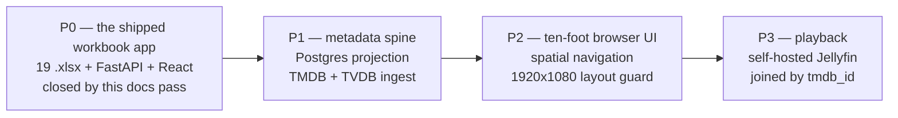
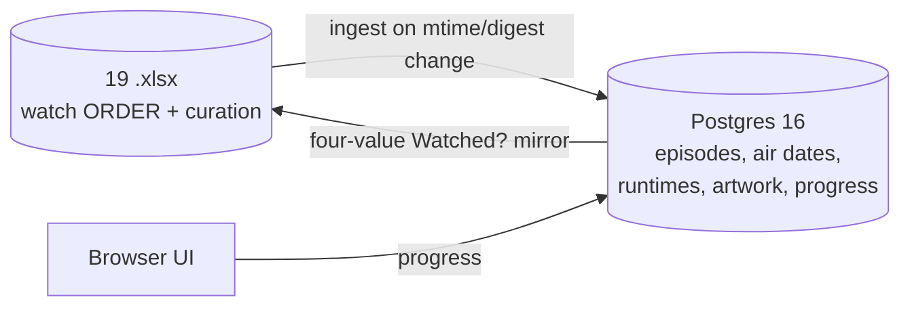

# Status

Where this project actually is, right now. Not a history — for that, read `docs/versions.md`.
Anything written here is true of the working tree as it stands; when it stops being true, this file
changes.

**Measured against `main` @ `10c3205` (2026-09-07); working tree clean.**
Last reviewed: 2026-09-15. Version in flight: **0.1.1** (docs only — see `docs/versions.md`).

---

## 0. Resume here — the numbered steps

Read this first. Steps 1-5 are done; step 6 is where work resumes. "**You**" means the repository
owner and cannot be done by an agent; "**Agent**" means it needs no account, key or purchase.

| # | Step | Tasks | Who | State |
|---|---|---|---|---|
| 1 | The workbook app shipped — nineteen `.xlsx` categories, FastAPI + React, chat dock, layout guard, CI | — | — | **Done** (Phase 0 app) |
| 2 | `streambert` evaluated and **rejected**; the three-phase plan chosen; dual store, browser-only UI and deferred playback settled | ADR-001…008 | — | **Done** 2026-09-08 |
| 3 | Documentation foundation written — this file, `CLAUDE.md`, `docs/TV_MASTER_PLAN.md`, `docs/versions.md` | T00, T01 | Agent | **Done** 2026-09-08 |
| 4 | **TMDB coverage measured before committing to it** — 139/140 sampled titles found, ~99.5% weighted. Coverage is not a risk; resolution is. T13/T16/T18 sharpened, `title.tmdb_id` made nullable | — | Agent | **Done** 2026-09-09 — see §2.8 |
| 5 | **Get the two provider credentials.** TMDB: account → Settings → API → take the **v4 Read Access Token** (the long `eyJ…` string), free and instant. TheTVDB: buy the user subscription, then Dashboard → Account → API Keys → *Create a v4 API Key* with funding model **End-User Subscriptions**; keep both the key and your subscriber **PIN** | T02, T03 | **You** | **Done** 2026-09-15 — TMDB API Read Access Token (T02), and TheTVDB v4 key on End-User Subscriptions plus its subscriber PIN (T03). A key on that model does not come with a PIN: the PIN came from the separate $11.99/yr user subscription at `https://www.thetvdb.com/subscribe`, which the owner bought. That subscription **also issues a legacy v3 API key, which this project does not use** — only the v4 key goes in `TV_TVDB_API_KEY`. The owner types them into the gitignored root `.env` (`C:\Users\Amram\IMPORTANT\Personal\TV\.env`), whose placeholder-only template was created at the owner's request. Phase 1 must point `Settings` at that file by absolute path — see `CLAUDE.md` section 8.3 |
| 6 | `.claude/` wiring — `settings.json` plus the OS-agnostic `.cjs` hook set, `commands/`, `skills/`, copied and adapted from a reference project. Node `.cjs` only, stdin not env vars | T01a | Agent | **Next** |
| 7 | `.env.example` with every variable and a safe placeholder | T01b | Agent | Pending |
| 8 | README reconciliation — `OWNER/REPO` placeholders (the real path is `amrambouskila/watch-list`, the `origin` remote), eighteen→nineteen workbooks, the stale test count, the Semgrep description, the "There is no database." opening, and a P0→P1→P2→P3 phase diagram. **Closes Phase 0** | T01c | Agent | Pending |
| 9 | The data layer — SQLAlchemy 2.0 async models, Alembic, first revision, `postgres:16-alpine` on host port 5525, CI service container | T04-T11 | Agent | Blocked on step 8 |
| 10 | The provider clients — httpx scaffolding, TMDB, TheTVDB, `sync_state` cursors | T12-T15 | Agent | Blocked on steps 5, 9 |
| 11 | The resolver — normalise, franchise-prefix expansion, search, season/episode fallback, verification, confidence | T16-T20 | Agent | Blocked on step 10 |
| 12 | **The dry-run report over all nineteen workbooks** → `docs/resolver-dry-run.md`. The real go/no-go, with per-workbook numbers instead of a 140-title sample | T31 | Agent | Blocked on step 11 |
| 13 | Identity, reconciliation, the watch mirror, the read API, the review queue, attribution, launcher `[q]`/`[v]` → **Phase 1 gate** | T21-T33 | Agent | Blocked on step 12 |

Steps 14+ are Phase 2 (ten-foot UI) and Phase 3 (Jellyfin playback, gated on a real file library
existing). See `docs/TV_MASTER_PLAN.md` §4 and §11.

**If you read nothing else:** steps 1-5 are done and work resumes at step 6. All three credentials
exist, so nothing in steps 6-13 is blocked on the owner any more.

**Paused on 2026-09-15: the playback question comes before step 6.**
- **What changed.** The owner learned that TMDB and TheTVDB supply no video, and chose a launcher that
  opens titles on the streaming services (§2.14).
- **What the owner asked for.** One complete plan, including the monthly bill, before any further building.
- **Where the research is.** §2.20–§2.30 hold every finding. `docs/TV_MASTER_PLAN.md` carries
  two proposed ADRs: ADR-011, no VPN switching, and ADR-012, the launcher.
- **Research is complete.** The consolidated plan and monthly bill went to the owner on 2026-09-15.
- **Owner decisions are the next step.** They are collected in §2.23 and in ADR-012's "Open" list.
- **Steps 6-8 do not depend on any of this.**
- **Do not commit `docs/` yet.** It now records the owner's country and subscriptions, and the repository
  is public. The owner decides first how to handle that (§2.23).

---

## 1. What exists and works

Phase 0 — the shipped workbook app. A local, single-user web app for nineteen hand-curated watch
orders. It ships, it is used, and it has no database: the nineteen `.xlsx` workbooks in the
repository root **are** the store, read and written in place with openpyxl.

| | |
|---|---|
| Backend | Python 3.13 + FastAPI + Pydantic v2 + openpyxl + uvicorn, managed by `uv`. `app/backend/src/tv_watchlist/`, 83 modules / 4,160 lines. Version `0.1.0` at `app/backend/pyproject.toml:3`. |
| HTTP surface | 14 routes: nine REST (`api/categories.py`, six; `api/rows.py`, three) and five chat (`api/chat.py`). No `/health` — the compose healthcheck probes `/openapi.json` because that endpoint touches no workbook (`docker-compose.yml:40-43`). |
| Frontend | React 18 + TypeScript strict + Vite + Redux Toolkit, managed by `pnpm@9.15.9`. Four slices (`catalog`, `category`, `chat`, `ui`) in `app/frontend/src/stores/`, 20 one-concept type files, 31 components, 8 stylesheets. No router, no chart library, no CSS framework. Version `0.1.0` at `app/frontend/package.json:4`. |
| Chat dock | `claude-agent-sdk` shelling out to the `claude` CLI, streaming SSE, with Playwright/Chromium escalation for pages that block a plain fetch. Every write it proposes goes through the same `Catalog` calls the REST endpoints use. |
| Storage | The workbooks, plus pre-write snapshots in `app/.backups/` (last 10 per file) and card artwork in `app/heroes/` with `ATTRIBUTION.md`. |
| Safety | Per-workbook `asyncio` locks, an `mtime` freshness guard on every mutating call, a refusal when Excel holds the file (HTTP 423 — `api/errors.py:36`), atomic temp-file-and-swap writes, and retirement that *moves* a workbook into `.backups` rather than unlinking it. |
| Settings | `Settings` (`app/backend/src/tv_watchlist/config.py:14-25`), `env_prefix="TV_"` (`:17`), so every field name derives its variable mechanically. |
| Ports | `5284` frontend, `8284` backend, `5286` layout-guard probe (`app/frontend/layout/probeServer.ts:1`, overridable via `TV_LAYOUT_PORT` at `:4`; binds only during `pnpm test:layout`). All three are already registered in `PORT_ASSIGNMENTS.md`. |

### Tests, as measured

| Suite | Count | Notes |
|---|---|---|
| pytest | **722 collected** | `uv run pytest --collect-only -q`, verified 2026-09-08. 63 `.py` files under `tests/`, 447 `def test_*` functions; the rest are `parametrize` expansions. |
| Vitest | **207** across 20 files | jsdom, behaviour-level. `pnpm test`, vitest 4.1.11. |
| Playwright layout guard | **152** | 38 tests x 4 window sizes (1512x900, 1280x720, 1024x768, 960x1040), real Chromium, eighteen surfaces, no network. |

### CI

`.github/workflows/ci.yml` runs `lint -> sast -> test -> coverage gate -> build -> docker-build`,
expressed with `needs:`, plus a separate CodeQL workflow. All six required stages are present and in
order. Every test job emits its own JUnit XML and publishes it with `dorny/test-reporter@v1`
(`reporter: java-junit`, `checks: write`, `if: !cancelled()`) — `junit-backend.xml`,
`junit-frontend.xml`, `junit-layout.xml`. Semgrep runs six named packs — `p/default`,
`p/owasp-top-ten`, `p/python`, `p/typescript`, `p/react`, `p/docker` (`ci.yml:122-127`) — with SARIF
uploaded to the Security tab; `pip-audit`, `pnpm audit --audit-level=high`, gitleaks and Trivy are
all wired in. Every `uses:` is pinned to a 40-character SHA.

Coverage floors, declared as workflow `env` at `ci.yml:39-43` and checked by an inline Python step:
backend **97%** lines; frontend **56%** lines / **54%** statements / **45%** functions / **45%**
branches. The comment above them (`ci.yml:35-38`) records these as measured, not aspirational —
backend is 2259 of 2322 lines. They ratchet upward and are not the fleet's 100% target; the gap is
recorded in section 4.

---

## 2. What was decided this session

No code changed. What changed is the plan, and it is now written down.

### 2.1 streambert: evaluated, rejected

`github.com/truelockmc/streambert` was assessed as a possible source of ideas or code. It is
rejected outright and adopted from in no part. It is an Electron desktop client under GPL-3.0 that
scrapes unlicensed stream hosts (VidSrc, videasy, vidking, allmanga.to) and rips m3u8 with ffmpeg,
and it self-tags as piracy. Three independent disqualifiers: zero technical overlap with a browser
app over a personal file library, GPL-3.0 contagion onto a repository that currently carries no
`LICENSE` file — vendoring it would settle the licence question as a side effect of a code-reuse
convenience rather than as a decision, and settle it on GPL-3.0 (section 4, item 1) — and legal
exposure this project has no appetite for. It is recorded as ADR-006 in `docs/TV_MASTER_PLAN.md` and
summarised in the status and versions entries for this change. Nothing from it is adopted.

### 2.2 The phase sequence

**Phase 0 is the app described in section 1** — it shipped before this plan existed, and this
documentation pass is what closes it, on five tasks: `T00` (root `docs/`), `T01` (root `CLAUDE.md`),
`T01a` (the `.claude/` wiring), `T01b` (`.env.example`) and `T01c` (the README reconciliation).
Phase 0 is named explicitly so a reader of the phase sequence never has to guess what came before
Phase 1.

P3 is designed for and deliberately not built: **there are no video files on this machine yet.**
Playback is not deferred because it is hard, but because there is nothing to play. The join key to
whatever media server eventually appears is chosen now — `tmdb_id` — so the schema does not have to
move when it does.

### 2.3 Dual store

The workbooks do not go away, and this is the load-bearing decision of Phase 1.

- **Excel stays authoritative** for watch order and hand curation, and stays editable in Excel.
- **Postgres becomes authoritative** for episodes, air dates, runtimes, artwork and watch progress.
- The `Watched?` cell is **mirrored back** into the sheet, so a workbook opened standalone still
  means something. The mirror is a lossy one-directional projection of the append-only progress log
  onto four values (`""` / `Watched` / `In progress` / `Skip`) — never read back as truth, only as a
  signal that a human changed something.
- A sheet row's identity is a UUID written into a hidden `Row ID` column at the far right, because
  the existing writer already relays whole row-value arrays through adds, moves and removes and so
  carries that identity for free. Row number and `Order` value are both disqualified: the writer
  resequences them.

### 2.4 Device and UI treatment

The app is watched on a TV, driven from a PC or laptop over HDMI or a cast. **It stays a browser
app.** No Tizen `.wgt`, no webOS `.ipk`, no `react-native-tvos`, no app store, no second native
codebase. The ten-foot treatment is CSS tokens (type scale, safe-area insets) plus one focus
library: **`@noriginmedia/norigin-spatial-navigation`** (MIT). `react-tv-space-navigation` was
rejected as stale; `bbc/lrud` is archived.

### 2.5 Metadata providers

- **TMDB is the spine** — identity, artwork, seasons, episodes. Bearer token server-side only, read
  from `TV_TMDB_READ_ACCESS_TOKEN`. Two constraints land in the schema rather than in a comment: a
  hard **6-month cache ceiling** in TMDB's terms, and the fact that anime `episode_number` is
  absolute-continuous across seasons (One Piece season 2 is episodes 62-77), so an `SxxEyy` built
  from TMDB numbers is silently wrong for exactly the anime workbooks this library is half made of.
- **TheTVDB v4, on an End-User Subscriptions key** supplies alternate episode **orders**, authenticated with
  `TV_TVDB_API_KEY` plus `TV_TVDB_PIN`. **Seven season types are live in production — `official`, `dvd`, `absolute`, `alternate`, `regional`, `altdvd`, `alttwo` (measured 2026-09-15) — and the
  OpenAPI spec lists them as *examples*, not an `enum`, so the list is not closed.** The operative
  rule everywhere these orders are touched: **read the season-type list at runtime from a cached
  `GET /v4/seasons/types` and never hard-code it.** Only `official` and `absolute` are broadly
  populated; `dvd` is materially incomplete and `alternate`, `alttwo` and `regional` are effectively
  absent for most titles. An unrecognised season type returns HTTP 200 with an empty list, so a
  zero-length response means *unknown*, never *no episodes*.
- **AniList is not adopted now, and is revisitable behind an ADR and a feature flag** — it is not a
  permanent non-goal. It is not needed for ordering, because TheTVDB already supplies absolute
  order; what it would add is franchise topology (`Media.relations` across separately-titled films,
  OVAs and ONAs). It is held back on operational grounds: its API is currently degraded to **30
  requests per minute** (the documented limit is 90, the response headers still advertise 90, and
  rate-limit-increase requests are not being accepted), and it returns **HTTP 403** during outages.
  Revisit it when franchise chaining becomes a real requirement.
- **Trakt is inspiration only, not adopted** — its February 2026 free tier caps a user at 1,000
  total list items, below this library's row count.
- **Plex is not adopted** — its 2026 remote-streaming paywall was extended to third-party API
  clients.
- **Jellyfin is the designated Phase 3 playback layer**, self-hosted. Noted now so the schema is
  built against it: Jellyfin cannot filter items by provider id at all, so a `tmdb_id -> item id`
  index has to be built and cached from a paged library scan.

### 2.6 Storage allocation

Postgres host port **5525** is allocated for this project — the first free slot in the documented
`5520-5591` range, adjacent to `Torah_Learning_Sidra` at `5524`. It is an allocation, not a bind:
nothing publishes it yet. **It is the only new host port this design takes.** See section 4, item 6.

---

### 2.7 The library's shape, measured against the real workbooks

Read straight off the nineteen `.xlsx` files with `openpyxl` on 2026-09-09, not estimated:

| Measurement | Value |
|---|---|
| Rows carrying a `Title` | **996 of 996** — every row has one |
| Distinct `(title, type)` pairs | **686** |
| Of those, "hard" kinds (Short, OVA, Special, TV Special, Web Animation, Compilation Movie, Miniseries episode, LEGO Animation, ...) | **134 pairs**, covering **147 of the 996 rows** |
| Ordinary kinds (TV, Movie, Film, Anime, Animation, Crossover, Live-action, ...) | **552 pairs** |

Two findings that decide whether Phase 1's resolver is tractable at all:

1. **The `Title` column is clean.** Every row holds a real title string — `Enemy at the Gates`,
   `Spider-Man: Homecoming`, `Vinland Saga` — and the *span* lives separately in the `Unit` column
   (`E153–195`, `S5 E10-19`, `Movie 2`, `1942–43 — Battle of Stalingrad`). There is no free-text
   prose in the title field. `resolver/match_key.py` (T16) therefore has a real string to normalise,
   and `resolver/span.py` (T17) has a separate field to parse. That separation is what makes T18
   possible; had the two been mixed, the design would have needed rethinking.
2. **996 rows collapse to 686 works.** `Arrow` recurs across DCU with different episode spans,
   `One Piece` likewise. The resolver identifies 686 things, and each identification serves several
   rows — so `curated_entry` rows outnumber `title` rows by roughly 1.45x, as the schema assumes.

The raw extraction is reproducible: it reads the first sheet of each workbook, takes the `Title`
column plus whichever of `Unit` / `Season / Unit` / `Season / Episode / Movie` /
`Season / Episode Block` / `Event` / `Episodes / Seasons` that workbook uses, and needs no key.

---

### 2.8 TMDB coverage — measured, 2026-09-09

**The question:** does TMDB actually carry every show and film in the nineteen workbooks? If not,
the project was going to be scrapped. It was measured before any Phase 1 code was written, against a
stratified sample of 140 of the 686 distinct `(title, type)` pairs — 100 drawn uniformly from the 552
ordinary pairs, 40 from the 134 hard ones (Short, OVA, Special, TV Special, Web Animation,
Compilation Movie, Miniseries episode, ...). Probed against the public themoviedb.org catalogue; no
API key needed to answer it.

| Measure | Result |
|---|---|
| Ordinary stratum found in TMDB | **100 / 100** |
| Hard stratum found in TMDB | **39 / 40** |
| Weighted estimate, whole library | **~99.5% of pairs, ~99.6% of rows** (~4 rows genuinely absent) |
| Exact character-for-character title match | **67%** of pairs (76% ordinary, 30% hard) |
| Resolvable with no normalisation, no disambiguation, no parent lookup | **~47%** — the true zero-touch rate |

**The answer is yes — coverage is not the risk.** The single genuine miss in 140 probes was
*Fullmetal Alchemist: Brotherhood — Simple People*, an individual OVA that TMDB carries only inside a
bundled "OVA Collection" entry. The risk is entirely in *resolution*, and the probe turned up five
failure classes that are now design input rather than surprises:

1. **Franchise prefix stripped in the workbook, present on TMDB** — ~17% of pairs. `Attack of the
   Clones` → `Star Wars: Episode II - Attack of the Clones`; `Dead End Adventure` → `One Piece: Dead
   End Adventure`; `The Consultant` → `Marvel One-Shot: The Consultant`. Deterministic and cheap: the
   workbook *filename* already names the franchise.
2. **The work exists only as a season or a season-0 episode of a parent, with no top-level entry** —
   ~17% of pairs, ~127 rows. `Inuyasha: The Final Act` is season 2 of `tv/35610`; `Attack on Titan:
   Ilse's Notebook` is `tv/1429` S0E7. **This is schema-relevant**: an `external_id` scheme that can
   only address top-level ids silently strips ~13% of the library.
3. **Real same-title collisions** — ~24% need disambiguation. Eight distinct films are titled exactly
   `Superman`, and TMDB's default ranking puts the 2025 one above the 1978 one that a DCU row means.
   About 4% are undecidable from the workbook as it stands and want a year column or a human.
4. **Confidently wrong matches, which are worse than misses** — ~5% observed. An unrelated 2015 show
   is titled exactly `Skeleton Crew`; a Bleach TYBW *theatrical compilation* carries almost the exact
   string of the TV cour a row means.
5. **Genuinely absent** — ~4 rows library-wide.

**In plain terms, because this is easy to misread.** Nothing is missing from TMDB. The gap is that
the workbook and TMDB *spell the same work differently* — `Attack of the Clones` is TMDB's `Star Wars:
Episode II - Attack of the Clones`; `Dead End Adventure` is `One Piece: Dead End Adventure`; `Inuyasha:
The Final Act` is season 2 of `Inuyasha` rather than a page of its own. Same films, same episodes,
different strings. So this is a lookup problem, not a coverage problem, and the ~4 genuinely absent
rows degrade to a manually-typed local record rather than to a failure. The thing actually worth
engineering against is the *opposite* of missing data: a matcher that confidently attaches the **wrong**
work — the 2025 `Superman` to a row that means 1978, or the unrelated 2015 `Skeleton Crew` to a row
that means `Star Wars: Skeleton Crew`. Those are silent, and they are why verification and the review
queue are not optional. Expect the queue to hold roughly 100 rows, cleared by hand once, after which
every row is pinned by id and never ambiguous again.

**Consequence:** build the resolver as *normalise → franchise-prefix expansion → search →
season/episode fallback including season 0 → type-and-runtime verification → confidence score*, and
expect ~85-90% of rows to land automatically and correctly, ~10% in the review queue, and a handful
needing a manual local record. **Never let the resolver rank by popularity alone** — that is exactly
how a 1978 row gets the 2025 film. The plan's existing `resolution_state` / `resolution_confidence` /
review-queue design (§12 R1) is the right shape; T13, T16 and T18 have been sharpened with what this
probe found.

---

### 2.9 Credentials verified live, and what the live APIs corrected — 2026-09-15

All three credentials in the root `.env` were exercised against the real services by a throwaway
script that reads the file itself and prints no secret. **Everything authenticates and returns data.**

| Check | Result |
|---|---|
| TMDB — authenticate with the v4 Read Access Token | HTTP 200 |
| TMDB — `tv/37854` One Piece | 23 regular seasons plus season 0 specials, 1181 episodes |
| TMDB — `tv/37854/season/2` | 16 episodes numbered **62-77**: the absolute-inside-season-buckets numbering the schema is built for |
| TMDB — search `Attack of the Clones` | top hit `Star Wars: Episode II - Attack of the Clones` (2002) — the franchise-prefix case from §2.8, live |
| TheTVDB — `POST /v4/login` with v4 key + PIN | HTTP 200, token issued |
| TheTVDB — `GET /v4/seasons/types` | 7 types: `official`, `dvd`, `absolute`, `alternate`, `regional`, `altdvd`, `alttwo` |
| TheTVDB — `series/81797` episodes under `absolute`, `official`, `dvd`, `default` | every one returned a full first page of 500 |

**One episode, four numberings.** *The First Line of Defense? The Giant Whale Laboon Appears!*, aired
2001-03-21, is:

| Numbering | Source | Value |
|---|---|---|
| TMDB | `tv/37854` | season 2, `episode_number` 62 |
| TheTVDB `absolute` | `series/81797` | #62 (season 1, episode 62) |
| TheTVDB `dvd` | `series/81797` | season 2, episode 1 |
| TheTVDB `official` | `series/81797` | season 5, episode 2 |

That is the case for `episode_order` (`CLAUDE.md` section 5.13) made by one real row rather than an
argument: no arithmetic maps one column onto another, and a UI that prints `S{season}E{episode}` from
any single provider is wrong for this title.

**These are metadata services.** Everything above is information *about* episodes — names, dates,
numbering, artwork. Neither TMDB nor TheTVDB supplies video, audio, dubs or subtitles. The `/eng`
variants below return English *titles and descriptions*, not English audio. Dub versus sub is a
property of the video files the owner plays in Phase 3.

**Four corrections the live APIs made, now applied across all four documents:**

1. **The season-type list was wrong.** The documents named `default, official, dvd, absolute,
   alternate, alttwo, regional`. The live list has **`altdvd`**, not `default`. `default` is still
   accepted as an episodes-endpoint path and returned exactly what `official` returned, so it is an
   alias, not a type. This is the never-hard-code-the-list rule proving itself: the hard-coded copy was
   already stale.
2. **TheTVDB's search is not in the resolution path.** Searching `One Piece` returned ten series; the
   first was Netflix's `ONE PIECE (2023)` and the anime ranked **eighth**, under its Japanese primary
   name `ワンピース`. TMDB's `/tv/{id}/external_ids` returns `tvdb_id` directly instead — verified for
   One Piece (37854 → 81797), Dexter (1405 → 79349) and Pokémon (60572 → 76703). Resolution is
   **TMDB title → `external_ids.tvdb_id` → TheTVDB orders.**
3. **TheTVDB returns original-language names by default** — Japanese for anime. English comes from the
   language variants: `/series/{id}/translations/eng` returned `One Piece`, and
   `/series/{id}/episodes/{type}/eng` returned English episode names. The ingest requests `/eng`.
4. **"24 seasons" was imprecise.** TMDB reports `number_of_seasons = 23`; the `seasons` array has 24
   entries because it includes season 0, the specials bucket.

T14 and T20 in `docs/TV_MASTER_PLAN.md` now carry corrections 2 and 3.

---

### 2.10 Decided — Next and Autoplay follow the curated order (2026-09-15)

The owner's requirement: once a category has an order, playback respects it. A **Next** button and an
**Autoplay** toggle advance to whatever the workbook orders next — from a One Piece episode to the film
that follows it, then back to the next episode. Recorded as `docs/TV_MASTER_PLAN.md` §6.9 and ADR-010,
with deliverables 2.8 (Up next, Phase 2) and 3.8 (Next and Autoplay, Phase 3), tasks T24, T41 and T53a,
and a line in each of the Phase 1, 2 and 3 gates.

It changed one planned table. `curated_entry_episode`, the flattened queue that answers "what plays
next", was designed with **no rows for movie entries**, which would have made Next skip every film.
Movie entries now occupy one slot each. Nothing is built yet, so this costs only the design.

**Three defaults recorded for the owner to confirm or overturn** (§6.9, rules 4-6): items marked `Skip`
are passed over; a next item that cannot be played — not in the library, ambiguous, or unresolved —
stops playback on it with an explicit skip action rather than being silently jumped; and the queue is
one category's order, stopping at the category's end. **One open contract decision:** the table name
`curated_entry_episode` no longer describes its contents — proposed rename `curated_entry_item`, to
settle before T24.

**Dub versus sub** is recorded as a Phase 3 decision (deliverable 3.9). TMDB and TheTVDB supply
metadata only; which audio and subtitle tracks exist is a property of the owner's video files.

---

### 2.11 Open — where the video comes from, and adding content through the chat (2026-09-15)

**The gap, stated plainly.** Nothing in the app or in this plan produces video. TMDB and TheTVDB supply
metadata only — titles, dates, numbering, artwork — never the episodes or films themselves. Phase 3
assumed a local file library, from the owner's earlier answers ("plays video, from my own library";
"no files exist yet"), which is why it is gated on one existing. The owner has since said those answers
were given believing the metadata services supplied the video. **Where playback comes from is
therefore undecided, and that decision sets the shape of Phase 3, Next and Autoplay.** Until it is made,
no playback design in `docs/TV_MASTER_PLAN.md` — including §6.9 and ADR-010 — is settled.

**Requirement received the same day — adding content through the in-app Claude chat.** The owner wants
to tell the chat "add a new category of <kind of shows or films>" or "add <show> to <category>",
misspellings included, and have it infer the intended works, confirm them back as a plan, create or
update the workbook on approval, offer hero artwork to choose from, and have the result available to
watch straight away — or show that it is still being made available. **Much of this already shipped in
Phase 0** (`CLAUDE.md` sections 3.5, 5.8, 13.3 and 14.7): create, edit and hero proposals, a
human-approved diff, up to three artwork candidates, and the new category selected on approval. **Not
yet covered:** matching each approved work to one exact TMDB entry in a non-AI picker the owner confirms (TMDB content may not enter the chat, §2.20); an immediate scoped ingest after approval; and the
"watch it now" half, which depends on the decision above. The plan update for both follows that
decision.

**The owner's answers, 2026-09-15.** Pays for **Netflix, Crunchyroll and Amazon Prime Video**. Owns **none** of the library on disc or as video files. Selected **"my own files only"** for playback — a choice whose consequence (no playback at all until files exist, and few legitimate ways to obtain files for this library) is being confirmed with the owner before the plan is rewritten around it.

---

### 2.12 Measured — where the library can be watched today (US, 2026-09-15)

TMDB's watch-provider data — sourced from JustWatch, which must be credited wherever the app displays
it — was pulled for the 139 titles of the §2.8 coverage sample, for the United States.

| Stratum | Included with a subscription | Free with ads only | Rent or buy only | Not watchable in the US |
|---|---|---|---|---|
| Ordinary titles (100) | 79% | 8% | 4% | 9% |
| Shorts, OVAs, specials (39) | 54% | 0% | 0% | 46% |

Services carrying the most ordinary titles: Disney+ 25%, Netflix 17% (a further 12% listed under
"Netflix Standard", largely overlapping), Crunchyroll 16%, Hulu 13%, HBO Max 12%, Prime Video 11%. The
fewest subscriptions for the most coverage, chosen greedily: Disney+ (25%) → + Crunchyroll (41%)
→ + HBO Max (53%) → + Prime Video (63%) → + Netflix (69%). Free with ads: Tubi 15%, Hoopla
14%, The Roku Channel 10%, Pluto TV 10%, Kanopy 8%.

By workbook, subscription availability in the sample runs from near-complete — Marvel 23/24, Star Wars
5/5, Misc_Anime 9/9, Attack on Titan 7/8, DCU 16/19 — to poor for the anime whose orders are full of
films, OVAs and specials: One Piece 2/11, Pokémon 5/13, Bleach 2/5.

**What this does and does not establish.** A streaming service can be *opened* from the app but not
*controlled*: another service's player cannot be driven by this app, so true Autoplay through the
curated order is possible only for video the app plays itself. The free data names the service that
carries a title, not a link to a specific episode inside it. Caveats: a sample, not the library;
specials the probe matched to a parent series inherit that series' availability, which overstates
them; and availability is regional and changes month to month.

---

### 2.13 Measured — Israel versus the US, on the owner's own subscriptions (2026-09-15)

The owner lives in Israel, so §2.12's US-only figures overstated what is watchable where the owner
is. Same 139-title sample, same TMDB watch-provider data (JustWatch-sourced):

| Regular titles (100) | Israel | United States |
|---|---|---|
| On Netflix, Crunchyroll or Prime Video — what the owner pays for | 17% | 37% |
| On any subscription service | 32% | 79% |
| Rent or buy only | 26% | 4% |
| Not available at all | 42% | 9% |
| Free, officially, on YouTube (playable inside the app) | 0% | 6% |

For the 39 shorts, OVAs and specials: Israel 8% on the owner's services and 74% unavailable; the US
33% and 46%. In Israel the services carrying the most of this library are Netflix 10%, HBO Max 9%,
Crunchyroll 8% and Shahid VIP 5%; adding HBO Max to the owner's services lifts coverage from 17% to
26%. Disney+ does not appear in TMDB's Israel data at all, and Israeli pay-TV operators may carry titles
this data does not track, so Israel may be undercounted. By workbook, on the owner's services in Israel:
Misc_Anime 7/9 and Pokémon 5/13 are the only strong ones; Marvel 1/24, DCU 3/19, WWII 0/22,
One Piece 0/11, Star Wars 0/5.

**Unlicensed sources stay out of scope, reaffirmed 2026-09-15.** No phase plays video from sources that
do not hold the rights to it (`CLAUDE.md` §0.3, ADR-006), and no design in this repository may depend
on one. The legitimate sources the app itself can play are the owner's own files (Jellyfin), official
free uploads (YouTube's embeddable player) and public-domain films; per the table above, official
YouTube uploads cover 0% of this library in Israel. **The playback direction is open** until the owner
chooses among: opening titles on the services that carry them, the owner's own files, or no playback
for now.

---

### 2.14 Decided — launcher now, own files later; worldwide availability requested (2026-09-15)

**Direction.** Playback starts as a **launcher**. Every title shows where it can be watched and opens
there in one click, and Next opens the next title in the curated order. In-app playback with true
Autoplay — Jellyfin, §4.3 — follows for any video files the owner adds later. Phases 1 and 2 are
unchanged by this choice: both are needed on every route.

**Region requirement.** Availability is to be **worldwide**, not one country. For each title the app
should find which country's catalog carries it on a service the owner pays for (Netflix, Crunchyroll,
Prime Video), and the owner wants the app to switch their **NordVPN** connection to that country before
opening the service. Before this is planned, three things are being verified: whether NordVPN can be
driven from software on Windows and macOS; what each service's terms say about viewing another
country's catalog; and how much coverage worldwide switching actually adds for this library.

---

### 2.15 Measured — worldwide availability on the owner's own services (2026-09-15)

Same 139-title sample; TMDB's watch-provider data covers 139 regions. A title counts when some country's
catalog carries it on Netflix, Crunchyroll or Prime Video — the services the owner already pays for.

| Regular titles (100) | Share |
|---|---|
| On the owner's services in Israel | 17% |
| On the owner's services in **some** country | **74%** |
| On **any** subscription service in some country | 96% |

Service by service, anywhere in the world: Prime Video 65%, Netflix 49%, Crunchyroll 19%. For the 39
shorts, OVAs and specials: 8% in Israel, 44% in some country, 77% on any service somewhere.

**A few countries do most of the work.** Starting from Israel's 17%, adding Japan reaches 46%, France
60% and the United States 66%; beyond that each extra country adds a title or two, up to 74%. Two
cautions, both unverified: a country carrying a title says nothing about whether that catalog has
English audio or subtitles, and only countries where the VPN provider has servers are usable.

**By workbook**, Israel versus some country: WWII 0/22 → 19/22, DCU 3/19 → 17/19, Attack on Titan
0/8 → 7/8, Bleach 0/5 → 5/5, Misc_Anime 7/9 → 9/9, Naruto 1/5 → 4/5, Pokémon 5/13 → 8/13,
One Piece 0/11 → 4/11 — but Marvel only 1/24 → 5/24 and Star Wars 0/5 → 0/5. Of the 26 regular
titles on none of the owner's services anywhere, 17 are on Disney+ somewhere, which is where Marvel and
Star Wars live; 4 are on no subscription service in any country.

---

### 2.16 Verified — can the app switch NordVPN, and what the services' terms say (2026-09-15)

**NordVPN control, by operating system**, checked against NordVPN's own support articles with each
command re-verified:

| OS | Can software switch the VPN country? | How |
|---|---|---|
| Windows (the owner's machine) | **Partly.** Connect and disconnect are officially documented; confirming the result is not | `nordvpn -c -g "<country>"` and `nordvpn -d`, run from `C:\Program Files\NordVPN\`. No documented status command, country list, exit codes or protocol flag, so the app must confirm a switch by checking its own public IP afterwards |
| macOS | **No.** NordVPN documents no command line, script or API for the macOS app | Manual switching only |
| Linux | **Yes.** An official, open-source `nordvpn` CLI | `nordvpn connect <country>`, `nordvpn status`, `nordvpn countries`, `nordvpn disconnect` |

NordVPN's support site states "8,400+ servers in 167+ countries"; an undocumented JSON endpoint lists
150. NordVPN's own terms on automated access could not be read programmatically and need a manual
check.

**What the owner's services' terms say about VPNs:**
- **Netflix** — Terms §1.5 limit access to content "primarily within the country in which you have
  established your account". On detecting a VPN Netflix shows error E106, and its help pages say a VPN
  user **may see only titles Netflix licenses worldwide** — so a VPN does not reliably unlock another
  country's catalog; it can shrink the one shown.
- **Prime Video** — Terms §3: "You may not use any technology or technique to obscure or disguise your
  location." Under §6(a) rights end on any violation, and Amazon may revoke access without a refund.
- **Crunchyroll** — Terms §5: "the use of VPNs, proxy servers, IP spoofing, or similar methods to
  circumvent geo-filtering mechanisms is strictly prohibited", and accounts may be suspended or
  terminated for "attempted circumvention of security measures".

No official page describes a penalty aimed specifically at VPN use; account action sits in the general
suspension and termination clauses. This is a contract matter between the owner and each service, not
a copyright one, and no authoritative source settles its legal status for a consumer.

**TMDB's where-to-watch data**, verified: each country's `link` opens **TMDB's own watch page**, not the
service — TMDB's docs say the API is "*not* going to return full deep links". There is series- and
season-level data but **no episode-level availability**. Everywhere the app shows it must credit
**JustWatch** and TMDB; the data refreshes daily and may not be cached beyond six months.

**Project conflict, to resolve in the plan update:** `CLAUDE.md` §2.2 lists "deep links to
Netflix/Disney+/Prime, 'where to watch' providers" as a *never* item. The owner's launcher decision
(§2.14) reverses that, so it needs an ADR and an edit to §2.2 before any launcher code.

---

### 2.17 Measured — the whole library, every title, best case (2026-09-15)

The 140-title sample (§2.8, §2.12–§2.15) is superseded by a measurement of **the whole library**:
every distinct (workbook, title, type) — 686 of them, covering all 996 rows — resolved to TMDB
automatically and checked against TMDB's watch-provider data in the 116 countries where TMDB has data
and NordVPN has servers. Matching accuracy against the 140 hand-verified titles: 124 agree, 6 wrong, 9
unmatched. 649 titles resolved (most low-confidence matches are anime arcs correctly mapped to their
parent series); 37 did not match at all. The wrong matches are the known traps — *Superman* 1978
versus 2025, *Supergirl* 1984 versus 2026, a premiere special or compilation film instead of the work.

**This is a best case.** It assumes every service shows the catalog of whatever country the VPN is set
to. §2.16 verified that this is not reliably true: Netflix can show only its worldwide titles when it
detects a VPN, and Prime Video and Crunchyroll prohibit VPN use in their terms. Real coverage is lower.

| Services, with VPN country switching (best case) | Share of titles |
|---|---|
| Netflix + Crunchyroll + Prime Video, **no VPN** (Israel) | 15% (21% of rows) |
| Netflix + Crunchyroll + Prime Video, with the VPN | 58% (65% of rows) |
| + Disney+ | 79% |
| + Disney+ + HBO Max | 82% |
| All ten candidates (also Hulu, Paramount+, Peacock, Apple TV+, JioHotstar) | 82% (86% of rows) |

**100% is not reachable with subscriptions.** With all ten services and perfect country switching, the
ceiling is 82% of titles and 86% of rows — 89% of regular films and series, but only 46% of shorts, OVAs
and specials. Of the 115 titles still uncovered, 66 are not offered on any service in any country, 39 are
on subscription services outside the ten, 6 can only be rented or bought, and 4 are free with ads
somewhere. Once Disney+ and HBO Max are in, the other five services add under 1%. The countries doing
the work, in order: Israel, Japan, the United States, the United Kingdom, Spain, then a title or two each
from several more. Counting only confident matches gives the same shape: 57% → 79% → 82.7%.

---

### 2.18 Measured — fixed VPN countries, and what is missing (2026-09-15, best case)

Same whole-library data and the same best-case assumption as §2.17. Setting the VPN to a few fixed
countries, instead of switching per title, costs little coverage:

| Countries reachable | Owner's 3 services | + Disney+ | + Disney+ and HBO Max | All ten |
|---|---|---|---|---|
| Israel only (no VPN) | 15% | 15% | 21% | 21% |
| Israel + US | 33% | 54% | 62% | 65% |
| Israel + US + Japan | 45% | 66% | 75% | 77% |
| Israel + US + Japan + UK | 51% | 72% | 77% | 79% |
| Any NordVPN country | 58% | 79% | 82% | 82% |

Disney+ adds nothing without a VPN because it does not appear in TMDB's Israel data.

**The 115 titles even all ten services cannot reach — preliminary, being verified title by title:**
- **66 not offered on any service anywhere.** Concentrated in OVAs, shorts, web animation and specials
  (One Piece 12, Naruto 11, Pokémon 9, Star Wars 5, Hunter x Hunter 3, My Hero Academia 3), plus recent
  or upcoming releases not yet on streaming, and a few suspected mismatches (for example *The Fantastic
  Four: First Steps*, which the matcher attached to a premiere special).
- **39 on subscription services outside the ten** — mostly Korean (Watcha, wavve, TVING), Japanese
  (U-NEXT) and niche anime services; none is worth adding for a handful of titles each.
- **6 rent or buy only** — *Birds of Prey*, *Constantine*, *Powerless*, *Y: The Last Man*, *Blade: The
  Series*, *Uprising*.
- **4 free with ads somewhere.**
- A further **37 titles did not match TMDB at all**; their availability is unknown, and most are OVAs.

TMDB's data does not track official free uploads on YouTube, so some web series listed as "not offered
anywhere" (Pokémon and Star Wars shorts among them) may in fact be watchable free from the rights
holder — being checked.

---

### 2.19 Re-checked — mismatches and the "not offered anywhere" list (2026-09-15, preliminary)

- **All six known mismatches are in fact available** under their hand-verified TMDB entries: *Superman*
  (1978) on Prime Video, HBO Max and Hulu; *Supergirl* (1984) on Prime Video and HBO Max; *The Fantastic
  Four: First Steps* on Disney+; and *BLEACH: Thousand-Year Blood War — The Calamity*, *Fullmetal
  Alchemist: Reflections* and the *My Hero Academia* special through their parent series. The
  whole-library matcher's errors therefore understate coverage slightly.
- **Six titles are recent or upcoming releases** by the workbooks' own release column, not yet on
  streaming: *Clayface*, *Spider-Man: Brand New Day*, *VisionQuest*, *Avengers: Doomsday*, *The Lord of the
  Rings: The Hunt for Gollum* and *Star Wars: Starfighter*. They are gaps today, not permanently.
- **A looser re-match of the rest proposed eleven alternates, most of them wrong** — for example the
  1977 animated *The Hobbit* attached to the 2014 live-action film, and *Truman* attached to *The Truman
  Show*. Only a few look right (*Birds of Prey* 2020, *The Flash* crossover episodes, *Canopy*, *Yu-Gi-Oh!
  CARD GAME THE CHRONICLES*). No figure in this file uses these heuristic results; a title-by-title
  verification against official sources is authoritative.

---

### 2.20 Verified — prices, catalog rules, and why VPN country-switching is out (2026-09-15)

**VPN country-switching does not work legitimately, so the plan drops it.** Verified against each
service's own pages:
- **Netflix:** "With a VPN, you may only be shown TV shows and movies Netflix has worldwide licensing
  for." A VPN shrinks the catalog; it does not show another country's. The account country "can't be
  changed unless you move to a new one."
- **Prime Video:** the catalog is tied to the account's home country, with location verification; the
  terms forbid disguising location; abroad, only "selected" titles stream.
- **Crunchyroll:** "the use of VPNs, proxy servers, IP spoofing, or similar methods to circumvent
  geo-filtering mechanisms is strictly prohibited."
- **HBO Max:** the home country is where you subscribed, the payment method must be issued there, and
  users are told to disable VPNs.
- **Hulu, Paramount+, Peacock and JioHotstar** are not sold in Israel and require US (or Indian)
  residency or presence; several ban VPNs outright.
- NordVPN's own streaming page frames streaming as reaching "your paid legal content from home ...
  while you're traveling", and its support articles document region locks (Prime Video by first billing
  address, HBO Max by account region, Disney+ regional libraries) that defeat per-title switching.

**Sold in Israel, verified monthly prices:**

| Service | Israel | Notes |
|---|---|---|
| Netflix | Basic ₪32.90 · Standard ₪54.90 · Premium ₪69.90 | no ad plan; VAT not stated |
| Prime Video (standalone) | US$5.99 | billed in US dollars |
| Crunchyroll | web price unverified; App Store Fan ₪17.90 · Mega Fan ₪23.90 | App Store prices may carry a markup |
| Disney+ | ₪49.90 (₪499 a year) | one plan, no ads, **includes a Hulu section** |
| HBO Max | Standard ₪49.90 · Premium ₪64.90 | VAT included |
| Apple TV | ₪25.90 | also included with iCloud+ in Israel |

**Where-to-watch data for Israel is weak.** TMDB's JustWatch-sourced data does not track Disney+ in
Israel, and a title whose US page lists five offers showed none for Israel, so the Israel figures in
§2.12–§2.18 undercount. The Streaming Availability API (Movie of the Night) covers Israel for
Netflix, Prime Video, HBO Max, Apple TV and Crunchyroll — not Disney+ — with episode-level deep
links and per-country audio and subtitle languages; its free tier is 1,000 requests a month.
Watchmode needs US$349 a month for deep links; JustWatch's API is contract-only.

**The in-app chat and the owner's Claude plan.** Through the Agent SDK with a subscription login, chat
usage draws from the same usage limits as Claude Code. An API key would bill per use instead.

**Filling gaps legitimately, and Israeli law.** Apple in Israel sells films but not TV seasons; Google
Play Movies and Microsoft do not sell films to Israel. Israeli copyright law has no anti-circumvention
provision (Telran, CA 5097/11), but whether copying a disc you own to a computer or NAS is lawful is
unresolved: the private-copying provision covers "cassettes" and excludes computer devices, and fair
use has no ruling on it. Get legal advice before relying on it. Israel is DVD Region 2 and Blu-ray
Region B.

**Verified 2026-09-15 — TMDB's terms forbid feeding its data to the chat.** TMDB's API Terms (last
updated 2023-10-20) §1.C prohibit using "the TMDB APIs or TMDB Content in connection with, including
for training, a machine learning (ML) or artificial intelligence (AI) based Application", and §2.A
counts interactive query-response systems, "including large language model (LLM) ... chatbots", as
commercial use. That contradicts `CLAUDE.md` §0.3 and §10 (B6) as first written, which said
inference-time use was allowed; both are being corrected. **The design rule that follows: TMDB content
never enters the chat agent's context.** Whether TMDB may be used at all in an app that also contains
an AI chat is not answered by the terms, and is an owner decision (asking TMDB is the clean route).
TMDB's documented rate limit is "somewhere in the 40 requests per second range" (docs updated
2025-10-20), with nothing said about per-IP or per-key limits, so `CLAUDE.md`'s "~50 req/s, 20
connections per IP" is also being corrected.

---

### 2.21 Measured — realistic coverage in Israel, and who carries each franchise (2026-09-15)

With VPN switching out (§2.20), what counts is the Israeli catalog of services sold in Israel. TMDB
cannot measure that exactly: its Israel data shows Netflix on 55 library titles, Crunchyroll 46, HBO Max
36, Prime Video 5 and Disney+ 0 (untracked). Coverage is therefore a range. The **lower bound** is TMDB's
Israel data; the **upper bound** counts a title if the service carries it anywhere in the world (Hulu
counted inside Disney+). The true Israeli figure lies between the two.

| Israeli subscriptions | Titles | Rows |
|---|---|---|
| Netflix + Prime Video + Crunchyroll (already paid) | 15%–59% | 21%–65% |
| Netflix + Prime Video + Crunchyroll + HBO Max | 21%–61% | 25%–67% |
| Netflix + Prime Video + Crunchyroll + Disney+ | 15%–80% | 21%–84% |
| Netflix + Prime Video + Crunchyroll + Disney+ + HBO Max | 21%–82% | 25%–86% |

Apple TV changes nothing: it carries none of the library.

**Who carries the most of each franchise** (upper bound; useful for rotating one subscription at a
time): Marvel and Star Wars — Disney+ (104 of 116, 46 of 51); DCU — HBO Max (61 of 85); Misc_Anime —
Crunchyroll (60 of 66); WWII and Pokémon — Prime Video (53 of 79, 55 of 76); One Piece and Naruto —
Netflix (19 of 43, 15 of 28); Attack on Titan and Inuyasha — Disney+ and Crunchyroll.

**Prime Video's Israeli catalog is the largest unknown.** TMDB finds 323 library titles on Prime Video
worldwide but only 5 in Israel, and the US$5.99 Israeli plan is Amazon's international catalog, not the
US one. Its real contribution in Israel may sit far below the upper bound.

**Cheaper combinations**, measured the same way (added 2026-09-15). These are the options for keeping
fewer services, or rotating one at a time:

| Israeli subscriptions | Titles | Rows |
|---|---|---|
| Netflix + Disney+ | 9%–68% | 12%–72% |
| Netflix + HBO Max | 14%–44% | 15%–52% |
| Netflix + Crunchyroll + Disney+ | 15%–68% | 20%–72% |
| Netflix + Crunchyroll + HBO Max | 21%–50% | 24%–57% |
| Netflix + Crunchyroll | 15%–43% | 20%–49% |

**Titles found on no other of the five services** (upper bound):

| Service | Titles | Rows |
|---|---|---|
| Disney+ | 136 | 180 |
| Prime Video | 56 | 63 |
| Netflix | 15 | 32 |
| HBO Max | 14 | 22 |
| Crunchyroll | 3 | 3 |

The upper bound overstates the overlap. A title that Crunchyroll shares with Netflix in some other country
can still be Crunchyroll-only in Israel.

---

### 2.22 Verified — TheTVDB's terms, and the exchange rate used for the bill (2026-09-15)

- **TheTVDB's Terms of Service (last updated 2020-10-23) contain no clause on machine learning, AI,
  LLMs or chatbots.** API access is "solely for the product or project for which you have been
  provided access", and the terms forbid "excessive calls to the API". TMDB's AI restriction
  (§2.20) therefore has no TheTVDB counterpart, but TheTVDB's terms cover episode data, not a
  licence to put TMDB content in front of the chat.
- **Exchange rate for bill figures:** US$1 = ₪3.0534 (ECB reference rate via frankfurter, 2026-09-14).
  Prime Video in Israel and the TheTVDB subscription bill in US dollars; the shekel amount actually
  charged depends on the card issuer's rate and any foreign-transaction fee.

---

### 2.23 Reviewed — what a launcher cannot do, and the decisions pending (2026-09-15)

An independent completeness review, measured against the owner's stated experience ("click on whatever
category, show or movie I want and then it automatically plays it and allows me to autoplay through the
whole category"), found hard limits on streamed titles. The first four are being verified:
- **No completion signal.** The app cannot see that an episode or film finished inside another site's
  player, so nothing marks it watched and nothing advances automatically.
- **Autoplay across streaming services is not buildable within the rules.** Browsers block a tab opened
  without a click, and the review reports that Netflix's, Amazon's and Crunchyroll's terms ban automated
  access, so neither a timer that opens the next title nor an extension that watches their players is
  acceptable. For streamed titles Next is a human press; true Autoplay exists only for video the app
  plays itself (Jellyfin, later).
- **Each service's own autoplay follows that service's episode order**, so a curated span can overrun
  unless the service's autoplay setting is turned off.
- **Casting DRM video from a browser tab typically shows a black screen**, and Netflix removed casting to
  most newer TVs in late 2025. For streamed titles the launcher route is effectively HDMI from the PC.
- **Disney+ in Israel has no data or link source**, though it carries Marvel and Star Wars.
- **Services number long anime their own way** — a fourth numbering beside TMDB's, TheTVDB absolute
  and aired — so opening a span on a service needs a per-service episode map.

**Before anything in `docs/` is committed:** this file now records the owner's country, subscriptions and
VPN plans, and the repository is public. Decide first between keeping those details out of the public
repository (for example a gitignored `docs/private/`), making the repository private, or accepting the
exposure.

**Owner decisions pending, gathered in one place:** the completion signal (a manual "Finished, play next"
press is the only terms-safe option found); each service's own autoplay setting; the launcher's
availability states and what Next does at an item that cannot be opened; the input device used at the TV;
HDMI-only versus casting; the Claude billing path for the chat; monthly, annual or rotating subscriptions;
keeping or cancelling NordVPN, and whether the app warns when it is on; an audio and subtitle language
policy; how the chat confirms an exact work without TMDB content (Wikidata, TheTVDB, or TMDB's written
permission); rentals and purchases; which machine is the TV machine and how it starts; and the
repository's visibility.

---

### 2.24 Measured — TheTVDB carries almost the whole library (2026-09-15)

**Why this was measured.** TMDB's terms may rule it out of an app that contains an AI chat (§2.20).
TheTVDB's terms have no AI clause (§2.22), which makes it the fallback metadata source. Its coverage
was measured against the same 649 resolved (workbook, title, type) pairs:
- **Series:** mapped through TMDB's `tvdb_id` cross-reference, then confirmed with TheTVDB `/series/{id}`.
- **Everything else:** mapped through the IMDb id and TheTVDB `/search/remoteid/{id}`.

The script and data are `tvdb_coverage.py` and `facts/tvdb_coverage.json`. They live in the session
scratchpad and are not committed.

| Slice | Pairs TheTVDB carries | Rows |
|---|---|---|
| All resolved pairs | 615 of 649 (94.8%) | 920 of 956 (96.2%) |
| Films | 352 of 375 (93.9%); 17 of them only as an episode of a series | 357 of 380 |
| Series | 263 of 274 (96.0%) | 563 of 576 |
| Regular titles | 529 of 544 (97.2%) | 824 of 841 |
| Shorts, OVAs and specials | 86 of 105 (81.9%) | 96 of 115 |

- **The 34 misses overstate what TheTVDB lacks.** They include mainstream titles such as *The Fantastic
  Four: First Steps*, *The Punisher* and *Pokémon Horizons*. For those, the id cross-reference
  failed, and no name search was tried.
- **The weakest workbooks are all heavy on OVAs and specials:** HunterXHunter (4 of 7),
  My_Hero_Academia (8 of 11), Naruto (24 of 28) and One_Piece (38 of 43).
- **TMDB records a Wikidata item for 594 of the 649 pairs (91.5%).** Wikidata was not queried directly:
  its query service refused this machine with HTTP 429 and `Retry-After: 1000`.
- **What this settles.** Whether TMDB may be used does not decide whether the app is possible.
  TheTVDB alone would supply identity, seasons and alternate orders for about 95% of the library. It
  would, however, move the Phase 3 join key off `tmdb_id`; Jellyfin can hold TheTVDB ids through its
  TheTVDB plugin. TheTVDB's image terms remain open (§2.22).

---

### 2.25 Verified — every title no subscription carries, checked one by one (2026-09-15)

**What was checked: 113 titles (131 rows), one at a time.**
- 76 titles that no subscription carries anywhere: 66 offered nowhere, 6 rent or buy only, 4 free with ads
  (§2.17–2.19).
- 37 titles the automatic matcher could not identify.

**How.** Four agents split the titles by franchise group. A verifier then re-checked 104 of the claims,
upheld 97 and downgraded 7 to "unsure". Only rights holders and licensed services counted as sources.
**Not checked:** 39 titles (41 rows) that are on a subscription outside the ten services measured.

| Verified status | Titles | Rows | Detail |
|---|---|---|---|
| On a subscription the provider data missed | 27 | 30 | Found mostly in **US** catalogs; Israeli catalogs were not checked. Crunchyroll: OVAs for Attack on Titan, My Hero Academia and One Piece. HBO Max: *Band of Brothers* episodes and *The Hobbit* (1977). Disney+: *The Punisher* and *The Fantastic Four: First Steps*, plus two Bleach entries outside the US. |
| Free from the rights holder | 17 | 27 | The official Pokémon YouTube channel (*Evolutions*, *Generations*, *Hisuian Snow*, *Paldean Winds*, *Path to the Peak*, *Pokétoon*, *Bidoof's Big Stand*); StarWarsKids.com; Studio Pierrot's *Road of Naruto*; Konami's Yu-Gi-Oh! channel. Five are free only in the US or UK (Tubi, Plex, YouTube's free-movie section, Channel 4). |
| Rent or buy only | 9 | 10 | Mostly US stores. DC: *Birds of Prey* (2002), *Constantine*, *Powerless*, *Vixen*, and *Y: The Last Man* (Canada and Australia only). Also *Blade: The Series* and two WWII films. One Naruto OVA exists only inside a Steam game. |
| Disc only | 36 | 36 | Mostly bonus discs of OVAs and shorts, many Japan-only: Naruto 11, One Piece 8, Hunter × Hunter 3, My Hero Academia 3. Also the 1980 *Return of the King* and 1995 *Truman* on US DVD. Several are second-hand only. |
| Not released yet | 7 | 7 | *Spider-Man: Brand New Day* (in cinemas); *VisionQuest* (Disney+, 2026-10-14); *Clayface* (2026-10-23); *Avengers: Doomsday* (2026-12-18); *Star Wars: Starfighter* (2027-05-28); *The Hunt for Gollum* (2027-12-17); *Shadow of the Past* (in development). |
| Not legally watchable anywhere | 6 | 6 | *Arrow: Blood Rush*; *Sunny Side Battle!!!*; the 2006 Naruto Toonami special; *Defeat the Pirate Ganzack!*; *One Piece 3D: Gekisou! Trap Coaster*; *The Star Wars Holiday Special* (only its cartoon segment is on Disney+). |
| Unsure | 11 | 14 | Four Fullmetal Alchemist: Brotherhood OVAs and the *4-Koma Theater* (digital sale unconfirmed); *Training of the Dead*; *Superhero Fight Club*; *Pikachu & Pichu*; *Pokémon: Mega Evolution Special*; *Le Grand Charles*; *Nueremberg Trials* (the row does not say which work is meant). |

Rows were linked back to the workbooks for 112 of the 113 titles (130 of 131 rows). Where a title is
watchable is mostly the US view.

**What it changes.**
- **100% is still unreachable, but the hard floor is far smaller than "66 offered nowhere" implied.**
  Only **6 titles (6 rows) cannot be watched legally anywhere**, and 7 are simply not released yet.
- **The 17 free official uploads** open from the launcher like any service title.
- **The 36 disc-only rows** belong to the "own files later" path, and whether ripping discs is lawful in
  Israel is unresolved.
- **The 27 missed subscription titles** need a check of the Israeli catalogs before they count.

---

### 2.26 Researched — driving it from the sofa, and getting back to the app (2026-09-15)

**How this was researched.** From vendor documentation, the HTML spec, Chromium's source and each service's
help centre. Nothing was tested live, and no streaming account was used.

**Input devices, best first.** Ranked by how well each one drives both this app and the services' players.

1. **A wireless keyboard with a touchpad.** For example the Logitech K400 Plus: US$34.99 in Logitech's US
   store, 10 m range.
   - It sends every documented player shortcut and every browser tab key.
   - It types into the chat.
   - Its touchpad clicks the on-screen Skip Intro and Next Episode buttons, which have no key on Disney+,
     HBO Max or Crunchyroll.
2. **A phone as a remote.** For example Unified Remote.
   - Keyboard, touchpad and media control are free; the full version is US$4.99, one-time, on iOS.
   - It needs its server app running on the PC.
3. **The TV's own remote over HDMI-CEC, which needs an adapter.** Pulse-Eight: "Almost all graphics cards do
   not support CEC in any form".
   - **The adapter.** Pulse-Eight's USB-CEC Adapter costs US$48.94 and ships from the UK. Its Israeli
     distributor, Top Audio, may not stock it. It supports Windows 10 and 11.
   - **How the remote's buttons arrive.** Arrows arrive as arrow keys, OK as Enter and Play/Pause as the
     media key. Back/Exit arrives as **Backspace**, which is not Back in Chrome or Edge.
   - **Limits.** There is no pointer and no typing, and video through the adapter is capped at 4K60 4:2:0
     8-bit. How each TV brand handles CEC is undocumented.
4. **A gamepad.** It works only in pages written for the Gamepad API, and no service documents support
   for one.

**Player shortcuts in the desktop web players:**

| Service | Documented shortcuts |
|---|---|
| Netflix | Space/Enter (play/pause), F (fullscreen), Esc, arrows (seek, volume), M (mute), **S (Skip Intro)** |
| Prime Video | Space, F, arrows, M, C (subtitles), A (audio track); Esc exits fullscreen "or exit[s] playback" |
| HBO Max | Space, Esc, arrows, M. Skip Intro and Next Episode are buttons only; autoplay starts after 15 seconds |
| Disney+ | none |
| Crunchyroll | none |

No service documents a Next Episode key.

**Handing off between the app and a service tab:**
- **The app cannot bring its own tab back to the front.** The HTML spec and Chromium's `DOMWindow::focus`
  both require user activation, and a background tab has none. An opener can focus a tab *it opened*,
  but a tab cannot focus its opener.
- **Crunchyroll cuts the app off from any tab the app opens.** Its homepage sends
  `Cross-Origin-Opener-Policy: same-origin-allow-popups`, which severs the opener's reference to the tab.
  The other services' watch pages were not checked.
- **The app can tell when the viewer comes back.** Switching back to its tab fires a `visibilitychange` event.
- **The workable pattern:**
  - Keep the app as the first tab, so **Ctrl+1** returns to it.
  - When the app sees the viewer return, it offers "Finished? Play next".
  - **Ctrl+W** closes the service's tab.
  - Optionally, an owner-installed browser extension adds a one-key return. It would use
    `chrome.tabs.update`; global hotkeys are limited to Ctrl+Shift+0–9.
  - Not verified: whether Ctrl+1 works while a player is fullscreen.
- **Titles open in a new tab.** Opening them in the same tab and pressing Back is unreliable: Chromium's
  history-manipulation intervention affects Back, and no service documents how Back behaves.

**Voice for the chat:**
- **English: Windows 11 voice typing (Win+H).** It works in any text box with no code, needs internet and
  uses Azure speech services.
- **Browser speech recognition** sends audio to Google (Chrome's Web Speech API) or to Azure (Edge's).
- **Hebrew dictation has no verified path.** Win+H does not list Hebrew, and neither does Chrome's
  on-device mode.

---

### 2.27 Verified — what a launcher can and cannot do (2026-09-15)

**How this was checked.** Five research agents, then an adversarial verifier. Of the 23 claims the plan
depends on, 15 were verified, 2 contradicted and 6 left unverified. The sources were vendor
documentation, Chromium's source code and the Streaming Availability API's OpenAPI file. Nothing was
tested in a browser, and no streaming account was used.

**Availability data and links: the Streaming Availability API (Movie of the Night).**
- **Free plan.** 1,000 requests a month on a key from developers.movieofthenight.com. The quota is a hard
  cap: "access to the API will be temporarily blocked until the next billing cycle". There are no
  overage fees.
- **Coverage in Israel.** Netflix, Prime Video, HBO Max, Apple TV, Mubi, Curiosity Stream, Crunchyroll
  and Zee5. **Disney+ is not covered.** This comes from the docs page; the live endpoint needs a key.
- **Links to individual episodes exist.** Set `series_granularity=episode`; the `link` field is always
  present.
- **Contradicted: episodes carry no season or episode number.** An episode has only a title, an
  overview, an air year and links, and the order of the episode list is undocumented.
  - A curated span such as One Piece E19–53 therefore has to be matched by title or air year.
  - One real call must prove the matching before anything relies on it:
    `/shows/tv/37854?country=il&series_granularity=episode`.
- **Disney+ in Israel has no availability source at all.**
  - JustWatch has no Israeli Disney+ page, and Reelgood does not cover Israel.
  - Disney+'s own pages carry an undocumented `hasContent` flag. It is unreliable (it reads true for a
    film that is only in cinemas), and Disney+'s terms may forbid reading it automatically.
  - So Disney+ availability would have to be marked by hand.

**Opening the next title automatically.**
- **The click window is 5 seconds.** A browser opens a new tab only within 5 seconds of a click or key
  press (Chromium's `kActivationLifespan`), so by default a countdown that opens the next title after
  10 seconds is blocked.
- **A per-site "Pop-ups and redirects: Allow" setting skips that check in Chrome.** This was read in
  Chromium's source, not tested. Whether Edge accepts a `localhost` address in that setting is
  unverified.
- **The app's tab is throttled while a service plays in another tab:**
  - timers run once a second, and once a minute after 5 minutes hidden;
  - Chrome's Energy Saver can freeze an eligible background tab, which stops its timers;
  - Edge puts tabs to sleep after 2 hours when its sleeping-tabs setting is on.
- **The app cannot see when a title ends or is paused**, so any automatic advance would be a guess based
  on runtime.
- **Conclusion: Next is a press.** Across streaming services there is no reliable Autoplay that stays
  within the services' terms. True Autoplay stays with video the app plays itself (Phase 3).
- **Each service's own autoplay follows the service's order.**
  - Netflix: "Autoplay Next Episode" is set per profile (verified).
  - HBO Max: "Autoplay Episodes" is set per profile on the web (US help page).
  - Prime Video, Disney+ and Crunchyroll: unverified.

**Getting the picture onto the TV.**
- **HDMI from the PC is the only route with documented requirements.**
  - Netflix no longer supports casting from phones to most TVs (Netflix, quoted by 9to5Google on
    2025-12-01).
  - No vendor documents what happens to protected video when a Chrome tab is cast or the desktop is
    mirrored. Test that before relying on it.
- **Netflix Ultra HD** in Chrome 117+ or Edge 118+ needs a 4K 60 Hz display over HDCP 2.2, and "every
  active display must also meet these requirements". A second, older monitor can block 4K.
- **Prime Video** in a browser plays "up to HD".
- **Windows hardware DRM enforces HDCP on every monitor**, judged by the least capable one. That is
  Microsoft's documentation for UWP apps; that it applies to browsers is an inference.

**Billing Claude for the chat is a policy risk, not a settled question.**
- **Today:** Agent SDK use under a subscription login draws from the plan's usage limits (support article
  15036540; the separate credit is paused).
- **Against it:** Anthropic's Legal & compliance page says developers building products "including those
  using the Agent SDK, should use API key authentication". It reserves subscription login for "ordinary
  use of Claude Code and other native Anthropic applications", and says Anthropic may enforce this
  "without prior notice". It does not say whether a single-user personal app counts.
- **Safe path:** an API key, billed per use, or asking Anthropic.

**Still unverified, and needing a real test:**
- protected video when casting;
- the autoplay settings of Prime Video, Disney+ and Crunchyroll;
- the exact Cross-Origin-Opener-Policy header on each service's player page;
- whether Edge's pop-up allow-list accepts `localhost`.

---

### 2.28 Verified — the services' terms, the availability API's licence, and Disney+ in Israel (2026-09-15)

Sources are official texts, but every quote came through a fetch tool. Re-open the source before quoting
any of it word for word.

**What the services' terms say:**
- **Netflix Israel** (updated 2026-04-10), §1.8, forbids:
  - any "robot, spider, scraper or other automated means";
  - to "insert any code or product or manipulate the content";
  - under (ix), any of these "in connection with ... any machine learning tool".
- **Prime Video in Israel** falls under Amazon's Conditions of Use (2026-08-14), which forbid "data mining,
  robots, or similar data gathering and extraction tools".
- **Crunchyroll**, §5, forbids any "robot, spider, scraper, deep-link, mod, hack ... or other automated
  data gathering or extraction tool ... to access, acquire, modify, copy, monitor, or otherwise interfere
  with any portion of the Services".
- **Disney+**, 3(c)(viii), forbids automated access "including ... for the purposes of creating or developing
  any AI Tool". This is the US agreement of 2025-10-17; the Israeli text could not be retrieved.
- **HBO Max Israel** (effective 2026-01-13):
  - 15.3(a) lists "link to" and "frame" among the ways of exploiting the platform that are banned;
  - 15.3(b) bans robots and extraction tools;
  - 15.3(c) bans scraping for AI training.

**What that means for the launcher:**
- **A press that opens a service's own title page is ordinary use of the owner's account**, much like a
  bookmark. The documents do not say so explicitly, and they do not settle how HBO Max's "link to" or
  Crunchyroll's "deep-link" applies to it.
- **Anything automated is on the wrong side of every one of these clauses:**
  - a timer that opens the next title;
  - a browser extension that reads or controls a player;
  - a script that reads a service's pages.
- **The plan therefore keeps to one press per title**, and never reads, scrapes or controls a service's
  pages.

**The chat must never visit the services' sites.** Netflix, Disney+ and HBO Max tie their bans on
automated access to AI tools, and the chat's fetch tool can currently open any public page. A denylist of
streaming-service domains belongs in that tool.

**Crunchyroll pages cut the app's handle to their tab.** They send
`Cross-Origin-Opener-Policy: same-origin-allow-popups`, measured on the homepage and on a `/watch/` page.
The logged-out Netflix, Prime Video, Disney+ Israel and HBO Max pages checked sent no such header.

**The Streaming Availability API's own terms.** The developer-portal version governs. It is undated, under
German law, and changes need 30 days' notice.
- **Plans.**
  - Free: 1,000 requests a month.
  - Starter: US$49 for 25,000.
  - Growth: US$99 for 100,000.
  - Scale: US$299.

  No per-endpoint weighting is documented, so one "Get a Show" call most likely counts as one request.
- **AI.** The terms forbid using the data "to train, fine-tune, evaluate, or improve machine learning models
  or artificial intelligence systems". They say nothing about passing data to a model when answering a
  question. The plan keeps availability data out of the chat regardless.
- **Attribution.** "Streaming Availability API by Movie of the Night", with a link to
  https://www.movieofthenight.com/about/api, on an About page or another visible place. The pricing FAQ
  asks for it only when the data is "made public", but the binding terms make no exception, so the app
  attributes.
- **Images and text are not licensed.** Artwork, service logos and descriptions count as "Third-Party
  Content", which the vendor does not license and which must be deleted on notice. The launcher shows no
  images from this API.
- **Caching is allowed** "for as long as required", including after the subscription ends. One cached lookup
  for each of the library's 591 distinct works fits within the free plan.

**Long anime is split into different seasons on each service.**
- **How One Piece is split:**
  - TMDB: 23 seasons plus specials.
  - Prime Video's Crunchyroll listing: 21 seasons, labelled by episode range.
  - Netflix: about 26 seasons, with a gap from episode 751 to 1088 (a third-party guide from February 2025).
- **Some arcs line up and others do not.** TMDB and Prime Video's listing match on East Blue, Water
  Seven, Enies Lobby, Thriller Bark and Wano, but not on Impel Down & Marineford, Zou or Whole Cake Island.
- **Consequence: a service's season numbers can never be used to find an episode.**

**Disney+ in Israel, from Disney's own pages.** These are logged-out spot checks on 2026-09-15 of the
undocumented `hasContent` flag. "Present" means Disney+ Israel has a title page with content, not a
guarantee that the title plays.
- **Marvel, present.**
  - Every MCU feature film tested except *The Incredible Hulk*.
  - The Disney+ Marvel series.
  - The Netflix-era Defenders shows, including *The Punisher*.
  - The Fox *X-Men* films and *Deadpool*.
  - *The Fantastic Four: First Steps*.
- **Marvel, absent in Israel although Disney+ US has them.**
  - *The Incredible Hulk*.
  - Sony's *Spider-Man* films (2002–2007) and *Across the Spider-Verse*.
  - The *Venom* films, *Morbius* and *Kraven*.
  - *Daredevil* (2003) and the 1990s *X-Men* animated series.
- **Star Wars, present.** All nine saga films, *Rogue One*, *Solo*, and the main series (*The Mandalorian*,
  *Andor*, *Ahsoka*, *The Clone Wars*, *Rebels*, *The Bad Batch* and others).
- **Hulu.** Disney+ Israel has had a Hulu section since 2025-10-08 (Israeli press), with titles such as
  *The Bear*.
- **Availability data.** No data source covers Disney+ in Israel (§2.27), so the app would mark its
  availability by hand.

---

### 2.29 Checked — anime and English dubs in Israel (2026-09-15)

**How this was checked, and its limits.**
- **Netflix: checkable.** It identifies this machine as being in Israel, and its public Israeli title
  pages list audio and subtitle languages, per title rather than per season.
- **Crunchyroll: not checkable.** Its site blocked automated reading.
- **Disney+ and HBO Max: not checkable.** They build their catalogs only in a logged-in browser.
- **No web search.** The search budget was used up, so there were no news or dub-announcement sources.

**On Netflix Israel, with an English dub and English subtitles:**
- ***One Piece*, but only 7 seasons:** "East Blue", "Entering into the Grand Line", "Enter Chopper at the
  Winter Island", "Alabasta", "Egghead Arc ①", "Egghead Arc ②" and "Elbaph Arc". The long middle
  of the series, Skypiea through Wano, is not among them.
- ***Hunter x Hunter* (2011):** 6 seasons.
- ***My Hero Academia*:** 7 seasons, plus the film *You're Next*.
- ***Demon Slayer*:** 5 seasons.
- **Pokémon:** *Indigo League*, *Horizons* seasons 1 and 2, and three films. These also have a Hebrew
  dub.

*One Piece Fan Letter* and *One Piece: Heroines* are Japanese-only, with English subtitles.

**Not found on Netflix Israel.** The check merged about 21 public genre pages, which sample the catalog
rather than list all of it.
- *Naruto*, *Naruto Shippuden* and *Boruto*.
- *Bleach* and *Attack on Titan*.
- The *Fullmetal Alchemist* anime and *Inuyasha*.
- *Yu-Gi-Oh!*.
- *Demon Slayer: Mugen Train*, *Infinity Castle* and *One Piece Film Red*.

**Elsewhere in Israel:**
- **Prime Video.** A logged-out Israeli search for all fifteen names returned none of them (medium
  confidence).
- **Crunchyroll.** JustWatch Israel lists *One Piece*, *Naruto Shippuden* and *My Hero Academia* among the
  first ~78 of its 895 titles. The audio languages are unknown for every title.
- **Disney+.** None of these anime appeared on its public Israeli browse pages (1,022 titles, including the
  Hulu hub). Whether it has *Bleach: Thousand-Year Blood War* is still unknown.
- **HBO Max.** It has an anime collection in Israel whose titles load only when logged in. Its Israeli page
  confirms "plans from ₪49.90/month", with Premium at ₪64.90.

**What this changes.**
- **The Israeli upper bound in §2.21 is too high for the anime workbooks.** It counted a title as
  covered if a service carried it anywhere in the world. Netflix Israel has only part of *One Piece*, and
  none of *Naruto*, *Bleach* or *Attack on Titan* turned up on Netflix or Prime Video.
- **Crunchyroll is probably the main source of anime in Israel.** Its Israeli catalog and dubs are now the
  largest unknown.
- **A free Streaming Availability API key would settle this for the whole library** before any new
  subscription is bought. The API covers Crunchyroll, Netflix, Prime Video and HBO Max in Israel, with
  audio and subtitle languages.

**What only the owner can check.**
- **In any player:** the Audio & Subtitles menu on the newest season, for example One Piece's Elbaph arc.
- **Crunchyroll:** each series page's audio details.
- **Disney+:** a search for *Bleach*.

---

### 2.30 Verified — VAT, card fees, Israeli operators, and the licensing of metadata and images (2026-09-15)

Five research agents checked these findings and an adversarial verifier reviewed them, 40 claims in all.
Web search was exhausted, so nothing dated after 1 January 2026 was found on whether Israel enforces VAT
on foreign digital services.

**VAT and card fees:**
- **Israel's VAT rate is 18%**, from 1 January 2025 (Tax Authority).
- **Foreign digital services are not yet made to charge Israeli VAT to consumers.** The Tax Authority's
  circular is "in effect but is not yet enforced", and the bill requiring registration "has yet to pass"
  (EY VAT guide, 2026).
- **Prices that include VAT:**
  - HBO Max: ₪49.90 Standard, ₪64.90 Premium, "incl VAT".
  - Crunchyroll: ₪17.90 Fan, ₪22.90 Mega Fan, "VAT INCLUSIVE" (seen from Israel).
- **Prices that do not say:**
  - Netflix Israel: "you may be charged taxes in addition to your membership price".
  - Prime Video: its pricing "may include VAT and/or other taxes".
  - Disney+: ₪49.90 a month or ₪499 a year, confirmed on its Hebrew page; its VAT wording was not
    retrieved.
  - TheTVDB: no tax wording at all.
  - Anthropic: prices "don't include applicable tax".

  Nobody reached a checkout page, so whether any of these adds 18% is not known.
- **Card fees on US-dollar charges:**
  - Isracard: 2.9% on non-bank cards, from June 2026.
  - Max: 3%.
  - Cal: 3.0%, charged only "when a conversion occurs".
  - Isracard's BASIC card advertises 0%.
  - Bank-issued cards were not checked.
- **What this does to the bill:**
  - US-dollar lines cost about 3% more, under ₪1 a month in total.
  - If Netflix, Prime Video and TheTVDB each added 18% VAT, the full scenario would rise by about
    ₪14.50.

**Israeli TV operators.** They are only another way to pay for Disney+ or HBO Max, not another way to watch.
HOT, STING+ and Partner have no Windows browser player for their own TV service, so every title still plays
on the streaming service's own website. The offers below are new-customer promotions read on 2026-09-15;
commitment periods and exit fees were not verified.

| Operator | Offer |
|---|---|
| yes | Disney+ free for three months, then ₪49.9 a month (the same as buying direct) |
| HOT | HBO Max at ₪49.90 a month. With a HOT package: free for three months, then ₪25 a month for nine months |
| Cellcom tv+ | HBO Max free for the first three months with its bundles |
| STING+ | An HBO Max bundle at ₪69 a month for 12 months, then ₪98.9 |

**Licensing of metadata and images:**
- **TMDB.**
  - Commercial use needs a written agreement; without one it "constitutes a material breach".
  - No price is published. The "US$149 a month" figure has no official source; prices come from
    sales@themoviedb.org.
  - The terms do not say whether an app is used "in connection with" AI when it contains an AI chat that
    never receives TMDB content. That needs a written answer from TMDB.
  - Caching is capped at 6 months, and TMDB may not be used as an image host.
- **TheTVDB.**
  - Its terms (2020-10-23) say: "THE TERMS OF THE API LICENSE DO NOT GIVE YOU AUTHORIZATION TO USE OR
    DISPLAY IMAGES, TRAILERS OR PROGRAMMING ASSOCIATED WITH THE API".
  - **So TheTVDB artwork cannot be shown in the app.**
  - No retention clause and no AI clause were found.
- **Wikidata.**
  - Its structured data is CC0.
  - Its query service throttles each client and may block requests without a compliant User-Agent. That
    is the likely cause of the refusal in §2.24.
- **Streaming Availability API.**
  - The free plan "doesn't require any payment information".
  - Its `/changes` feed returns 25 changes per page and reaches 31 days back and 31 days ahead. Upcoming
    changes exclude Crunchyroll. Whether each page costs a request is undocumented.
  - Its two terms documents disagree on using images after a subscription ends. The stricter reading
    applies, and the app shows none of its images in any case.

---

## 3. What is next — Phase 1

**The Phase 1 gate is `docs/TV_MASTER_PLAN.md` section 10.1.** The ordering below is the working
sequence, not a substitute for that gate. Each item gates the one after it.

1. **Dry-run the resolver against all 19 workbooks before the schema is committed to.** Turning a
   hand-written `Unit` string (`Movie`, `Season 1`, `E1-18`, `E19-53`, `OVA collection`,
   `Episode IV`, empty) into a span over a specific episode order is the one genuinely unsolved
   problem in the design, and the regular-looking strings are the dangerous ones — Pokemon's
   `Season 1` is an English marketing season, not TMDB season 1, and it parses perfectly onto the
   wrong episodes. The open question is how many of the **996** curated rows land in a human review
   queue. If the answer is "several hundred", the review UI is Phase 1's main deliverable rather than
   a nice-to-have, and `unresolved` should be the default rendering mode rather than an exception
   state. Measure this first; do not guess it. **The measurement gets a durable home of its own:
   `docs/resolver-dry-run.md`, one table per workbook with rows, confirmed, auto-resolved,
   unresolved, and the worst-confidence examples.** It does not live here — this file is live state,
   not a log.
2. **Get the API keys.** TMDB is self-serve and instant (`TV_TMDB_READ_ACCESS_TOKEN`); the only
   obligation is the attribution string and logo. For TheTVDB v4 the funding model is **decided:
   "End-User Subscriptions"** — the instant-approval path, which requires a TheTVDB user subscription
   and sends the subscriber PIN as `pin` on every `POST /v4/login`. `TV_TVDB_PIN` is therefore
   **required whenever the TheTVDB client runs**, not conditional. "Negotiated Contract" was rejected
   because its key stays inactive until a human sales review and can block T14 indefinitely.
3. **Land the data layer.** `app/backend/src/tv_watchlist/data/` (`base.py`, `session.py`,
   `enums.py`, `models/`), eleven tables, Alembic against the async engine, first revision. Tests run
   against a real Postgres 16 service container on database `tv_test` — mocking the database is
   forbidden.
4. **Wire the infrastructure.** `postgres:16-alpine` in `docker-compose.yml` with `pg_isready`, a
   named `tv_postgres_data` volume, `${TV_POSTGRES_PORT:-5525}:5432`, database **`tv`**
   (`TV_POSTGRES_DB`, default `tv`) with `TV_POSTGRES_PASSWORD` supplying the credential, and
   `depends_on: condition: service_healthy` on the backend; `alembic upgrade head` before `uvicorn`
   in the entrypoint. Update `PORT_ASSIGNMENTS.md` in the same commit — item 13 of the global
   Definition of Done.
5. **Give both launchers `[q]` and `[v]`.** Once compose owns a Postgres service and a named volume,
   the two missing branches stop being theoretical. `[q]` runs `docker compose down
   --remove-orphans` and removes images matching the `tv-watchlist` prefix while keeping volumes;
   `[v]` additionally passes `--volumes` and drops `tv_postgres_data`. See section 4, item 4.
6. **Build the ingest.** Workbook -> `category` / `curated_entry` on mtime-and-digest change, then
   TMDB -> `title` / `season` / `episode` / `artwork`, then TVDB -> `episode_order` against the
   runtime-fetched season-type list. Every provider response and every workbook cell crosses a
   Pydantic model before it reaches SQL.
7. **Mirror `Watched?` back**, and decide deliberately which writer loses the two-writer race: the
   mirror should lose to a live user edit and retry, not the other way round.

A data-contract change is queued and has to be written down before its code lands: `ColumnSpec.role`
gains `"identity"` for the hidden `Row ID` column. Its home is the project `CLAUDE.md`, which task
`T01` creates.

---

## 4. Open items

Gaps between this repository and the conventions in `~/.claude/CLAUDE.md`, plus one decision that is
not this document's to make. Each is listed rather than silently fixed, and each now names the task
that closes it.

1. **There is no `LICENSE` file, and choosing one is the owner's call — recorded as ADR-009.**
   ADR-009 reads, in full: "Repository licence — OPEN. The owner has not decided. No licence has
   been chosen and none is implied by this plan." `README.md:232-236` already leaves the choice
   open; until a licence exists the code is "all rights reserved" by default and nobody else may
   reuse it. `T01d` fills ADR-009 in once the owner decides: it is **blocked on that decision and
   carries no due phase**, and it gates nothing — an undecided owner question never blocks a phase
   gate. One constraint is already known and is not the owner's to change: the artwork in
   `app/heroes/` came from Wikimedia Commons under free licences (public domain, CC0, CC BY) and
   stays governed by `app/heroes/ATTRIBUTION.md` whatever the repository's own licence becomes
   (`README.md:238-241`), with the CC BY items carrying a live attribution requirement. ADR-006's
   second ground does not depend on that decision: the repository currently carries no `LICENSE`
   file, so vendoring GPL-3.0 code would settle the licence question as a side effect of a code-reuse
   convenience rather than as a decision — and would settle it on GPL-3.0.
2. **The README badges and clone commands point at a placeholder repository — scheduled as `T01c`.**
   `README.md:3-5` still reads `github.com/OWNER/REPO` in the comment and in both badge URLs, and the
   two `git clone` commands at `README.md:86` and `:94` carry the same placeholder. Both badges are
   dead links until the real path is filled in.
3. **There is no `.claude/` wiring and no project-level `CLAUDE.md` — scheduled as `T01a` and
   `T01`.** `T01a` copies and adapts the wiring from a reference project: `.claude/settings.json`
   with the OS-agnostic `.cjs` hook set (`session-start`, `pre-tool-use`, `post-tool-use`,
   `pre-compact`, `stop`, `stop-memory`, plus a shared `hookUtils.cjs`), `.claude/commands/` and
   `.claude/skills/` — Node `.cjs` only, never shell hooks, with tool data read from stdin.
   `.gitignore:27` already ignores `.claude/`. Until that lands, the rule that a `PreToolUse` hook
   blocks writes to `.env*` **will be enforced by the hook once `.claude/` lands (`T01a`); until then
   the rule is discipline.**
4. **The launchers implement `[r]` and `[k]` only — closed by Phase 1, section 3 item 5.**
   `run_tv.sh:120-121` and `run_tv.bat:84-85` offer restart and stop; `[q]` and `[v]` are **absent
   today because neither launcher invokes `docker compose`** — both start host-native dev servers
   (`uv run uvicorn`, `pnpm dev`), so there is currently no image and no volume for them to act on,
   and Docker is a separate path documented in the README. **Phase 1 adds them**, as a deliverable
   with its own task and gate line, because compose then owns a Postgres service and a named volume.
5. **There is no `.env.example` — scheduled as `T01b`.** `.gitignore:30-32` already ignores `.env`
   and `.env.*` while carrying the `!.env.example` negation, so the file has a reserved slot and no
   contents. `T01b` writes it: every variable, a safe placeholder, and a one-line comment each.
6. **`PORT_ASSIGNMENTS.md` must gain this project's Postgres row** when Phase 1 actually publishes
   the port — a `Personal/TV | 5525 | Postgres` line in the Final Host Listener Map plus a
   per-project inventory bullet. Not before: the registry records current assignments, and a row for
   a service that does not exist is a claim the next reader has to disprove. Today's entry correctly
   says the workbooks are the store and lists no database. `5525` is the only row this project will
   add.
7. **The READMEs' own numbers have drifted — scheduled as `T01c`.** `README.md:47` says "Eighteen
   workbooks" and `.gitignore:4` says "The eighteen `*.xlsx` files at the repo root", while the same
   README's opening (`README.md:7`, `:10`) says nineteen — and there are **19** on disk. Both READMEs
   also cite **712** pytest tests — `README.md:30`, `:168`, `:198` and `app/README.md:130` — where
   the suite collects **722**. `README.md:167` describes Semgrep as running `auto` plus rulesets,
   where the workflow actually names six packs (`ci.yml:122-127`). And the README's "There is no
   database." opening (`README.md:10`) does not survive Phase 1. `T01c` reconciles all of it in one
   pass and adds the phase-flow mermaid diagram (`P0 -> P1 -> P2 -> P3`) that the global contract
   requires of a phased project's README.
8. **ESLint carries no security plugins.** `eslint-plugin-security` and `eslint-plugin-no-unsanitized`
   are required by the fleet standard and appear in neither `app/frontend/eslint.config.js` nor
   `app/frontend/package.json:26-42`, and `pnpm lint` is a bare `eslint .`
   (`app/frontend/package.json:11`) with no `--max-warnings 0`, so warnings do not fail the job. The
   Python half is compliant: `app/backend/pyproject.toml:38` selects `S` (flake8-bandit), with `S101`
   excluded under `tests/` at `:41`.
9. **Nothing bumps the version fields.** There is no release workflow — `.github/workflows/` holds
   only `ci.yml` and `codeql.yml` — so `app/backend/pyproject.toml:3` and
   `app/frontend/package.json:4` have both sat at `0.1.0` since the first commit, as has the
   `version="0.1.0"` argument to `FastAPI(...)` in `create_app`
   (`app/backend/src/tv_watchlist/main.py:24-27`) — kept in step by the release pipeline, not
   hand-edited by a session. Under the protocol those fields are the release pipeline's to change and
   never a session's, which means the pipeline has to exist before a version can legitimately move.

---

## 5. Where to read next

| File | What it is |
|---|---|
| `docs/TV_MASTER_PLAN.md` | The authoritative plan: goals, the phases, architecture decisions and their reasoning, the per-phase gates (section 10.1 is Phase 1's), the task table, the Phase 1 schema contract. |
| `docs/versions.md` | Semver changelog, newest first. |
| `docs/resolver-dry-run.md` | The Phase 1 resolver dry-run report, once it has been run: per workbook, rows / confirmed / auto-resolved / unresolved, plus the worst-confidence examples. |
| `README.md` | The repository: what is in it, how to run it on a fresh machine, what CI does to it. |
| `app/README.md` | The app: how a category works, how the artwork is built, what happens when Excel is holding a file, and why the layout guard exists. |
| `app/docs/chat-feature-design.md` | Design notes for the chat dock. `app/docs/` stays design notes; the root `docs/` is the plan. |
