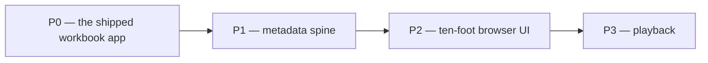

# Versions

Strict semver, newest at the top.

**The source of truth for the current version is the two manifest files** — the `version` field in
`app/backend/pyproject.toml` (`:3`) and the `version` field in `app/frontend/package.json` (`:4`).
They move together and are both at `0.1.0` today. Nothing else on this page overrides them: if a
heading below sits above the manifests' number, that heading describes work that has landed in the
tree but has not been released.

Three rules govern this file, and they exist because version drift between sessions is expensive:

- **The next version is computed, never invented, and never written as "Unreleased".** Patch for a
  bug fix, a docs-only change, a styling tweak or a behaviour-preserving refactor; minor for a new
  feature, module or endpoint, or for a data-contract change; major for a break, and only after the
  owner has agreed to it.
- **Only one unreleased version exists at a time.** While the manifests read `0.1.0` and this file
  carries a `v0.1.1` heading, further work goes *under* that heading as a new subsection. A fresh
  heading is opened only once the previous one has actually been released.
- **The `version` fields are bumped by the release pipeline, by hand never.** A session's job is to
  compute the next number and document it here. The same applies to the `version="0.1.0"` argument
  to `FastAPI(...)` in `create_app` (`app/backend/src/tv_watchlist/main.py:24-27`) — it is kept in
  step by the release pipeline, not hand-edited by a session. (No release pipeline exists yet — see
  `docs/status.md` section 4, item 9.)

---

## v0.1.1 — the plan, written down

Docs only. No source file, dependency, port binding or configuration changed, and neither `version`
field was touched. **Patch bump** from `0.1.0`: documentation with no behaviour change.

### Added — a root-level `docs/`

- **`docs/TV_MASTER_PLAN.md`** — the authoritative plan. Goals, the phase breakdown with
  deliverables and per-phase gates (section 10.1 is Phase 1's), architecture decisions with the
  reasoning behind each, the technology choices and what they were chosen over, cross-phase
  concerns, the security section (SAST wiring plus the untrusted-input boundary inventory), the task
  table, and the Phase 1 schema contract.
- **`docs/status.md`** — the live-state document: what exists now, what was decided, what is next,
  and the open items. It is state, not a log.
- **`docs/versions.md`** — this file.

`app/docs/` is unchanged and keeps its existing role: design notes, currently
`chat-feature-design.md`. The root `docs/` is the plan; `app/docs/` is the notes.

### Decided — the phase sequence, with Phase 0 named

- **P0, the shipped workbook app.** The nineteen-workbook FastAPI + React app described under
  `v0.1.0` below. It shipped before this plan existed; this documentation pass is what closes it, on
  five tasks: `T00` (root `docs/`), `T01` (root `CLAUDE.md`), `T01a` (the `.claude/` wiring), `T01b`
  (`.env.example`) and `T01c` (the README reconciliation).
- **P1, metadata spine.** A Postgres 16 projection beside the workbooks, fed by TMDB and TheTVDB
  ingest.
- **P2, ten-foot browser UI.** Spatial navigation, a ten-foot type scale and safe-area tokens, and
  1920x1080 added to the Playwright layout guard's window matrix.
- **P3, playback.** Self-hosted Jellyfin, joined by `tmdb_id` — and only once a real file library
  exists to play from. There are no video files on this machine yet, so P3 is designed for and not
  built.

### Decided — dual store

The workbooks stay. Excel remains authoritative for watch **order** and hand curation and remains
editable in Excel; Postgres becomes authoritative for episodes, air dates, runtimes, artwork and
watch progress. The `Watched?` cell is mirrored back into the sheet — a lossy one-directional
projection of an append-only progress log onto the sheet's own four values, read as a signal that a
human changed something and never as truth — so a workbook opened standalone still means something.
A sheet row's identity becomes a UUID carried in a hidden `Row ID` column, because the existing
writer already relays whole row-value arrays through adds, moves and removes and therefore carries
that identity for free; the Excel row number and the `Order` value are both disqualified, since the
writer resequences them.

The schema is eleven tables — `category`, `curated_entry`, `curated_entry_episode`, `title`,
`season`, `episode`, `episode_order`, `external_id`, `artwork`, `watch_event`, `sync_state` — with
the curated order modelled as two levels: the user's authored `position` over entries, and each
entry's span over that title's own dense, 1-based episode numbering.

### Decided — device and UI treatment

The app is watched on a TV driven from a PC or laptop over HDMI or a cast, and it **stays a browser
app**. No Tizen `.wgt`, no webOS `.ipk`, no `react-native-tvos`, no app stores, no second native
codebase. The ten-foot treatment is CSS tokens plus one focus library:
`@noriginmedia/norigin-spatial-navigation` (MIT), chosen over `react-tv-space-navigation` (stale) and
`bbc/lrud` (archived).

### Decided — Next and Autoplay follow the curated order

A **Next** button and an **Autoplay** toggle advance through a category's curated order across episodes
and films — from a One Piece episode to the film the workbook places next, then back into episodes —
recorded as `docs/TV_MASTER_PLAN.md` §6.9 and ADR-010, with deliverables 2.8 and 3.8, tasks T24, T41 and
T53a, and a line in each phase gate. The planned flattened queue, `curated_entry_episode`, now holds one
slot per movie entry; as first designed it held episodes only, which would have made Next skip every
film. Dub versus sub is recorded as a Phase 3 decision (deliverable 3.9), because it is a property of
the video files, not of TMDB or TheTVDB.

### Verified — credentials and provider behaviour, live

All three credentials (the TMDB v4 Read Access Token; the TheTVDB v4 key on End-User Subscriptions
plus its subscriber PIN) authenticate and return data against the live services. The live APIs
corrected the plan in four places, now applied across the docs: TheTVDB's season types are
`official`, `dvd`, `absolute`, `alternate`, `regional`, `altdvd`, `alttwo` — `altdvd`, not `default`,
which is only an endpoint alias for `official`; the TheTVDB series id comes from TMDB's
`/tv/{id}/external_ids`, never from TheTVDB's search, which ranked the One Piece anime eighth behind a
2023 live-action namesake; names are requested through TheTVDB's `/eng` language variants because the
default is the original language; and One Piece is 23 regular seasons plus season 0, not "24 seasons".
One episode — Laboon, aired 2001-03-21 — is TMDB season 2 episode 62, TheTVDB absolute #62, dvd season
2 episode 1 and official season 5 episode 2: the case for `episode_order`, in a single row. Full
findings: `docs/status.md` §2.9.

### Measured — TMDB actually covers this library

Before any Phase 1 code, a stratified sample of 140 of the 686 distinct `(title, type)` pairs was
probed against the public TMDB catalogue: **100/100 ordinary and 39/40 hard titles found**, weighted
to **~99.5% of pairs and ~99.6% of rows**, with ~4 rows genuinely absent library-wide. Coverage is
therefore not a risk to this project. Resolution is: only **67%** of titles match TMDB
character-for-character, ~17% of pairs live inside a parent series as a season or season-0 episode
rather than as a top-level entry, ~24% collide with real same-titled works, and the true zero-touch
rate is **~47%**. T13, T16 and T18 were sharpened accordingly, and `title.tmdb_id` is nullable so a
handful of unmatchable OVAs cannot block the schema. Full findings: `docs/status.md` §2.8.

### Decided — metadata providers

- **TMDB** is the identity, artwork and metadata spine, read with `TV_TMDB_READ_ACCESS_TOKEN`
  server-side only. Its hard 6-month cache ceiling and its absolute-continuous anime episode
  numbering are designed into the schema rather than noted in a comment. One term is recorded
  precisely because it was first misread: TMDB prohibits using its content "in connection with,
  including for training" any machine-learning or AI application, which covers inference, so **no
  TMDB content ever reaches the chat agent** (verified against the terms text 2026-09-15).
- **TheTVDB v4** supplies alternate episode orders, authenticated with `TV_TVDB_API_KEY` plus
  `TV_TVDB_PIN`. The funding model is **decided: "End-User Subscriptions"** — instant approval against
  a TheTVDB user subscription, with the subscriber PIN sent on every login, chosen over "Negotiated
  Contract" because that key stays inactive until a human sales review. **Seven season types are live in production — `official`, `dvd`, `absolute`, `alternate`, `regional`, `altdvd`, `alttwo` (measured 2026-09-15) — and the OpenAPI spec lists
  them as examples rather than an `enum`, so the list is not closed.** The rule that follows: read
  the season-type list at runtime from a cached `GET /v4/seasons/types` and never hard-code it. An
  empty episode list is treated as *unknown* rather than as *no episodes*.
- **AniList** is **not adopted now, and is revisitable behind an ADR and a feature flag** — not a
  permanent non-goal. TheTVDB already supplies absolute order, so AniList is not needed for
  ordering; what it would add is franchise topology. It is held back because its API is currently
  degraded to 30 requests per minute, rate-limit-increase requests are not being accepted, and it
  returns HTTP 403 during outages.
- **Trakt** is design inspiration only and is **not adopted** — its February 2026 free tier caps a
  user at 1,000 total list items.
- **Plex** is **not adopted** — its 2026 remote-streaming paywall was extended to third-party API
  clients.
- **Jellyfin** is the designated Phase 3 playback layer, self-hosted.

### Rejected — streambert

`github.com/truelockmc/streambert` was evaluated and rejected outright; nothing from it is adopted.
It is an Electron desktop client under GPL-3.0 that scrapes unlicensed stream hosts and rips m3u8
with ffmpeg, and it self-tags as piracy. Zero technical overlap with a browser app over a personal
file library; GPL-3.0 contagion onto a repository that currently carries no `LICENSE` file, so
vendoring it would settle the licence question as a side effect of a code-reuse convenience rather
than as a decision, and settle it on GPL-3.0; and legal exposure — three independent disqualifiers.
It is recorded as ADR-006 in `docs/TV_MASTER_PLAN.md` and summarised in the status and versions
entries for this change. Nothing from it is adopted.

### Allocated — Postgres host port 5525, and nothing else

The first free slot in the documented `5520-5591` range, adjacent to `Torah_Learning_Sidra` at
`5524`. It is the **only** new host port this design takes. The allocation is an allocation only —
no compose service, `.env` default or launcher default claims it, and `PORT_ASSIGNMENTS.md` is
**not** amended in this change. The registry row lands in the Phase 1 implementation commit that
actually publishes the port. The Phase 1 database is `tv` (`TV_POSTGRES_DB`, default `tv`), with
`tv_test` for the CI service container.

### Scheduled — Phase 1 deliverables that close known gaps

- **`docs/resolver-dry-run.md`** is the durable home of the Phase 1 resolver dry-run report: per
  workbook, rows / confirmed / auto-resolved / unresolved, plus the worst-confidence examples. It is
  a report, so it does not live in `docs/status.md`.
- **Both launchers gain `[q]` and `[v]`.** They are absent today because neither `run_tv.sh` nor
  `run_tv.bat` invokes `docker compose`; Phase 1 adds them, because compose then owns a Postgres
  service and a named volume. `[q]` runs `docker compose down --remove-orphans` and removes images
  matching the `tv-watchlist` prefix while keeping volumes; `[v]` additionally passes `--volumes` and
  drops `tv_postgres_data`.
- **`T01a`** copies and adapts the `.claude/` wiring — `settings.json` with the OS-agnostic `.cjs`
  hook set, `commands/` and `skills/`. **`T01b`** writes `.env.example`. **`T01c`** reconciles the
  READMEs: the `OWNER/REPO` placeholders, the eighteen/nineteen workbook count, the 712/722 test
  count, the Semgrep description, the "There is no database." opening, and a phase-flow mermaid
  diagram the global contract requires of a phased project's README.

### Recorded, not fixed

`docs/status.md` section 4 carries the full list of convention gaps: no `LICENSE` file (**ADR-009**
— "Repository licence — OPEN. The owner has not decided. No licence has been chosen and none is
implied by this plan." — with `app/heroes/ATTRIBUTION.md` governing the artwork whatever the
repository's licence becomes, and `T01d` filling ADR-009 in once the owner decides, blocked on that
decision with no due phase), placeholder `OWNER/REPO` badge and clone URLs, no `.claude/` wiring
and no project-level `CLAUDE.md`, launchers missing `[q]`/`[v]`, no `.env.example`, a
`PORT_ASSIGNMENTS.md` row still to come, README counts that have drifted from what is on disk and in
the suite, ESLint without its security plugins, and no release workflow to bump the version fields.
Each is listed rather than quietly patched, because several of them are decisions and not chores —
and each now names the task that closes it.

### Researched — playback without files, the monthly bill, and what cannot be done

Documentation only; no code changed. The owner asked for one complete plan, with a monthly bill, before any
further building.

- **Findings.** `docs/status.md` §2.20–§2.30 records every finding behind that plan:
  - verified Israeli prices, VAT and card fees;
  - realistic coverage in Israel, as a range, including cheaper combinations of services;
  - a title-by-title check of the titles no subscription carries — only 6 cannot be watched legally
    anywhere;
  - TheTVDB's coverage as a fallback metadata source (95% of works);
  - control from the sofa;
  - what a launcher can and cannot do;
  - the services' terms, and the Streaming Availability API's licence;
  - Disney+, anime and English dubs in Israel;
  - Israeli TV operators;
  - the licensing of metadata and images.
- **ADR-011, proposed: the app never switches a VPN.** Catalogs follow the account's country, and Prime Video
  and Crunchyroll forbid VPN use in their terms.
- **ADR-012, proposed: playback starts as a launcher to the owner's own subscriptions.**
  - One press per title, and Next is a press too.
  - No Autoplay across streaming services.
  - Availability for Israel comes from the Streaming Availability API.
  - Disney+ availability is marked by hand.

The version stays **0.1.1**: a documentation-only patch.

---

## v0.1.0 — the app as it stands

The Excel-backed watch-list app: Phase 0. No release date is recorded — both `version` fields were
set to `0.1.0` at the outset and have never moved, and no release tag exists. This entry is
reconstructed from the working tree so the changelog has a floor to build on, not from a release
event.

### The application

A local, single-user web app over nineteen hand-curated watch orders — Marvel, DCU, Star Wars,
Middle Earth, a WWII chronology and a shelf of anime. **There is no database.** The nineteen `.xlsx`
workbooks in the repository root are the store, committed on purpose so a clone arrives with the
library already in it: nothing to import, migrate or seed.

### Backend

Python 3.13, FastAPI, Pydantic v2, openpyxl and uvicorn, managed by `uv`; 83 modules and 4,160 lines
across `app/backend/src/tv_watchlist/`. Fourteen HTTP routes — nine REST over categories and rows
(`api/categories.py` six, `api/rows.py` three), five for chat (`api/chat.py`). Configuration is one
`Settings` model (`config.py:14-25`) with `env_prefix="TV_"` (`:17`). The Excel layer reads the first
sheet of each workbook whatever it is named, derives its columns and their roles from the header row
and the sheet's own data validations, and writes edits back in place while preserving the table,
dropdowns and conditional formatting, so opening the file in Excel afterwards shows exactly what the
browser did.

Every mutation funnels through one `Catalog`: a per-workbook lock, an `mtime` freshness guard that
refuses a write whose base changed on disk, a pre-write snapshot into `app/.backups/` (last ten
kept), and an atomic temp-file-and-swap save so a half-failed write never truncates the original.
A workbook open in Excel is refused with HTTP 423 (`api/errors.py:36`) rather than clobbered.
Retiring a category *moves* its workbook and artwork aside; nothing is ever unlinked. Files that
will not parse, and files shadowed by a namesake, are surfaced in the listing rather than silently
omitted.

### Frontend

React 18, TypeScript strict, Vite and Redux Toolkit, managed by `pnpm@9.15.9` — no router, no chart
library, no CSS framework, no UI kit. Four store slices (`catalog`, `category`, `chat`, `ui`), 31
components, 20 one-concept type files and 8 stylesheets. A wall of category cards with generated
geometric backdrops drawn from each category's id and accent colour, overlaid with franchise artwork
from `app/heroes/`; a category view whose rail cycles each entry through the sheet's own dropdown
vocabulary; a reference drawer for a workbook's supporting sheets; and dialogs for adding entries,
creating a category and retiring one. Writes are optimistic and queued per workbook, with each
response's `mtime` threaded into the next request so two quick clicks cannot manufacture a conflict
with themselves, and a stale refusal re-reads the workbook and replays whatever edits are still in
flight.

### Chat dock

A research assistant built on `claude-agent-sdk`, shelling out to the `claude` CLI and streaming a
turn as SSE frames. It reads categories and fetches pages through an SSRF-guarded fetcher that
escalates to Playwright Chromium when a plain request is blocked, and it can only ever *propose* —
every write it suggests is applied through the same `Catalog` calls the REST endpoints use, after
the user approves it, guarded by the `mtime` the proposal's row numbers were resolved against.
Artwork proposals are chosen by eye from downloaded candidates rather than approved blind, and each
pick is credited in `app/heroes/ATTRIBUTION.md`.

Chat is deliberately unavailable in the containers: the image carries neither the `claude` CLI nor
Chromium, and `/api/chat` answers HTTP 503 there while everything else works normally.

### Layout guard

`pnpm test:layout` mounts the real app with the real stylesheets in a real Chromium at four window
sizes and drives it into eighteen surfaces, asserting for every control that it is inside the
window, that nothing is painted over it, that enough of it is actually there, and that enough of it
answers a click. It exists because jsdom has no layout engine and five separate "button below the
fold" bugs shipped before it did. Nothing in a run touches the network.

### Containers and launchers

Two containers: FastAPI, and an unprivileged nginx serving the built SPA and proxying `/api` and
`/heroes`. The backend healthcheck probes `/openapi.json`, which touches no workbook
(`docker-compose.yml:40-43`). The repo root is bind-mounted as `/library`, so the containers read and
write the same workbooks the clone arrived with. `run_tv.sh` and `run_tv.bat` are the host-native
alternative — first-run install, both dev servers in one terminal, then a menu with `[r]` restart and
`[k]` stop (`run_tv.sh:120-121`, `run_tv.bat:84-85`). Neither launcher invokes `docker compose`, so
neither offers `[q]` or `[v]`. Ports: `5284` frontend, `8284` backend, and `5286` for the
layout-guard probe server (`app/frontend/layout/probeServer.ts:1`), which binds only during a guard
run.

### CI

GitHub Actions, six stages gated in order — `lint -> sast -> test -> coverage gate -> build ->
docker-build` — plus a separate CodeQL workflow. The SAST stage runs Semgrep against six named packs
— `p/default`, `p/owasp-top-ten`, `p/python`, `p/typescript`, `p/react`, `p/docker`
(`ci.yml:122-127`) — with its SARIF uploaded to the Security tab, `pip-audit` over the exported
lockfile, `pnpm audit --audit-level=high`, and gitleaks over the tree; `docker-build` scans both
images with Trivy. All three test jobs publish JUnit XML through `dorny/test-reporter`, so a run
shows per-test results including when it fails. The coverage gate holds each suite at the figure it
measures today — backend 97% lines, frontend 56% lines / 54% statements / 45% functions / 45%
branches (`ci.yml:39-43`) — and ratchets: coverage may rise, never slip. Every `uses:` is pinned to a
40-character commit SHA; the header comment (`ci.yml:7-11`) expects Dependabot's `github-actions`
ecosystem to bump those SHAs, and no `.github/dependabot.yml` exists yet to do it.

Suites at this version: **722** collected pytest tests, **207** Vitest tests across 20 files, and
**152** Playwright layout runs (38 tests x 4 viewports) in real Chromium.
